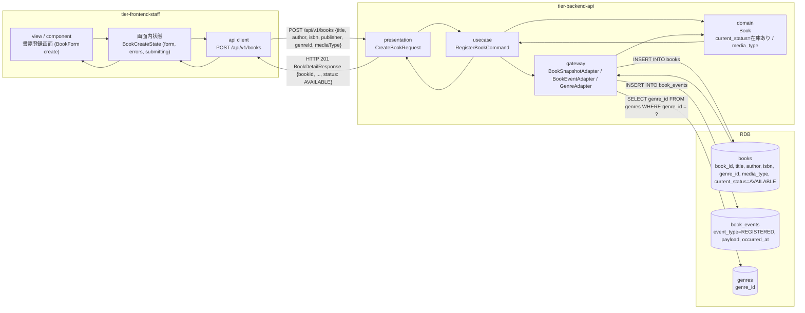
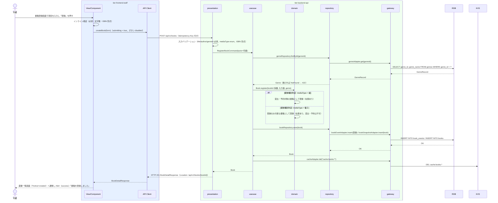

# 書籍を登録する

## 概要

司書がタイトル・著者・ISBN・出版社・ジャンル・媒体種別（紙・電子）を書籍登録画面で入力し、書籍を蔵書として登録する。
登録された書籍は「書籍の状態」が「在庫あり」となり、貸出・予約・検索の対象に加わる。初期リリースでは媒体種別は紙のみ運用する（電子は登録のみ可能）。

## データフロー



| レイヤー | データモデル | 変換内容 |
|---------|------------|---------|
| FE view | BookForm（create）の入力値: title, author, isbn, publisher, genreId, mediaType（既定 PAPER） | インライン検証（必須・文字数・ISBN 形式）後に CreateBookRequest へ変換 |
| FE api client | POST /api/v1/books の JSON ボディ | trace_id と Idempotency-Key を付与（LP-038）。HTTP エラーを統一エラー型に正規化（LR-027） |
| BE presentation | CreateBookRequest(title, author, isbn?, publisher?, genreId, mediaType) | 型・必須・形式・enum の検証（LP-001）。認可コンテキスト（司書）を付与して RegisterBookCommand に変換 |
| BE usecase | RegisterBookCommand → Book | ジャンル存在確認、Book.register() で集約生成、repository.save（events INSERT + snapshot INSERT）を 1 トランザクションで実行。キャッシュ無効化 |
| BE domain | Book（book_id 採番, title, author, isbn, publisher, genre_id, media_type, current_status=在庫あり, version=1） | 媒体種別判定（紙 / 電子の受理）、状態遷移「（初期）→ 在庫あり」（LP-010） |
| BE gateway | books INSERT + book_events INSERT（event_type=REGISTERED）+ genres SELECT | Book → BookRecord / BookEventRecord |
| Response | BookDetailResponse { bookId, title, author, isbn, publisher, genreId, genreName, mediaType, status: "AVAILABLE", waitingCount: 0, registeredAt, updatedAt, version } | 蔵書一覧画面へ戻る際の Alert（success）表示 |

## 処理フロー



## バリエーション一覧

| バリエーション名 | 値 | 処理内容 | 適用 tier | 適用箇所 |
|----------------|---|---------|----------|---------|
| ジャンル | 文学、社会科学、自然科学、技術、芸術、歴史、児童書、その他 | BookForm のジャンル Select（GET /api/v1/genres の選択肢）。genreId として送信し、存在確認する | tier-frontend-staff, tier-backend-api | 書籍登録画面 / POST /api/v1/books |
| 媒体種別 | 紙、電子 | BookForm の媒体種別（初期リリースは紙固定表示、電子は選択可だが注記表示）。API では `PAPER` / `ELECTRONIC` を受理 | tier-frontend-staff, tier-backend-api | 書籍登録画面 / RegisterBookCommand |

## 分岐条件一覧

| 条件名 | 判定ルール | 適用 tier | 適用箇所 | BDD Scenario |
|--------|----------|----------|---------|-------------|
| 媒体種別判定 | mediaType が `PAPER` の書籍は貸出・予約対象として登録する。`ELECTRONIC` の書籍は登録のみ可能（貸出・予約は受け付けない）として登録する。いずれも状態は在庫あり | tier-backend-api | Book.register() | 電子書籍を登録すると登録のみ可能な書籍として在庫ありになる |
| ジャンル存在判定 | genreId が genres に存在しない場合は 422（code: GENRE_NOT_FOUND）とし登録しない | tier-backend-api | RegisterBookCommand | 存在しないジャンル ID は 422 になる |

## 計算ルール一覧

| 計算名 | 入力情報 | 計算式/ロジック | 出力情報 | 適用 tier |
|--------|---------|---------------|---------|----------|
| 書籍 ID 採番 | なし | 一意 ID（ULID 等）を採番して `book_id` とする | 書籍.書籍ID | tier-backend-api |
| ISBN 正規化 | 書籍.ISBN | フロントエンドが送信前にハイフンを除去する。API はハイフンなしの 13 桁または 10 桁（末尾のみ `X` 可）だけを受理し、DB にもハイフンなしの正規形で保存する | 書籍.ISBN（正規化済み） | tier-frontend-staff, tier-backend-api |

## 状態遷移一覧

| 状態モデル | 遷移元 | 遷移先 | トリガー | 事前条件 | 事後処理 | 適用 tier |
|-----------|--------|--------|---------|---------|---------|----------|
| 書籍の状態 | （初期） | 在庫あり | 書籍を登録する | 必須項目が揃い、ジャンルが存在する | book_events に「登録」イベントを記録し、`cache:books:*` を無効化する | tier-backend-api |

## 関連 RDRA モデル

| モデル種別 | 要素名 | 関連 |
|-----------|--------|------|
| 業務 | 蔵書管理業務 | このUCが属する業務 |
| BUC | 蔵書を管理するフロー | このUCを含むBUC |
| アクター | 司書 | 操作するアクター（価値提供） |
| 画面 | 書籍登録画面 | 入力画面 |
| 情報 | 書籍 | 登録する情報 |
| 情報 | ジャンル | 参照する情報（選択肢 / 存在確認） |
| 状態 | 書籍の状態 | （初期）→ 在庫あり |
| 条件 | 媒体種別判定 | 紙 / 電子の受理ルール |
| バリエーション | ジャンル、媒体種別 | 選択肢と受理値 |

## E2E 完了条件（BDD）

### 正常系

```gherkin
Feature: 書籍を登録する

  Scenario: 紙の書籍を登録すると在庫ありとして蔵書一覧に表示される
    Given 司書「佐藤花子」が司書ポータルにログイン済み
    And ジャンル「文学」（genreId: G-001）が登録済み
    When 書籍登録画面（/staff/books/new）でタイトル「吾輩は猫である」、著者「夏目漱石」、ISBN「978-4-10-101001-1」、出版社「新潮社」、ジャンル「文学」、媒体種別「紙」を入力して「登録」を押す
    Then HTTP 201 が返り、蔵書一覧画面に Alert（success）「書籍を登録しました」が表示される
    And BookTable に「吾輩は猫である」が BookStatusBadge「在庫あり」で表示される

  Scenario: 電子書籍を登録すると登録のみ可能な書籍として在庫ありになる
    Given 司書「佐藤花子」が司書ポータルにログイン済み
    When 書籍登録画面でタイトル「デジタル図書館入門」、著者「山田太郎」、ジャンル「技術」、媒体種別「電子」を入力して「登録」を押す
    Then HTTP 201 が返り、レスポンスの mediaType が "ELECTRONIC"、status が "AVAILABLE" である
    And 蔵書一覧画面の媒体列に「電子」が表示される

  Scenario: ISBN と出版社を省略して登録できる
    Given 司書「佐藤花子」が司書ポータルにログイン済み
    When 書籍登録画面でタイトル「こころ」、著者「夏目漱石」、ジャンル「文学」のみを入力して「登録」を押す
    Then HTTP 201 が返り、レスポンスの isbn と publisher が null である
```

### 異常系

```gherkin
  Scenario: タイトル未入力のときはインライン検証で送信されない
    Given 司書「佐藤花子」が書籍登録画面（/staff/books/new）を表示している
    When タイトルを空のまま著者「夏目漱石」、ジャンル「文学」を入力して「登録」を押す
    Then BookForm のタイトル欄に Input（error）「タイトルは必須です」が表示される
    And POST /api/v1/books は呼び出されない

  Scenario: 存在しないジャンル ID は 422 になる
    Given 司書「佐藤花子」のアクセストークンを保持している
    When POST /api/v1/books を genreId「G-999」で送信する
    Then HTTP 422 と problem+json（code: GENRE_NOT_FOUND, errors[0].field: "genreId"）が返る
    And 書籍登録画面のジャンル Select に「ジャンルが見つかりません」が表示される

  Scenario: 利用者区分「利用者」のトークンでは登録できない
    Given 利用者「田中太郎」（利用者区分: 利用者）のアクセストークンを保持している
    When POST /api/v1/books を館内経路に送信する
    Then HTTP 403 と problem+json（code: FORBIDDEN）が返る

  Scenario: 送信中に二重クリックしても 1 件しか登録されない
    Given 司書「佐藤花子」が書籍登録画面で有効な値を入力している
    When 「登録」ボタンを 0.2 秒間隔で 2 回押す
    Then 2 回目の押下は disabled により無視され、books に 1 件だけ登録される
```

## ティア別仕様

- [司書向けフロントエンド](tier-frontend-staff.md)
- [Backend API](tier-backend-api.md)

### 統合 API Spec

- [OpenAPI Spec](../../../_cross-cutting/api/openapi.yaml)（全 UC 統合、Contract First 開発用）
