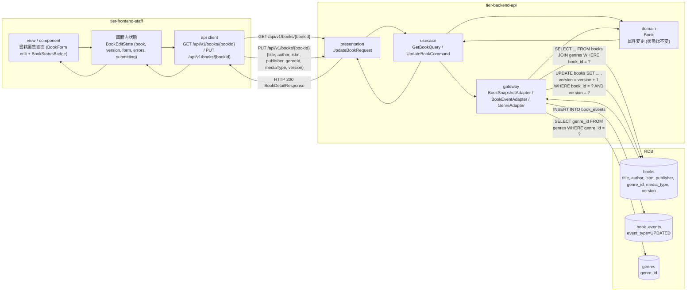
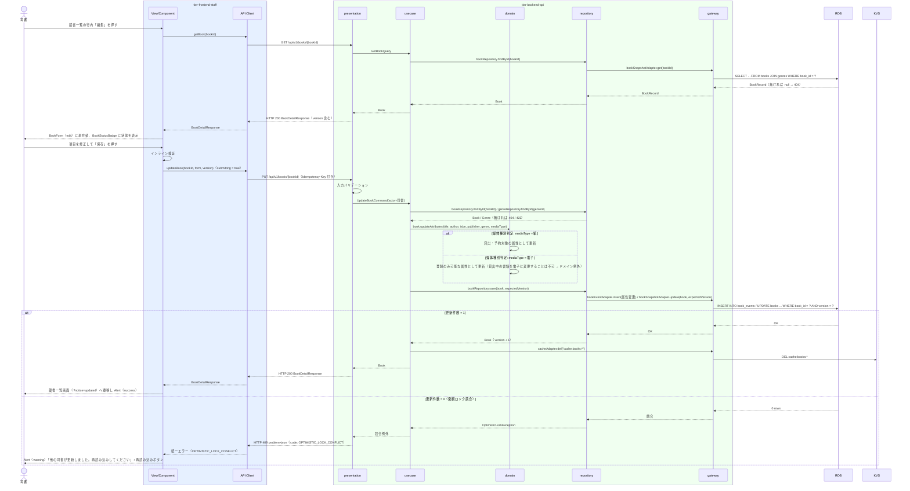

# 書籍を編集する

## 概要

司書が登録済みの書籍情報（タイトル・著者・ISBN・出版社・ジャンル・媒体種別）を書籍編集画面で修正して保存し、変更内容を蔵書に反映する。
書籍の状態（在庫あり・貸出中・予約待ち）は本 UC では変更しない。編集画面には現在の状態を BookStatusBadge で表示し、貸出中でも属性の修正はできる。

## データフロー



| レイヤー | データモデル | 変換内容 |
|---------|------------|---------|
| FE view | BookForm（edit）の入力値 + 取得した book.version | 初期表示は GET の応答から form を初期化。保存時にインライン検証し UpdateBookRequest（version 含む）へ変換 |
| FE api client | GET / PUT /api/v1/books/{bookId} | trace_id と Idempotency-Key（PUT）を付与。409 は理由コード（OPTIMISTIC_LOCK_CONFLICT）を保持して正規化（LR-027） |
| BE presentation | UpdateBookRequest(title, author, isbn?, publisher?, genreId, mediaType, version) | 型・必須・形式・enum の検証。UpdateBookCommand に変換 |
| BE usecase | GetBookQuery → Book / UpdateBookCommand → Book | 書籍取得（無ければ 404）、ジャンル存在確認、Book.updateAttributes()、repository.save（楽観ロック）を 1 トランザクションで実行。キャッシュ無効化 |
| BE domain | Book（属性更新。current_status は変更不可） | 媒体種別判定（紙 / 電子の受理）。状態遷移は発生しない |
| BE gateway | books UPDATE（version 条件）+ book_events INSERT（属性変更） | 更新件数 0 なら競合例外（LP-013） |
| Response | BookDetailResponse { bookId, ..., status, version: n+1, updatedAt } | 蔵書一覧画面へ戻る際の Alert（success） |

## 処理フロー



## バリエーション一覧

| バリエーション名 | 値 | 処理内容 | 適用 tier | 適用箇所 |
|----------------|---|---------|----------|---------|
| ジャンル | 文学、社会科学、自然科学、技術、芸術、歴史、児童書、その他 | BookForm のジャンル Select。変更時は存在確認 | tier-frontend-staff, tier-backend-api | 書籍編集画面 / PUT /api/v1/books/{bookId} |
| 媒体種別 | 紙、電子 | BookForm の媒体種別 ToggleGroup。貸出中・予約待ちの書籍を「電子」へ変更することは不可 | tier-frontend-staff, tier-backend-api | 書籍編集画面 / Book.updateAttributes() |

## 分岐条件一覧

| 条件名 | 判定ルール | 適用 tier | 適用箇所 | BDD Scenario |
|--------|----------|----------|---------|-------------|
| 媒体種別判定 | 状態が在庫ありの書籍は紙 ⇄ 電子の変更を受理する。状態が貸出中・予約待ちの書籍を電子に変更する要求は 409（code: MEDIA_TYPE_CHANGE_NOT_ALLOWED）とする | tier-backend-api | Book.updateAttributes() | 貸出中の書籍を電子に変更すると 409 になる |
| 楽観ロック判定 | リクエストの version が books.version と一致する場合のみ更新する。不一致は 409（code: OPTIMISTIC_LOCK_CONFLICT） | tier-backend-api | bookRepository.save() | 他の司書が先に更新していた場合は競合エラーになる |
| ジャンル存在判定 | genreId が genres に存在しない場合は 422（code: GENRE_NOT_FOUND） | tier-backend-api | UpdateBookCommand | （書籍を登録すると同じ） |

## 計算ルール一覧

| 計算名 | 入力情報 | 計算式/ロジック | 出力情報 | 適用 tier |
|--------|---------|---------------|---------|----------|
| version 更新 | books.version | version + 1（UPDATE 成功時） | BookDetailResponse.version | tier-backend-api |
| ISBN 正規化 | 書籍.ISBN | フロントエンドが送信前にハイフンを除去する。API はハイフンなしの 10 桁（末尾のみ `X` 可）または 13 桁だけを受理し、DB にもハイフンなしの正規形で保存する | 書籍.ISBN（正規化済み） | tier-frontend-staff, tier-backend-api |

## 状態遷移一覧

| 状態モデル | 遷移元 | 遷移先 | トリガー | 事前条件 | 事後処理 | 適用 tier |
|-----------|--------|--------|---------|---------|---------|----------|
| 書籍の状態 | （参照のみ） | （遷移なし） | 書籍を編集する | なし | 属性変更イベントの記録とキャッシュ無効化のみ。状態は変更しない | tier-backend-api |

## 関連 RDRA モデル

| モデル種別 | 要素名 | 関連 |
|-----------|--------|------|
| 業務 | 蔵書管理業務 | このUCが属する業務 |
| BUC | 蔵書を管理するフロー | このUCを含むBUC |
| アクター | 司書 | 操作するアクター（価値提供） |
| 画面 | 書籍編集画面 | 編集画面 |
| 情報 | 書籍 | 更新する情報 |
| 情報 | ジャンル | 参照する情報（選択肢 / 存在確認） |
| 状態 | 書籍の状態 | 編集画面に現在の状態を表示（遷移なし） |
| 条件 | 媒体種別判定 | 媒体種別変更の受理ルール |
| バリエーション | ジャンル、媒体種別 | 選択肢と受理値 |

## E2E 完了条件（BDD）

### 正常系

```gherkin
Feature: 書籍を編集する

  Scenario: 現在値を表示してタイトルを修正し保存する
    Given 司書「佐藤花子」が司書ポータルにログイン済み
    And 書籍「B-0001 吾輩は猫である」（著者「夏目漱石」、在庫あり、version 1）が登録済み
    When 蔵書一覧画面の行内「編集」で書籍編集画面（/staff/books/B-0001/edit）を開き、タイトルを「吾輩は猫である（新版）」に変更して「保存」を押す
    Then HTTP 200 が返り version が 2 になる
    And 蔵書一覧画面に Alert（success）「書籍を更新しました」が表示され、BookTable のタイトルが「吾輩は猫である（新版）」になる

  Scenario: 貸出中の書籍でも属性を修正できる
    Given 司書「佐藤花子」が司書ポータルにログイン済み
    And 書籍「B-0002 坊っちゃん」が貸出中である
    When 書籍編集画面（/staff/books/B-0002/edit）で出版社を「岩波書店」に変更して「保存」を押す
    Then 編集画面には BookStatusBadge「貸出中」が表示されている
    And HTTP 200 が返り、status は "ON_LOAN" のまま publisher が「岩波書店」になる

  Scenario: ジャンルを変更して保存する
    Given 司書「佐藤花子」が司書ポータルにログイン済み
    And 書籍「B-0003 こころ」（ジャンル「その他」）が登録済み
    When 書籍編集画面でジャンルを「文学」に変更して「保存」を押す
    Then HTTP 200 が返り genreName が「文学」になる
```

### 異常系

```gherkin
  Scenario: 他の司書が先に更新していた場合は競合エラーになる
    Given 司書「佐藤花子」が書籍「B-0001」（version 1）の編集画面を開いている
    And 司書「鈴木一郎」が同じ書籍を先に更新して version が 2 になっている
    When 佐藤花子が「保存」を押す
    Then HTTP 409 と problem+json（code: OPTIMISTIC_LOCK_CONFLICT）が返る
    And Alert（warning）「他の司書が更新しました。再読み込みしてください」と「再読み込み」ボタンが表示される

  Scenario: 貸出中の書籍を電子に変更すると 409 になる
    Given 司書「佐藤花子」のアクセストークンを保持している
    And 書籍「B-0002」が貸出中（媒体種別: 紙）である
    When PUT /api/v1/books/B-0002 を mediaType「ELECTRONIC」で送信する
    Then HTTP 409 と problem+json（code: MEDIA_TYPE_CHANGE_NOT_ALLOWED）が返る

  Scenario: 存在しない書籍の編集画面は不在メッセージを表示する
    Given 司書「佐藤花子」が司書ポータルにログイン済み
    When 書籍編集画面（/staff/books/B-9999/edit）を開く
    Then GET /api/v1/books/B-9999 が HTTP 404（code: BOOK_NOT_FOUND）を返す
    And EmptyState「書籍が見つかりません」と「蔵書一覧へ戻る」ボタンが表示される

  Scenario: タイトルを空にして保存するとインライン検証で止まる
    Given 司書「佐藤花子」が書籍「B-0001」の編集画面を開いている
    When タイトルを空にして「保存」を押す
    Then タイトル欄に Input（error）「タイトルは必須です」が表示される
    And PUT /api/v1/books/B-0001 は呼び出されない
```

## ティア別仕様

- [司書向けフロントエンド](tier-frontend-staff.md)
- [Backend API](tier-backend-api.md)

### 統合 API Spec

- [OpenAPI Spec](../../../_cross-cutting/api/openapi.yaml)（全 UC 統合、Contract First 開発用）
