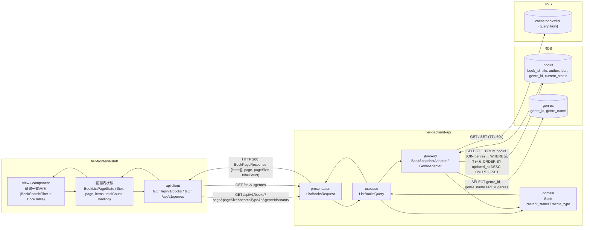
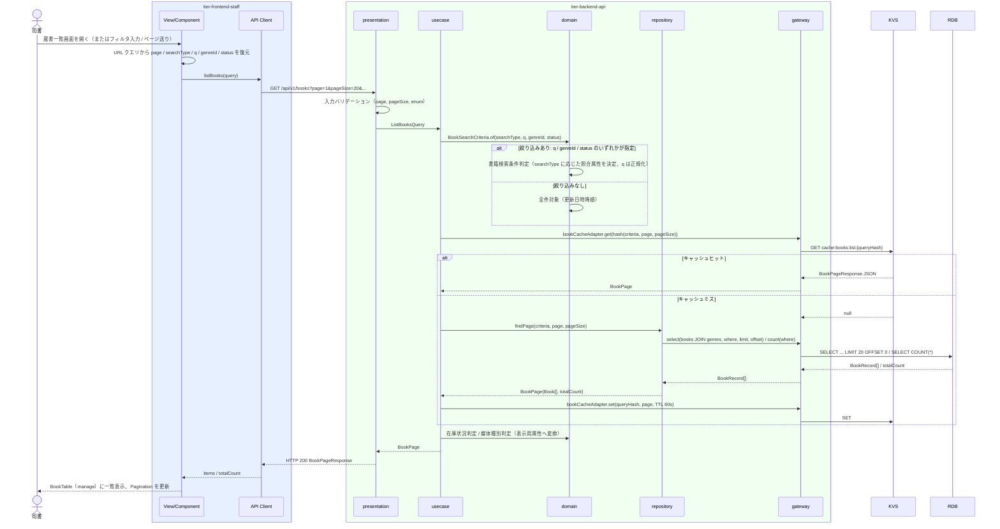

# 書籍一覧を参照する

## 概要

司書が登録済みの書籍を蔵書一覧画面で一覧参照し、登録・編集・削除の対象と登録状況（在庫あり・貸出中・予約待ち）を確認する。
一覧は 20 件/頁の offset ページネーションで表示し、BookSearchFilter（staff）でタイトル・著者・ISBN・ジャンル・在庫状況による絞り込みができる。

## データフロー



| レイヤー | データモデル | 変換内容 |
|---------|------------|---------|
| FE view | BookSearchFilter の入力値（searchType, q, genreId, status）、ページ番号 | フィルタ入力と Pagination 操作を URL クエリ（`?page=&searchType=&q=&genreId=&status=`）に反映し、GET リクエストのクエリへ変換 |
| FE api client | GET /api/v1/books のクエリパラメータ | trace_id 付与、HTTP エラーを統一エラー型に正規化 |
| BE presentation | ListBooksRequest(page, pageSize, searchType, q, genreId, status) | 型・範囲・enum の検証（page >= 1、pageSize 1〜100、status enum、searchType enum）。ListBooksQuery に変換 |
| BE usecase | ListBooksQuery → BookPage | 検索条件を BookSearchCriteria（domain 値オブジェクト）に変換し repository へ委譲。総件数と件数を集約 |
| BE domain | Book（book_id, title, author, isbn, publisher, genre, media_type, current_status） | 在庫状況判定（current_status をそのまま状態文言へ）、媒体種別判定（media_type 表示） |
| BE gateway | books JOIN genres の SELECT（LIMIT/OFFSET）+ COUNT | BookRecord → Book エンティティ復元 |
| Response | BookPageResponse { items: BookSummary[], page, pageSize, totalCount } | BookTable（manage）の行データ + Pagination の総ページ数 |

## 処理フロー



## バリエーション一覧

| バリエーション名 | 値 | 処理内容 | 適用 tier | 適用箇所 |
|----------------|---|---------|----------|---------|
| ジャンル | 文学、社会科学、自然科学、技術、芸術、歴史、児童書、その他 | BookSearchFilter のジャンル絞り込み（genreId）。一覧のジャンル列表示 | tier-frontend-staff, tier-backend-api | 蔵書一覧画面 / GET /api/v1/books |
| 媒体種別 | 紙、電子 | BookTable の媒体列に表示。初期リリースは紙のみ登録運用 | tier-frontend-staff, tier-backend-api | 蔵書一覧画面（媒体列）/ BookSummary.mediaType |
| 検索条件種別 | キーワード、タイトル、著者、ISBN、ジャンル | BookSearchFilter（staff）の searchType 切替。照合属性の切替（ストラテジー） | tier-frontend-staff, tier-backend-api | 蔵書一覧画面 / ListBooksQuery |

## 分岐条件一覧

| 条件名 | 判定ルール | 適用 tier | 適用箇所 | BDD Scenario |
|--------|----------|----------|---------|-------------|
| 在庫状況判定 | books.current_status（在庫あり / 貸出中 / 予約待ち）をそのまま BookStatusBadge の state として表示する | tier-backend-api, tier-frontend-staff | ListBooksQuery / BookTable 状態列 | 登録済み書籍の一覧が状態つきで表示される |
| 媒体種別判定 | books.media_type（紙 / 電子）を媒体列に表示する。電子の書籍も一覧に含める（登録のみ可能） | tier-backend-api, tier-frontend-staff | ListBooksQuery / BookTable 媒体列 | 電子書籍が媒体「電子」として一覧に含まれる |
| 書籍検索条件判定 | searchType が指定された場合のみ、対応する属性（キーワード = タイトル・著者・出版社・ISBN、タイトル、著者、ISBN、ジャンル）で正規化つき部分一致照合する | tier-backend-api | ListBooksQuery | タイトルで絞り込むと該当書籍のみ表示される |

## 計算ルール一覧

| 計算名 | 入力情報 | 計算式/ロジック | 出力情報 | 適用 tier |
|--------|---------|---------------|---------|----------|
| 総ページ数 | totalCount, pageSize | ceil(totalCount / pageSize)。totalCount = 0 のとき 1 | Pagination の総ページ数 | tier-frontend-staff |
| OFFSET | page, pageSize | (page - 1) * pageSize | SQL OFFSET | tier-backend-api |

## 状態遷移一覧

| 状態モデル | 遷移元 | 遷移先 | トリガー | 事前条件 | 事後処理 | 適用 tier |
|-----------|--------|--------|---------|---------|---------|----------|
| 書籍の状態 | （参照のみ） | （遷移なし） | 書籍一覧を参照する | なし | なし（在庫状況判定の表示に使用） | tier-backend-api |

## 関連 RDRA モデル

| モデル種別 | 要素名 | 関連 |
|-----------|--------|------|
| 業務 | 蔵書管理業務 | このUCが属する業務 |
| BUC | 蔵書を管理するフロー | このUCを含むBUC |
| アクター | 司書 | 操作するアクター（価値受益） |
| 画面 | 蔵書一覧画面 | 一覧を表示する画面 |
| 情報 | 書籍 | 参照する情報（一覧表示） |
| 情報 | ジャンル | 参照する情報（ジャンル列 / 絞り込み） |
| 状態 | 書籍の状態 | 在庫状況の表示に使用 |
| 条件 | 在庫状況判定 | 状態列の表示 |
| 条件 | 媒体種別判定 | 媒体列の表示 |
| バリエーション | ジャンル、媒体種別、検索条件種別 | 絞り込みと表示切替 |

## E2E 完了条件（BDD）

### 正常系

```gherkin
Feature: 書籍一覧を参照する

  Scenario: 登録済み書籍の一覧が状態つきで表示される
    Given 司書「佐藤花子」が司書ポータルにログイン済み
    And 書籍「B-0001 吾輩は猫である」（在庫あり）と「B-0002 坊っちゃん」（貸出中）が登録済み
    When 蔵書一覧画面（/staff/books）を開く
    Then BookTable に 2 件の書籍が表示される
    And 「吾輩は猫である」の状態列に BookStatusBadge「在庫あり」が表示される
    And 「坊っちゃん」の状態列に BookStatusBadge「貸出中」が表示される

  Scenario: 21 件以上の書籍が 20 件ずつページ送りで表示される
    Given 司書「佐藤花子」が司書ポータルにログイン済み
    And 書籍が 45 件登録済み
    When 蔵書一覧画面（/staff/books）を開く
    Then 1 ページ目に 20 件が表示され、Pagination に総ページ数「3」が表示される
    When Pagination で「3」ページ目を選択する
    Then 3 ページ目に 5 件が表示され、URL クエリが「?page=3」になる

  Scenario: タイトルで絞り込むと該当書籍のみ表示される
    Given 司書「佐藤花子」が司書ポータルにログイン済み
    And 書籍「吾輩は猫である」「坊っちゃん」「こころ」が登録済み
    When BookSearchFilter で検索条件種別「タイトル」を選び「猫」と入力して検索する
    Then BookTable に「吾輩は猫である」の 1 件だけが表示される
    And Pagination は single-page で表示される

  Scenario: 電子書籍が媒体「電子」として一覧に含まれる
    Given 司書「佐藤花子」が司書ポータルにログイン済み
    And 媒体種別「電子」の書籍「B-0100 デジタル図書館入門」が登録済み
    When 蔵書一覧画面（/staff/books）を開く
    Then 「デジタル図書館入門」の媒体列に「電子」が表示される
```

### 異常系

```gherkin
  Scenario: 書籍が 1 件も登録されていない場合は EmptyState が表示される
    Given 司書「佐藤花子」が司書ポータルにログイン済み
    And 書籍が 0 件
    When 蔵書一覧画面（/staff/books）を開く
    Then EmptyState（with-action）「書籍が登録されていません」と「書籍を登録」ボタンが表示される

  Scenario: 利用者区分「利用者」のトークンでは一覧 API を呼び出せない
    Given 利用者「田中太郎」（利用者区分: 利用者）のアクセストークンを保持している
    When GET /api/v1/books を館内経路に送信する
    Then HTTP 403 と problem+json（code: FORBIDDEN）が返る

  Scenario: API がエラーを返した場合は Alert に再試行導線が表示される
    Given 司書「佐藤花子」が司書ポータルにログイン済み
    And GET /api/v1/books が HTTP 500 を返す
    When 蔵書一覧画面（/staff/books）を開く
    Then Alert（destructive）「一覧を取得できませんでした」と「再試行」ボタンが表示される
```

## ティア別仕様

- [司書向けフロントエンド](tier-frontend-staff.md)
- [Backend API](tier-backend-api.md)

### 統合 API Spec

- [OpenAPI Spec](../../../_cross-cutting/api/openapi.yaml)（全 UC 統合、Contract First 開発用）
