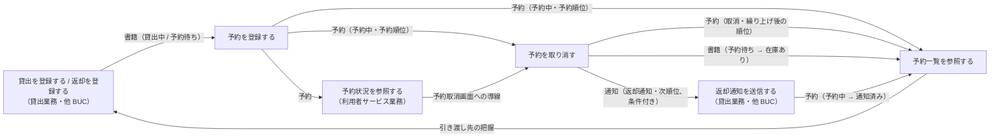
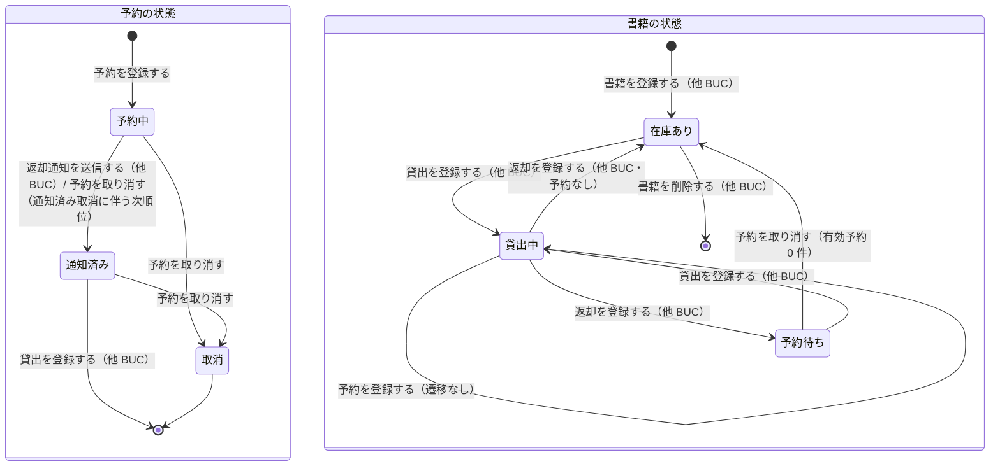

# 書籍を予約するフロー

## 概要

利用者が貸出中・予約待ちの書籍に予約を登録し、受付順の予約順位つきで管理する。利用者は自分の予約を取り消せ、取消時は後続の順位を繰り上げる。司書は書籍ごとの予約順位と予約の状態を確認し、返却時に引き渡す利用者を把握する。

## 所属 UC 一覧

| UC名 | アクター | 主な操作 | 関連情報 |
|------|---------|---------|---------|
| [予約を登録する](予約を登録する/spec.md) | 利用者 | 貸出中・予約待ちの書籍に予約を申し込み、受付順の予約順位つきで「予約中」として登録する | 予約、書籍、利用者 |
| [予約を取り消す](予約を取り消す/spec.md) | 利用者 | 自分の予約を「取消」に遷移させ、後続順位を繰り上げる。通知済み予約の取消時は次順位へ返却通知を生成し、有効予約が無くなれば書籍を「在庫あり」に戻す | 予約、書籍、通知、利用者 |
| [予約一覧を参照する](予約一覧を参照する/spec.md) | 司書 | 書籍ごとの予約順位・利用者・受付日時・予約の状態を一覧で確認し、引き渡し先（通知済み / 順位 1 位）を把握する | 予約、書籍、利用者 |

## UC 横断データフロー

BUC 内の UC 間で情報がどう流れるかを示す。情報がどの UC で作成（C）・参照（R）・更新（U）されるかを明記する。

### データフロー図

### 情報 CRUD マトリクス

| 情報名 | 予約を登録する | 予約を取り消す | 予約一覧を参照する |
|--------|:-------------:|:-------------:|:-----------------:|
| 予約 | C | U | R |
| 書籍 | R | U（予約待ち → 在庫あり、条件付き） | R |
| 利用者 | R | R（次順位の送信先） | R |
| 通知 | - | C（返却通知・次順位、条件付き） | - |

## 状態遷移全体図

BUC 内で関連する状態モデルの全遷移パスと、各遷移を担当する UC を示す。BUC 外の UC が担当する遷移は「（他 BUC）」と付記する。

### 状態遷移 UC マッピング

| 状態モデル | 遷移元 | 遷移先 | 担当 UC |
|-----------|--------|--------|--------|
| 予約の状態 | （なし） | 予約中 | [予約を登録する](予約を登録する/spec.md) |
| 予約の状態 | 予約中 | 取消 | [予約を取り消す](予約を取り消す/spec.md) |
| 予約の状態 | 通知済み | 取消 | [予約を取り消す](予約を取り消す/spec.md) |
| 予約の状態 | 予約中 | 通知済み | [予約を取り消す](予約を取り消す/spec.md)（通知済み取消に伴う次順位）/ 返却通知を送信する（他 BUC） |
| 予約の状態 | 通知済み | （終了） | 貸出を登録する（他 BUC） |
| 予約の状態 | 予約中 / 通知済み / 取消 | （遷移なし・表示のみ） | [予約一覧を参照する](予約一覧を参照する/spec.md) |
| 書籍の状態 | 貸出中 | 貸出中（遷移なし） | [予約を登録する](予約を登録する/spec.md) |
| 書籍の状態 | 予約待ち | 在庫あり | [予約を取り消す](予約を取り消す/spec.md) |
| 書籍の状態 | 貸出中 | 予約待ち | 返却を登録する（他 BUC） |
| 書籍の状態 | （なし） | 在庫あり | 書籍を登録する（他 BUC: 蔵書管理業務） |
| 書籍の状態 | 在庫あり / 予約待ち | 貸出中 | 貸出を登録する（他 BUC: 貸出業務） |
| 書籍の状態 | 貸出中 | 在庫あり | 返却を登録する（他 BUC: 貸出業務・予約なし） |
| 書籍の状態 | 在庫あり | （終了） | 書籍を削除する（他 BUC: 蔵書管理業務） |

## BUC 内共有条件一覧

BUC 内の複数 UC で共有される条件の一覧。各条件がどの UC で適用されるかを明記する。

| 条件名 | 条件の説明 | 適用 UC |
|--------|----------|--------|
| 予約順位決定 | 受付日時の早い順に順位を付与する（登録時: 有効予約の最大順位 + 1）。取消時は後続の予約中・通知済みの順位を 1 ずつ繰り上げ、取消・終了した予約は順位管理から外す | 予約を登録する, 予約を取り消す |
| 有効予約の判定（予約中・通知済み） | 予約の状態が「予約中」「通知済み」の予約を有効予約として扱う。待ち人数の算出（登録・一覧）、重複予約禁止（登録）、書籍の状態復帰（取消）、既定の表示対象（一覧）に共通で用いる | 予約を登録する, 予約を取り消す, 予約一覧を参照する |

UC 固有の条件（参考。詳細は各 UC Spec）: 予約可否判定・媒体種別判定・同一利用者の重複予約禁止（予約を登録する）、利用状況閲覧範囲判定・取消可否・次順位への返却通知（返却通知対象判定）・書籍の状態復帰（予約を取り消す）、表示対象の切替・引き渡し先の強調（予約一覧を参照する）。

## BUC 内共有バリエーション一覧

BUC 内の複数 UC で共有されるバリエーションの一覧。

| バリエーション名 | 値 | 適用 UC |
|----------------|---|--------|
| 利用者区分 | 利用者（本人としてのみ操作可。司書トークンは 403） | 予約を登録する, 予約を取り消す |
| 利用者区分 | 司書（司書ポータル・API は司書区分必須） | 予約一覧を参照する |

UC 固有のバリエーション（参考）: 媒体種別（紙・電子。予約を登録する）、通知種別 = 返却通知（予約を取り消す）。
