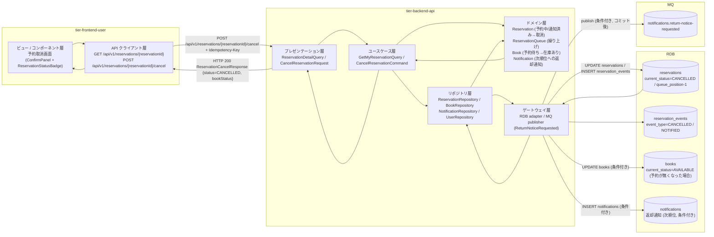
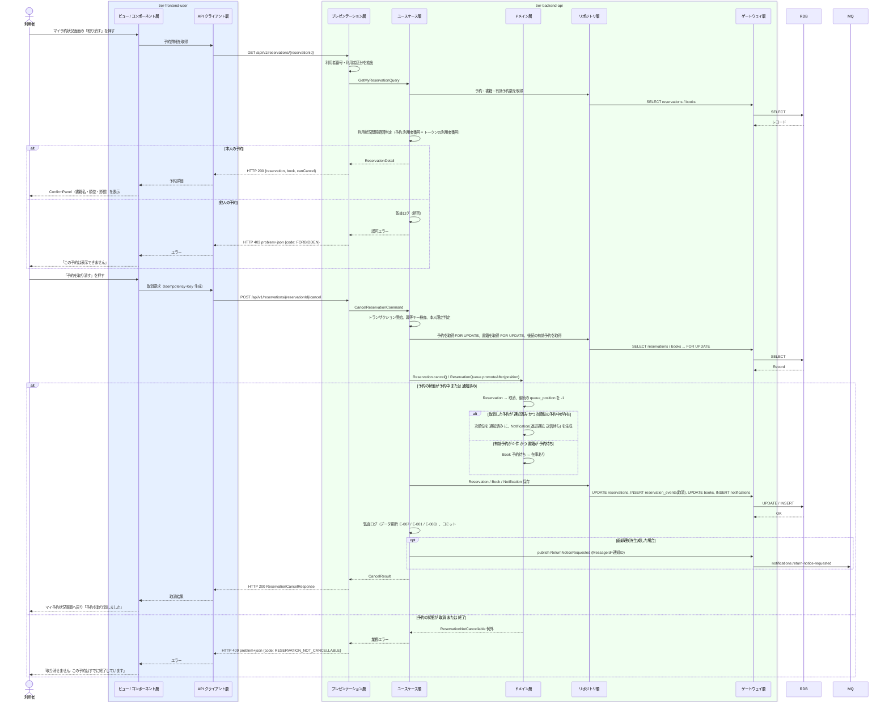

# 予約を取り消す

## 概要

利用者が利用者ポータルで自分の予約（予約中または通知済み）を取り消し、予約の状態を「取消」に遷移させる。後続の予約中・通知済みの予約順位を 1 ずつ繰り上げ、通知済みの予約を取り消したときは次の順位の利用者に返却通知を送る。取り消した結果、書籍に有効な予約が無くなり書籍が「予約待ち」であれば「在庫あり」に戻す。本人以外の予約は取り消せない（利用状況閲覧範囲判定）。

## データフロー



| レイヤー | データモデル | 変換内容 |
|---------|------------|---------|
| FE View | 予約の要約（書籍名・順位・状態バッジ）、確認パネル（影響: 後続の順位が繰り上がる）、取消結果 | マイ予約状況からの遷移 → 確認 → 確定 → マイ予約状況へ戻り Alert（success） |
| FE API Client | `GET /api/v1/reservations/{reservationId}`、`POST /api/v1/reservations/{reservationId}/cancel`（Idempotency-Key 付与） | 予約詳細・取消結果を View 用モデルに正規化、problem+json を利用者向けメッセージに変換 |
| BE presentation | ReservationDetailQuery(reservationId) / CancelReservationRequest(reservationId) | 型・形式の検証、トークンから利用者番号と利用者区分を抽出 |
| BE usecase | GetMyReservationQuery / CancelReservationCommand | 本人限定判定（LP-007）、トランザクション境界、冪等キー検査、監査ログ、条件付き MQ 発行 |
| BE domain | Reservation / ReservationQueue / Book / Notification / ReturnNoticePolicy | 予約の状態遷移（予約中・通知済み → 取消）、後続順位の繰り上げ、書籍の状態判定、次順位への返却通知対象判定 |
| BE repository / gateway | reservations UPDATE（対象 + 後続）、reservation_events INSERT、books UPDATE（条件付き）、notifications INSERT（条件付き）、MQ publish | レコード更新・イベント記録・メッセージ発行 |
| Response | ReservationCancelResponse(reservationId, status=CANCELLED, cancelledAt, bookStatus, promotedCount, nextNotified) | 完了表示とマイ予約状況画面への復帰 |

## 処理フロー



## バリエーション一覧

| バリエーション名 | 値 | 処理内容 | 適用 tier | 適用箇所 |
|----------------|---|---------|----------|---------|
| 利用者区分 | 利用者 | 自分の利用者番号に紐づく予約のみ取消できる | tier-backend-api | GetMyReservationQuery / CancelReservationCommand（利用状況閲覧範囲判定） |
| 利用者区分 | 司書 | 本 UC の対象外（利用者ポータルの画面。司書ポータルに予約取消の画面は無い）。API は司書トークンを 403 にする | tier-backend-api | API 認可 |
| 通知種別 | 返却通知 | 通知済みの予約を取り消したとき次順位へ返却通知を生成する | tier-backend-api | CancelReservationCommand（domain: ReturnNoticePolicy） |

## 分岐条件一覧

| 条件名 | 判定ルール | 適用 tier | 適用箇所 | BDD Scenario |
|--------|----------|----------|---------|-------------|
| 利用状況閲覧範囲判定 | 利用者区分が「利用者」の場合、予約の利用者番号がトークンの利用者番号と一致する場合のみ参照・取消できる。不一致は 403 + 監査ログ | tier-backend-api | GetMyReservationQuery / CancelReservationCommand（usecase） | 他人の予約は取り消せない |
| 予約順位決定 | 取消時は後続の予約中・通知済みの予約の順位を 1 ずつ繰り上げる。取消・終了した予約は順位の管理対象から外す | tier-backend-api | CancelReservationCommand（domain: ReservationQueue.promoteAfter） | 予約中の予約を取り消して後続を繰り上げる |
| 取消可否 | 予約の状態が「予約中」または「通知済み」のときのみ取消できる。「取消」「終了」は不可（409） | tier-backend-api | CancelReservationCommand（domain: Reservation.cancel） | 終了した予約は取り消せない |
| 次順位への返却通知 | 取り消した予約が「通知済み」で書籍が「予約待ち」かつ次順位の「予約中」の予約があれば、その予約を「通知済み」に遷移させ返却通知を生成する（状態.tsv: 通知済み → 取消 → 次の予約順位の利用者に通知） | tier-backend-api | CancelReservationCommand（domain: ReturnNoticePolicy） | 通知済みの予約を取り消して次の利用者に通知する |
| 書籍の状態復帰 | 取消後に有効予約が 0 件で書籍が「予約待ち」なら「在庫あり」に遷移させる | tier-backend-api | CancelReservationCommand（domain: Book.onReservationCleared） | 最後の予約を取り消して書籍を在庫ありに戻す |

## 計算ルール一覧

| 計算名 | 入力情報 | 計算式/ロジック | 出力情報 | 適用 tier |
|--------|---------|---------------|---------|----------|
| 順位繰り上げ | 予約.書籍ID、予約.予約順位（取消対象）、予約.予約の状態 | 対象行（`book_id = ? AND current_status IN ('RESERVED','NOTIFIED') AND queue_position > ?`）を `queue_position` 昇順に走査し、1 行ずつ `UPDATE reservations SET queue_position = queue_position - 1, version = version + 1, updated_at = 現在時刻 WHERE reservation_id = ?` を実行する（部分一意インデックス `uq_reservations_book_id_queue_position` と衝突しないよう、一括 UPDATE にしない） | 後続予約の予約順位 | tier-backend-api |
| 取消日時 | 取消操作の現在時刻 | `cancelled_at = reservation_events(取消).occurred_at` | 予約.取消日時 | tier-backend-api |

## 状態遷移一覧

| 状態モデル | 遷移元 | 遷移先 | トリガー | 事前条件 | 事後処理 | 適用 tier |
|-----------|--------|--------|---------|---------|---------|----------|
| 予約の状態 | 予約中 | 取消 | 予約を取り消す | 本人の予約 | 後続順位の繰り上げ、reservation_events に取消イベント記録 | tier-backend-api |
| 予約の状態 | 通知済み | 取消 | 予約を取り消す | 本人の予約 | 後続順位の繰り上げ、次順位の予約中を通知済みに遷移し返却通知を生成 | tier-backend-api |
| 予約の状態 | 予約中 | 通知済み | 予約を取り消す（通知済みの取消に伴う次順位） | 書籍が予約待ち、次順位の予約が存在 | 通知レコード作成、MQ 発行 | tier-backend-api |
| 書籍の状態 | 予約待ち | 在庫あり | 予約を取り消す | 有効予約が 0 件になった | book_events に予約取消イベント記録、参照キャッシュ無効化 | tier-backend-api |

## 関連 RDRA モデル

| モデル種別 | 要素名 | 関連 |
|-----------|--------|------|
| 業務 | 貸出業務 | このUCが属する業務 |
| BUC | 書籍を予約するフロー | このUCを含むBUC |
| アクター | 利用者 | 操作するアクター |
| 情報 | 予約 | 状態を更新する情報 |
| 情報 | 書籍 | 状態を更新する情報（予約待ち → 在庫あり） |
| 情報 | 通知 | 次順位への返却通知として作成する情報（条件付き） |
| 状態 | 予約の状態 | 予約中 → 取消、通知済み → 取消 |
| 状態 | 書籍の状態 | 予約待ち → 在庫あり |
| 条件 | 予約順位決定 | 後続順位の繰り上げ |
| 条件 | 利用状況閲覧範囲判定 | 本人の予約のみ取消可 |
| 条件 | 返却通知対象判定 | 通知済み取消時の次順位への通知 |
| バリエーション | 利用者区分 | 利用者本人のみ |
| バリエーション | 通知種別 | 返却通知（次順位への通知） |
| 情報 | 利用者 | 次順位の送信先メールアドレスを参照する情報 |
| 画面 | 予約取消画面 | 利用者が操作する画面 |

## E2E 完了条件（BDD）

### 正常系

```gherkin
Feature: 予約を取り消す

  Scenario: 予約中の予約を取り消して後続を繰り上げる
    Given 利用者「田中太郎」（利用者番号「U-000123」）が利用者ポータルにログイン済み
    And 書籍 ID「B-000789」の状態が「貸出中」
    And 利用者番号「U-000123」の予約「R-0001」が予約順位 1（予約中）、「U-000300」の予約「R-0002」が予約順位 2（予約中）
    When 利用者がマイ予約状況画面から予約「R-0001」の予約取消画面を開き「予約を取り消す」を押す
    Then 予約「R-0001」の状態が「取消」になる
    And 予約「R-0002」の予約順位が 1 になる
    And マイ予約状況画面に戻り「予約を取り消しました」と表示される

  Scenario: 通知済みの予約を取り消して次の利用者に通知する
    Given 利用者「田中太郎」（利用者番号「U-000123」）が利用者ポータルにログイン済み
    And 書籍 ID「B-000789」の状態が「予約待ち」
    And 利用者番号「U-000123」の予約「R-0001」が予約順位 1（通知済み）、「U-000300」の予約「R-0002」が予約順位 2（予約中）
    When 利用者が予約「R-0001」を取り消す
    Then 予約「R-0001」の状態が「取消」になる
    And 予約「R-0002」の予約順位が 1、状態が「通知済み」になる
    And 利用者番号「U-000300」宛の通知種別「返却通知」の通知が送信待ちで作成される
    And 書籍「B-000789」の状態は「予約待ち」のままである

  Scenario: 最後の予約を取り消して書籍を在庫ありに戻す
    Given 利用者「田中太郎」（利用者番号「U-000123」）が利用者ポータルにログイン済み
    And 書籍 ID「B-000789」の状態が「予約待ち」
    And 利用者番号「U-000123」の予約「R-0001」が予約順位 1（通知済み）で他に有効な予約が無い
    When 利用者が予約「R-0001」を取り消す
    Then 予約「R-0001」の状態が「取消」になる
    And 書籍「B-000789」の状態が「在庫あり」になる
```

### 異常系

```gherkin
  Scenario: 他人の予約は取り消せない
    Given 利用者「田中太郎」（利用者番号「U-000123」）が利用者ポータルにログイン済み
    And 予約「R-0002」は利用者番号「U-000300」の予約である
    When 利用者が /reservations/R-0002/cancel を開く
    Then 画面に「この予約は表示できません」と表示され取消できない
    And 監査ログに拒否が記録される

  Scenario: 終了した予約は取り消せない
    Given 利用者「田中太郎」（利用者番号「U-000123」）が利用者ポータルにログイン済み
    And 利用者番号「U-000123」の予約「R-0001」の状態が「取消」
    When 利用者が予約「R-0001」の予約取消画面を開く
    Then 画面に「取り消せません: この予約はすでに終了しています」と表示され「予約を取り消す」は無効である

  Scenario: 同じ取消操作を二重送信しても結果は変わらない
    Given 利用者が予約「R-0001」の取消を確定し HTTP 200 を受信済み
    When 同じ Idempotency-Key で POST /api/v1/reservations/R-0001/cancel を再送する
    Then HTTP 200 と同一の取消結果が返る
    And 後続の予約順位は二重に繰り上がらない
```

## ティア別仕様

- [利用者向けフロントエンド](tier-frontend-user.md)
- [Backend API](tier-backend-api.md)

### 統合 API Spec

- [OpenAPI Spec](../../../_cross-cutting/api/openapi.yaml)（全 UC 統合、Contract First 開発用）
- [AsyncAPI Spec](../../../_cross-cutting/api/asyncapi.yaml)（全 UC 統合、`notifications.return-notice-requested` を条件付きで発行）
