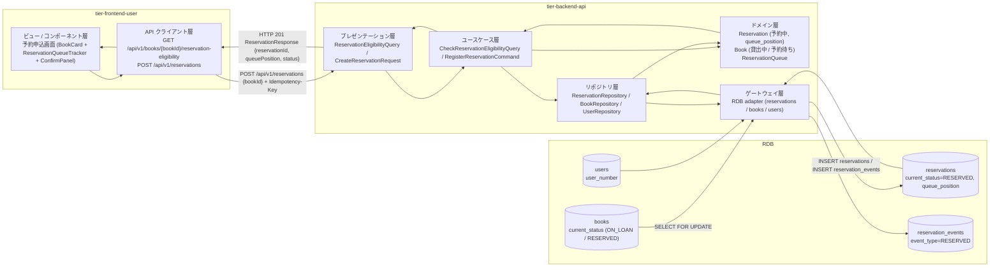
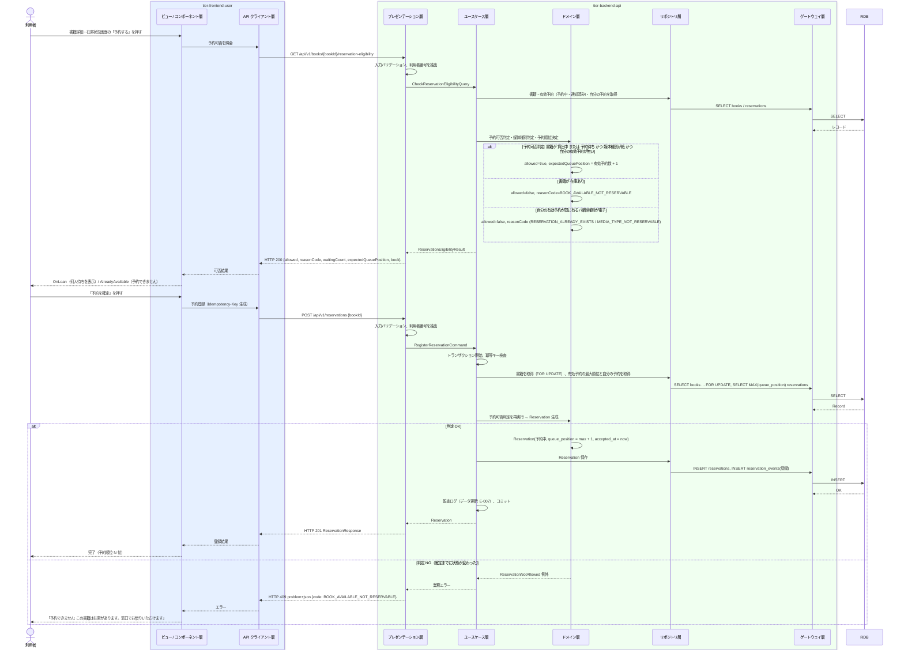

# 予約を登録する

## 概要

利用者が利用者ポータルで「貸出中」または「予約待ち」の書籍に予約を申し込み、受付順の予約順位つきで「予約中」として登録する。在庫ありの書籍には予約できない旨を、申込前の予約可否照会で表示する。予約主体はトークンの利用者番号で確定し、画面から他人の利用者番号は指定できない。

## データフロー



| レイヤー | データモデル | 変換内容 |
|---------|------------|---------|
| FE View | 書籍要約（BookCard）、予約可否と待ち人数（ReservationQueueTracker）、確認パネル、登録結果（予約順位） | 書籍詳細からの遷移 → 可否照会 → 確定 → 完了表示（予約順位を大きく表示） |
| FE API Client | `GET /api/v1/books/{bookId}/reservation-eligibility`、`POST /api/v1/reservations`（Idempotency-Key 付与） | 可否・登録結果を View 用モデルに正規化、problem+json を利用者向けメッセージに変換 |
| BE presentation | ReservationEligibilityQuery(bookId) / CreateReservationRequest(bookId) | 型・形式・必須の検証、トークンから利用者番号を抽出し Command に付与（本文の userNumber は受け付けない） |
| BE usecase | CheckReservationEligibilityQuery / RegisterReservationCommand | トランザクション境界、冪等キー検査、監査ログ（データ更新 E-007） |
| BE domain | Reservation / Book / ReservationQueue | 予約可否判定、媒体種別判定、予約順位決定（有効予約の最大順位 + 1）、同一利用者の重複予約禁止 |
| BE repository / gateway | reservations INSERT、reservation_events INSERT、books SELECT FOR UPDATE、users SELECT | レコード作成・イベント記録 |
| Response | ReservationResponse(reservationId, bookId, userNumber, acceptedAt, queuePosition, status, waitingCount) | 完了表示（予約順位 N 位 / あと N 人） |

## 処理フロー



## バリエーション一覧

| バリエーション名 | 値 | 処理内容 | 適用 tier | 適用箇所 |
|----------------|---|---------|----------|---------|
| 媒体種別 | 紙 | 予約対象として判定を続行する | tier-backend-api | 媒体種別判定（domain） |
| 媒体種別 | 電子 | 予約不可（`MEDIA_TYPE_NOT_RESERVABLE`）として拒否する | tier-backend-api | 媒体種別判定（domain） |
| 利用者区分 | 利用者 | 予約申込画面と `POST /api/v1/reservations` を本人として利用できる | tier-frontend-user / tier-backend-api | 利用者ポータル認可 / API 認可（利用者区分「利用者」、本人番号はトークン由来） |

## 分岐条件一覧

| 条件名 | 判定ルール | 適用 tier | 適用箇所 | BDD Scenario |
|--------|----------|----------|---------|-------------|
| 予約可否判定 | 書籍の状態が「貸出中」または「予約待ち」の場合のみ予約を受け付ける。「在庫あり」は予約不可 | tier-backend-api | CheckReservationEligibilityQuery / RegisterReservationCommand（domain: Book.isReservable） | 貸出中の書籍を予約する / 予約待ちの書籍を予約する / 在庫ありの書籍は予約できない |
| 予約順位決定 | 受付日時の早い順に順位を付与する。順位 = 当該書籍の有効予約（予約中・通知済み）の最大順位 + 1 | tier-backend-api | RegisterReservationCommand（domain: ReservationQueue.nextPosition） | 予約待ちの書籍を予約する |
| 媒体種別判定 | 媒体種別「紙」のみ予約対象。「電子」は予約不可 | tier-backend-api | 同上（domain: Book.isReservable） | 電子書籍は予約できない |
| 同一利用者の重複予約禁止 | 同じ書籍に対し自分の有効予約（予約中・通知済み）が既にあれば予約不可 | tier-backend-api | 同上（domain: ReservationQueue.hasActiveReservationOf） | 同じ書籍を二重に予約できない |

## 計算ルール一覧

| 計算名 | 入力情報 | 計算式/ロジック | 出力情報 | 適用 tier |
|--------|---------|---------------|---------|----------|
| 予約順位 | 予約.書籍ID、予約.予約の状態、予約.予約順位 | `queue_position = COALESCE(MAX(queue_position WHERE book_id = ? AND current_status IN ('RESERVED','NOTIFIED')), 0) + 1` | 予約.予約順位 | tier-backend-api |
| 待ち人数 | 同上 | `waitingCount = COUNT(有効予約)`、画面表示は「あと {waitingCount} 人」 | ReservationQueueTracker の total | tier-backend-api / tier-frontend-user |

## 状態遷移一覧

| 状態モデル | 遷移元 | 遷移先 | トリガー | 事前条件 | 事後処理 | 適用 tier |
|-----------|--------|--------|---------|---------|---------|----------|
| 予約の状態 | （なし） | 予約中 | 予約を登録する | 予約可否判定が可 | 予約順位を付与、reservation_events に登録イベント記録 | tier-backend-api |
| 書籍の状態 | 貸出中 | 貸出中 | 予約を登録する | — | 書籍の状態は変えない（返却時に予約待ちへ遷移） | tier-backend-api |

## 関連 RDRA モデル

| モデル種別 | 要素名 | 関連 |
|-----------|--------|------|
| 業務 | 貸出業務 | このUCが属する業務 |
| BUC | 書籍を予約するフロー | このUCを含むBUC |
| アクター | 利用者 | 操作するアクター |
| 情報 | 予約 | 作成する情報 |
| 情報 | 書籍 | 状態・媒体種別を参照する情報 |
| 情報 | 利用者 | 予約主体として参照する情報 |
| 状態 | 予約の状態 | （なし）→ 予約中 |
| 状態 | 書籍の状態 | 貸出中 / 予約待ちのみ予約可 |
| 条件 | 予約可否判定 | 予約可否の判定 |
| 条件 | 予約順位決定 | 受付順の順位付与 |
| 条件 | 媒体種別判定 | 紙のみ予約対象 |
| バリエーション | 媒体種別 | 紙・電子 |
| バリエーション | 利用者区分 | 利用者本人のみ |
| 画面 | 予約申込画面 | 利用者が操作する画面 |

## E2E 完了条件（BDD）

### 正常系

```gherkin
Feature: 予約を登録する

  Scenario: 貸出中の書籍を予約する
    Given 利用者「田中太郎」（利用者番号「U-000123」）が利用者ポータルにログイン済み
    And 書籍 ID「B-000789」の書籍「こころ」（媒体種別: 紙）の状態が「貸出中」
    And 書籍「B-000789」に有効な予約が無い
    When 利用者が予約申込画面で「予約を確定」を押す
    Then 予約が利用者番号「U-000123」、予約順位 1、状態「予約中」で登録される
    And 画面に「予約を受け付けました。予約順位: 1 位」と表示される

  Scenario: 予約待ちの書籍を予約する
    Given 利用者「田中太郎」（利用者番号「U-000123」）が利用者ポータルにログイン済み
    And 書籍 ID「B-000789」の状態が「予約待ち」
    And 利用者番号「U-000200」の予約が予約順位 1（通知済み）、「U-000300」の予約が予約順位 2（予約中）
    When 利用者が予約申込画面で「予約を確定」を押す
    Then 予約が予約順位 3、状態「予約中」で登録される
    And 画面に「予約順位: 3 位（あと 2 人）」と表示される
```

### 異常系

```gherkin
  Scenario: 在庫ありの書籍は予約できない
    Given 利用者「田中太郎」が利用者ポータルにログイン済み
    And 書籍 ID「B-000456」の状態が「在庫あり」
    When 利用者が予約申込画面（/books/B-000456/reserve）を開く
    Then 画面に「予約できません: この書籍は在庫があります。窓口でお借りいただけます」と表示される
    And 「予約を確定」ボタンは無効である

  Scenario: 同じ書籍を二重に予約できない
    Given 利用者「田中太郎」（利用者番号「U-000123」）が利用者ポータルにログイン済み
    And 書籍 ID「B-000789」に利用者番号「U-000123」の予約が状態「予約中」で存在する
    When 利用者が予約申込画面で「予約を確定」を押す
    Then 画面に「予約できません: この書籍はすでに予約済みです」と表示される
    And 予約は追加されない

  Scenario: 電子書籍は予約できない
    Given 利用者「田中太郎」が利用者ポータルにログイン済み
    And 書籍 ID「B-000900」の媒体種別が「電子」で状態が「貸出中」
    When 利用者が予約申込画面を開く
    Then 画面に「予約できません: 電子書籍は予約の対象外です」と表示される

  Scenario: 未ログインでは予約申込画面を開けない
    Given 利用者がログインしていない
    When 利用者が /books/B-000789/reserve を開く
    Then IdP のログイン画面に遷移し、ログイン後に予約申込画面へ戻る

  Scenario: 同じ確定操作を二重送信しても予約は 1 件だけ登録される
    Given 利用者が書籍「B-000789」の予約を確定し HTTP 201 を受信済み
    When 同じ Idempotency-Key で POST /api/v1/reservations を再送する
    Then HTTP 201 と同一の reservationId が返る
    And 予約は 1 件のみ存在する
```

## ティア別仕様

- [利用者向けフロントエンド](tier-frontend-user.md)
- [Backend API](tier-backend-api.md)

### 統合 API Spec

- [OpenAPI Spec](../../../_cross-cutting/api/openapi.yaml)（全 UC 統合、Contract First 開発用）
