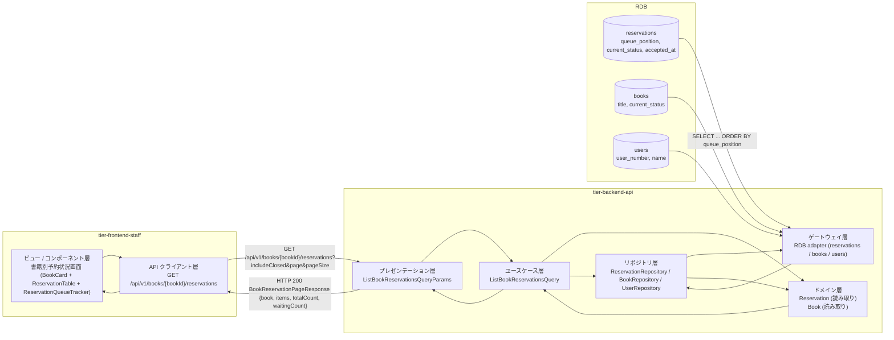
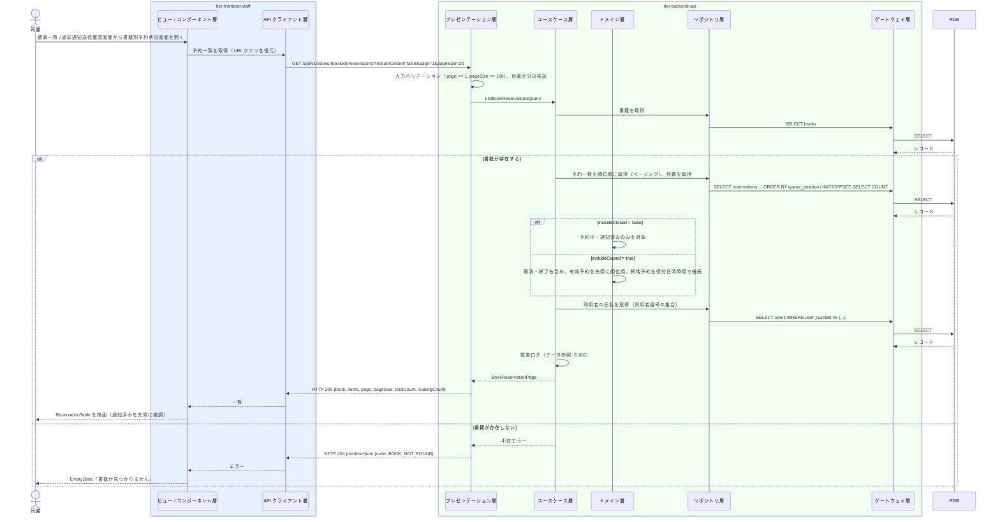

# 予約一覧を参照する

## 概要

司書が司書ポータルで書籍ごとの予約一覧（予約順位・利用者・受付日時・予約の状態）を確認し、返却時に引き渡す利用者（通知済み / 順位 1 位）を把握する。既定では有効な予約（予約中・通知済み）を順位順に表示し、取消・終了した予約は切替で表示する。

## データフロー



| レイヤー | データモデル | 変換内容 |
|---------|------------|---------|
| FE View | 書籍要約（BookCard）、予約一覧（ReservationTable: 順位 / 利用者 / 受付日時 / 状態）、進行トラッカー、取消・終了の表示切替、ページ送り | URL クエリ（includeClosed, page）と同期し一覧を描画。通知済みの予約を先頭に強調 |
| FE API Client | `GET /api/v1/books/{bookId}/reservations` | 一覧を View 用モデルに正規化、HTTP エラーを統一エラー型に変換 |
| BE presentation | ListBookReservationsQueryParams(bookId, includeClosed, page, pageSize) | 型・範囲の検証（pageSize 上限 100）、司書区分の検証 |
| BE usecase | ListBookReservationsQuery | 書籍存在確認、有効予約の順位順取得、氏名の結合、監査ログ（データ参照） |
| BE domain | Reservation / Book | 読み取りのみ（状態遷移なし） |
| BE repository / gateway | reservations SELECT（順位順・ページング）、books SELECT、users SELECT（氏名） | レコード読み取り・結合 |
| Response | BookReservationPageResponse(book, items[ReservationListItem], page, pageSize, totalCount, waitingCount) | 一覧表示と待ち人数表示 |

## 処理フロー



## バリエーション一覧

| バリエーション名 | 値 | 処理内容 | 適用 tier | 適用箇所 |
|----------------|---|---------|----------|---------|
| 利用者区分 | 司書 | 書籍別予約状況画面と `GET /api/v1/books/{bookId}/reservations` を利用できる | tier-frontend-staff / tier-backend-api | 司書ポータル認可 / API 認可（司書区分必須） |

## 分岐条件一覧

| 条件名 | 判定ルール | 適用 tier | 適用箇所 | BDD Scenario |
|--------|----------|----------|---------|-------------|
| 表示対象の切替 | `includeClosed = false`（既定）: 予約の状態が「予約中」「通知済み」のみ。`true`: 「取消」「終了」も含める | tier-backend-api / tier-frontend-staff | ListBookReservationsQuery / ReservationTable の切替 | 有効な予約を順位順に表示する / 取消・終了した予約も表示する |
| 引き渡し先の強調 | 予約の状態が「通知済み」の予約の行に「引き渡し先」ラベルを表示し、行の背景色を強調スタイル（`var(--analysis-light)`）にする（順位 1 位は通常 通知済み） | tier-frontend-staff | ReservationTable の行スタイル | 有効な予約を順位順に表示する |

## 計算ルール一覧

| 計算名 | 入力情報 | 計算式/ロジック | 出力情報 | 適用 tier |
|--------|---------|---------------|---------|----------|
| 待ち人数 | 予約.書籍ID、予約.予約の状態 | `waitingCount = COUNT(reservations WHERE book_id = ? AND current_status IN ('RESERVED','NOTIFIED'))` | waitingCount | tier-backend-api |
| ページ数 | totalCount, pageSize | `ceil(totalCount / pageSize)`（pageSize 既定 20、上限 100） | Pagination の総ページ数 | tier-frontend-staff |

## 状態遷移一覧

| 状態モデル | 遷移元 | 遷移先 | トリガー | 事前条件 | 事後処理 | 適用 tier |
|-----------|--------|--------|---------|---------|---------|----------|
| 予約の状態 | — | — | 予約一覧を参照する | — | 状態遷移なし（予約中 / 通知済み / 取消 / 終了 を表示するのみ） | tier-backend-api |

## 関連 RDRA モデル

| モデル種別 | 要素名 | 関連 |
|-----------|--------|------|
| 業務 | 貸出業務 | このUCが属する業務 |
| BUC | 書籍を予約するフロー | このUCを含むBUC |
| アクター | 司書 | 操作するアクター |
| 情報 | 予約 | 参照する情報（予約順位・予約の状態・受付日時） |
| 情報 | 書籍 | 参照する情報（書籍要約・状態） |
| 情報 | 利用者 | 参照する情報（氏名） |
| 状態 | 予約の状態 | 表示する状態（予約中 / 通知済み / 取消 / 終了） |
| 状態 | 書籍の状態 | 書籍要約に表示 |
| バリエーション | 利用者区分 | 司書のみ |
| 画面 | 書籍別予約状況画面 | 司書が操作する画面 |

## E2E 完了条件（BDD）

### 正常系

```gherkin
Feature: 予約一覧を参照する

  Scenario: 有効な予約を順位順に表示する
    Given 司書「佐藤花子」が司書ポータルにログイン済み
    And 書籍 ID「B-000789」の書籍「こころ」の状態が「予約待ち」
    And 利用者番号「U-000200」（山田太郎）の予約が予約順位 1、状態「通知済み」、受付日時「2026-09-01 10:00」
    And 利用者番号「U-000300」（鈴木一郎）の予約が予約順位 2、状態「予約中」、受付日時「2026-09-02 15:30」
    And 利用者番号「U-000400」の予約が状態「取消」
    When 司書が書籍別予約状況画面（/staff/books/B-000789/reservations）を開く
    Then ReservationTable に 2 行が予約順位順に表示される
    And 1 行目のセルは「1」「山田太郎」「2026/09/01 10:00」「通知済み」であり、その行に「引き渡し先」ラベルが表示される
    And 「待ち人数: 2 人」と表示され、取消の予約は表示されない

  Scenario: 取消・終了した予約も表示する
    Given 司書「佐藤花子」が書籍別予約状況画面を開いている
    And 書籍「B-000789」に状態「取消」の予約が 1 件ある
    When 司書が「取消・終了も表示」を ON にする
    Then ReservationTable に取消の予約が末尾に ReservationStatusBadge「取消」で表示される
```

### 異常系

```gherkin
  Scenario: 予約がない書籍では空状態を表示する
    Given 司書「佐藤花子」が司書ポータルにログイン済み
    And 書籍 ID「B-000456」に予約が無い
    When 司書が書籍別予約状況画面（/staff/books/B-000456/reservations）を開く
    Then EmptyState に「この書籍に予約はありません」と表示される

  Scenario: 存在しない書籍では見つからない旨を表示する
    Given 司書「佐藤花子」が司書ポータルにログイン済み
    And 書籍 ID「B-999999」は登録されていない
    When 司書が /staff/books/B-999999/reservations を開く
    Then 画面に「書籍が見つかりません」と蔵書一覧へのボタンが表示される

  Scenario: 利用者は書籍別予約状況を参照できない
    Given 利用者区分「利用者」のトークンを持つ
    When GET /api/v1/books/B-000789/reservations を送る
    Then HTTP 403 が返る
```

## ティア別仕様

- [司書向けフロントエンド](tier-frontend-staff.md)
- [Backend API](tier-backend-api.md)

### 統合 API Spec

- [OpenAPI Spec](../../../_cross-cutting/api/openapi.yaml)（全 UC 統合、Contract First 開発用）
