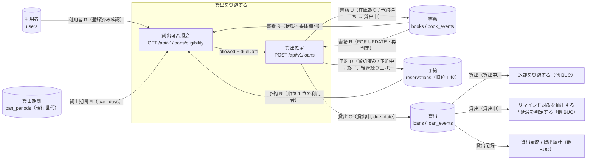
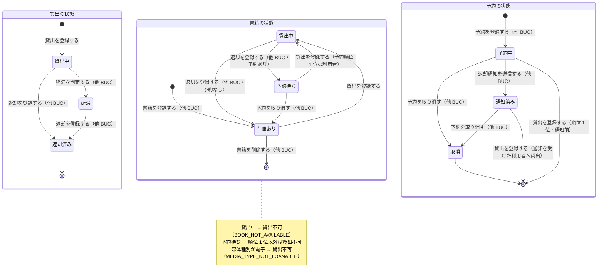

# 書籍を貸し出すフロー

## 概要

利用者が書架から取った在庫ありの書籍を利用者番号とともに窓口に提示し、司書が貸出を登録して書籍を「貸出中」にし、返却期限（貸出日 + 貸出期間）を案内して書籍を渡す BUC。予約待ちの書籍は予約順位 1 位の利用者に限り貸し出せ、その予約は終了する。システムを使う UC は「貸出を登録する」の 1 件で、前後の「借りたい書籍を窓口に持ち込む」「返却期限を確認して書籍を受け取る」はシステムを使わない作業である。

## 所属 UC 一覧

| UC名 | アクター | 主な操作 | 関連情報 |
|------|---------|---------|---------|
| [貸出を登録する](貸出を登録する/spec.md) | 司書（価値提供） | 貸出受付画面で利用者番号と書籍 ID を入力して貸出可否を照会し、確定して貸出記録を作成する。返却期限を自動設定し、書籍を貸出中に遷移させる | 貸出、書籍、利用者、貸出期間、予約 |

システムを使わないアクティビティ（UC なし）:

- 借りたい書籍を窓口に持ち込む（利用者）
- 返却期限を確認して書籍を受け取る（利用者）

## UC 横断データフロー

BUC 内の UC は 1 件のため、UC 内の判定（照会）と確定（登録）の 2 段階を軸に、情報の入出力と他 BUC への影響を示す。情報がどの UC で作成（C）・参照（R）・更新（U）されるかを明記する。

### データフロー図

### 情報 CRUD マトリクス

| 情報名 | 貸出を登録する |
|--------|:-------:|
| 貸出 | C |
| 書籍 | R / U |
| 利用者 | R |
| 貸出期間 | R |
| 予約 | R / U |

補足:

- 貸出の C と書籍・予約の U は 1 トランザクションで行い、`loan_events` / `book_events` にイベントを記録する。書籍は version による楽観ロックで更新する。
- 予約の U は書籍が予約待ちで貸出先が予約順位 1 位の場合のみ発生する（予約を終了に遷移し、後続予約の順位を繰り上げる）。

## 状態遷移全体図

BUC 内で関連する状態モデルの全遷移パスと、各遷移を担当する UC を示す。本 BUC は貸出の状態の起点（（なし）→ 貸出中）を担当し、書籍の状態と予約の状態も同時に遷移させる。

### 状態遷移 UC マッピング

| 状態モデル | 遷移元 | 遷移先 | 担当 UC |
|-----------|--------|--------|--------|
| 貸出の状態 | （なし） | 貸出中 | [貸出を登録する](貸出を登録する/spec.md)（返却期限を自動設定） |
| 書籍の状態 | 在庫あり | 貸出中 | [貸出を登録する](貸出を登録する/spec.md)（利用者が登録済み、媒体種別が紙） |
| 書籍の状態 | 予約待ち | 貸出中 | [貸出を登録する](貸出を登録する/spec.md)（貸出先が予約順位 1 位の利用者） |
| 予約の状態 | 通知済み | （終了） | [貸出を登録する](貸出を登録する/spec.md)（通知を受けた利用者への貸出） |
| 予約の状態 | 予約中 | （終了） | [貸出を登録する](貸出を登録する/spec.md)（順位 1 位の利用者への通知前の貸出。状態.tsv には無い UC Spec 側の補完遷移） |
| 貸出の状態 | 貸出中 | 延滞 | 延滞を判定する（期限管理業務 / 延滞者に督促するフロー） |
| 貸出の状態 | 貸出中 / 延滞 | 返却済み | 返却を登録する（貸出業務 / 書籍を返却するフロー） |
| 書籍の状態 | 貸出中 | 在庫あり / 予約待ち | 返却を登録する（貸出業務 / 書籍を返却するフロー） |
| 予約の状態 | 予約中 | 通知済み | 返却通知を送信する（貸出業務 / 書籍を返却するフロー） |
| 貸出の状態 | 返却済み | （終了） | （終端。担当 UC なし） |
| 書籍の状態 | （初期） | 在庫あり | 書籍を登録する（蔵書管理業務 / 蔵書を管理するフロー） |
| 書籍の状態 | 在庫あり | （終了） | 書籍を削除する（蔵書管理業務 / 蔵書を管理するフロー） |
| 書籍の状態 | 予約待ち | 在庫あり | 予約を取り消す（貸出業務 / 書籍を予約するフロー） |
| 予約の状態 | （初期） | 予約中 | 予約を登録する（貸出業務 / 書籍を予約するフロー） |
| 予約の状態 | 予約中 / 通知済み | 取消 | 予約を取り消す（貸出業務 / 書籍を予約するフロー） |
| 予約の状態 | 取消 | （終了） | （終端。担当 UC なし） |

## BUC 内共有条件一覧

BUC 内の UC は 1 件のため、UC 間で共有される条件は無い。代わりに、貸出を登録する が適用する条件と、その条件を共有する他 BUC の UC を示す（BUC をまたぐ整合性の確認用）。

| 条件名 | 条件の説明 | 適用 UC |
|--------|----------|--------|
| 貸出可否判定 | 書籍の状態が「在庫あり」かつ利用者が登録済み → 可。「貸出中」→ 不可。「予約待ち」→ 予約順位 1 位の利用者に限り可。照会（eligibility）と確定（POST）の両方で判定する | 貸出を登録する（本 BUC のみ） |
| 返却期限算出 | 返却期限 = 貸出日（当日） + 貸出期間（valid_to IS NULL の現行世代 loan_days） | 貸出を登録する（本 BUC のみ） |
| 媒体種別判定 | 媒体種別が「紙」のみ貸出対象。「電子」は貸出不可（MEDIA_TYPE_NOT_LOANABLE） | 貸出を登録する。他 BUC: 書籍を登録する / 書籍を編集する / 書籍一覧を参照する（蔵書を管理するフロー）, 書籍詳細を参照する（書籍を検索するフロー）, 予約を登録する（書籍を予約するフロー） |

## BUC 内共有バリエーション一覧

BUC 内の UC は 1 件のため、UC 間で共有されるバリエーションは無い。貸出を登録する が適用するバリエーションと、他 BUC との共有関係を示す。

| バリエーション名 | 値 | 適用 UC |
|----------------|---|--------|
| 媒体種別 | 紙（貸出対象として判定を続行）、電子（貸出不可として拒否） | 貸出を登録する。他 BUC: 蔵書を管理するフロー / 書籍を検索するフロー / 書籍を予約するフロー の各 UC |
| 利用者区分 | 司書（貸出受付画面と POST /api/v1/loans を利用可） | 貸出を登録する。他 BUC: 返却を登録する / 返却通知を送信する（書籍を返却するフロー）, 利用者を管理するフロー の各 UC |
