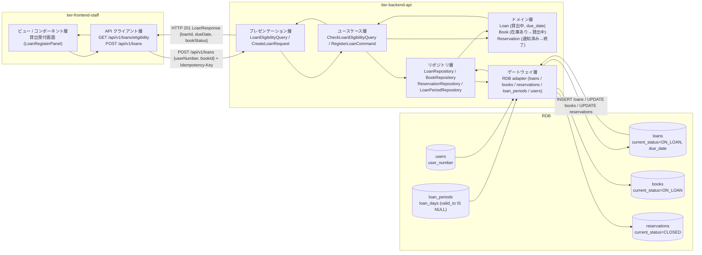
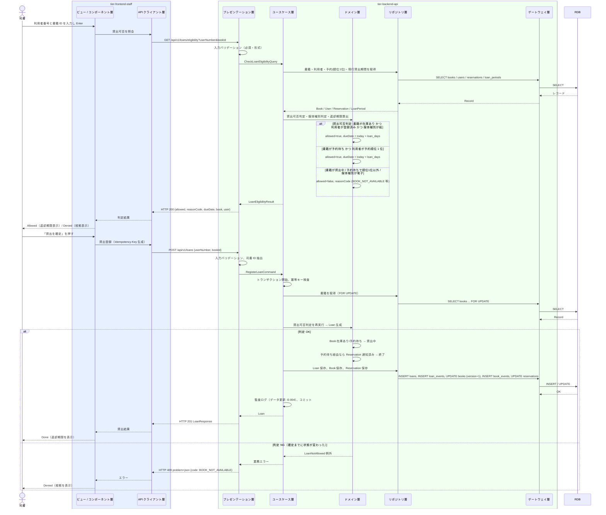

# 貸出を登録する

## 概要

司書が窓口で利用者番号と書籍 ID を指定して貸出記録を作成し、書籍の状態を「在庫あり」（または予約順位 1 位の利用者に対する「予約待ち」）から「貸出中」に遷移させる。返却期限は貸出日にビジネスパラメータ「貸出期間」を加算して自動設定し、貸出できない場合は判定結果と根拠を同時に表示する。

## データフロー



| レイヤー | データモデル | 変換内容 |
|---------|------------|---------|
| FE View | LoanRegisterPanel の入力（利用者番号・書籍 ID）、判定結果（allowed / denied + 根拠）、返却期限 | 2 入力 → 判定クエリ → 確定操作 → 完了表示（返却期限を大きく表示） |
| FE API Client | `GET /api/v1/loans/eligibility?userNumber&bookId`、`POST /api/v1/loans`（Idempotency-Key 付与） | 判定結果と貸出結果を View 用モデルに正規化、problem+json を利用者向けメッセージに変換 |
| BE presentation | LoanEligibilityQuery(userNumber, bookId) / CreateLoanRequest(userNumber, bookId) | 型・形式・必須の検証、トークンから司書 ID（recorded_by）を抽出し Command に付与 |
| BE usecase | CheckLoanEligibilityQuery / RegisterLoanCommand | トランザクション境界、冪等キー検査、監査ログ（データ更新） |
| BE domain | Loan / Book / Reservation / LoanPeriod | 貸出可否判定、媒体種別判定、返却期限算出、書籍・予約の状態遷移 |
| BE repository / gateway | loans INSERT、books UPDATE（version 楽観ロック）、reservations UPDATE、loan_periods / users SELECT | レコード作成・更新、イベント記録（loan_events / book_events） |
| Response | LoanResponse(loanId, bookId, userNumber, loanedOn, dueDate, status, bookStatus) | 完了表示（Done）と返却期限案内 |

## 処理フロー



## バリエーション一覧

| バリエーション名 | 値 | 処理内容 | 適用 tier | 適用箇所 |
|----------------|---|---------|----------|---------|
| 媒体種別 | 紙 | 貸出対象として判定を続行する | tier-backend-api | 媒体種別判定（domain） |
| 媒体種別 | 電子 | 貸出不可（`MEDIA_TYPE_NOT_LOANABLE`）として拒否する | tier-backend-api | 媒体種別判定（domain） |
| 利用者区分 | 司書 | 貸出受付画面と POST /api/v1/loans を利用できる | tier-frontend-staff / tier-backend-api | 司書ポータル認可 / API 認可（司書区分必須） |

## 分岐条件一覧

| 条件名 | 判定ルール | 適用 tier | 適用箇所 | BDD Scenario |
|--------|----------|----------|---------|-------------|
| 貸出可否判定 | 書籍の状態が「在庫あり」かつ利用者番号が登録済み → 可。「貸出中」→ 不可。「予約待ち」→ 予約順位 1 位（状態が通知済みまたは予約中）の利用者に限り可 | tier-backend-api | CheckLoanEligibilityQuery / RegisterLoanCommand（domain: Loan.canLend） | 在庫ありの書籍を貸し出す / 予約順位 1 位の利用者に予約待ちの書籍を貸し出す / 貸出中の書籍は貸し出せない / 予約順位 1 位以外には貸し出せない |
| 媒体種別判定 | 媒体種別が「紙」のみ貸出対象。「電子」は貸出不可 | tier-backend-api | 同上（domain: Book.isLoanable） | 電子書籍は貸し出せない |
| 返却期限算出 | 返却期限 = 貸出日（当日） + 貸出期間（valid_to IS NULL の現行世代 loan_days） | tier-backend-api | RegisterLoanCommand（domain: DueDatePolicy） | 在庫ありの書籍を貸し出す |

## 計算ルール一覧

| 計算名 | 入力情報 | 計算式/ロジック | 出力情報 | 適用 tier |
|--------|---------|---------------|---------|----------|
| 返却期限算出 | 貸出.貸出日（当日）、貸出期間.貸出期間（日数） | `due_date = loaned_on + loan_days`（日付加算、時刻は持たない） | 貸出.返却期限 | tier-backend-api |
| 現行貸出期間の解決 | 貸出期間.適用開始日（valid_from）、貸出日 | `valid_from <= loaned_on AND valid_to IS NULL` の世代を 1 件採用する（適用開始日が貸出日より後の世代は使わない） | 貸出期間.貸出期間（日数） | tier-backend-api |

## 状態遷移一覧

| 状態モデル | 遷移元 | 遷移先 | トリガー | 事前条件 | 事後処理 | 適用 tier |
|-----------|--------|--------|---------|---------|---------|----------|
| 貸出の状態 | （なし） | 貸出中 | 貸出を登録する | 貸出可否判定が可 | 返却期限を自動設定、loan_events に登録イベント記録 | tier-backend-api |
| 書籍の状態 | 在庫あり | 貸出中 | 貸出を登録する | 利用者が登録済み、媒体種別が紙 | book_events に貸出イベント記録 | tier-backend-api |
| 書籍の状態 | 予約待ち | 貸出中 | 貸出を登録する | 貸出先が予約順位 1 位の利用者 | 該当予約を終了に遷移、後続予約の順位を繰り上げ | tier-backend-api |
| 予約の状態 | 通知済み | （終了） | 貸出を登録する | 通知を受けた利用者への貸出 | 予約は順位管理対象から外れる | tier-backend-api |
| 予約の状態 | 予約中 | 終了 | 貸出を登録する | 順位 1 位の利用者への貸出（通知前） | 予約は順位管理対象から外れる | tier-backend-api |

## 関連 RDRA モデル

| モデル種別 | 要素名 | 関連 |
|-----------|--------|------|
| 業務 | 貸出業務 | このUCが属する業務 |
| BUC | 書籍を貸し出すフロー | このUCを含むBUC |
| アクター | 司書 | 操作するアクター |
| 情報 | 貸出 | 作成する情報 |
| 情報 | 書籍 | 状態を更新する情報 |
| 情報 | 利用者 | 貸出先として参照する情報 |
| 情報 | 貸出期間 | 返却期限算出に参照する情報（貸出期間（日数）・適用開始日） |
| 情報 | 予約 | 予約待ち書籍の貸出時に参照・更新する情報 |
| 状態 | 貸出の状態 | （なし）→ 貸出中 |
| 状態 | 書籍の状態 | 在庫あり → 貸出中、予約待ち → 貸出中 |
| 状態 | 予約の状態 | 通知済み → 終了 |
| 条件 | 貸出可否判定 | 貸出可否の判定 |
| 条件 | 返却期限算出 | 返却期限の自動設定 |
| 条件 | 媒体種別判定 | 紙のみ貸出対象 |
| バリエーション | 媒体種別 | 紙・電子 |
| 画面 | 貸出受付画面 | 司書が操作する画面 |

## E2E 完了条件（BDD）

### 正常系

```gherkin
Feature: 貸出を登録する

  Scenario: 在庫ありの書籍を貸し出す
    Given 司書「佐藤花子」が司書ポータルにログイン済み
    And 利用者番号「U-000123」の利用者「田中太郎」が登録済み
    And 書籍 ID「B-000456」の書籍「吾輩は猫である」（媒体種別: 紙）の状態が「在庫あり」
    And 貸出期間が 14 日（適用開始日 2026-01-01）で現行である
    And 本日が 2026-09-03
    When 司書が貸出受付画面で利用者番号「U-000123」と書籍 ID「B-000456」を入力して「貸出を確定」を押す
    Then 貸出が状態「貸出中」、返却期限「2026-09-17」で登録される
    And 書籍「B-000456」の状態が「貸出中」になる
    And 画面に返却期限「2026-09-17」が表示される

  Scenario: 予約順位 1 位の利用者に予約待ちの書籍を貸し出す
    Given 司書「佐藤花子」が司書ポータルにログイン済み
    And 書籍 ID「B-000789」の状態が「予約待ち」
    And 利用者番号「U-000200」の予約が予約順位 1、状態「通知済み」
    And 利用者番号「U-000300」の予約が予約順位 2、状態「予約中」
    When 司書が利用者番号「U-000200」と書籍 ID「B-000789」で貸出を確定する
    Then 貸出が状態「貸出中」で登録される
    And 書籍「B-000789」の状態が「貸出中」になる
    And 利用者番号「U-000200」の予約の状態が「終了」になる
    And 利用者番号「U-000300」の予約順位が 1 になる
```

### 異常系

```gherkin
  Scenario: 貸出中の書籍は貸し出せない
    Given 司書「佐藤花子」が司書ポータルにログイン済み
    And 書籍 ID「B-000456」の状態が「貸出中」
    When 司書が利用者番号「U-000123」と書籍 ID「B-000456」を入力して判定する
    Then 画面に「貸出できません: この書籍は貸出中です」と表示される
    And 貸出は登録されない

  Scenario: 予約順位 1 位以外には貸し出せない
    Given 司書「佐藤花子」が司書ポータルにログイン済み
    And 書籍 ID「B-000789」の状態が「予約待ち」
    And 利用者番号「U-000200」の予約が予約順位 1
    When 司書が利用者番号「U-000300」と書籍 ID「B-000789」を入力して判定する
    Then 画面に「貸出できません: この書籍は予約順位 1 位の利用者のみ貸出できます」と表示される
    And 貸出は登録されない

  Scenario: 電子書籍は貸し出せない
    Given 司書「佐藤花子」が司書ポータルにログイン済み
    And 書籍 ID「B-000900」の媒体種別が「電子」で状態が「在庫あり」
    When 司書が利用者番号「U-000123」と書籍 ID「B-000900」を入力して判定する
    Then 画面に「貸出できません: 電子書籍は貸出の対象外です」と表示される

  Scenario: 未登録の利用者番号では貸し出せない
    Given 司書「佐藤花子」が司書ポータルにログイン済み
    And 利用者番号「U-999999」は登録されていない
    When 司書が利用者番号「U-999999」と書籍 ID「B-000456」を入力して判定する
    Then 画面に「貸出できません: 利用者番号 U-999999 は登録されていません」と表示される

  Scenario: 同じ確定操作を二重送信しても貸出は 1 件だけ登録される
    Given 司書が利用者番号「U-000123」と書籍 ID「B-000456」で貸出を確定し HTTP 201 を受信済み
    When 同じ Idempotency-Key で POST /api/v1/loans を再送する
    Then HTTP 201 と同一の loanId が返る
    And 貸出は 1 件のみ存在する
```

## ティア別仕様

- [司書向けフロントエンド](tier-frontend-staff.md)
- [Backend API](tier-backend-api.md)

### 統合 API Spec

- [OpenAPI Spec](../../../_cross-cutting/api/openapi.yaml)（全 UC 統合、Contract First 開発用）
