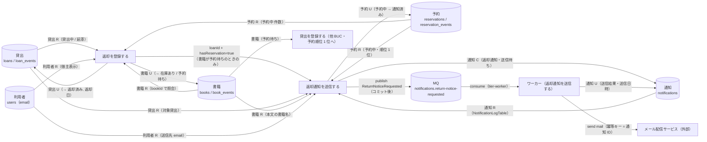
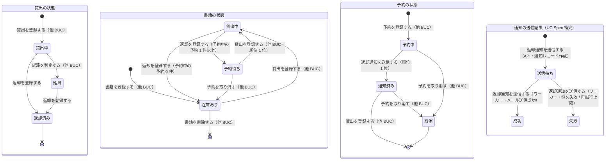

# 書籍を返却するフロー

## 概要

利用者が窓口に返却した書籍について、司書が返却を登録して貸出を「返却済み」にし、書籍を予約の有無に応じて「在庫あり」または「予約待ち」に戻す BUC。予約がある場合は続けて予約順位 1 位の利用者に返却通知メールを送信し、予約を「通知済み」に遷移させる。メール送信は Backend API が通知レコードを作成して MQ に発行し、ワーカーがメール配信サービス経由で送信して結果を反映する非同期構成である。

## 所属 UC 一覧

| UC名 | アクター | 主な操作 | 関連情報 |
|------|---------|---------|---------|
| [返却を登録する](返却を登録する/spec.md) | 司書（価値提供） | 返却受付画面で書籍 ID から貸出中 / 延滞の貸出を特定し、返却を確定する。返却後の書籍状態を判定し、予約があれば返却通知送信確認画面へ誘導する | 貸出、書籍、予約 |
| [返却通知を送信する](返却通知を送信する/spec.md) | 司書（価値提供）、利用者（受信）、外部システム: メール配信サービス | 返却通知送信確認画面で送信先（予約順位 1 位）を確認して送信を確定する。通知レコードを作成し予約を通知済みに遷移、ワーカーがメールを送信して送信結果を記録する | 予約、利用者、通知、書籍 |

システムを使わないアクティビティ（UC なし）:

- 書籍を窓口に返却する（利用者）
- 返却通知を受け取る（予約順位 1 位の利用者）

## UC 横断データフロー

BUC 内の UC 間で情報がどう流れるかを示す。情報がどの UC で作成（C）・参照（R）・更新（U）されるかを明記する。

### データフロー図

### 情報 CRUD マトリクス

| 情報名 | 返却を登録する | 返却通知を送信する |
|--------|:-------:|:-------:|
| 貸出 | R / U | R |
| 書籍 | R / U | R |
| 予約 | R | R / U |
| 利用者 | R | R |
| 通知 | | C / R / U |

補足:

- 返却を登録する の U は `loan_events`（返却）/ `book_events`（返却）のイベント記録と、`loans` / `books`（version 楽観ロック）の更新を 1 トランザクションで行う。
- 返却通知を送信する の 通知 C と 予約 U は同一トランザクションで行い、コミット後に MQ へ発行する。通知 U（送信結果・送信日時）はワーカーが行う。
- 通知の重複防止は「対象予約 × 通知種別（返却通知）× 送信日」の一意制約と、ワーカー側の MessageId（= 通知 ID）既処理照合の二段で行う。

## 状態遷移全体図

BUC 内で関連する状態モデルの全遷移パスと、各遷移を担当する UC を示す。本 BUC は貸出の状態の終端（返却済み）、書籍の状態の貸出中からの戻り、予約の状態の予約中 → 通知済み、および通知の送信結果を担当する。

### 状態遷移 UC マッピング

| 状態モデル | 遷移元 | 遷移先 | 担当 UC |
|-----------|--------|--------|--------|
| 貸出の状態 | 貸出中 | 返却済み | [返却を登録する](返却を登録する/spec.md) |
| 貸出の状態 | 延滞 | 返却済み | [返却を登録する](返却を登録する/spec.md) |
| 書籍の状態 | 貸出中 | 在庫あり | [返却を登録する](返却を登録する/spec.md)（予約中の予約が 0 件） |
| 書籍の状態 | 貸出中 | 予約待ち | [返却を登録する](返却を登録する/spec.md)（予約中の予約が 1 件以上。返却通知送信確認画面へ誘導） |
| 予約の状態 | 予約中 | 通知済み | [返却通知を送信する](返却通知を送信する/spec.md)（書籍が予約待ち、予約が順位 1 位） |
| 通知の送信結果（RDRA 状態モデル外・UC Spec 補完） | 送信待ち | 成功 | [返却通知を送信する](返却通知を送信する/spec.md)（tier-worker） |
| 通知の送信結果（RDRA 状態モデル外・UC Spec 補完） | 送信待ち | 失敗 | [返却通知を送信する](返却通知を送信する/spec.md)（tier-worker・DLQ 退避） |
| 貸出の状態 | （なし） | 貸出中 | 貸出を登録する（貸出業務 / 書籍を貸し出すフロー） |
| 貸出の状態 | 貸出中 | 延滞 | 延滞を判定する（期限管理業務 / 延滞者に督促するフロー） |
| 書籍の状態 | 在庫あり / 予約待ち | 貸出中 | 貸出を登録する（貸出業務 / 書籍を貸し出すフロー） |
| 予約の状態 | （なし） | 予約中 | 予約を登録する（貸出業務 / 書籍を予約するフロー） |
| 予約の状態 | 通知済み | （終了） | 貸出を登録する（貸出業務 / 書籍を貸し出すフロー） |
| 予約の状態 | 予約中 / 通知済み | 取消 | 予約を取り消す（貸出業務 / 書籍を予約するフロー） |
| 書籍の状態 | （初期） | 在庫あり | 書籍を登録する（蔵書管理業務 / 蔵書を管理するフロー） |
| 書籍の状態 | 在庫あり | （終了） | 書籍を削除する（蔵書管理業務 / 蔵書を管理するフロー） |

## BUC 内共有条件一覧

BUC 内の複数 UC で共有される条件の一覧。各条件がどの UC で適用されるかを明記する。2 UC で名前が同じ条件は無いが、「予約中の予約の有無（予約順位 1 位の特定）」という同一の判定を両 UC が連鎖して適用するため、その連鎖を共有条件として示す。

| 条件名 | 条件の説明 | 適用 UC |
|--------|----------|--------|
| 予約中の予約の有無（返却後の書籍状態判定 → 返却通知対象判定 の連鎖） | 返却された書籍に状態「予約中」の予約が 1 件以上あるかを `COUNT(reservations WHERE book_id = ? AND current_status = 'RESERVED')` で判定する。返却を登録する では書籍を予約待ち / 在庫ありに振り分け `hasReservation` を返し、返却通知を送信する では同じ判定で順位 1 位の利用者を送信先に特定する（0 件なら 409 で送信しない） | 返却を登録する（返却後の書籍状態判定）, 返却通知を送信する（返却通知対象判定） |
| 利用状況閲覧範囲判定（司書のみ操作可） | 利用者区分が「司書」のトークンのみ返却受付画面 / 返却通知送信確認画面と `POST /api/v1/loans/{loanId}/return` / `POST /api/v1/notifications/return-notices` を利用できる（司書ポータル認可 / API 認可） | 返却を登録する, 返却通知を送信する |
| 冪等性（Idempotency-Key） | 確定操作の二重送信を Idempotency-Key で検知し、同一結果を返す（返却イベント / 通知レコードは 1 件のみ） | 返却を登録する, 返却通知を送信する |

BUC 内で 1 つの UC でしか使われない条件（UC Spec 側のみ）:

- 返却後の書籍状態判定 の貸出側ルール（貸出中・延滞 → 返却済み。返却済みは 409 LOAN_ALREADY_RETURNED）（返却を登録する）
- 通知の重複送信防止（対象予約 × 返却通知 × 送信日）（返却通知を送信する）

## BUC 内共有バリエーション一覧

BUC 内の複数 UC で共有されるバリエーションの一覧。

| バリエーション名 | 値 | 適用 UC |
|----------------|---|--------|
| 利用者区分 | 司書（返却受付画面 / 返却通知送信確認画面と各 POST API を利用可） | 返却を登録する, 返却通知を送信する |

BUC 内で 1 つの UC でしか使われないバリエーション（UC Spec 側のみ）:

- 通知種別 = 返却通知（返却通知を送信する。件名 / 本文テンプレートと `notification_type = RETURN_NOTICE` の切替）
