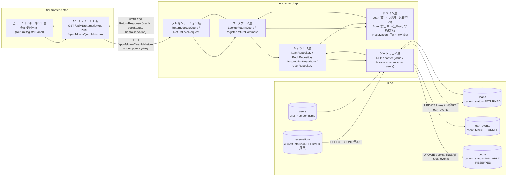
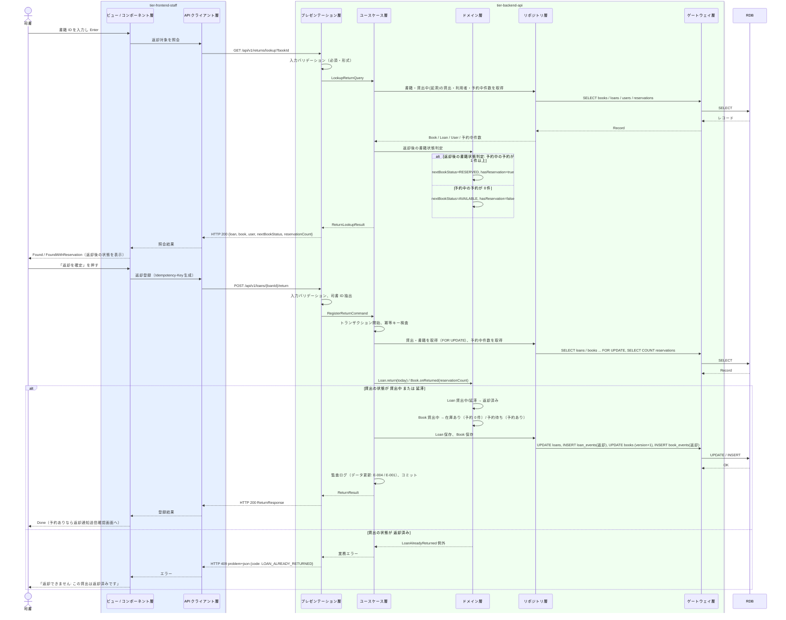

# 返却を登録する

## 概要

司書が窓口で書籍 ID から貸出中（または延滞）の貸出を特定し、返却を登録して貸出の状態を「返却済み」に遷移させる。書籍の状態は予約中の予約が無ければ「在庫あり」、有れば「予約待ち」に遷移させ、予約が有る場合は続けて返却通知送信確認画面（UC「返却通知を送信する」）へ誘導する。

## データフロー



| レイヤー | データモデル | 変換内容 |
|---------|------------|---------|
| FE View | ReturnRegisterPanel の入力（書籍 ID）、照会結果（貸出・利用者・返却後の書籍状態・予約者の有無）、登録結果 | 1 入力 → 照会 → 確定 → 完了表示。予約ありなら返却通知送信確認画面へ遷移 |
| FE API Client | `GET /api/v1/returns/lookup?bookId`、`POST /api/v1/loans/{loanId}/return`（Idempotency-Key 付与） | 照会・登録結果を View 用モデルに正規化、problem+json を司書向けメッセージに変換 |
| BE presentation | ReturnLookupQuery(bookId) / ReturnLoanRequest(loanId, Idempotency-Key) | 型・形式・必須の検証、トークンから司書の利用者番号を抽出し Command に付与 |
| BE usecase | LookupReturnQuery / RegisterReturnCommand | トランザクション境界、冪等キー検査、監査ログ（データ更新 E-004 / E-001） |
| BE domain | Loan / Book / Reservation | 返却後の書籍状態判定（予約中の件数で在庫あり / 予約待ち）、貸出の状態遷移（貸出中・延滞 → 返却済み） |
| BE repository / gateway | loans UPDATE、loan_events INSERT、books UPDATE（version 楽観ロック）、book_events INSERT、reservations / users SELECT | レコード更新・イベント記録 |
| Response | ReturnResponse(loanId, returnedOn, status, bookStatus, hasReservation, nextReservation) | 完了表示（Done）と返却通知送信確認画面への誘導 |

## 処理フロー



## バリエーション一覧

| バリエーション名 | 値 | 処理内容 | 適用 tier | 適用箇所 |
|----------------|---|---------|----------|---------|
| 利用者区分 | 司書 | 返却受付画面と `POST /api/v1/loans/{loanId}/return` を利用できる | tier-frontend-staff / tier-backend-api | 司書ポータル認可 / API 認可（司書区分必須） |

## 分岐条件一覧

| 条件名 | 判定ルール | 適用 tier | 適用箇所 | BDD Scenario |
|--------|----------|----------|---------|-------------|
| 返却後の書籍状態判定 | 返却された書籍に状態「予約中」の予約が 1 件以上 → 書籍を「予約待ち」。0 件 → 「在庫あり」。貸出の状態は「貸出中」「延滞」のいずれからも「返却済み」 | tier-backend-api | LookupReturnQuery / RegisterReturnCommand（domain: Book.onReturned, Loan.return） | 予約のない書籍を返却する / 予約のある書籍を返却する / 延滞中の書籍を返却する |

## 計算ルール一覧

| 計算名 | 入力情報 | 計算式/ロジック | 出力情報 | 適用 tier |
|--------|---------|---------------|---------|----------|
| 返却日の確定 | 返却登録の当日 | `returned_on = 当日`（loan_events の返却イベント occurred_at の日付） | 貸出.返却日 | tier-backend-api |
| 予約中件数 | 予約.書籍ID、予約.予約の状態 | `COUNT(reservations WHERE book_id = ? AND current_status = 'RESERVED')` | hasReservation / reservationCount | tier-backend-api |

## 状態遷移一覧

| 状態モデル | 遷移元 | 遷移先 | トリガー | 事前条件 | 事後処理 | 適用 tier |
|-----------|--------|--------|---------|---------|---------|----------|
| 貸出の状態 | 貸出中 | 返却済み | 返却を登録する | 貸出が存在し返却済みでない | loan_events に返却イベント記録 | tier-backend-api |
| 貸出の状態 | 延滞 | 返却済み | 返却を登録する | 同上 | 同上 | tier-backend-api |
| 書籍の状態 | 貸出中 | 在庫あり | 返却を登録する | 予約中の予約が 0 件 | book_events に返却イベント記録、参照キャッシュ無効化 | tier-backend-api |
| 書籍の状態 | 貸出中 | 予約待ち | 返却を登録する | 予約中の予約が 1 件以上 | book_events に返却イベント記録、返却通知送信確認画面へ誘導 | tier-backend-api / tier-frontend-staff |

## 関連 RDRA モデル

| モデル種別 | 要素名 | 関連 |
|-----------|--------|------|
| 業務 | 貸出業務 | このUCが属する業務 |
| BUC | 書籍を返却するフロー | このUCを含むBUC |
| アクター | 司書 | 操作するアクター |
| 情報 | 貸出 | 状態を更新する情報 |
| 情報 | 書籍 | 状態を更新する情報 |
| 情報 | 予約 | 予約中の有無を参照する情報 |
| 状態 | 貸出の状態 | 貸出中 → 返却済み、延滞 → 返却済み |
| 状態 | 書籍の状態 | 貸出中 → 在庫あり、貸出中 → 予約待ち |
| 条件 | 返却後の書籍状態判定 | 返却後の書籍の状態決定 |
| バリエーション | 利用者区分 | 司書のみ操作可能 |
| 画面 | 返却受付画面 | 司書が操作する画面 |

## E2E 完了条件（BDD）

### 正常系

```gherkin
Feature: 返却を登録する

  Scenario: 予約のない書籍を返却する
    Given 司書「佐藤花子」が司書ポータルにログイン済み
    And 書籍 ID「B-000456」の書籍「吾輩は猫である」の状態が「貸出中」
    And 利用者番号「U-000123」の貸出「L-0001」が状態「貸出中」、返却期限「2026-09-17」
    And 書籍「B-000456」に予約中の予約が無い
    And 本日が 2026-09-10
    When 司書が返却受付画面で書籍 ID「B-000456」を入力して「返却を確定」を押す
    Then 貸出「L-0001」の状態が「返却済み」、返却日「2026-09-10」になる
    And 書籍「B-000456」の状態が「在庫あり」になる
    And 画面に「返却を登録しました（在庫あり）」と表示される

  Scenario: 予約のある書籍を返却する
    Given 司書「佐藤花子」が司書ポータルにログイン済み
    And 書籍 ID「B-000789」の状態が「貸出中」で貸出「L-0002」が「貸出中」
    And 利用者番号「U-000200」の予約が予約順位 1、状態「予約中」
    When 司書が返却受付画面で書籍 ID「B-000789」を入力して「返却を確定」を押す
    Then 貸出「L-0002」の状態が「返却済み」になる
    And 書籍「B-000789」の状態が「予約待ち」になる
    And 画面に「予約者がいます。返却通知を送信してください」と返却通知送信確認画面へのボタンが表示される

  Scenario: 延滞中の書籍を返却する
    Given 司書「佐藤花子」が司書ポータルにログイン済み
    And 書籍 ID「B-000456」の貸出「L-0003」が状態「延滞」、返却期限「2026-08-31」
    And 本日が 2026-09-10
    When 司書が書籍 ID「B-000456」で返却を確定する
    Then 貸出「L-0003」の状態が「返却済み」になる
    And 書籍「B-000456」の状態が「在庫あり」になる
```

### 異常系

```gherkin
  Scenario: 貸出中でない書籍は返却できない
    Given 司書「佐藤花子」が司書ポータルにログイン済み
    And 書籍 ID「B-000456」の状態が「在庫あり」
    When 司書が返却受付画面で書籍 ID「B-000456」を入力して照会する
    Then 画面に「返却できません: この書籍は貸出中ではありません」と表示される
    And 「返却を確定」ボタンは表示されない

  Scenario: 存在しない書籍 ID は照会できない
    Given 司書「佐藤花子」が司書ポータルにログイン済み
    And 書籍 ID「B-999999」は登録されていない
    When 司書が書籍 ID「B-999999」を入力して照会する
    Then 画面に「返却できません: 書籍 ID B-999999 は登録されていません」と表示される

  Scenario: 同じ確定操作を二重送信しても返却は 1 回だけ登録される
    Given 司書が貸出「L-0001」の返却を確定し HTTP 200 を受信済み
    When 同じ Idempotency-Key で POST /api/v1/loans/L-0001/return を再送する
    Then HTTP 200 と同一の返却結果が返る
    And loan_events の返却イベントは 1 件のみ存在する
```

## ティア別仕様

- [司書向けフロントエンド](tier-frontend-staff.md)
- [Backend API](tier-backend-api.md)

### 統合 API Spec

- [OpenAPI Spec](../../../_cross-cutting/api/openapi.yaml)（全 UC 統合、Contract First 開発用）
