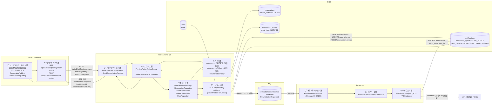
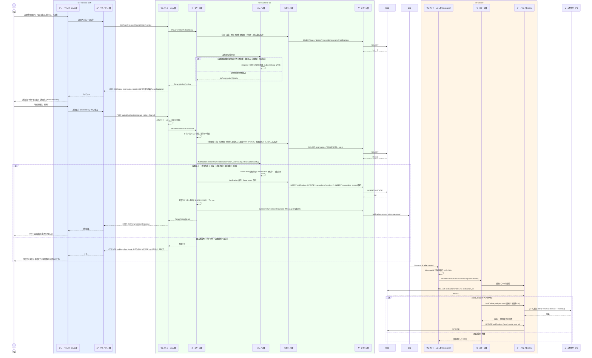

# 返却通知を送信する

## 概要

返却登録に伴い書籍が「予約待ち」になったとき、司書が返却通知送信確認画面で送信先（予約順位 1 位の利用者）を確認して送信を確定する。Backend API は通知レコード（返却通知・送信待ち）を作成し予約の状態を「予約中」から「通知済み」に遷移させた上で MQ に `ReturnNoticeRequested` を発行し、ワーカーがメール配信サービス経由でメールを送信して送信結果を通知レコードに反映する。

## データフロー



| レイヤー | データモデル | 変換内容 |
|---------|------------|---------|
| FE View | 送信先（予約順位 1 位の利用者、連絡先は PiiMaskedText）、書籍要約、予約一覧、通知記録、送信確定ボタン | 確認 → 確定 → 送信受付表示（Sent）。過去の送信記録を NotificationLogTable に表示 |
| FE API Client | `GET /api/v1/loans/{loanId}/return-notice`、`POST /api/v1/notifications/return-notices`（Idempotency-Key 付与） | プレビュー・送信結果を View 用モデルに正規化、problem+json を司書向けメッセージに変換 |
| BE presentation | ReturnNoticePreviewQuery(loanId) / SendReturnNoticeRequest(loanId) | 型・形式・必須の検証、司書の利用者番号を抽出 |
| BE usecase | PreviewReturnNoticeQuery / SendReturnNoticeCommand | トランザクション境界（通知レコード作成 + 予約状態遷移）、コミット後に MQ 発行（LP-008）、監査ログ |
| BE domain | Notification / Reservation / ReturnNoticePolicy | 返却通知対象判定（有効予約 RESERVED / NOTIFIED の順位 1 位）、件名・本文の生成、予約の状態遷移 |
| BE repository / gateway | notifications INSERT、reservations UPDATE、reservation_events INSERT、users / loans / books SELECT、MQ publish | レコード作成・更新、メッセージ発行（MessageId = 通知 ID） |
| Worker | ReturnNoticeRequested → SendReturnNoticeMailCommand → MailDeliveryAdapter | メール送信（通知 ID を冪等キー）、送信結果（成功 / 失敗）と送信日時を notifications に反映 |
| Response | ReturnNoticeResponse(notificationId, reservationId, sendResult=PENDING, reservationStatus=NOTIFIED) | 「返却通知を受け付けました」表示。送信結果は NotificationLogTable の再取得で確認 |

## 処理フロー



## バリエーション一覧

| バリエーション名 | 値 | 処理内容 | 適用 tier | 適用箇所 |
|----------------|---|---------|----------|---------|
| 通知種別 | 返却通知 | 件名 / 本文テンプレートを返却通知用に切り替え、`notification_type = RETURN_NOTICE`、`target_reservation_id` を設定する | tier-backend-api / tier-worker | SendReturnNoticeCommand（domain: NotificationTemplate）/ MailDeliveryAdapter |
| 利用者区分 | 司書 | 返却通知送信確認画面と `POST /api/v1/notifications/return-notices` を利用できる | tier-frontend-staff / tier-backend-api | 司書ポータル認可 / API 認可 |

## 分岐条件一覧

| 条件名 | 判定ルール | 適用 tier | 適用箇所 | BDD Scenario |
|--------|----------|----------|---------|-------------|
| 返却通知対象判定 | 返却された書籍に有効予約（状態「予約中」/「通知済み」）がある場合、予約順位 1 位の予約の利用者を通知種別「返却通知」の送信先とし、その予約が「予約中」なら「通知済み」に遷移させる。有効予約が無い場合は送信しない（409） | tier-backend-api | PreviewReturnNoticeQuery / SendReturnNoticeCommand（domain: ReturnNoticePolicy） | 予約順位 1 位の利用者に返却通知を送信する / 予約のない書籍には送信できない |
| 送信先ガード（2 位以降を送信先にしない） | 順位 1 位の予約が「通知済み」のまま来館していなくても、2 位以降の予約を送信先にしない。順位 1 位が取消・終了して繰り上がった場合のみ新しい 1 位が対象になる | tier-backend-api | PreviewReturnNoticeQuery / SendReturnNoticeCommand（domain: ReturnNoticePolicy） | 予約順位 1 位の利用者に返却通知を送信する |
| 通知の重複送信防止 | 対象予約 ID × 通知種別「返却通知」× 送信日（requested_on）の通知レコードが既に存在すれば送信しない（409） | tier-backend-api / tier-worker | SendReturnNoticeCommand（notifications 一意制約）/ Consumer の既処理照合 | 同日の二重送信を防ぐ |

## 計算ルール一覧

| 計算名 | 入力情報 | 計算式/ロジック | 出力情報 | 適用 tier |
|--------|---------|---------------|---------|----------|
| 件名・本文の生成 | 書籍.タイトル、利用者.氏名、予約.予約順位、送信日 | 返却通知テンプレート: 件名「【Libro】ご予約の書籍が返却されました」、本文に書籍名・来館案内・受付日 | 通知.件名、通知.本文 | tier-backend-api |
| 送信日 | 送信確定の当日 | `requested_on = 当日`、`sent_at` はワーカーが送信完了時刻を設定 | 通知.送信日時 | tier-backend-api / tier-worker |

## 状態遷移一覧

| 状態モデル | 遷移元 | 遷移先 | トリガー | 事前条件 | 事後処理 | 適用 tier |
|-----------|--------|--------|---------|---------|---------|----------|
| 予約の状態 | 予約中 | 通知済み | 返却通知を送信する | 書籍が予約待ち、有効予約の順位 1 位 | reservation_events に通知イベント記録、通知レコード作成、MQ 発行 | tier-backend-api |
| 通知の送信結果 | 送信待ち | 成功 | ワーカーのメール送信成功 | 通知レコードが送信待ち | sent_at を設定 | tier-worker |
| 通知の送信結果 | 送信待ち | 失敗 | 恒久失敗 / 再試行上限超過 | 同上 | sent_at を設定、DLQ 退避、司書が NotificationLogTable で確認 | tier-worker |

## 関連 RDRA モデル

| モデル種別 | 要素名 | 関連 |
|-----------|--------|------|
| 業務 | 貸出業務 | このUCが属する業務 |
| BUC | 書籍を返却するフロー | このUCを含むBUC |
| アクター | 司書 | 送信を確定するアクター |
| アクター | 利用者 | 返却通知を受け取るアクター |
| 情報 | 予約 | 状態を更新する情報（予約中 → 通知済み） |
| 情報 | 利用者 | 送信先メールアドレスを参照する情報 |
| 情報 | 通知 | 作成・更新する情報 |
| 情報 | 書籍 | 通知本文に含める情報 |
| 状態 | 予約の状態 | 予約中 → 通知済み |
| 条件 | 返却通知対象判定 | 送信先の特定と予約の状態遷移 |
| バリエーション | 通知種別 | 返却通知 |
| 外部システム | メール配信サービス | 返却通知メールの配信 |
| 画面 | 返却通知送信確認画面 | 司書が操作する画面 |
| イベント | 返却通知メール配信 | ワーカーから外部システムへの送信 |

## E2E 完了条件（BDD）

### 正常系

```gherkin
Feature: 返却通知を送信する

  Scenario: 予約順位 1 位の利用者に返却通知を送信する
    Given 司書「佐藤花子」が司書ポータルにログイン済み
    And 貸出「L-0002」（書籍 ID「B-000789」「こころ」）が「返却済み」で書籍の状態が「予約待ち」
    And 利用者番号「U-000200」（メールアドレス「u200@example.com」）の予約「R-0001」が予約順位 1、状態「予約中」
    And 本日が 2026-09-10
    When 司書が返却通知送信確認画面で送信先を確認して「送信を確定」を押す
    Then 通知が通知種別「返却通知」、対象予約「R-0001」、送信先「u200@example.com」、送信結果「送信待ち」で作成される
    And 予約「R-0001」の状態が「通知済み」になる
    And 画面に「返却通知を受け付けました」と表示される
    And ワーカーがメール配信サービスにメールを送信し、通知の送信結果が「成功」、送信日時が設定される

  Scenario: 送信結果を通知記録で確認する
    Given 予約「R-0001」への返却通知が送信結果「成功」で記録済み
    When 司書が返却通知送信確認画面を再表示する
    Then NotificationLogTable に通知種別「返却通知」、送信結果「成功」の行が表示される
```

### 異常系

```gherkin
  Scenario: 予約のない書籍には送信できない
    Given 司書「佐藤花子」が司書ポータルにログイン済み
    And 貸出「L-0001」（書籍 ID「B-000456」）が「返却済み」で書籍に予約中の予約が無い
    When 司書が返却通知送信確認画面（/staff/returns/L-0001/notify）を開く
    Then 画面に「送信できません: この書籍に予約者はいません」と表示され「送信を確定」は無効である

  Scenario: 同日の二重送信を防ぐ
    Given 予約「R-0001」への返却通知が本日 2026-09-10 に作成済み
    When 司書が同じ貸出「L-0002」で「送信を確定」を押す
    Then 画面に「送信できません: 本日すでに返却通知を送信済みです」と表示される
    And 通知は追加されない

  Scenario: メール配信サービスの恒久失敗を記録する
    Given 予約「R-0001」への返却通知が送信結果「送信待ち」で作成され MQ に発行済み
    And メール配信サービスが宛先不正（4xx）を返す
    When ワーカーがメッセージを処理する
    Then 通知の送信結果が「失敗」になり再試行しない
    And 返却通知送信確認画面の NotificationLogTable に送信結果「失敗」が表示される
```

## ティア別仕様

- [司書向けフロントエンド](tier-frontend-staff.md)
- [Backend API](tier-backend-api.md)
- [ワーカー](tier-worker.md)

### 統合 API Spec

- [OpenAPI Spec](../../../_cross-cutting/api/openapi.yaml)（全 UC 統合、Contract First 開発用）
- [AsyncAPI Spec](../../../_cross-cutting/api/asyncapi.yaml)（全 UC 統合、`notifications.return-notice-requested`）
