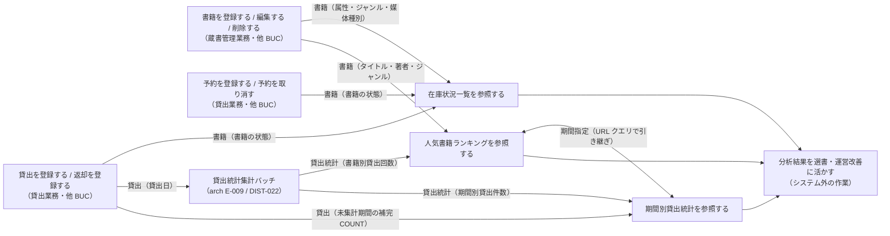
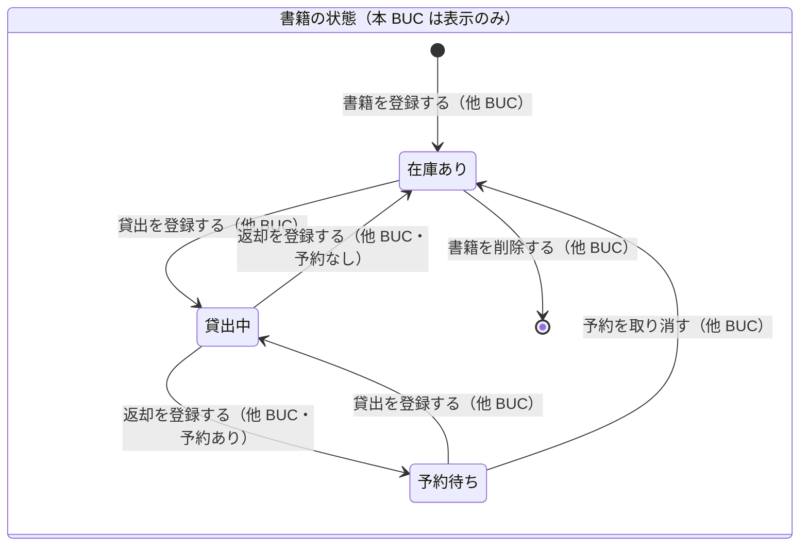

# 蔵書の利用状況を分析するフロー

## 概要

司書が在庫状況一覧・人気書籍ランキング・期間別貸出統計の 3 画面で蔵書の利用状況を把握し、選書や運営改善の判断材料とする。書籍の状態は現在値を参照し、ランキングと期間別統計は貸出記録を集計した貸出統計（集計テーブル）を期間指定で読み出す。

## 所属 UC 一覧

| UC名 | アクター | 主な操作 | 関連情報 |
|------|---------|---------|---------|
| [在庫状況一覧を参照する](在庫状況一覧を参照する/spec.md) | 司書 | 書籍の状態別件数（在庫あり・貸出中・予約待ち）を俯瞰し、状態・ジャンルで絞り込んだ書籍一覧をページ送りで確認する | 書籍、ジャンル |
| [人気書籍ランキングを参照する](人気書籍ランキングを参照する/spec.md) | 司書 | 期間を指定し、貸出回数の多い順の書籍ランキング（上位 N 件、同数は同順位）を確認する | 貸出統計、貸出、書籍 |
| [期間別貸出統計を参照する](期間別貸出統計を参照する/spec.md) | 司書 | 集計期間種別（日・月・年）と期間を指定し、期間内の貸出件数の推移と前期比を確認する | 貸出統計、貸出、書籍 |

## UC 横断データフロー

BUC 内の UC 間で情報がどう流れるかを示す。本 BUC の 3 UC はすべて参照系で、情報の作成・更新は行わない。情報の作成元（他 BUC・集計バッチ）と、分析 3 画面間で引き継ぐ期間指定を示す。

### データフロー図

### 情報 CRUD マトリクス

| 情報名 | 在庫状況一覧を参照する | 人気書籍ランキングを参照する | 期間別貸出統計を参照する |
|--------|:--------------------:|:--------------------------:|:----------------------:|
| 書籍 | R（書籍の状態・属性） | R（タイトル・著者・ジャンル） | R（集計単位。書籍別内訳は表示しない） |
| ジャンル | R（絞り込み・表示） | R（表示） | - |
| 貸出統計 | - | R（書籍別貸出回数） | R（期間別貸出件数） |
| 貸出 | - | R（集計元） | R（未集計期間の補完） |

## 状態遷移全体図

BUC 内で関連する状態モデルの全遷移パスと、各遷移を担当する UC を示す。本 BUC の UC は状態を遷移させず、在庫状況一覧が書籍の状態を表示するのみ。遷移はすべて他 BUC の UC が担当する。

### 状態遷移 UC マッピング

| 状態モデル | 遷移元 | 遷移先 | 担当 UC |
|-----------|--------|--------|--------|
| 書籍の状態 | 在庫あり / 貸出中 / 予約待ち | （遷移なし・状態別件数と一覧を表示） | [在庫状況一覧を参照する](在庫状況一覧を参照する/spec.md) |
| （なし） | — | （参照のみ。状態遷移を伴わない） | [人気書籍ランキングを参照する](人気書籍ランキングを参照する/spec.md) |
| （なし） | — | （参照のみ。状態遷移を伴わない） | [期間別貸出統計を参照する](期間別貸出統計を参照する/spec.md) |
| 書籍の状態 | （なし） | 在庫あり | 書籍を登録する（他 BUC: 蔵書管理業務） |
| 書籍の状態 | 在庫あり / 予約待ち | 貸出中 | 貸出を登録する（他 BUC: 貸出業務） |
| 書籍の状態 | 貸出中 | 在庫あり / 予約待ち | 返却を登録する（他 BUC: 貸出業務） |
| 書籍の状態 | 予約待ち | 在庫あり | 予約を取り消す（他 BUC: 貸出業務） |
| 書籍の状態 | 在庫あり | （終了） | 書籍を削除する（他 BUC: 蔵書管理業務） |

## BUC 内共有条件一覧

BUC 内の複数 UC で共有される条件の一覧。各条件がどの UC で適用されるかを明記する。

| 条件名 | 条件の説明 | 適用 UC |
|--------|----------|--------|
| 集計期間判定 | 集計期間種別（日・月・年）と指定期間から期間区切りを生成し、貸出日が期間内に含まれる貸出記録（集計テーブルの該当区切り）を集計対象とする | 人気書籍ランキングを参照する, 期間別貸出統計を参照する |
| 期間バリデーション | from <= to、かつ集計期間種別ごとの上限（日 366 日 / 月 36 か月 / 年 10 年）以内。違反は 400 `INVALID_PERIOD_RANGE`（ランキングは limit 1〜100 も検証） | 人気書籍ランキングを参照する, 期間別貸出統計を参照する |
| 認可（司書のみ） | 利用者区分 = 司書 のみ画面と API を利用できる。利用者は 403 | 在庫状況一覧を参照する, 人気書籍ランキングを参照する, 期間別貸出統計を参照する |

UC 固有の条件（参考）: 在庫状況判定・状態絞り込み・ページネーション（在庫状況一覧を参照する）、人気書籍ランキング判定（人気書籍ランキングを参照する）、未集計期間の補完（期間別貸出統計を参照する）。

## BUC 内共有バリエーション一覧

BUC 内の複数 UC で共有されるバリエーションの一覧。

| バリエーション名 | 値 | 適用 UC |
|----------------|---|--------|
| 集計期間種別 | 日、月、年（既定は月。集計テーブルの period_type と PeriodSelector の粒度を切替） | 人気書籍ランキングを参照する, 期間別貸出統計を参照する |
| ジャンル | 文学、社会科学、自然科学、技術、芸術、歴史、児童書、その他（在庫状況一覧は絞り込み、ランキングは表示のみ） | 在庫状況一覧を参照する, 人気書籍ランキングを参照する |

UC 固有のバリエーション（参考）: 媒体種別（紙・電子。表示列のみ。在庫状況一覧を参照する）。
