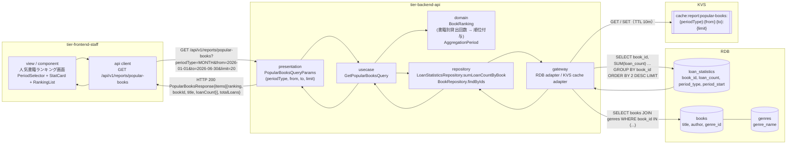
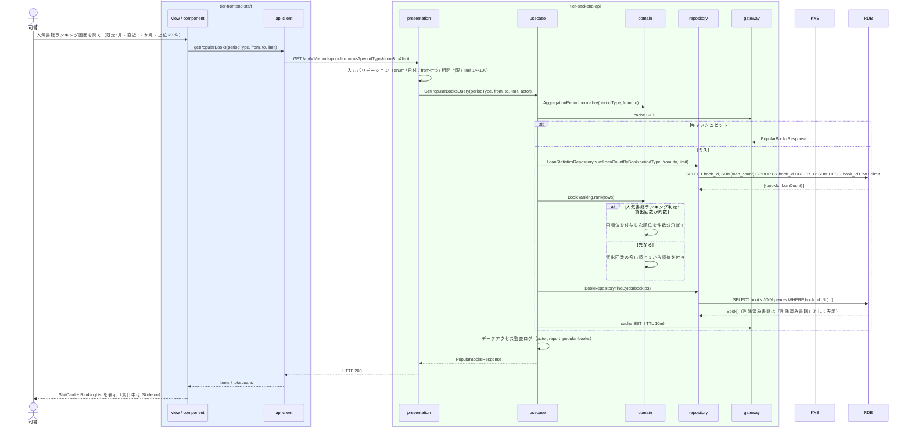

# 人気書籍ランキングを参照する

## 概要

司書が期間を指定し、貸出記録に基づく貸出回数の多い順の書籍ランキングを人気書籍ランキング画面で確認する。貸出統計（集計テーブル。arch E-009）の書籍別貸出回数を期間で合算し、順位を付与して上位 N 件を返す。選書・運営改善の判断材料として用いる。

## データフロー



| レイヤー | データモデル | 変換内容 |
|---------|------------|---------|
| FE view / component | PeriodSelector（granularity / from / to）、StatCard（期間内貸出件数・1 位の貸出回数）、RankingList（items / limit） | 期間指定 → クエリパラメータ変換。期間は URL クエリで分析 3 画面と共有 |
| BE presentation | PopularBooksQueryParams(periodType, from, to, limit) | 型・形式・上限のバリデーション（LP-001）→ Query 変換 |
| BE usecase | GetPopularBooksQuery | 集計期間判定 → 書籍別貸出回数の合算 → 順位付与（人気書籍ランキング判定）→ 書籍属性の付与 |
| BE domain | BookRanking（bookId, loanCount, ranking） | 貸出回数の多い順に並べ、同数は同順位 |
| BE repository / gateway | loan_statistics SUM GROUP BY book_id、books / genres SELECT、KVS Cache-Aside | ランキング行の生成 |
| Response | PopularBooksResponse{periodType, from, to, totalLoans, items[{ranking, bookId, title, author, genreName, loanCount}], aggregatedAt} | RankingList の表示用 |

## 処理フロー



## バリエーション一覧

| バリエーション名 | 値 | 処理内容 | 適用 tier | 適用箇所 |
|----------------|---|---------|----------|---------|
| 集計期間種別 | 日 / 月 / 年 | 集計テーブルの period_type を切り替えて期間内の貸出回数を合算する。期間上限は日 366 日 / 月 36 か月 / 年 10 年 | tier-backend-api / tier-frontend-staff | LoanStatisticsRepository.sumLoanCountByBook / PeriodSelector |
| ジャンル | 文学 / 社会科学 / … / その他 | ランキング行にジャンル名を表示する（絞り込みは行わない） | tier-frontend-staff | RankingList |

## 分岐条件一覧

| 条件名 | 判定ルール | 適用 tier | 適用箇所 | BDD Scenario |
|--------|----------|----------|---------|-------------|
| 人気書籍ランキング判定 | 期間内の貸出回数を書籍ごとに合算し、多い順に並べて 1 から順位を付与する。同数は同順位、次の順位は同数の件数分飛ばす（1, 1, 3） | tier-backend-api | domain BookRanking.rank | 直近 12 か月の上位 20 件を貸出回数順に表示する / 貸出回数が同数の書籍は同順位になる |
| 集計期間判定 | 集計期間種別と指定期間に基づき、貸出日が期間内の貸出記録（集計テーブルの該当区切り）を対象とする | tier-backend-api | AggregationPeriod / LoanStatisticsRepository | 直近 12 か月の上位 20 件を貸出回数順に表示する |
| 期間バリデーション | from <= to、periodType ごとの上限、limit 1〜100（既定 20） | tier-backend-api / tier-frontend-staff | presentation / PeriodSelector | limit の上限を超えると 400 になる |
| 認可 | 利用者区分 = 司書 のみ | tier-backend-api | presentation LP-003 / usecase | 利用者区分「利用者」は参照できない |

## 計算ルール一覧

| 計算名 | 入力情報 | 計算式/ロジック | 出力情報 | 適用 tier |
|--------|---------|---------------|---------|----------|
| 書籍別貸出回数 | 貸出統計.貸出回数（loan_count）、集計対象期間 | loanCount(book) = Σ loan_count（period_type = 指定種別 かつ period_start が期間内） | items[].loanCount | tier-backend-api |
| 順位 | items[].loanCount | 降順に並べ、同数は同順位（競技順位方式） | items[].ranking | tier-backend-api |
| 期間内貸出件数 | items[].loanCount（全書籍） | totalLoans = Σ loanCount（LIMIT 前の全書籍） | totalLoans | tier-backend-api |
| 貸出回数バーの長さ | items[].loanCount、1 位の loanCount | 幅% = loanCount / items[0].loanCount × 100 | RankingList のバー | tier-frontend-staff |

## 状態遷移一覧

| 状態モデル | 遷移元 | 遷移先 | トリガー | 事前条件 | 事後処理 | 適用 tier |
|-----------|--------|--------|---------|---------|---------|----------|
| （なし） | — | — | 参照のみ。状態遷移を伴わない | — | — | — |

## 関連 RDRA モデル

| モデル種別 | 要素名 | 関連 |
|-----------|--------|------|
| 業務 | 運営分析業務 | このUCが属する業務 |
| BUC | 蔵書の利用状況を分析するフロー | このUCを含むBUC |
| アクター | 司書 | ランキングを参照する |
| 情報 | 貸出統計 | 書籍ごとの貸出回数・ランキング順位（集計テーブル） |
| 情報 | 貸出 | 集計元の貸出記録 |
| 情報 | 書籍 | ランキング行のタイトル・著者・ジャンル |
| 条件 | 人気書籍ランキング判定 | 順位付与ルール |
| 条件 | 集計期間判定 | 期間の対象判定 |
| バリエーション | 集計期間種別 | 日・月・年 |
| 画面 | 人気書籍ランキング画面 | 表示画面 |

## E2E 完了条件（BDD）

### 正常系

```gherkin
Feature: 人気書籍ランキングを参照する

  Scenario: 直近 12 か月の上位 20 件を貸出回数順に表示する
    Given 司書「S-0001」が司書ポータルにログイン済みで、今日が 2026-09-03 である
    And 貸出統計に集計期間種別「月」で 2025-10 から 2026-09 の書籍別貸出回数があり、合算すると書籍「吾輩は猫である」が 42 回で最多、「こころ」が 35 回で 2 番目である
    When 人気書籍ランキング画面を開く
    Then RankingList の 1 位に「吾輩は猫である」（42 回）、2 位に「こころ」（35 回）が表示される
    And 表示件数は最大 20 件である

  Scenario: 貸出回数が同数の書籍は同順位になる
    Given 司書「S-0001」がログイン済みである
    And 期間 2026-01-01〜2026-06-30 の書籍別貸出回数が「吾輩は猫である」30 回、「こころ」30 回、「坊っちゃん」28 回である
    When 人気書籍ランキング画面で集計期間種別「月」・期間 2026-01-01〜2026-06-30 を指定する
    Then 「吾輩は猫である」と「こころ」が 1 位、「坊っちゃん」が 3 位で表示される

  Scenario: 期間別貸出統計画面から期間を引き継ぐ
    Given 司書「S-0001」が期間別貸出統計画面で集計期間種別「年」・期間 2024-01-01〜2026-12-31 を表示している
    When サイドバーから人気書籍ランキング画面へ遷移する
    Then URL クエリ periodType=YEAR&from=2024-01-01&to=2026-12-31 でランキングが表示される
```

### 異常系

```gherkin
  Scenario: 期間内に貸出がない場合は空状態を表示する
    Given 司書「S-0001」がログイン済みである
    And 期間 2020-01-01〜2020-12-31 の貸出統計が存在しない
    When 人気書籍ランキング画面で集計期間種別「年」・期間 2020-01-01〜2020-12-31 を指定する
    Then EmptyState「この期間の貸出はありません」が表示され順位は表示されない

  Scenario: 利用者区分「利用者」は参照できない
    Given 利用者「U-0001」（利用者区分: 利用者）のアクセストークンを持つ
    When GET /api/v1/reports/popular-books?periodType=MONTH&from=2026-01-01&to=2026-06-30 を呼ぶ
    Then HTTP 403 と problem+json {code: "FORBIDDEN"} が返る
```

## ティア別仕様

- [司書向けフロントエンド](tier-frontend-staff.md)
- [Backend API](tier-backend-api.md)

### 統合 API Spec

- [OpenAPI Spec](../../../_cross-cutting/api/openapi.yaml)（全 UC 統合、Contract First 開発用）
- [AsyncAPI Spec](../../../_cross-cutting/api/asyncapi.yaml)（全 UC 統合、非同期イベントがある場合のみ）
