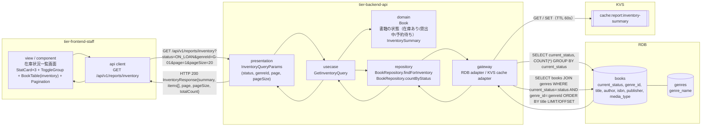
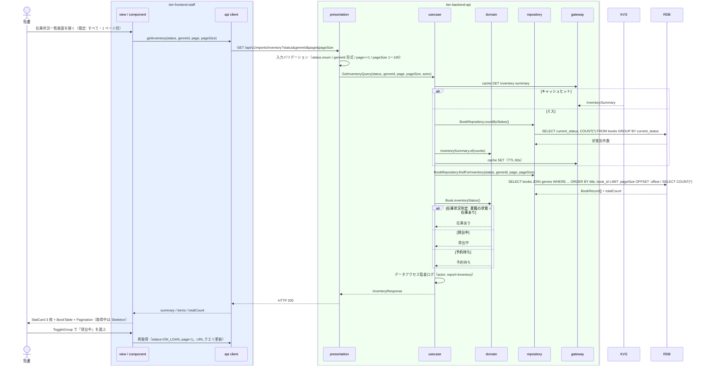

# 在庫状況一覧を参照する

## 概要

司書が書籍ごとの状態（在庫あり・貸出中・予約待ち）を在庫状況一覧画面で確認する。書籍の状態別件数を StatCard で俯瞰し、状態・ジャンルで絞り込んだ書籍一覧をページネーション付きで表示する。条件「在庫状況判定」（書籍の状態をもとに在庫状況を表示）を適用する。

## データフロー



| レイヤー | データモデル | 変換内容 |
|---------|------------|---------|
| FE view / component | ToggleGroup（すべて / 在庫あり / 貸出中 / 予約待ち）、Select（ジャンル）、BookTable（inventory）、Pagination | 絞り込み操作 → クエリパラメータ変換。条件とページ番号を URL クエリに保持 |
| BE presentation | InventoryQueryParams(status?, genreId?, page=1, pageSize=20) | 型・enum・範囲のバリデーション（LP-001）→ Query 変換 |
| BE usecase | GetInventoryQuery | 状態別件数の取得（Cache-Aside）+ 絞り込み一覧のページ取得 |
| BE domain | Book（書籍 ID、タイトル、著者、ISBN、出版社、ジャンル、媒体種別、書籍の状態）/ InventorySummary（状態別件数） | 在庫状況判定（書籍の状態をそのまま在庫状況として表示） |
| BE repository / gateway | books COUNT GROUP BY current_status、books JOIN genres SELECT（LIMIT/OFFSET） | ページ単位の書籍一覧 |
| Response | InventoryResponse{summary{available, onLoan, reserved, total}, items[{bookId, title, author, isbn, publisher, genreName, mediaType, status}], page, pageSize, totalCount} | StatCard・BookTable の表示用 |

## 処理フロー



## バリエーション一覧

| バリエーション名 | 値 | 処理内容 | 適用 tier | 適用箇所 |
|----------------|---|---------|----------|---------|
| ジャンル | 文学 / 社会科学 / 自然科学 / 技術 / 芸術 / 歴史 / 児童書 / その他 | genreId で書籍一覧を絞り込む（Select）。件数サマリはジャンルに依らず全体 | tier-frontend-staff / tier-backend-api | Select（ジャンル）/ BookRepository.findForInventory |
| 媒体種別 | 紙 / 電子 | BookTable の媒体列に表示する。初期リリースは紙のみ運用のため絞り込みは設けない | tier-frontend-staff | BookTable（inventory） |

## 分岐条件一覧

| 条件名 | 判定ルール | 適用 tier | 適用箇所 | BDD Scenario |
|--------|----------|----------|---------|-------------|
| 在庫状況判定 | 書籍の状態（在庫あり・貸出中・予約待ち）をそのまま在庫状況として表示する。状態別件数は current_status の GROUP BY | tier-backend-api / tier-frontend-staff | domain Book.inventoryStatus / BookStatusBadge | 状態別件数と書籍一覧を表示する |
| 状態絞り込み | status 指定時は current_status = status の書籍のみ。未指定はすべて | tier-backend-api | BookRepository.findForInventory | 貸出中の書籍だけに絞り込む |
| ページネーション | page（>=1）・pageSize（1〜100、既定 20）で LIMIT/OFFSET。totalCount を返す | tier-backend-api / tier-frontend-staff | presentation / Pagination | 2 ページ目を表示する |
| 認可 | 利用者区分 = 司書 のみ | tier-backend-api | presentation LP-003 / usecase | 利用者区分「利用者」は参照できない |

## 計算ルール一覧

| 計算名 | 入力情報 | 計算式/ロジック | 出力情報 | 適用 tier |
|--------|---------|---------------|---------|----------|
| 状態別件数 | 書籍.書籍の状態 | available = COUNT(current_status = 'AVAILABLE')、onLoan = COUNT(current_status = 'ON_LOAN')、reserved = COUNT(current_status = 'RESERVED')、total = 合計 | summary | tier-backend-api |
| 貸出率（表示用） | summary | (onLoan + reserved) / total × 100（小数 1 桁。total = 0 なら「—」） | StatCard の補足 | tier-frontend-staff |
| ページ数 | totalCount、pageSize | ceil(totalCount / pageSize) | Pagination | tier-frontend-staff |

## 状態遷移一覧

| 状態モデル | 遷移元 | 遷移先 | トリガー | 事前条件 | 事後処理 | 適用 tier |
|-----------|--------|--------|---------|---------|---------|----------|
| 書籍の状態 | 在庫あり / 貸出中 / 予約待ち | （遷移なし） | 在庫状況一覧を参照する | 参照のみ | なし | tier-backend-api |

## 関連 RDRA モデル

| モデル種別 | 要素名 | 関連 |
|-----------|--------|------|
| 業務 | 運営分析業務 | このUCが属する業務 |
| BUC | 蔵書の利用状況を分析するフロー | このUCを含むBUC |
| アクター | 司書 | 在庫状況を参照する |
| 情報 | 書籍 | 書籍の状態・属性を参照 |
| 情報 | ジャンル | 絞り込みと表示 |
| 状態 | 書籍の状態 | 在庫あり・貸出中・予約待ちの表示 |
| 条件 | 在庫状況判定 | 適用される条件 |
| バリエーション | ジャンル | 絞り込み |
| バリエーション | 媒体種別 | 表示列 |
| 画面 | 在庫状況一覧画面 | 表示画面 |

## E2E 完了条件（BDD）

### 正常系

```gherkin
Feature: 在庫状況一覧を参照する

  Scenario: 状態別件数と書籍一覧を表示する
    Given 司書「S-0001」が司書ポータルにログイン済みである
    And 書籍が在庫あり 120 冊、貸出中 45 冊、予約待ち 8 冊登録されている
    When 在庫状況一覧画面を開く
    Then StatCard に「在庫あり 120」「貸出中 45」「予約待ち 8」が表示される
    And BookTable にタイトル順で 20 冊が表示され、各行に BookStatusBadge が表示される
    And Pagination に全 9 ページ（173 冊）が表示される

  Scenario: 貸出中の書籍だけに絞り込む
    Given 司書「S-0001」が在庫状況一覧画面を表示している
    When ToggleGroup で「貸出中」を選ぶ
    Then BookTable の全行の BookStatusBadge が「貸出中」になる
    And URL クエリが status=ON_LOAN&page=1 に更新される

  Scenario: 2 ページ目を表示する
    Given 司書「S-0001」が在庫状況一覧画面で status=ON_LOAN（45 冊）を表示している
    When Pagination で 2 ページ目を選ぶ
    Then BookTable に 21〜40 冊目が表示され URL クエリが page=2 になる

  Scenario: 予約待ちの書籍から書籍別予約状況画面へ遷移する
    Given 司書「S-0001」が在庫状況一覧画面で status=RESERVED を表示している
    When 書籍「吾輩は猫である」（B-001）の行を選ぶ
    Then 書籍別予約状況画面（/staff/books/B-001/reservations）へ遷移する
```

### 異常系

```gherkin
  Scenario: 絞り込み結果が 0 件なら空状態を表示する
    Given 司書「S-0001」が在庫状況一覧画面を表示している
    And ジャンル「芸術」の予約待ち書籍が存在しない
    When ToggleGroup で「予約待ち」、ジャンルで「芸術」を選ぶ
    Then EmptyState「条件に一致する書籍はありません」が表示される

  Scenario: 利用者区分「利用者」は参照できない
    Given 利用者「U-0001」（利用者区分: 利用者）のアクセストークンを持つ
    When GET /api/v1/reports/inventory を呼ぶ
    Then HTTP 403 と problem+json {code: "FORBIDDEN"} が返る
```

## ティア別仕様

- [司書向けフロントエンド](tier-frontend-staff.md)
- [Backend API](tier-backend-api.md)

### 統合 API Spec

- [OpenAPI Spec](../../../_cross-cutting/api/openapi.yaml)（全 UC 統合、Contract First 開発用）
- [AsyncAPI Spec](../../../_cross-cutting/api/asyncapi.yaml)（全 UC 統合、非同期イベントがある場合のみ）
