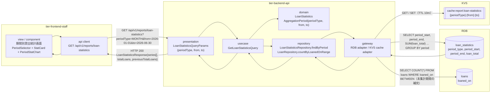
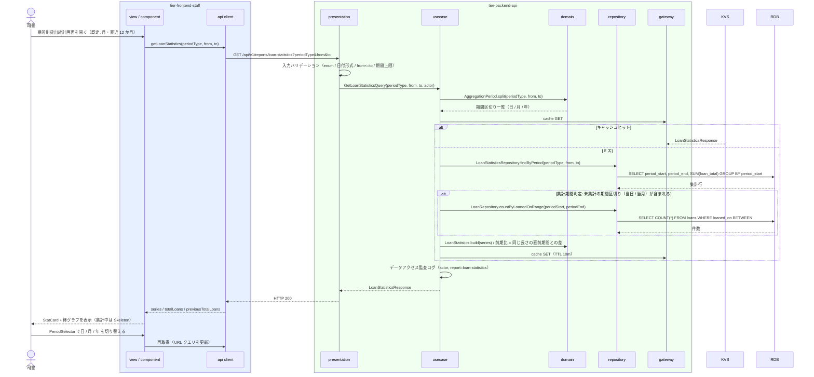

# 期間別貸出統計を参照する

## 概要

司書が集計期間種別（日・月・年）と期間を指定し、期間内の貸出件数の推移を期間別貸出統計画面で確認する。貸出日が期間内に含まれる貸出記録を集計期間種別ごとに集計した貸出統計（集計テーブル。arch E-009 / DIST-022）を読み出し、NFR B.2.1.3（集計 10 秒以内）を満たす。

## データフロー



| レイヤー | データモデル | 変換内容 |
|---------|------------|---------|
| FE view / component | PeriodSelector（granularity / from / to）、StatCard（期間内貸出件数・前期比）、PeriodStatChart（series） | 期間指定 → クエリパラメータ変換。URL クエリに期間を保持し分析 3 画面で引き継ぐ |
| BE presentation | LoanStatisticsQueryParams(periodType, from, to) | 型・形式・範囲上限のバリデーション（LP-001）→ Query 変換 |
| BE usecase | GetLoanStatisticsQuery | 集計期間判定（条件）→ 集計テーブル参照 → 未集計期間の補完 → 前期比算出 |
| BE repository / gateway | loan_statistics SELECT（期間集約。集計ID は period_type × period_start × book_id の複合キーで実現し、サロゲート列は持たない）、loans COUNT（補完）、KVS Cache-Aside | 期間単位の貸出件数系列を生成 |
| Response | LoanStatisticsResponse{periodType, from, to, totalLoans, previousTotalLoans, series[{periodStart, periodEnd, loanTotal}]} | StatCard・PeriodStatChart の表示用 |

## 処理フロー



## バリエーション一覧

| バリエーション名 | 値 | 処理内容 | 適用 tier | 適用箇所 |
|----------------|---|---------|----------|---------|
| 集計期間種別 | 日 | 期間を 1 日単位に区切り、日ごとの貸出件数を集計する。上限 366 日 | tier-backend-api / tier-frontend-staff | AggregationPeriod.split / PeriodSelector(granularity=DAY) |
| 集計期間種別 | 月 | 期間を月単位に区切る（月初〜月末）。上限 36 か月。画面の既定値 | tier-backend-api / tier-frontend-staff | AggregationPeriod.split / PeriodSelector(granularity=MONTH) |
| 集計期間種別 | 年 | 期間を年単位に区切る。上限 10 年 | tier-backend-api / tier-frontend-staff | AggregationPeriod.split / PeriodSelector(granularity=YEAR) |

## 分岐条件一覧

| 条件名 | 判定ルール | 適用 tier | 適用箇所 | BDD Scenario |
|--------|----------|----------|---------|-------------|
| 集計期間判定 | 集計期間種別と指定期間から期間区切りを生成し、貸出日（loaned_on）が区切り内にある貸出記録を集計対象とする | tier-backend-api | domain AggregationPeriod / LoanStatisticsRepository.findByPeriod | 月単位で直近 6 か月の貸出件数を表示する |
| 未集計期間の補完 | 期間区切りに loan_statistics の行が無い場合（当日・当月など集計バッチ未実行）は loans を直接 COUNT して補完する | tier-backend-api | usecase GetLoanStatisticsQuery | 当月を含む期間でも当月分が表示される |
| 期間バリデーション | from <= to、かつ periodType ごとの上限（日 366 日 / 月 36 か月 / 年 10 年）以内。違反は 400 `INVALID_PERIOD_RANGE` | tier-backend-api / tier-frontend-staff | presentation バリデーション / PeriodSelector | 期間上限を超える指定はエラーになる |
| 認可 | 利用者区分 = 司書 のみ。利用者は 403 | tier-backend-api | presentation LP-003 / usecase | 利用者区分「利用者」は参照できない |

## 計算ルール一覧

| 計算名 | 入力情報 | 計算式/ロジック | 出力情報 | 適用 tier |
|--------|---------|---------------|---------|----------|
| 期間別貸出件数 | 貸出統計.貸出件数（loan_total）、集計対象期間 | 区切りごとに SUM(loan_total)。未集計区切りは COUNT(loans.loaned_on BETWEEN 区切り) | series[].loanTotal | tier-backend-api |
| 期間内合計 | series[].loanTotal | totalLoans = Σ series[].loanTotal | totalLoans | tier-backend-api |
| 前期比 | totalLoans、直前の同一長期間の合計 | previousTotalLoans = 同じ日数だけ遡った期間の合計。delta = totalLoans − previousTotalLoans | StatCard.delta | tier-backend-api（値）/ tier-frontend-staff（表示） |

## 状態遷移一覧

| 状態モデル | 遷移元 | 遷移先 | トリガー | 事前条件 | 事後処理 | 適用 tier |
|-----------|--------|--------|---------|---------|---------|----------|
| （なし） | — | — | 参照のみ。状態遷移を伴わない | — | — | — |

## 関連 RDRA モデル

| モデル種別 | 要素名 | 関連 |
|-----------|--------|------|
| 業務 | 運営分析業務 | このUCが属する業務 |
| BUC | 蔵書の利用状況を分析するフロー | このUCを含むBUC |
| アクター | 司書 | 期間を指定して統計を参照する |
| 情報 | 貸出統計 | 集計ID（複合キー）・集計期間種別・集計対象期間・貸出件数（集計テーブル） |
| 情報 | 貸出 | 集計元（貸出日）。未集計期間の補完 |
| 情報 | 書籍 | 貸出統計の集計単位（本 UC は書籍別内訳を表示しない） |
| 条件 | 集計期間判定 | 適用される条件 |
| バリエーション | 集計期間種別 | 日・月・年 |
| 画面 | 期間別貸出統計画面 | 表示画面 |

## E2E 完了条件（BDD）

### 正常系

```gherkin
Feature: 期間別貸出統計を参照する

  Scenario: 月単位で直近 6 か月の貸出件数を表示する
    Given 司書「S-0001」が司書ポータルにログイン済みである
    And 貸出統計に集計期間種別「月」で 2026-03 から 2026-08 の貸出件数（120, 135, 98, 150, 142, 160）が集計済みである
    When 期間別貸出統計画面で集計期間種別「月」・期間 2026-03-01〜2026-08-31 を指定する
    Then 棒グラフに 6 本のバーが 2026-03 から 2026-08 の順に表示される
    And StatCard「期間内貸出件数」に 805 が表示される

  Scenario: 当月を含む期間でも当月分が表示される
    Given 司書「S-0001」がログイン済みで、今日が 2026-09-03 である
    And 貸出統計に 2026-09 の集計行が存在せず、貸出に貸出日 2026-09-01〜2026-09-03 の貸出記録が 7 件ある
    When 期間別貸出統計画面で集計期間種別「月」・期間 2026-08-01〜2026-09-30 を指定する
    Then 2026-09 のバーに 7 が表示される

  Scenario: 日単位に切り替えると同じ期間を日ごとに表示する
    Given 司書「S-0001」が期間別貸出統計画面で期間 2026-08-01〜2026-08-31 を月単位で表示している
    When PeriodSelector で集計期間種別を「日」に切り替える
    Then 棒グラフが 31 本のバーで再描画される
    And URL クエリが periodType=DAY&from=2026-08-01&to=2026-08-31 に更新される
```

### 異常系

```gherkin
  Scenario: 期間上限を超える指定はエラーになる
    Given 司書「S-0001」がログイン済みである
    When 期間別貸出統計画面で集計期間種別「日」・期間 2025-01-01〜2026-12-31 を指定する
    Then 画面に「日単位の集計期間は 366 日以内で指定してください」が表示され API は呼ばれない

  Scenario: 利用者区分「利用者」は参照できない
    Given 利用者「U-0001」（利用者区分: 利用者）のアクセストークンを持つ
    When GET /api/v1/reports/loan-statistics?periodType=MONTH&from=2026-01-01&to=2026-06-30 を呼ぶ
    Then HTTP 403 と problem+json {code: "FORBIDDEN"} が返る
```

## ティア別仕様

- [司書向けフロントエンド](tier-frontend-staff.md)
- [Backend API](tier-backend-api.md)

### 統合 API Spec

- [OpenAPI Spec](../../../_cross-cutting/api/openapi.yaml)（全 UC 統合、Contract First 開発用）
- [AsyncAPI Spec](../../../_cross-cutting/api/asyncapi.yaml)（全 UC 統合、非同期イベントがある場合のみ）
