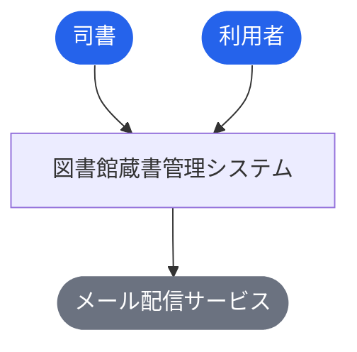
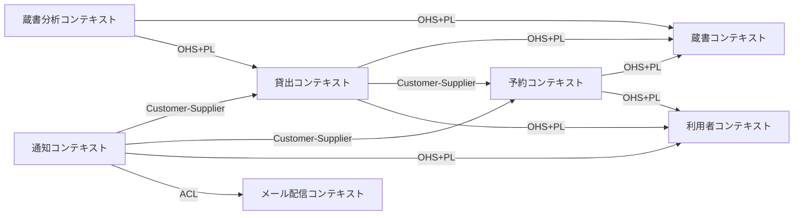
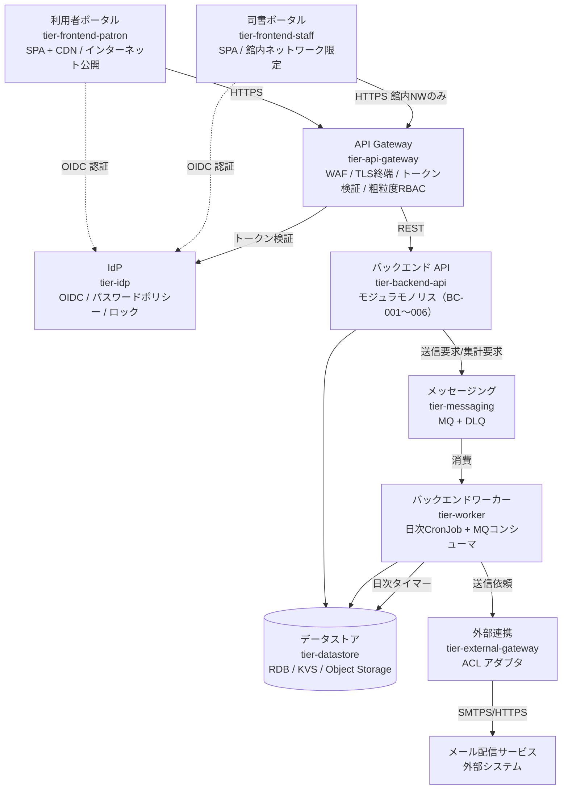
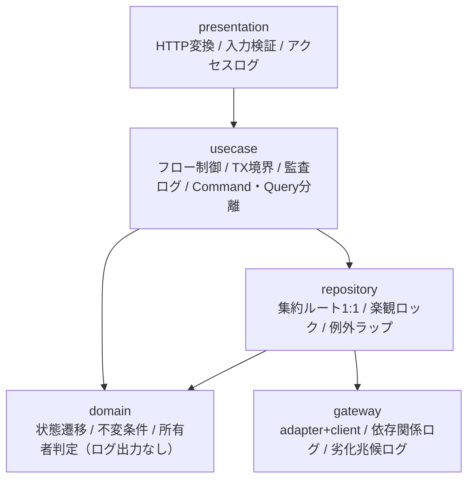
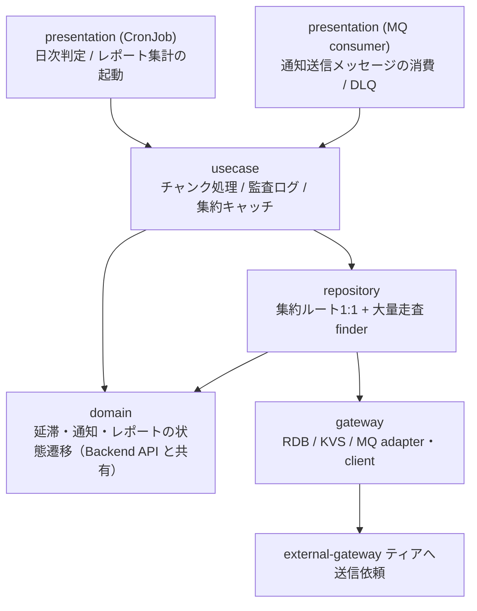
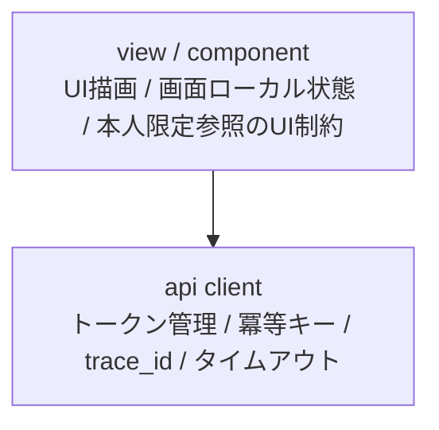
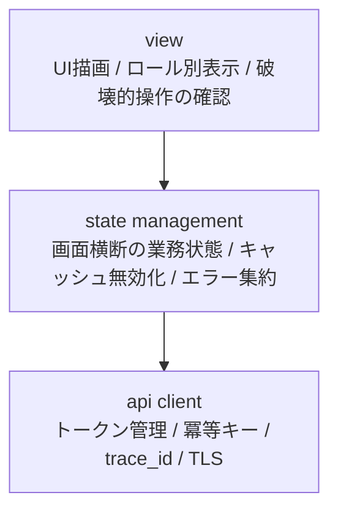
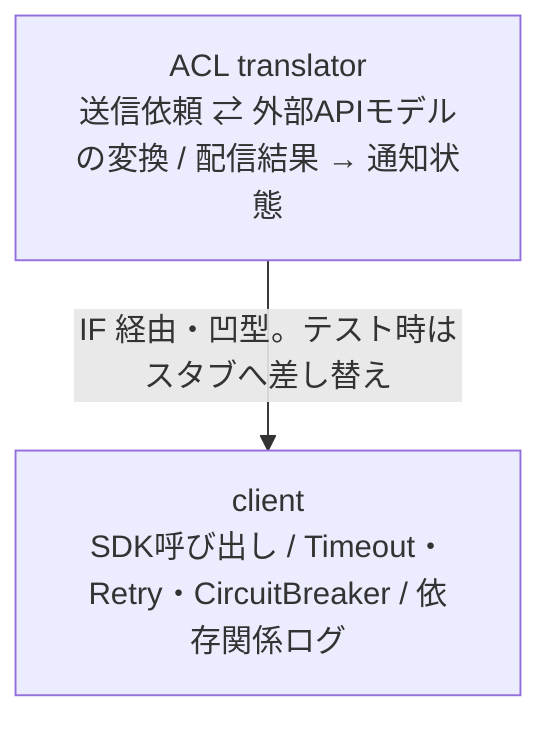

# 図書館蔵書管理システム

> 図書館の蔵書と利用者を一元管理し、貸出・返却・予約を Web 画面から行えるようにするシステム。書籍情報（タイトル・著者・ISBN・出版社・ジャンル）と利用者情報（氏名・連絡先・利用者番号）を登録・編集・削除でき、キーワード・タイトル・著者・ISBN・ジャンルで蔵書を検索できる。貸出時に返却期限を自動設定し、期限接近のリマインド・期限超過の督促・予約書籍の取置き案内をメールで自動通知する。利用者は自分の貸出履歴と予約状況を Web 画面で照会でき、司書は在庫状況・人気書籍ランキング・期間別貸出統計をレポートとして把握できる。紙台帳と表計算ファイルに分散した情報を単一の正データに統合し、司書の管理の手間とミスを削減して利用者サービスを向上させる。まずは 1 館での運用を想定し、将来の電子書籍対応に備えて蔵書を資料種別で区別できるモデルとする。

**最終更新**: 2026-09-02 21:07:20 spec stories (design)

## 成果物一覧

| ドメイン | 最新 | イベント数 |
|---------|------|-----------:|
| [USDM（要求分解）](#usdm要求分解) | [usdm/latest/](usdm/latest/) | 1 |
| [RDRA（要件定義）](#rdra要件定義) | [rdra/latest/](rdra/latest/) | 1 |
| [NFR（非機能要求）](#nfr非機能要求) | [nfr/latest/](nfr/latest/) | 1 |
| [Arch（アーキテクチャ）](#archアーキテクチャ) | [arch/latest/](arch/latest/) | 2 |
| [Infra（インフラ設計）](#infraインフラ設計) | [infra/latest/](infra/latest/) | 1 |
| [Design（デザイン）](#designデザイン) | [design/latest/](design/latest/) | 6 |
| [Specs（詳細仕様）](#specs詳細仕様) | [specs/latest/](specs/latest/) | 3 |

## USDM（要求分解）

### 主要な成果物

- [requirements.md](usdm/latest/requirements.md)
- [requirements.yaml](usdm/latest/requirements.yaml)

| 項目 | 値 |
|------|-----|
| 要求数 | 6 |
| 仕様数 | 15 |

## RDRA（要件定義）

### 主要な成果物

- [アクター.tsv](rdra/latest/アクター.tsv)
- [外部システム.tsv](rdra/latest/外部システム.tsv)
- [情報.tsv](rdra/latest/情報.tsv)
- [状態.tsv](rdra/latest/状態.tsv)
- [条件.tsv](rdra/latest/条件.tsv)
- [バリエーション.tsv](rdra/latest/バリエーション.tsv)
- [BUC.tsv](rdra/latest/BUC.tsv)
- [関連データ.txt](rdra/latest/関連データ.txt)
- [ZeroOne.txt](rdra/latest/ZeroOne.txt)
- [システム概要.json](rdra/latest/システム概要.json)
- [views/（人間可読ビュー: Mermaid 図解つき Markdown）](rdra/latest/views/README.md)

| 項目 | 値 |
|------|-----|
| アクター | 2 |
| 外部システム | 1 |
| 情報 | 7 |
| 状態モデル | 6 |
| 条件 | 17 |
| バリエーション | 9 |
| 業務 | 7 |
| BUC | 13 |
| UC | 41 |

### 外部ツール連携

| ツール | データファイル | 手順 |
|--------|-------------|------|
| [RDRA Graph](https://vsa.co.jp/rdratool/graph/v0.94/) | [関連データ.txt](rdra/latest/関連データ.txt) | ファイル内容をコピーし、RDRA Graph に貼り付け |
| [RDRA Sheet](https://docs.google.com/spreadsheets/d/1h7J70l6DyXcuG0FKYqIpXXfdvsaqjdVFwc6jQXSh9fM/) | [ZeroOne.txt](rdra/latest/ZeroOne.txt) | ファイル内容をコピーし、テンプレートに貼り付け |

### システムコンテキスト図



## NFR（非機能要求）

### 主要な成果物

- [nfr-grade.md](nfr/latest/nfr-grade.md)
- [nfr-grade.yaml](nfr/latest/nfr-grade.yaml)

| 項目 | 値 |
|------|-----|
| モデルシステム | model2 |
| カテゴリ | 6 |
| 重要項目 | 81 |

## Arch（アーキテクチャ）

### 主要な成果物

- [arch-design.md](arch/latest/arch-design.md)
- [arch-design.yaml](arch/latest/arch-design.yaml)
- [coverage-report.md](arch/latest/coverage-report.md)

| 項目 | 値 |
|------|-----|
| 言語 | TypeScript |
| サブドメイン | 5 |
| Bounded Context | 7 |
| コンテキストマップ関係 | 11 |
| ティア | 9 |
| ポリシー | 31 |
| ルール | 31 |
| エンティティ | 9 |

### ドメインアーキテクチャ（コンテキストマップ）



### コンテナ図（システム構成）



### コンポーネント図（レイヤー依存）

**tier-backend-api**



**tier-worker**



**tier-frontend-patron**



**tier-frontend-staff**



**tier-external-gateway**



## Infra（インフラ設計）

### 主要な成果物

- [_changes.md](infra/latest/_changes.md)
- [_inference.md](infra/latest/_inference.md)
- [infra-event.md](infra/latest/infra-event.md)
- [infra-event.yaml](infra/latest/infra-event.yaml)
- [product-input.yaml](infra/latest/product-input.yaml)

## Design（デザイン）

### 主要な成果物

- [design-event.md](design/latest/design-event.md)
- [design-event.yaml](design/latest/design-event.yaml)
- [assets/](design/latest/assets) (SVG 45 ファイル)

### ブランド

| 項目 | 値 |
|------|-----|
| 名称 | Libra |
| プライマリカラー | `#1D4ED8` |
| セカンダリカラー | `#0F766E` |
| トーン | 信頼・堅実。公共サービスとして、断定しすぎず、次に何をすればよいかを必ず示す |

### Storybook

```bash
cd docs/design/latest/storybook-app && npm run storybook
```

Stories: 53 ファイル

## Specs（詳細仕様）

### 主要な成果物

- [spec-event.md](specs/latest/spec-event.md)
- [spec-event.yaml](specs/latest/spec-event.yaml)

| 項目 | 値 |
|------|-----|
| UC | 41 |
| API | 45 |
| 非同期イベント | 6 |

### 横断設計

| 仕様 | ファイル |
|------|---------|
| UX デザイン仕様 | [ux-ui/ux-design.md](specs/latest/_cross-cutting/ux-ui/ux-design.md) |
| UI デザイン仕様 | [ux-ui/ui-design.md](specs/latest/_cross-cutting/ux-ui/ui-design.md) |
| データ可視化仕様 | [ux-ui/data-visualization.md](specs/latest/_cross-cutting/ux-ui/data-visualization.md) |
| 共通コンポーネント設計 | [ux-ui/common-components.md](specs/latest/_cross-cutting/ux-ui/common-components.md) |
| OpenAPI 3.1 | [api/openapi.yaml](specs/latest/_cross-cutting/api/openapi.yaml) |
| AsyncAPI 3.0 | [api/asyncapi.yaml](specs/latest/_cross-cutting/api/asyncapi.yaml) |
| RDB スキーマ | [datastore/rdb-schema.yaml](specs/latest/_cross-cutting/datastore/rdb-schema.yaml) |
| KVS スキーマ | [datastore/kvs-schema.yaml](specs/latest/_cross-cutting/datastore/kvs-schema.yaml) |
| トレーサビリティマトリクス | [traceability-matrix.md](specs/latest/_cross-cutting/traceability-matrix.md) |

### 蔵書管理業務

**蔵書を管理するフロー**

- [蔵書一覧を照会する](specs/latest/蔵書管理業務/蔵書を管理するフロー/蔵書一覧を照会する/spec.md)
- [書籍を登録する](specs/latest/蔵書管理業務/蔵書を管理するフロー/書籍を登録する/spec.md)
- [書籍情報を編集する](specs/latest/蔵書管理業務/蔵書を管理するフロー/書籍情報を編集する/spec.md)
- [書籍を削除する](specs/latest/蔵書管理業務/蔵書を管理するフロー/書籍を削除する/spec.md)

### 利用者管理業務

**利用者を管理するフロー**

- [利用者一覧を照会する](specs/latest/利用者管理業務/利用者を管理するフロー/利用者一覧を照会する/spec.md)
- [利用者を登録する](specs/latest/利用者管理業務/利用者を管理するフロー/利用者を登録する/spec.md)
- [利用者情報を編集する](specs/latest/利用者管理業務/利用者を管理するフロー/利用者情報を編集する/spec.md)
- [利用者を削除する](specs/latest/利用者管理業務/利用者を管理するフロー/利用者を削除する/spec.md)
- [自分の利用者情報を照会する](specs/latest/利用者管理業務/利用者を管理するフロー/自分の利用者情報を照会する/spec.md)

### 蔵書利用業務

**書籍を検索するフロー**

- [書籍を検索する](specs/latest/蔵書利用業務/書籍を検索するフロー/書籍を検索する/spec.md)
- [書籍詳細と在庫状況を照会する](specs/latest/蔵書利用業務/書籍を検索するフロー/書籍詳細と在庫状況を照会する/spec.md)
- [司書向けに蔵書を検索する](specs/latest/蔵書利用業務/書籍を検索するフロー/司書向けに蔵書を検索する/spec.md)

**書籍を貸し出すフロー**

- [自分の貸出内容と返却期限を照会する](specs/latest/蔵書利用業務/書籍を貸し出すフロー/自分の貸出内容と返却期限を照会する/spec.md)
- [書籍の貸出可否を判定する](specs/latest/蔵書利用業務/書籍を貸し出すフロー/書籍の貸出可否を判定する/spec.md)
- [貸出を登録する](specs/latest/蔵書利用業務/書籍を貸し出すフロー/貸出を登録する/spec.md)
- [利用者番号で貸出対象利用者を特定する](specs/latest/蔵書利用業務/書籍を貸し出すフロー/利用者番号で貸出対象利用者を特定する/spec.md)

**書籍を返却するフロー**

- [自分の返却済み貸出を照会する](specs/latest/蔵書利用業務/書籍を返却するフロー/自分の返却済み貸出を照会する/spec.md)
- [返却を登録する](specs/latest/蔵書利用業務/書籍を返却するフロー/返却を登録する/spec.md)
- [返却後の書籍状態を更新する](specs/latest/蔵書利用業務/書籍を返却するフロー/返却後の書籍状態を更新する/spec.md)
- [返却対象の貸出を照会する](specs/latest/蔵書利用業務/書籍を返却するフロー/返却対象の貸出を照会する/spec.md)

### 予約管理業務

**書籍を予約するフロー**

- [自分の予約順位を照会する](specs/latest/予約管理業務/書籍を予約するフロー/自分の予約順位を照会する/spec.md)
- [予約を登録する](specs/latest/予約管理業務/書籍を予約するフロー/予約を登録する/spec.md)
- [予約を取り消す](specs/latest/予約管理業務/書籍を予約するフロー/予約を取り消す/spec.md)

**予約者へ通知するフロー**

- [自分の取置き状況を照会する](specs/latest/予約管理業務/予約者へ通知するフロー/自分の取置き状況を照会する/spec.md)
- [予約順1位の利用者を特定する](specs/latest/予約管理業務/予約者へ通知するフロー/予約順1位の利用者を特定する/spec.md)
- [取置き通知メールを送信する](specs/latest/予約管理業務/予約者へ通知するフロー/取置き通知メールを送信する/spec.md)

### 貸出期限管理業務

**返却期限をリマインドするフロー**

- [自分の返却期限を照会する](specs/latest/貸出期限管理業務/返却期限をリマインドするフロー/自分の返却期限を照会する/spec.md)
- [返却期限接近の貸出を判定する](specs/latest/貸出期限管理業務/返却期限をリマインドするフロー/返却期限接近の貸出を判定する/spec.md)
- [リマインドメールを送信する](specs/latest/貸出期限管理業務/返却期限をリマインドするフロー/リマインドメールを送信する/spec.md)

**延滞を督促するフロー**

- [延滞中の貸出を照会する](specs/latest/貸出期限管理業務/延滞を督促するフロー/延滞中の貸出を照会する/spec.md)
- [期限超過の貸出を延滞にする](specs/latest/貸出期限管理業務/延滞を督促するフロー/期限超過の貸出を延滞にする/spec.md)
- [督促メールを送信する](specs/latest/貸出期限管理業務/延滞を督促するフロー/督促メールを送信する/spec.md)
- [自分の延滞中の貸出を照会する](specs/latest/貸出期限管理業務/延滞を督促するフロー/自分の延滞中の貸出を照会する/spec.md)

### 利用照会業務

**貸出履歴を確認するフロー**

- [自分の現在の貸出を照会する](specs/latest/利用照会業務/貸出履歴を確認するフロー/自分の現在の貸出を照会する/spec.md)
- [自分の貸出履歴を照会する](specs/latest/利用照会業務/貸出履歴を確認するフロー/自分の貸出履歴を照会する/spec.md)

**予約状況を確認するフロー**

- [自分の予約状況を照会する](specs/latest/利用照会業務/予約状況を確認するフロー/自分の予約状況を照会する/spec.md)
- [自分の取置き中の予約を照会する](specs/latest/利用照会業務/予約状況を確認するフロー/自分の取置き中の予約を照会する/spec.md)

### 蔵書分析業務

**在庫状況を把握するフロー**

- [在庫状況レポートを参照する](specs/latest/蔵書分析業務/在庫状況を把握するフロー/在庫状況レポートを参照する/spec.md)
- [在庫状況を区分別に集計する](specs/latest/蔵書分析業務/在庫状況を把握するフロー/在庫状況を区分別に集計する/spec.md)

**貸出統計を把握するフロー**

- [貸出統計レポートを参照する](specs/latest/蔵書分析業務/貸出統計を把握するフロー/貸出統計レポートを参照する/spec.md)
- [期間別貸出統計を集計する](specs/latest/蔵書分析業務/貸出統計を把握するフロー/期間別貸出統計を集計する/spec.md)

> 7 業務 / 13 BUC / 41 UC

## ADRs（設計判断記録）

| # | ドメイン | 判断 | ステータス |
|---|---------|------|----------|
| 1 | Arch | [SD-001「蔵書貸出・予約」を Core サブドメインに分類](arch/events/20260902_133544_initial_arch/decisions/arch-decision-001.yaml) | approved |
| 2 | Arch | [境界づけられたコンテキストを 6 BC + 外部 1 BC に分割](arch/events/20260902_133544_initial_arch/decisions/arch-decision-002.yaml) | approved |
| 3 | Arch | [コンテキストマップの統合方式（ACL / Customer-Supplier / OHS）を確定](arch/events/20260902_133544_initial_arch/decisions/arch-decision-003.yaml) | approved |
| 4 | Arch | [集約境界を 6 集約・不変条件 18 件の仮説として定義](arch/events/20260902_133544_initial_arch/decisions/arch-decision-004.yaml) | approved |
| 5 | Arch | [BC : tier 対応形態にモジュラモノリスを採用し、バックエンド API を CaaS(k8s) で運用](arch/events/20260902_133544_initial_arch/decisions/arch-decision-005.yaml) | approved |
| 6 | Arch | [認可アーキテクチャにパターン A（RBAC + Backend 作り込み）を採用](arch/events/20260902_133544_initial_arch/decisions/arch-decision-006.yaml) | approved |
| 7 | Arch | [非同期通知に MQ 独立ティア + DLQ を採用](arch/events/20260902_133544_initial_arch/decisions/arch-decision-007.yaml) | approved |
| 8 | Arch | [フロントエンドを利用者ポータル / 司書ポータルの 2 アプリに分離](arch/events/20260902_133544_initial_arch/decisions/arch-decision-008.yaml) | approved |
| 9 | Arch | [レイヤリング戦略: 5 層 + 軽量 CQRS、凹型は外部連携ティアのみ](arch/events/20260902_133544_initial_arch/decisions/arch-decision-009.yaml) | approved |
| 10 | Arch | [データモデル戦略: RDB 単一正データ + 全文索引、KVS は派生エンティティのみ](arch/events/20260902_133544_initial_arch/decisions/arch-decision-010.yaml) | approved |
| 11 | Infra | [アプリケーション実行基盤にコンテナサーバレスを選定する](infra/events/20260902_142349_infra_product_design/docs/cloud-context/decisions/product/product-decision-001.yaml) | accepted |
| 12 | Infra | [API エッジをロードバランサ + WAF で構成し、トークン検証をアプリケーション層に置く](infra/events/20260902_142349_infra_product_design/docs/cloud-context/decisions/product/product-decision-002.yaml) | accepted |
| 13 | Infra | [リレーショナルデータストアをマネージド単一インスタンス Multi-AZ 構成とする](infra/events/20260902_142349_infra_product_design/docs/cloud-context/decisions/product/product-decision-003.yaml) | accepted |
| 14 | Infra | [職員向け面の館内ネットワーク限定を接続元 IP 制限で実現する](infra/events/20260902_142349_infra_product_design/docs/cloud-context/decisions/product/product-decision-004.yaml) | draft |
| 15 | Infra | [単一リージョン複数 AZ 構成とし、遠隔地 DR を設けない](infra/events/20260902_142349_infra_product_design/docs/cloud-context/decisions/product/product-decision-005.yaml) | accepted |
| 16 | Design | [ブランドアイデンティティを「信頼・堅実」路線の仮称 Libra とする](design/events/20260902_145539_design_system/decisions/design-decision-001.yaml) | approved |
| 17 | Design | [ポータルを patron / staff の 2 つに分割し、プライマリ色で識別する](design/events/20260902_145539_design_system/decisions/design-decision-002.yaml) | approved |
| 18 | Design | [デザイントークンを primitive / semantic / component の 3 層 CSS カスタムプロパティで構成する](design/events/20260902_145539_design_system/decisions/design-decision-003.yaml) | approved |
| 19 | Design | [ドメインコンポーネントを RDRA の状態モデル・情報・バリエーションから機械的に導出する](design/events/20260902_145539_design_system/decisions/design-decision-004.yaml) | approved |
| 20 | Design | [Storybook を Next.js 16 + Tailwind v4 + Storybook 10 で構成し、外部 CDN に依存しない](design/events/20260902_145539_design_system/decisions/design-decision-005.yaml) | approved |
| 21 | Design | [loading 表現は LoadingState 1 か所に集約し、Skeleton と Spinner を用途で固定する](design/events/20260902_185951_design_system/decisions/design-decision-006.yaml) | approved |
| 22 | Design | [アプリシェル・ルート表・遷移 API をデザインシステムが所有し、router アダプタだけを実装リポに残す](design/events/20260902_185951_design_system/decisions/design-decision-007.yaml) | approved |
| 23 | Design | [components.ui[] に path / exports を持たせ、Skeleton・Spinner をファイル名ではなく成果物定義から解決させる](design/events/20260902_204527_design_system/decisions/design-decision-008.yaml) | approved |
| 24 | Specs | [同期 API のスタイルは REST（OpenAPI 3.1）とし、パスを /api/v1/{リソース} + staff / me で分離する](specs/events/20260902_152849_spec_generation/decisions/spec-decision-001.yaml) | approved |
| 25 | Specs | [通知メール送信とレポート集計だけを MQ 経由の非同期にし、at-least-once + 冪等消費 + DLQ 退避で受ける](specs/events/20260902_152849_spec_generation/decisions/spec-decision-002.yaml) | approved |
| 26 | Specs | [RDB は 3NF を基本としつつ、loans に貸出時点の書誌スナップショットを非正規化して保持する](specs/events/20260902_152849_spec_generation/decisions/spec-decision-003.yaml) | approved |
| 27 | Specs | [横断関心事（エラー・ページネーション・認証伝播・冪等性・楽観ロック）を全 41 UC 共通の規約として一元化する](specs/events/20260902_152849_spec_generation/decisions/spec-decision-004.yaml) | approved |
| 28 | Specs | [貸出期間区分の適用方式 — 利用者区分ごとの「既定 + 選択可能集合」で検証する](specs/events/20260902_152849_spec_generation/decisions/spec-decision-005.yaml) | approved |
| 29 | Specs | [利用者識別情報は Bearer トークンのクレームだけで送り、401 を 3 コードに限定する](specs/events/20260902_191046_spec_generation/decisions/spec-decision-006.yaml) | approved |
| 30 | Specs | [冪等キーは request_fingerprint 付きで保存し、内容不一致の再送を 409 で拒否する](specs/events/20260902_191046_spec_generation/decisions/spec-decision-007.yaml) | approved |
| 31 | Specs | [enum は日本語 wire value のまま x-enum-varnames で ASCII 識別子を併記し、AsyncAPI payload には安定 title を必須にする](specs/events/20260902_191046_spec_generation/decisions/spec-decision-008.yaml) | approved |
| 32 | Specs | [API operation の所有 UC を 1 つに固定し、他 UC からの利用は _api-summary.yaml の consumes で宣言する](specs/events/20260902_191046_spec_generation/decisions/spec-decision-009.yaml) | approved |
| 33 | Specs | [受け入れ基準 ID は {仕様ID}#{添字} とし、1 基準につき主担当 UC を 1 つに固定する](specs/events/20260902_191046_spec_generation/decisions/spec-decision-010.yaml) | approved |
| 34 | Specs | [loading 表現・URL 結線・完了結果の所有権を共通層へ集約し、UC 仕様は参照だけにする](specs/events/20260902_191046_spec_generation/decisions/spec-decision-011.yaml) | approved |

## Pipeline feedback runs

distillery-impl が公開した feedback-request Markdown を `dist-pipeline` が差分実行した記録。
`input.md`（不変 snapshot）/ `routing.json`（所有 stage の判定）/ `plan.json`（work unit と実行順）/ `result.json`（要求ごとの最終判定）を含む。

| feedback_id | 状態 | 要求 | applied | merged | deferred | 実行 stage | run dir |
|-------------|------|-----:|--------:|-------:|---------:|-----------|---------|
| 20260902_184257_impl_feedback_d0f57ea2 | completed | 11 | 11 | 0 | 0 | design_system → spec → spec_stories | [feedback-runs/](pipeline/feedback-runs/20260902_184257_impl_feedback_d0f57ea2) |
| 20260902_213000_impl_feedback_d0f57ea2 | completed | 2 | 2 | 0 | 0 | design_system → spec → spec_stories | [feedback-runs/](pipeline/feedback-runs/20260902_213000_impl_feedback_d0f57ea2) |

## イベント履歴

| 日時 | ドメイン | イベントID |
|------|---------|-----------|
| 2026-09-02 13:07:41 | USDM（要求分解） | [20260902_130741_initial_build](usdm/events/20260902_130741_initial_build) |
| 2026-09-02 13:07:41 | RDRA（要件定義） | [20260902_130741_initial_build](rdra/events/20260902_130741_initial_build) |
| 2026-09-02 13:25:51 | NFR（非機能要求） | [20260902_132551_initial_nfr](nfr/events/20260902_132551_initial_nfr) |
| 2026-09-02 13:35:44 | Arch（アーキテクチャ） | [20260902_133544_initial_arch](arch/events/20260902_133544_initial_arch) |
| 2026-09-02 14:23:49 | Infra（インフラ設計） | [20260902_142349_infra_product_design](infra/events/20260902_142349_infra_product_design) |
| 2026-09-02 14:47:24 | Arch（アーキテクチャ） | [20260902_144724_arch_infra_feedback_20260902_142349_infra_product_design](arch/events/20260902_144724_arch_infra_feedback_20260902_142349_infra_product_design) |
| 2026-09-02 14:55:39 | Design（デザイン） | [20260902_145539_design_system](design/events/20260902_145539_design_system) |
| 2026-09-02 15:28:49 | Specs（詳細仕様） | [20260902_152849_spec_generation](specs/events/20260902_152849_spec_generation) |
| 2026-09-02 18:35:02 | Design（デザイン） | [20260902_183502_spec_stories](design/events/20260902_183502_spec_stories) |
| 2026-09-02 18:59:51 | Design（デザイン） | [20260902_185951_design_system](design/events/20260902_185951_design_system) |
| 2026-09-02 19:10:46 | Specs（詳細仕様） | [20260902_191046_spec_generation](specs/events/20260902_191046_spec_generation) |
| 2026-09-02 20:11:17 | Design（デザイン） | [20260902_201117_spec_stories](design/events/20260902_201117_spec_stories) |
| 2026-09-02 20:45:27 | Design（デザイン） | [20260902_204527_design_system](design/events/20260902_204527_design_system) |
| 2026-09-02 20:57:13 | Specs（詳細仕様） | [20260902_205713_spec_generation](specs/events/20260902_205713_spec_generation) |
| 2026-09-02 21:07:20 | Design（デザイン） | [20260902_210720_spec_stories](design/events/20260902_210720_spec_stories) |

---

*このファイルは `generateReadme.js` により自動生成されています。手動編集しないでください。*
