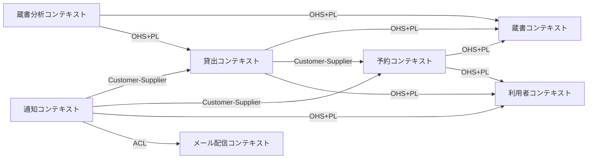
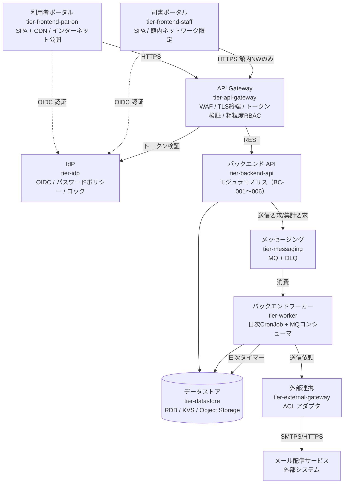
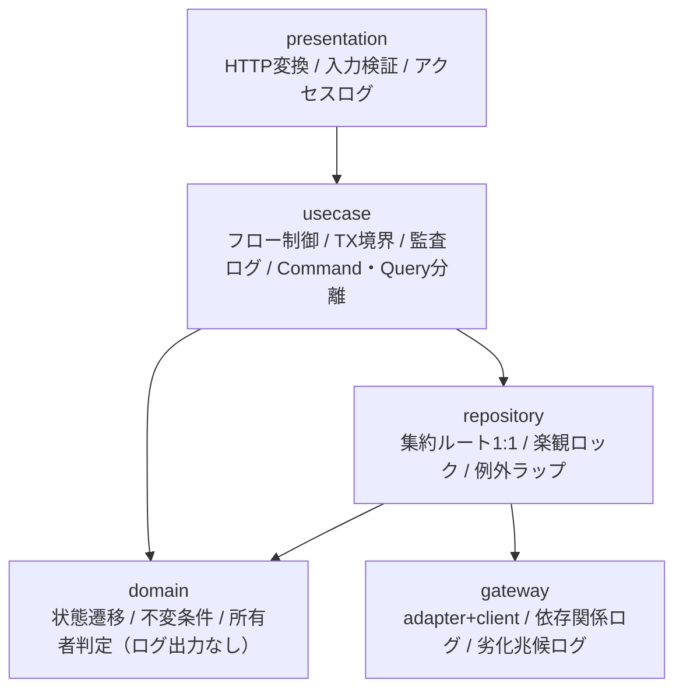
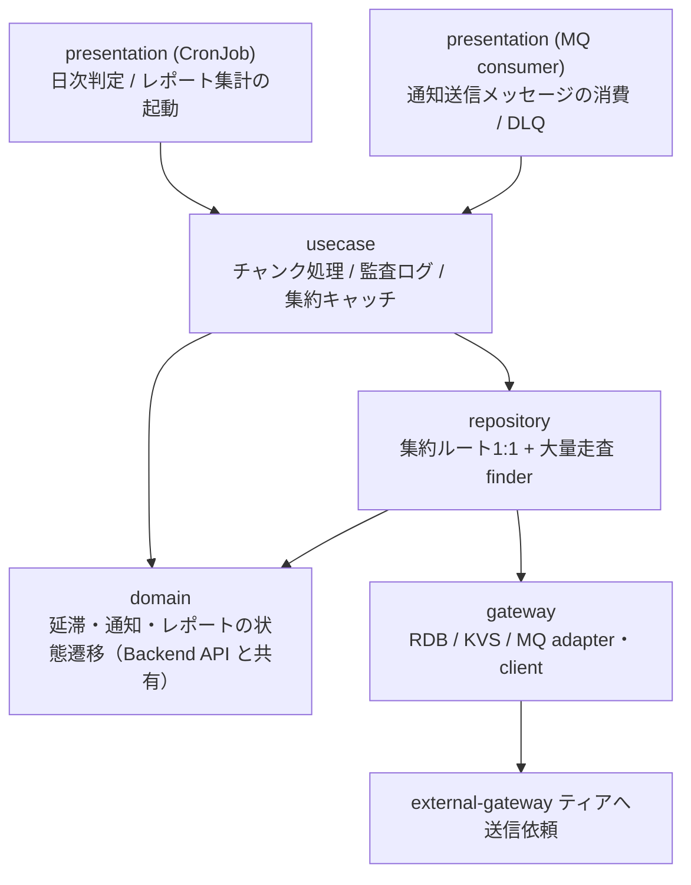
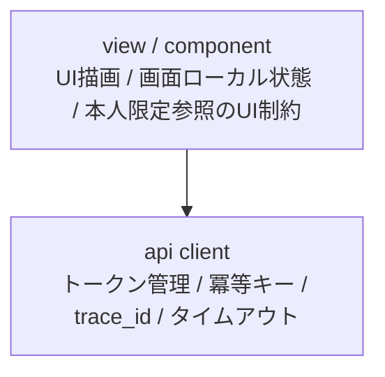
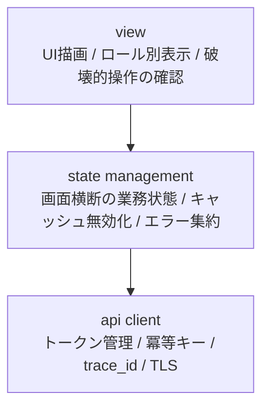
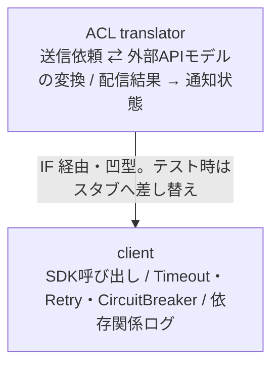
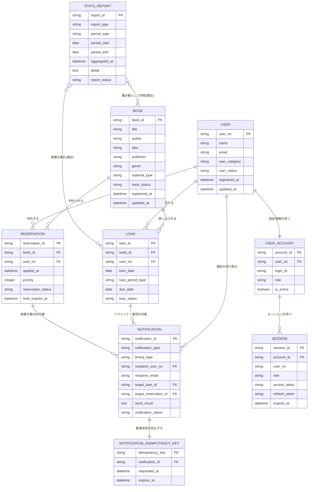

# アーキテクチャ設計書

## 概要

| 項目 | 内容 |
|------|------|
| イベントID | 20260902_133544_initial_arch |
| 作成日時 | 2026-09-02T14:11:27 |
| ソース | RDRA モデルと NFR グレードからの初期アーキテクチャ設計（trigger_event: rdra:20260902_130741_initial_build, nfr:20260902_132551_initial_nfr） |
| 言語 | TypeScript |
| フレームワーク | SPA フレームワーク（コンポーネント指向 / ルーティング内蔵）, サーバサイド Web フレームワーク（レイヤードアーキテクチャ対応 / DI 可能）, OpenAPI 準拠の API 定義とコード生成, RDB マイグレーションツール |
| 技術的制約 | モノレポ構成（利用者ポータル / 司書ポータル / 共有コンポーネントパッケージ / バックエンド API / ワーカーを単一リポジトリで管理）, モジュラモノリス（BC-001〜BC-006 をバックエンド API 内のモジュールとして分離。BC-007 は tier-external-gateway に実装）, ベンダーニュートラルなテクノロジー選定（具体的なクラウドサービス名は dist-infrastructure ステージで確定）, 認証は外部マネージド IdP に委譲し、認可は RBAC + バックエンド作り込み（認可サービスは導入しない）, 日本語のみ（i18n 対応は行わないが、日付・数値の書式はロケール API 経由で記述する）, 司書向け機能は館内ネットワークからのみアクセス可能（NFR E.5.3.1） |

## ドメインアーキテクチャ

### コンテキストマップ図

### サブドメイン分類

| ID | 名前 | 分類 | 投資方針 | 関連 BUC | confidence | 根拠 |
|----|------|:----:|---------|---------|:----------:|------|
| SD-001 | 蔵書貸出・予約 | core | 最優先で深いモデリングと継続的リファクタリングに投資。チーム最強の人材を配置 | BUC-004, BUC-005, BUC-006, BUC-010, BUC-011 | 中 | システム概要が「貸出・返却・予約を Web 画面から行えるようにする」ことを本システムの目的として明示しており、貸出可否判定・返却期限自動設定・予約順位/取置きという業務ルールの密度が最も高い。図書館サービスの価値の中心であり、外部調達で置き換えられない。ただしシステム概要に「競争優位」「差別化」の明示的キーワードは無いため経営判断の確認が必要 |
| SD-002 | 蔵書目録 | supporting | good enough な品質で安定運用。標準的なフレームワーク採用 | BUC-001, BUC-003 | 中 | 書籍マスタの登録・編集・削除と検索は貸出・予約業務の前提となる基盤だが、それ自体は差別化要因ではない。資料種別による将来の電子書籍対応の拡張点を持つため、標準的な CRUD + 検索で十分 |
| SD-003 | 利用者管理 | supporting | good enough な品質で安定運用。標準的なフレームワーク採用 | BUC-002 | 中 | 利用者の登録・編集・削除とアカウント役割管理は貸出・予約の前提条件（利用者登録ポリシー）を支える業務。中核業務を支援するが差別化要因ではない |
| SD-004 | 通知配信 | generic | 外部 SaaS / ライブラリ採用、自作回避。コスト効率優先 | BUC-007, BUC-008, BUC-009 | 高 | 取置き案内・返却期限リマインド・延滞督促のメール送信は外部システム「メール配信サービス」の機能カテゴリ（メール）と一致する汎用機能。送信基盤は自作せず外部サービスを利用する。ただし通知対象の判定条件（取置き通知対象条件・リマインド通知対象条件・督促通知対象条件）は業務ルールであり、この点は要確認 |
| SD-005 | 蔵書分析 | supporting | good enough な品質で安定運用。標準的なフレームワーク採用 | BUC-012, BUC-013 | 中 | 在庫状況・人気書籍ランキング・期間別貸出統計は司書の選書・運用改善を支援する派生情報であり、貸出業務の実績から導出される。中核業務を支援するが差別化要因ではない |

### 境界づけられたコンテキスト (Bounded Context)

| ID | 名前 | 所属 SD | 所有 entity | 所有 BUC | チーム | confidence | 根拠 |
|----|------|:------:|-----------|---------|--------|:----------:|------|
| BC-001 | 蔵書コンテキスト | SD-002 | E-001 | BUC-001, BUC-003 | - | 中 | 情報.tsv のコンテキスト「蔵書管理」に対応。書籍と書籍状態の更新責任を単一の境界に閉じることで、貸出・予約・分析から在庫の解釈が分岐するのを防ぐ。主アクターは司書（登録・編集・削除）と利用者（検索・在庫照会） |
| BC-002 | 利用者コンテキスト | SD-003 | E-002, E-003, E-901 | BUC-002 | - | 中 | 情報.tsv のコンテキスト「利用者管理」に対応。個人情報（氏名・メールアドレス）と認証情報（ログインID・役割）を単一の境界に集約し、他コンテキストからは利用者番号での参照に限定してデータ感度を局所化する |
| BC-003 | 貸出コンテキスト | SD-001 | E-004 | BUC-004, BUC-005, BUC-010 | - | 中 | 情報.tsv のコンテキスト「貸出管理」に対応。貸出状態（貸出中／延滞／返却済み）が予約状態・書籍状態と独立したライフサイクルを持ち、貸出・返却・履歴照会の UC 群が同一エンティティに閉じる |
| BC-004 | 予約コンテキスト | SD-001 | E-005 | BUC-006, BUC-011 | - | 中 | 情報.tsv のコンテキスト「予約管理」に対応。予約順位の決定と取置きの引き継ぎという固有の業務ルールを持ち、状態.tsv でも予約状態が独立したライフサイクル（予約中／取置き中／貸出済み／キャンセル）を形成する |
| BC-005 | 通知コンテキスト | SD-004 | E-006, E-902 | BUC-007, BUC-008, BUC-009 | - | 中 | 情報.tsv のコンテキスト「通知管理」に対応。通知状態が送信の進行のみを扱い、貸出・予約のライフサイクルから独立している。タイマー駆動（返却期限接近判定日次タイマー／返却期限超過判定日次タイマー）で起動する非同期領域として境界を切る |
| BC-006 | 蔵書分析コンテキスト | SD-005 | E-007 | BUC-012, BUC-013 | - | 中 | 情報.tsv のコンテキスト「分析管理」に対応。書籍と貸出の実績を読み取り専用に集計する派生情報の領域であり、更新責任を持たないため独立した BC として読み取りモデルを分離できる |
| BC-007 | メール配信コンテキスト | SD-004 |  |  | - | 中 | 外部システム「メール配信サービス」を独立 BC として明示し、コンテキストマップ上で統合パターン（ACL）を宣言するためのプレースホルダ。自システムのエンティティ・BUC は所有しない |

#### ユビキタス言語

**BC-001 蔵書コンテキスト**

| 用語 | 定義 |
|------|------|
| 書籍 | 図書館が所蔵する資料の目録上の1件。書籍ID で一意に識別し、タイトル・著者・ISBN・出版社・ジャンル・資料種別を持つ。貸出コンテキストでの「貸出対象物」、分析コンテキストでの「集計軸」とは関心が異なる |
| 書籍状態 | 蔵書1冊の在庫状況（在庫あり／貸出中／予約待ち）。貸出可否判定・検索結果の在庫表示・在庫集計の基準となる、蔵書コンテキストが唯一の更新責任を持つ状態 |
| 資料種別 | 紙書籍／電子書籍の区分。初期リリースでは紙書籍のみ有効で、将来の電子書籍対応に備えた拡張点 |
| 除籍 | 蔵書から書籍を外すこと。在庫ありかつ有効な予約が無い場合に限り許可される |

**BC-002 利用者コンテキスト**

| 用語 | 定義 |
|------|------|
| 利用者 | 図書館の利用登録を行った人。利用者番号で一意に識別し、氏名・連絡先・利用者区分を持つ。貸出コンテキストでの「貸出責任者」、通知コンテキストでの「宛先」とは関心が異なる |
| 利用者アカウント | ログイン済み操作者の識別単位。役割（司書／利用者）と有効フラグを持ち、本人限定参照の判定に使う |
| 利用者状態 | 登録済み／取引進行中の区分。進行中の貸出・予約がある間は取引進行中となり、退会（削除）できない |
| 利用者区分 | 一般／学生／団体。貸出可能冊数や貸出期間などの利用条件を決める属性 |

**BC-003 貸出コンテキスト**

| 用語 | 定義 |
|------|------|
| 貸出 | どの利用者にどの書籍をいつ貸したかの記録1件。貸出ID で一意に識別し、返却期限と返却日を持つ |
| 返却期限 | 貸出日に利用者区分に対応する貸出期間区分の日数を加算して自動設定される期日。リマインド・督促の判定基準 |
| 延滞 | 返却期限を超過した貸出の状態。督促メールの送信対象となり、返却登録で解消する |
| 貸出履歴 | 返却済みとなった過去の貸出。利用者本人の照会対象であり、貸出統計の集計対象として保持される |

**BC-004 予約コンテキスト**

| 用語 | 定義 |
|------|------|
| 予約 | 貸出中の書籍に対する利用者の順番待ちの申込1件。予約ID で一意に識別し、申込日時・予約順位・取置き状況を持つ |
| 予約順位 | 同一書籍への予約を申込日時の昇順で並べた順番。貸出済み／キャンセルの予約は対象から外し、後続を繰り上げる |
| 取置き | 予約順1位の利用者のために返却された書籍を確保している状態。取置き期限までに来館がなければキャンセルし次順位へ引き継ぐ |

**BC-005 通知コンテキスト**

| 用語 | 定義 |
|------|------|
| 通知 | 取置き案内・返却期限リマインド・延滞督促のメール送信1件の記録。送信待ち／送信済み／送信失敗で送信進行を管理し、重複送信防止と未達追跡に使う |
| 通知種別 | 取置き案内／返却期限リマインド／延滞督促。送信の契機と文面を使い分ける区分 |
| 通知タイミング区分 | 期限前リマインド／期限当日／期限超過督促。いつ送るかの判定基準となる区分 |
| 宛先 | 通知の送信先メールアドレス。利用者コンテキストの連絡先を送信時点で解決した値 |

**BC-006 蔵書分析コンテキスト**

| 用語 | 定義 |
|------|------|
| 統計レポート | 在庫状況・人気書籍ランキング・期間別貸出統計の集計結果1件。集計中／作成済み／実績なしで作成進行を管理する |
| 集計期間区分 | 日次／月次／年次。貸出実績とランキングを同一粒度で比較するための期間単位 |
| 在庫状況区分 | 分析文脈における書籍状態の集計軸（在庫あり／貸出中／予約待ち）。蔵書コンテキストの「書籍状態」を読み取り専用に射影したもの |

**BC-007 メール配信コンテキスト**

| 用語 | 定義 |
|------|------|
| メール送信依頼 | 外部メール配信サービスへ渡す送信要求。宛先アドレスと本文を持つ、外部サービス側の語彙 |
| 配信結果 | 外部メール配信サービスが返す送信可否。通知コンテキストの送信済み／送信失敗へ翻訳される |

### コンテキストマップ

| ID | from BC | to BC | パターン | 方向 | 翻訳責務 | 統合イベント | confidence |
|----|---------|-------|:-------:|:----:|---------|--------------|:----------:|
| CM-001 | BC-003 | BC-001 | ohs | downstream | 蔵書コンテキストが「在庫状況照会」「貸出時の在庫あり→貸出中への状態変更」「返却時の状態更新」を公開インタフェースとして提供し、貸出コンテキストはそれを利用する。書籍状態の更新責任は蔵書側に残す | - | 中 |
| CM-002 | BC-004 | BC-001 | ohs | downstream | 予約コンテキストが蔵書コンテキストの公開インタフェースで書籍状態を参照して予約可否（貸出中のみ受付）を判定し、取置き成立時に予約待ちへの状態変更を依頼する | - | 中 |
| CM-003 | BC-003 | BC-004 | customer_supplier | downstream | 返却受付時に貸出コンテキストが予約コンテキストへ「対象書籍に有効な予約があるか」を問い合わせ、取置き中の予約に対する貸出成立を通知する。予約順位の解釈は予約側に閉じ、貸出側は可否と対象利用者番号のみ受け取る | - | 中 |
| CM-004 | BC-003 | BC-002 | ohs | downstream | 利用者コンテキストが「利用者番号による貸出対象利用者の特定」「利用者区分の提供」を公開インタフェースとして提供する。貸出コンテキストは利用者番号のみを保持し、氏名・連絡先は保持しない | - | 中 |
| CM-005 | BC-004 | BC-002 | ohs | downstream | 予約コンテキストが利用者コンテキストの公開インタフェースで登録済み利用者を確認し、予約に利用者番号のみを保持する | - | 中 |
| CM-006 | BC-005 | BC-003 | customer_supplier | downstream | 通知コンテキストが貸出コンテキストから「返却期限接近の貸出」「延滞対象の貸出」を取得し、通知1件へ翻訳する。延滞への状態遷移そのものは貸出コンテキストが行う | - | 中 |
| CM-007 | BC-005 | BC-004 | customer_supplier | downstream | 通知コンテキストが予約コンテキストから「予約順1位かつ予約中の予約」を取得して取置き案内を送信し、送信成功を予約側へ返して取置き中への遷移を促す | - | 中 |
| CM-008 | BC-005 | BC-002 | ohs | downstream | 通知コンテキストが利用者コンテキストの公開インタフェースで宛先メールアドレスを解決し、通知レコードには送信時点の宛先を記録する | - | 中 |
| CM-009 | BC-006 | BC-001 | ohs | downstream | 蔵書分析コンテキストが蔵書コンテキストの公開インタフェースから書籍と書籍状態を読み取り専用で取得し、在庫状況区分という集計軸へ射影する | - | 中 |
| CM-010 | BC-006 | BC-003 | ohs | downstream | 蔵書分析コンテキストが貸出コンテキストの公開インタフェースから返却済みを含む貸出実績を読み取り専用で取得し、貸出件数・書籍別貸出回数へ集計する | - | 中 |
| CM-011 | BC-005 | BC-007 | acl | downstream | 通知コンテキストが外部メール配信サービスの API モデル（メール送信依頼・配信結果）を ACL で隔離し、自身の通知状態（送信待ち／送信済み／送信失敗）へ翻訳する。外部障害時の再送は通知側の送信失敗→送信待ちの遷移として表現する | - | 高 |

### 集約境界の仮説

> 注: これらは戦略段階の仮説です。最終確定は dist-spec or ddd-tactical-implementation で行います。

| ID | BC | root entity | members | invariants | confidence | 備考 |
|----|----|-----------|---------|-----------|:----------:|------|
| AG-001 | BC-001 | E-001 | - | • 書籍状態が「在庫あり」であり、かつ予約状態が「予約中」「取置き中」の予約が存在しない場合に限り削除を許可する • 資料種別が「紙書籍」の蔵書のみ初期リリースで登録・貸出の対象とし、「電子書籍」は登録しない • 返却受付時に有効な予約（予約中）が存在する場合は書籍状態を「予約待ち」とし、存在しない場合は「在庫あり」とする | 低 | 仮説。最終確定は dist-spec または ddd-tactical-implementation で行う |
| AG-002 | BC-002 | E-002 | E-003 | • 貸出状態が「貸出中」「延滞」の貸出、および予約状態が「予約中」「取置き中」の予約が存在しない場合に限り利用者を削除できる • 貸出・予約は登録済み利用者に限定する • 貸出履歴・予約状況の照会はログイン中の利用者本人に紐づくもののみを対象とする | 低 | 仮説。最終確定は dist-spec または ddd-tactical-implementation で行う。利用者アカウントを別集約に分離する案もある（認証情報のライフサイクルが利用者と異なる場合） |
| AG-003 | BC-003 | E-004 | - | • 書籍状態が「在庫あり」であり、かつ貸出先が登録済みで利用可能な利用者であるときに限り貸出を許可する • 貸出記録の作成時に、貸出日を起点として利用者区分に対応する貸出期間区分の日数を加算した日を返却期限として自動設定する • 貸出状態が「返却済み」になった時点で督促を停止し、以降の状態遷移を行わない | 低 | 仮説。最終確定は dist-spec または ddd-tactical-implementation で行う |
| AG-004 | BC-004 | E-005 | - | • 書籍状態が「貸出中」の書籍に対してのみ予約を受け付ける • 同一利用者が同一書籍に対して「予約中」または「取置き中」の予約を既に持つ場合、再度の予約申込を受け付けない • 同一書籍への予約は申込日時の昇順で順位を付与し、「貸出済み」「キャンセル」の予約は順位対象から除外して後続を繰り上げる • 予約状態が「取置き中」の書籍は、取置き対象である予約順1位の利用者に対してのみ貸出を許可する | 低 | 仮説。最終確定は dist-spec または ddd-tactical-implementation で行う。同一書籍の予約列全体を1集約（書籍単位の予約待ち行列）とする案は強整合と競合の観点で要検討 |
| AG-005 | BC-005 | E-006 | - | • メール配信サービスへの送信が成功した通知は送信済みとし、同一対象への重複送信を抑止する • 書籍状態が「予約待ち」となった書籍について、予約順1位かつ予約中の予約1件のみを取置き通知の対象とする • 貸出状態が「返却済み」の貸出はリマインド・督促の対象外とする | 低 | 仮説。最終確定は dist-spec または ddd-tactical-implementation で行う |
| AG-006 | BC-006 | E-007 | - | • 蔵書全件を書籍状態（在庫あり／貸出中／予約待ち）で区分し、区分ごとの件数と書籍一覧を集計する • 対象期間に貸出実績が存在しない場合は「実績なし」として扱い、作成済みとしない | 低 | 仮説。最終確定は dist-spec または ddd-tactical-implementation で行う。集計明細は書籍と貸出から導出する読み取りモデルであり、集約として保持するか都度算出するかは Part 3（データ）と要調整 |

## システムアーキテクチャ

### システム構成図

### ティア構成

| ID | ティア名 | 説明 | テクノロジー候補 |
|-----|---------|------|----------------|
| tier-frontend-patron | 利用者ポータル | 図書館利用者向けの Web UI。書籍検索・在庫状況照会・予約申込/取消・自分の貸出内容/返却期限/貸出履歴/予約状況/取置き状況の照会を提供する。インターネットへ公開する | SPA, CDN |
| tier-frontend-staff | 司書ポータル | 司書向けの Web UI。蔵書/利用者の登録・編集・削除、窓口での貸出・返却・予約取消、延滞照会、在庫状況・貸出統計レポート参照を提供する。館内ネットワークからのみ利用する | SPA |
| tier-api-gateway | API Gateway | 2 ポータルからのリクエストを受け、TLS 終端・WAF・IP 制限・トークン検証・粗粒度 RBAC・レート制限を集約する境界ティア（Gatekeeper / Gateway Offloading パターン） | API Gateway, リバースプロキシ, WAF |
| tier-idp | IdP（アイデンティティプロバイダー） | 司書・利用者の認証、トークン発行、パスワードポリシー適用、アカウントロック、パスワードリセットを担う独立ティア。API Gateway はこのティアが発行したトークンを検証する | IdP |
| tier-backend-api | バックエンド API | 6 つの境界づけられたコンテキスト（蔵書・利用者・貸出・予約・通知・蔵書分析）をモジュールとして内包するモジュラモノリスの API ティア。窓口業務と Web 照会の全 UC を処理する | CaaS(k8s), FaaS |
| tier-worker | バックエンドワーカー | 日次タイマー起点のバッチ処理（返却期限接近判定・期限超過判定）と、MQ を消費する非同期処理（取置き案内・リマインド・督促メールの送信、レポート集計）を担うティア | CronJob(k8s), FaaS |
| tier-messaging | メッセージング | 通知送信要求とレポート集計要求のバッファとなる MQ ティア。DLQ を併設し、Backend API / Worker がプロデューサー、Worker がコンシューマーとなる | MQ |
| tier-datastore | データストア | 業務データの正データを保持する RDB、冪等キー・セッション・参照キャッシュを保持する KVS、バックアップと静的コンテンツを保持する Object Storage で構成する | RDB, KVS, Object Storage |
| tier-external-gateway | 外部連携 | 外部システム「メール配信サービス」との連携を担うアダプタティア。ACL として外部 API モデルを通知コンテキストのモデルへ翻訳する（BC-007 の実装先） | ACL アダプタ |

### 利用者ポータル (tier-frontend-patron) の方針・ルール

#### 方針

| ID | 方針名 | 内容 | 根拠 | RDRA/NFR 要素 | 確信度 |
|-----|---------|------|------|--------------|:------:|
| SP-001 | マルチデバイス対応 | PC とタブレットを主対象としたレスポンシブ UI を提供し、主要ブラウザ 3 種（最新版）で動作させる。スマートフォン対応の要否は別途確認する | 利用者照会は PC/タブレットからの利用が想定され、NFR で対応ブラウザ 2-3 種が定義されている | アクター: 利用者, NFR F.1.1.1, NFR F.1.1.2, NFR F.1.1.3 | 中 |
| SP-002 | アクセシビリティ準拠 | JIS X 8341-3:2016 レベル AA 準拠を目標として、意味的な HTML・キーボード操作・コントラスト比を設計要件に含める | 公共図書館の利用者向け画面としてアクセシビリティ目標が NFR で明示されている | NFR F.3.1.2 | 高 |
| SP-003 | 静的コンテンツの CDN 配信 | HTML/CSS/JS 等の静的アセットを CDN から配信し、アプリケーションサーバの負荷とレスポンスタイムを削減する（Static Content Hosting パターン） | レスポンスタイム 5 秒以内の目標と 100Mbps 帯域の制約下で、画面主体のアプリの配信コストを下げるため | NFR B.2.1.1, NFR F.1.2.2 | 中 |
| SP-004 | 本人限定参照の UI 制約 | 貸出履歴・予約状況・取置き状況の画面はログイン中の利用者本人に紐づくデータのみを表示し、他利用者のデータへ到達する導線を持たない | 条件「個人情報参照可否条件」が自分の〜を照会する系 10 UC に適用され、貸出履歴は読書傾向という機微情報であるため | 条件: 個人情報参照可否条件, NFR E.1.2.1 | 高 |

#### ルール

| ID | ルール名 | 内容 | 根拠 | RDRA/NFR 要素 | 確信度 |
|-----|---------|------|------|--------------|:------:|
| SR-001 | API 経由のデータアクセス | フロントエンドからデータストアへの直接アクセスを禁止し、必ず API Gateway 経由で Backend API を呼び出す | セキュリティとデータ整合性の確保 | なし | デフォルト |
| SR-002 | 冪等キーの付与と二重送信防止 | 予約申込・予約取消などの状態変更リクエストごとに冪等キー（UUID）を生成して X-Idempotency-Key ヘッダに付与し、送信ボタンの二度押し防止 UI 制御を併用する | 社外アクターがインターネット経由で予約という状態変更操作を行うため、リトライによる重複登録リスクがある | アクター: 利用者（社外）, BUC: 書籍を予約するフロー | 高 |
| SR-003 | trace_id の生成と伝播 | リクエストごとに trace_id を生成し、W3C Trace Context ヘッダで後続ティアへ伝播する | アプリケーション監視とアクセスログ・操作ログの横断検索を成立させるため | NFR C.1.3.1, NFR C.6.1.2 | 中 |
| SR-004 | 日本語単一ロケール | 表示テキストは日本語のみとし i18n リソースバンドルは導入しない。日付・数値の書式はロケール API 経由で記述し、将来の多言語化の拡張点だけ残す | RDRA に多言語・海外・グローバルのシグナルがなく、1 館運用が前提であるため | システム概要: まずは 1 館での運用を想定, バリエーション: 言語バリエーションなし | 高 |

### 司書ポータル (tier-frontend-staff) の方針・ルール

#### 方針

| ID | 方針名 | 内容 | 根拠 | RDRA/NFR 要素 | 確信度 |
|-----|---------|------|------|--------------|:------:|
| SP-005 | 館内ネットワーク限定公開 | 司書向け管理機能は館内ネットワークからのみ到達可能とし、インターネットからは公開しない | NFR の利用制限で司書向け管理機能を館内ネットワーク限定と定義しているため | NFR E.5.3.1, NFR E.8.3.1 | 高 |
| SP-006 | 窓口業務優先の操作設計 | 貸出・返却・予約取消の窓口オペレーションを最小操作数で完了できる高密度 UI とし、レポート参照は別導線に分ける | 司書は窓口で利用者を待たせながら貸出・返却を処理するため操作効率が要件になる | アクター: 司書, BUC: 書籍を貸し出すフロー / 書籍を返却するフロー | 中 |
| SP-007 | PC 単一デバイス最適化 | 司書窓口の対応デバイスを PC に限定し、レスポンシブ対応の優先度を下げる | NFR の対応デバイスで司書窓口が PC と定義されているため | NFR F.1.1.1, NFR F.1.1.3 | 中 |

#### ルール

| ID | ルール名 | 内容 | 根拠 | RDRA/NFR 要素 | 確信度 |
|-----|---------|------|------|--------------|:------:|
| SR-005 | 司書ロールの検証 | 司書ポータルの全画面は司書ロールを持つトークンでのみ操作可能とし、利用者ロールのトークンでは到達できない | ロールベースアクセス制御で司書機能と利用者機能を分離するため | 情報: 利用者アカウント（役割）, NFR E.5.2.1 | 高 |
| SR-006 | 個人情報表示の最小化 | 画面に表示する利用者の氏名・連絡先を業務上必要な範囲に限定し、ブラウザのローカルストレージへ個人情報を永続化しない | 個人情報保護法準拠と、貸出履歴が思想信条を推知しうるというプライバシー配慮の要求があるため | NFR E.1.2.1, NFR E.6.2.1 | 高 |

### API Gateway (tier-api-gateway) の方針・ルール

#### 方針

| ID | 方針名 | 内容 | 根拠 | RDRA/NFR 要素 | 確信度 |
|-----|---------|------|------|--------------|:------:|
| SP-008 | セキュリティオフロード | TLS 終端・WAF マネージドルールセット適用・IP 制限・IdP 発行トークンの検証・ロールによる粗粒度 RBAC を Gateway に集約し、Backend API から横断的関心事を外す | WAF・アクセス制御・利用制限・全通信暗号化の要求を 1 箇所で満たすため | NFR E.10.1.1, NFR E.5.2.1, NFR E.5.3.1, NFR E.6.1.2 | 高 |
| SP-009 | ポータル別の経路分離 | 利用者ポータル経路（インターネット公開・DMZ）と司書ポータル経路（館内ネットワーク限定）をリスナーレベルで分離し、司書向け API を外部から到達不可にする | 利用制限とネットワーク分離の要求により、司書向け管理機能と利用者向け照会の露出面を分ける必要があるため | NFR E.5.3.1, NFR E.8.3.1, アクター: 司書（社内）/ 利用者（社外） | 高 |
| SP-010 | レート制限 | IP 単位・アカウント単位のレート制限を適用し、ログイン試行の連続失敗と照会 API の過剰呼び出しを抑止する | ログイン失敗の連続検知とアカウントロックという不正監視要件を境界で補完するため | NFR E.7.2.1, NFR B.1.2.1 | 中 |

#### ルール

| ID | ルール名 | 内容 | 根拠 | RDRA/NFR 要素 | 確信度 |
|-----|---------|------|------|--------------|:------:|
| SR-007 | 認可責務の分界 | Gateway はロールによる粗粒度判定（司書 / 利用者）までを担当し、リソース所有者判定（本人限定参照）と状態ベース判定は Backend API の Domain 層が行う | 本人限定参照は貸出・予約という業務データの所有関係に依存し、Gateway が持つ属性だけでは判定できないため | 条件: 個人情報参照可否条件, NFR E.5.2.1 | 高 |
| SR-008 | タイムアウト階層の最上位 | Gateway のタイムアウトを Backend API より長く設定し、レスポンスタイム目標 5 秒から逆算した上限値を段階的に定義する（Gateway > Backend API > 外部連携） | リソースの無限占有を防ぎつつ、正常リクエストを Gateway で切断しないため | NFR B.2.1.1, NFR B.2.1.2 | 中 |
| SR-009 | アクセスログの全件出力 | 全リクエストのアクセスログ（trace_id, user_id, 経路, ステータス, 応答時間）を構造化ログとして出力し、監査ログ基盤へ転送する | アクセスログ + 操作ログ + 監査ログの出力とデータアクセスログの取得が要求されているため | NFR E.7.1.1, NFR C.6.1.2 | 高 |

### IdP（アイデンティティプロバイダー） (tier-idp) の方針・ルール

#### 方針

| ID | 方針名 | 内容 | 根拠 | RDRA/NFR 要素 | 確信度 |
|-----|---------|------|------|--------------|:------:|
| SP-011 | 認証の IdP 委譲 | OAuth2/OIDC に準拠した IdP へ認証処理を委譲し、アプリケーションは認証ロジックを保持しない（Federated Identity パターン） | 社外アクターである利用者がインターネット経由でログインするため、標準プロトコル準拠の認証基盤が必要 | アクター: 利用者（社外・受益者）, NFR E.5.1.1 | 高 |
| SP-012 | パスワードポリシーとアカウントロック | 複雑性・有効期限を含むパスワードポリシーを IdP で強制し、ログイン失敗の連続検知でアカウントをロックする | 認証方式が ID/パスワード＋パスワードポリシーで、不正監視としてログイン失敗の連続検知とアカウントロックが要求されているため | NFR E.5.1.1, NFR E.7.2.1 | 高 |
| SP-013 | 認証情報と業務ロールの分界 | ログイン ID・パスワード・有効フラグ等の認証情報は IdP が正データとして保持し、業務上の役割（司書 / 利用者）はトークンのクレームとして伝達したうえで利用者コンテキストが業務属性を保持する | 情報「利用者アカウント」がログインID・役割・有効フラグを持つため、IdP との責務重複を明示的に切り分ける必要がある | 情報: 利用者アカウント, NFR E.5.1.1 | 中 |

#### ルール

| ID | ルール名 | 内容 | 根拠 | RDRA/NFR 要素 | 確信度 |
|-----|---------|------|------|--------------|:------:|
| SR-010 | トークンライフサイクル管理 | アクセストークンは短命とし、リフレッシュトークンで更新する。ログアウト時とアカウント無効化時はリフレッシュトークンを失効させる | セッションハイジャック防止と、利用者削除・アカウント無効化の即時反映のため | NFR E.5.1.1, NFR E.7.1.1 | 中 |
| SR-011 | 認証イベントの監査ログ | ログイン成功・失敗・ログアウト・パスワード変更・アカウントロックを監査ログとして出力し、6 ヶ月間保管する | 監査ログとしてログイン/ログアウトとデータアクセスログの取得が要求され、ログ保管期間が 6 ヶ月と定義されているため | NFR E.7.1.1, NFR C.6.1.1 | 高 |
| SR-012 | IdP 障害時の切替 | IdP の障害時はコールドスタンバイ構成から 60 分未満で切替可能とし、切替手順を復旧手順書に含める | 認証が全機能の前提になるため、サービス切替時間 60 分未満の要求を IdP にも適用する | NFR A.1.2.1, NFR A.2.1.1 | 中 |

### バックエンド API (tier-backend-api) の方針・ルール

#### 方針

| ID | 方針名 | 内容 | 根拠 | RDRA/NFR 要素 | 確信度 |
|-----|---------|------|------|--------------|:------:|
| SP-014 | モジュラモノリス構成 | 自前の 6 BC（BC-001 蔵書 / BC-002 利用者 / BC-003 貸出 / BC-004 予約 / BC-005 通知 / BC-006 蔵書分析）を単一デプロイ単位の中のモジュールとして分割し、モジュール間はコンテキストマップの公開契約経由で連携する | BC は 6 個あるがアクター 2 種・同時アクセス 100 以下・1 館運用の規模であり、マイクロサービス分割の運用コストが見合わない。一方でコンテキスト分割されたモジュラ構成が拡張性要件として明示されている | BC: BC-001〜BC-006, NFR F.2.2.1, NFR B.1.1.1 | 中 |
| SP-015 | 水平スケールアウト | ステートレスな API インスタンスを LB 配下に N+1 で配置し、ピーク時（通常時の 2 倍）にインスタンス追加で対応する | サーバ内の冗長化が N+1、CPU 拡張性がスケールアウト、ピーク時同時アクセス数が通常時の 2 倍と定義されているため | NFR A.2.1.1, NFR B.3.1.1, NFR B.1.1.3, NFR B.1.2.1 | 中 |
| SP-016 | リソース所有者ベース認可の Domain 層強制 | 貸出・予約・利用者情報・取置き状況の照会は、トークンの利用者番号と対象データの利用者番号の一致を Domain 層で必ず検証する。ロールによる粗粒度判定だけに依存しない | 個人情報参照可否条件が本人限定参照を要求し、貸出履歴・予約状況は個人情報かつ読書傾向という高感度データであるため、RBAC 単独では不足する | 条件: 個人情報参照可否条件, 情報: 利用者/貸出/予約, NFR E.5.2.1, NFR E.1.2.1 | 高 |
| SP-017 | 在庫整合のトランザクション境界 | 貸出登録・返却登録・予約登録/取消と、それに伴う書籍状態・予約順位の更新を単一の RDB トランザクション内で完結させる | 貸出可否条件・予約順位決定条件・返却後状態決定条件が書籍状態と予約状態の同時整合を要求し、進行中取引の消失が窓口業務と矛盾するため | 条件: 貸出可否条件 / 予約順位決定条件 / 返却後状態決定条件, NFR A.4.1.1 | 高 |
| SP-018 | レポート集計の分離 | 在庫状況・人気書籍ランキング・期間別貸出統計の集計処理を照会系 API から切り離し、長時間化する集計は Worker ティアへ委譲して結果を参照する形にする | ターンアラウンドタイム 10 秒以内・レスポンスタイム 5 秒以内の目標があり、蔵書全件走査を同期処理に含めると目標を超過するため | BUC: 在庫状況を把握するフロー / 貸出統計を把握するフロー, NFR B.2.1.1, NFR B.2.1.3 | 中 |

#### ルール

| ID | ルール名 | 内容 | 根拠 | RDRA/NFR 要素 | 確信度 |
|-----|---------|------|------|--------------|:------:|
| SR-013 | 冪等キーによる重複検知 | 状態変更操作（貸出登録・返却登録・予約登録/取消・利用者登録）で受け取った冪等キーを KVS に記録し、重複リクエストには前回レスポンスを返却する | 社外アクターのリトライと窓口での二重操作による重複登録を防止するため | アクター: 利用者（社外）, BUC: 書籍を貸し出すフロー / 書籍を予約するフロー | 高 |
| SR-014 | モジュール間の直接参照禁止 | モジュール間で他モジュールのテーブルを直接参照せず、コンテキストマップ（CM-001〜CM-010）で定義した公開契約（OHS+PL / Customer-Supplier）経由でのみアクセスする | BC 境界を実装レベルで維持し、将来のサービス分割を可能にするため | コンテキストマップ: CM-001〜CM-010, NFR F.2.2.1 | 中 |
| SR-015 | ヘルスチェックエンドポイント | プロセス生存確認（shallow）と RDB/KVS/MQ 接続確認（deep）の 2 種のヘルスチェックエンドポイントを公開し、LB の振り分け判定と監視に用いる | N+1 冗長構成の切替判定と、サーバ＋ネットワーク＋アプリケーション監視の要求を満たすため | NFR A.2.1.1, NFR C.1.3.1, NFR C.1.3.3 | 中 |
| SR-016 | Web アプリケーション脆弱性対策 | XSS / SQL インジェクション / CSRF 対策をフレームワーク標準機能とコーディング規約で担保し、リリース前にツールによる自動診断を実施する | Web アプリケーション対策と自動セキュリティ診断が要求されているため | NFR E.10.2.1, NFR E.3.1.1 | 高 |
| SR-017 | ログへの個人情報非出力 | 氏名・メールアドレス・パスワードをログ本文に出力せず、利用者番号などの識別子のみを context に記録する | 機密データの暗号化とデータマスキング、個人情報保護法準拠の要求があるため | NFR E.6.1.1, NFR E.6.2.1, NFR C.6.1.2 | 高 |

### バックエンドワーカー (tier-worker) の方針・ルール

#### 方針

| ID | 方針名 | 内容 | 根拠 | RDRA/NFR 要素 | 確信度 |
|-----|---------|------|------|--------------|:------:|
| SP-019 | 日次タイマージョブ | 返却期限接近の貸出判定と期限超過の貸出の延滞遷移を日次タイマーで実行し、対象貸出から通知送信要求を生成する | BUC にタイマー起動のアクティビティが 2 件あり、貸出状態の延滞遷移がタイマー契機で発生するため | BUC: 返却期限をリマインドするフロー / 延滞を督促するフロー, 状態: 貸出状態（貸出中→延滞） | 高 |
| SP-020 | 通知送信の非同期消費 | 取置き案内・返却期限リマインド・延滞督促のメール送信を MQ から消費して処理し、コンシューマー数の増減でスループットを調整する（Competing Consumers パターン） | 外部イベントとして 3 種のメール送信依頼があり、バッチ処理量が 1 回あたり最大 10 万件と定義されているため | BUC: 予約者へ通知するフロー / 返却期限をリマインドするフロー / 延滞を督促するフロー, NFR B.1.1.4, NFR B.2.2.2 | 中 |
| SP-021 | バッチ実行計画 | 日次バッチの実行時間を 8 時間以内に収め、深夜の計画停止枠（1 時〜4 時）およびバックアップ取得時間帯と競合しない時間帯に配置する | バッチ処理時間が 8 時間以内、バックアップ時間帯と計画停止枠が深夜 1〜4 時と定義されているため | NFR B.2.2.1, NFR C.1.1.2, NFR C.1.1.3 | 中 |

#### ルール

| ID | ルール名 | 内容 | 根拠 | RDRA/NFR 要素 | 確信度 |
|-----|---------|------|------|--------------|:------:|
| SR-018 | 重複実行・重複消費の検知 | CronJob はジョブ実行 ID で重複実行を検知し、MQ コンシューマーはメッセージ ID で重複メッセージを検知して、同一通知の二重送信を防止する | 情報「通知」の説明に重複送信防止と未達の追跡が明示されているため | 情報: 通知（重複送信防止）, 状態: 通知状態 | 高 |
| SR-019 | 非同期処理のトレーサビリティ | CronJob はジョブ実行ごとに新規 trace_id を発行し、MQ メッセージには trace_id と parent span_id を伝播する。ティア入口で新たな span_id を発行する | 非同期処理を含む全ティア横断のトレーサビリティを確保するため | NFR C.1.3.1, NFR C.6.1.2 | 中 |
| SR-020 | リトライ上限と DLQ 退避 | メール送信の再試行上限を超えたメッセージは DLQ へ退避し、通知状態を「送信失敗」として記録したうえでアラートを通知する | 情報「通知」が送信失敗状態を持ち未達の追跡に使われること、および監視ツールによる障害検知とアラート通知が要求されていること | 状態: 通知状態（送信失敗）, NFR C.3.1.1, NFR C.3.2.1 | 高 |
| SR-021 | 劣化兆候の WARN ログ | キュー深度・リトライ率・ジョブ実行時間の増加を WARN レベルの劣化兆候ログとして出力し、しきい値は外部設定化する | アプリケーション監視とバッチ処理時間の目標超過を早期検知するため | NFR C.1.3.1, NFR C.3.1.1, NFR B.2.2.1 | 中 |

### メッセージング (tier-messaging) の方針・ルール

#### 方針

| ID | 方針名 | 内容 | 根拠 | RDRA/NFR 要素 | 確信度 |
|-----|---------|------|------|--------------|:------:|
| SP-022 | キューによる負荷平準化 | 通知送信要求をキューに投入して同期処理から切り離し、日次バッチが生成する大量の通知をワーカーのペースで処理する（Queue-Based Load Leveling パターン） | 日次バッチが貸出全件を走査して通知レコードを生成する一方、メール配信サービスの応答は同期的に待てないため | BUC: 返却期限をリマインドするフロー / 延滞を督促するフロー, NFR B.1.1.4, NFR B.1.2.1 | 中 |
| SP-023 | 至少一回配信と冪等消費 | メッセージ配信は at-least-once を前提とし、コンシューマー側の冪等消費で重複を吸収する。厳密な順序保証は要求しない | 通知は宛先・種別ごとに独立しており順序依存がなく、未達の防止が順序保証より優先されるため | 情報: 通知, 状態: 通知状態 | 中 |

#### ルール

| ID | ルール名 | 内容 | 根拠 | RDRA/NFR 要素 | 確信度 |
|-----|---------|------|------|--------------|:------:|
| SR-022 | DLQ の監視と再処理 | DLQ のメッセージ滞留を監視対象とし、手順書に基づく手動再処理の運用手順を整備する | 障害復旧方式が手順書に基づく手動復旧と定義されているため | NFR C.3.3.1, NFR C.3.1.1 | 中 |
| SR-023 | メッセージへの個人情報非格納 | メッセージ本文には通知 ID・利用者番号・対象貸出 ID/予約 ID の参照のみを載せ、氏名・メールアドレスなどの個人情報を格納しない | 機密データの暗号化対象に利用者の氏名・連絡先が含まれ、保持箇所を最小化する必要があるため | NFR E.6.1.1, NFR E.6.2.1 | 高 |

### データストア (tier-datastore) の方針・ルール

#### 方針

| ID | 方針名 | 内容 | 根拠 | RDRA/NFR 要素 | 確信度 |
|-----|---------|------|------|--------------|:------:|
| SP-024 | RDB を正データとする | 書籍・利用者・利用者アカウント・貸出・予約・通知・統計レポートの 7 エンティティの正データを RDB に保持し、参照整合性とトランザクション整合性を DB で担保する | 貸出可否・予約順位・削除可否といった条件がエンティティ間の同時整合を要求し、データ量は総容量 100GB 未満で単一 RDB に収まるため | 情報: 書籍/利用者/利用者アカウント/貸出/予約/通知/統計レポート, 条件: 貸出可否条件, NFR B.1.1.2 | 高 |
| SP-025 | KVS の用途限定 | KVS は冪等キー管理・セッション管理・参照系キャッシュに限定して用い、業務データの正データを保持しない | レスポンスタイム目標の達成と冪等性実現に必要だが、正データの二重化はデータ整合性リスクを生むため | NFR B.2.1.1, NFR B.2.1.2, NFR A.4.1.1 | 中 |
| SP-026 | 書籍検索は RDB の全文索引で実現 | キーワード・タイトル・著者・ISBN・ジャンルの 5 検索軸を RDB の全文索引と複合索引で実現し、専用の検索エンジンは導入しない | 蔵書は数万件・総容量 100GB 未満・同時アクセス 100 以下で、レスポンスタイム 5 秒以内の目標を RDB 索引で満たせる規模であるため | 条件: 書籍検索条件, バリエーション: 検索条件種別, NFR B.1.1.1, NFR B.1.1.2, NFR B.2.1.1 | 中 |
| SP-027 | バックアップと遠隔地保管 | 日次のフル＋差分バックアップを深夜枠（1 時〜4 時）に取得し 7 世代を保持する。バックアップは Object Storage 経由で遠隔地に保管する | バックアップ方式がフル＋差分（日次）、世代管理が 7 世代、災害対策がバックアップの遠隔地保管と定義されているため | NFR C.1.2.1, NFR C.1.2.2, NFR C.1.2.3, NFR C.1.1.2, NFR A.3.1.1 | 高 |
| SP-028 | 内部セグメント配置 | 個人情報を保持する RDB を内部セグメントに配置し、DMZ の Web 層からのみ到達可能として外部から直接到達できない構成にする | DMZ と内部セグメントの分離、および個人情報を保持する DB の外部到達禁止が要求されているため | NFR E.8.3.1, NFR E.8.1.1 | 高 |

#### ルール

| ID | ルール名 | 内容 | 根拠 | RDRA/NFR 要素 | 確信度 |
|-----|---------|------|------|--------------|:------:|
| SR-024 | 機密データの保管時暗号化 | 利用者の氏名・連絡先、利用者アカウントのパスワード、貸出履歴を保管時暗号化の対象とする | 機密データのみ暗号化という方針で対象が明示されているため | NFR E.6.1.1, NFR E.1.2.1 | 高 |
| SR-025 | 冪等キーの一意制約 | 状態変更を伴うテーブルの冪等キー列に UNIQUE 制約を設定し、競合時は UPSERT で重複挿入を防止する | アプリケーション層の重複検知が競合した場合の最終防衛線として必要 | アクター: 利用者（社外）, BUC: 書籍を貸し出すフロー | 高 |
| SR-026 | RPO を満たすログ退避 | トランザクションログを定期的に退避し、日次フルバックアップと組み合わせて数時間前までの復旧（RPO）を可能にする | RPO が数時間前までと定義され、日次バックアップのみでは進行中の貸出・予約・通知が失われるため | NFR A.4.1.1, NFR A.4.1.2, NFR C.1.2.1 | 高 |
| SR-027 | 非本番環境の匿名化データ | テスト環境・開発環境には利用者の氏名・連絡先を匿名化したデータのみを配置する | データマスキングでテスト環境・開発環境の匿名化が要求され、簡易テスト環境と開発環境 1 面が定義されているため | NFR E.6.2.1, NFR C.4.1.1, NFR C.4.2.1 | 高 |
| SR-028 | オンライン拡張可能なストレージ | ストレージは無停止でボリューム追加できる構成とし、冗長化はパリティ方式以上を適用する | ストレージ拡張性がオンライン拡張可能、ストレージの冗長化が RAID5 相当と定義されているため | NFR B.3.3.1, NFR A.2.5.1 | 中 |

### 外部連携 (tier-external-gateway) の方針・ルール

#### 方針

| ID | 方針名 | 内容 | 根拠 | RDRA/NFR 要素 | 確信度 |
|-----|---------|------|------|--------------|:------:|
| SP-029 | ACL によるドメインモデル保護 | メール配信サービスの送信依頼・配信結果モデルをアダプタで隔離し、通知コンテキストの通知状態（送信待ち / 送信済み / 送信失敗）へ翻訳する。外部のデータ形式を Domain 層へ持ち込まない | 外部システムのモデルが自システムの通知モデルと異なり、コンテキストマップで ACL が定義されているため | 外部システム: メール配信サービス, コンテキストマップ: CM-011 | 高 |
| SP-030 | 外部連携の回復性スタック | Timeout + Retry（指数バックオフ + Jitter）+ Circuit Breaker を組み合わせ、メール配信サービスの障害が通知処理全体へ波及しないようにする | 唯一の外部依存であり、その障害時も貸出・返却・予約の主業務を継続する必要があるため | 外部システム: メール配信サービス, NFR A.1.2.1, NFR A.4.1.2 | 中 |

#### ルール

| ID | ルール名 | 内容 | 根拠 | RDRA/NFR 要素 | 確信度 |
|-----|---------|------|------|--------------|:------:|
| SR-029 | 恒久エラーの非リトライ | 宛先不正・認証エラー等の 4xx 系恒久エラーはリトライせず、通知状態を「送信失敗」として即座に記録する | 恒久的な障害での再試行は無駄なレイテンシと負荷を生み、未達の追跡を遅らせるため | 状態: 通知状態（送信失敗）, 情報: 通知 | 高 |
| SR-030 | 外部通信の暗号化 | メール配信サービスとの通信は SMTPS または HTTPS（TLS1.2 以上）で行い、平文通信を禁止する | 全通信暗号化（内部通信を含む）と、通信プロトコルとして HTTPS / SMTPS が定義されているため | NFR E.6.1.2, NFR F.1.2.1 | 高 |
| SR-031 | 依存関係ログの出力 | 外部呼び出しごとに宛先種別・応答時間・結果コードを依存関係ログとして出力し、メールアドレスはマスクする | アプリケーション監視の範囲に外部依存を含め、かつ個人情報をログへ残さないため | NFR C.1.3.1, NFR E.6.2.1, 外部システム: メール配信サービス | 中 |

### ティア共通の方針

| ID | 方針名 | 内容 | 根拠 | RDRA/NFR 要素 | 確信度 |
|-----|---------|------|------|--------------|:------:|
| CTP-001 | 認証方式 | OAuth2/OIDC ベースの認証を全ティア共通で採用し、IdP が発行したトークンを API Gateway が検証する | 社外アクターである利用者がインターネット経由でログインし、ID/パスワード認証＋パスワードポリシーが要求されているため | アクター: 利用者（社外）, NFR E.5.1.1 | 高 |
| CTP-002 | 認可モデル | ロール（司書 / 利用者）による粗粒度 RBAC を API Gateway で行い、リソース所有者ベースの本人限定参照判定と状態ベースの操作可否判定を Backend API の Domain 層で行う（認可アーキテクチャ パターン A: RBAC + Backend 作り込み） | ロールは 2 種と少ない一方、本人限定参照が 10 UC に適用され、個人情報・貸出履歴という高感度データを扱うため RBAC 単独では不足する。所有権パターンは 3 種（貸出 / 予約 / 利用者情報）で外部 ReBAC サービスの導入コストには見合わない | 情報: 利用者アカウント（役割）, 条件: 個人情報参照可否条件 / 取置き中書籍貸出条件, NFR E.5.2.1 | 中 |
| CTP-003 | ヘルスチェック | 全ティアにヘルスチェックエンドポイントを実装し、shallow（プロセス生存）と deep（依存サービス確認）の 2 深度を提供する（Health Endpoint Monitoring パターン） | N+1 冗長構成の切替判定と、サーバ＋ネットワーク＋アプリケーション監視、5 分間隔ポーリングの実現に必要 | NFR A.2.1.1, NFR C.1.3.1, NFR C.1.3.3 | 中 |
| CTP-004 | 構造化ログと分散トレーシング | 全ティアで JSON 構造化ログを出力し、timestamp / level / trace_id / span_id / service / message / context を必須フィールドとする。分散トレーシングは OpenTelemetry 標準（W3C Trace Context）に統一し、span はティア単位で発行する | アクセスログ＋操作ログ＋エラーログ＋監査ログの 4 種を 6 ヶ月保管し、アプリケーション監視まで行う要求があるため | NFR C.6.1.1, NFR C.6.1.2, NFR C.1.3.1 | 中 |
| CTP-005 | 監査証跡 | 認証済みリクエストのログに session_id / user_id を、業務処理のログに業務エンティティ ID（貸出 ID・予約 ID・通知 ID・書籍 ID）を context として含める。本人限定参照の逸脱検知に用いる | 監査ログとしてログイン/ログアウト＋データアクセスログが要求され、ログ種別に本人限定参照の逸脱検知用の監査ログが明示されているため | NFR E.7.1.1, NFR C.6.1.2, 条件: 個人情報参照可否条件 | 高 |
| CTP-006 | 冪等性方針 | 状態変更操作は冪等キー（X-Idempotency-Key）を起点に、フロントエンドでの生成、Backend API での KVS 重複検知、RDB の UNIQUE 制約、ワーカーでのジョブ実行 ID / メッセージ ID 検知の 4 層で重複処理を防止する | 社外アクターがインターネット経由でリトライしうること、および貸出・返却・予約・利用者登録という状態変更操作が中核業務であることの 2 条件に該当するため | アクター: 利用者（社外）, BUC: 書籍を貸し出すフロー / 書籍を予約するフロー / 利用者を管理するフロー, 状態: 貸出状態 / 予約状態 / 通知状態 | 高 |
| CTP-007 | IdP 方式 | マネージド IdP を第一候補とし、館内の既存ディレクトリ連携が必要な場合のみセルフホスト IdP を選択する。利用者規模は 1,000 人規模を前提とする | 社外アクター向けの認証基盤が必要な一方、運用要員が図書館システム担当 1 次・保守ベンダ 2 次の小規模体制であり、認証基盤の自前運用負荷を避けたいため | アクター: 司書 / 利用者, NFR E.5.1.1, NFR C.5.2.1 | 中 |
| CTP-008 | i18n 方針 | オプション 1（日本語のみ）を採用し、i18n リソースバンドル・ロケール解決・多言語カラムは導入しない | RDRA に多言語・海外・グローバル・翻訳のキーワードがなく、アクターに外国語名もなく、バリエーションにも言語/地域の区分が存在しないため | システム概要: まずは 1 館での運用を想定, アクター: 司書 / 利用者, バリエーション（9 件に言語・地域なし） | 高 |
| CTP-009 | 個人情報保護 | 利用者の氏名・連絡先、パスワード、貸出履歴・予約状況を機密データとして扱い、保管時暗号化・ログ非出力・非本番環境での匿名化・保持箇所の最小化を全ティアに適用する | 個人情報保護法準拠が要求され、図書館の貸出履歴は思想信条を推知しうるためプライバシー配慮が特に必要と NFR に明記されているため | NFR E.1.2.1, NFR E.6.1.1, NFR E.6.2.1, 情報: 利用者 / 貸出 / 予約 | 高 |
| CTP-010 | ネットワーク分離 | 利用者向け公開経路を DMZ に、Backend API とデータストアを内部セグメントに配置する。司書向け管理機能は館内ネットワークからのみ到達可能とする | DMZ と内部セグメントの分離、個人情報 DB の外部到達禁止、司書向け管理機能の館内限定が要求されているため | NFR E.8.3.1, NFR E.5.3.1, NFR E.8.1.1 | 高 |
| CTP-011 | スケーリング方針 | アプリケーションティア（Backend API / Worker）は水平スケールアウト、データストアは垂直スケールとオンラインボリューム拡張で対応する | CPU 拡張性がスケールアウト、メモリ拡張性がスケールアップ、ストレージ拡張性がオンライン拡張可能と定義されているため | NFR B.3.1.1, NFR B.3.2.1, NFR B.3.3.1, NFR B.1.2.1 | 中 |
| CTP-012 | バックアップと復旧目標 | 通常障害時は RTO 2 時間以内・RPO 数時間前まで、災害時は 24 時間以内の業務継続を目標とする。復旧手順書とデータ整合性確認手順を整備し、リストア訓練を運用に組み込む | RTO 2 時間以内、RPO 数時間前まで、業務継続要（24 時間以内）、手順書に基づく手動復旧が定義されているため | NFR A.4.1.1, NFR A.4.1.2, NFR A.3.1.2, NFR C.3.3.1 | 高 |
| CTP-013 | デプロイと保守 | 四半期ごとの定期パッチ適用と月次・深夜帯（1 時〜4 時）の計画保守枠を前提とし、計画停止は 1 回あたり最大 1 時間・3 日前事前通知とする。サービス切替はコールドスタンバイで 60 分未満 | パッチ適用方針が四半期、計画保守が月次深夜帯、計画停止が最大 1 時間・3 日前通知、サービス切替時間が 60 分未満と定義されているため | NFR C.2.1.1, NFR C.2.1.2, NFR A.1.1.3, NFR A.1.2.1 | 中 |
| CTP-014 | 運用スケジュール | 9 時〜翌 8 時のサービス提供を前提とし、日次バッチ（リマインド判定・延滞判定）とバックアップを停止枠と重ならないよう配置する。運用監視も同時間帯を対象とする | 運用時間が 9 時〜翌 8 時、運用監視時間も同一、バックアップ時間帯が深夜 1〜4 時と定義されているため | NFR A.1.1.1, NFR C.1.1.1, NFR C.1.1.2 | 高 |
| CTP-015 | 基盤冗長化と設置環境 | ネットワーク機器と回線は一部冗長化、電源は UPS を前提とし、耐震構造のデータセンタへ設置する。入退室管理（ICカード）と監視カメラによる物理セキュリティを適用する | ネットワーク機器・回線・電源・建物の冗長化水準と、データセンタの耐震・空調・物理セキュリティが NFR で定義されているため | NFR A.2.3.1, NFR A.2.4.1, NFR A.2.6.1, NFR A.2.6.2, NFR F.4.1.1, NFR F.4.1.2, NFR F.4.1.3 | 高 |
| CTP-016 | 初期データ移行 | 紙台帳・表計算ファイルから書籍・利用者への一括移行（ビッグバン方式）を初期リリース時に休館日を利用して実施する。移行量は 100GB 以内、リハーサルを 1 回実施し、失敗時は紙台帳運用へ切り戻す | 移行方式が一括移行、移行時期が初期リリース時の休館日、データ移行量が 100GB 以内、リハーサル 1 回、切り戻し計画が定義されているため | NFR D.1.1.1, NFR D.2.1.1, NFR D.4.1.1, NFR D.4.1.2, NFR D.4.1.3, NFR D.5.1.1, NFR D.5.1.2, NFR D.5.1.3 | 高 |
| CTP-017 | 移行元データのクレンジングと変換 | 表計算ファイルから情報「書籍」「利用者」へのマッピング変換で ISBN・ジャンル・資料種別・利用者区分を正規化し、ISBN の重複/欠損と利用者の連絡先欠損を移行前に名寄せ・補完する。ISBN は ISO 2108 に準拠する | データ変換・データクレンジングの要求内容が具体的に定義され、業界標準として ISBN 準拠が求められているため | NFR D.4.1.2, NFR D.4.1.3, NFR F.3.1.1, 情報: 書籍 / 利用者 | 高 |

### ティア共通のルール

| ID | ルール名 | 内容 | 根拠 | RDRA/NFR 要素 | 確信度 |
|-----|---------|------|------|--------------|:------:|
| CTR-001 | 通信暗号化 | 全ティア間の通信を TLS1.2 以上で暗号化する。内部通信も対象とし、平文通信を禁止する | 全通信暗号化（内部通信を含む）と、通信プロトコルが HTTPS（TLS1.2 以上）と定義されているため | NFR E.6.1.2, NFR F.1.2.1 | 高 |
| CTR-002 | エラー通知とエスカレーション | 監視ツールによる異常検知時はメール＋チャットで通知し、図書館システム担当（1 次）→ 保守ベンダ（2 次）の 2 段エスカレーションを行う。監視は 5 分間隔のポーリング、異常検知時は即時通知とする | 障害検知方式・障害通知方式・監視間隔・エスカレーション体制が NFR で定義されているため | NFR C.3.1.1, NFR C.3.2.1, NFR C.1.3.3, NFR C.5.1.1, NFR C.5.2.1 | 中 |
| CTR-003 | API バージョニング | API は URL パスベースのメジャーバージョニング（/v1）を採用し、後方互換を壊す変更のみバージョンを上げる | 一般的なベストプラクティスを適用（RDRA/NFR に API 互換性の記述なし） | なし | デフォルト |
| CTR-004 | アクセス制御の最小権限 | ティア間の通信経路とデータストアへの接続権限を必要最小限に限定し、司書向け経路と利用者向け経路で異なる資格情報を用いる | ロールベースアクセス制御とネットワーク分離、組織のセキュリティポリシー準拠が要求されているため | NFR E.5.2.1, NFR E.8.3.1, NFR E.1.1.1 | 中 |
| CTR-005 | タイムアウト階層 | レスポンスタイム目標 5 秒から逆算し、API Gateway > Backend API > 外部連携の順にタイムアウト値を短く設定する。長時間化する集計処理は非同期方式へ切り替える | レスポンスタイム 5 秒以内・ターンアラウンドタイム 10 秒以内の目標があり、リソースの無限占有を避ける必要があるため | NFR B.2.1.1, NFR B.2.1.3, NFR B.2.1.2 | 中 |
| CTR-006 | ログ保管とマスキング | アクセスログ・操作ログ・エラーログ・監査ログを 6 ヶ月保管し、個人情報はマスクまたは識別子への置換を行ったうえで出力する | ログ保管期間 6 ヶ月・ログ種別 4 種が定義され、データマスキングと個人情報保護法準拠が要求されているため | NFR C.6.1.1, NFR C.6.1.2, NFR E.6.2.1 | 高 |
| CTR-007 | 脆弱性管理 | リリース前にツールによる自動セキュリティ診断を実施し、利用ミドルウェアの脆弱性情報を定期確認する。マルウェア対策ソフトの定義ファイル自動更新と定期スキャンを行う | セキュリティ診断（ツール自動診断）・リスク管理プロセス・マルウェア対策が定義されているため | NFR E.2.1.1, NFR E.3.1.1, NFR E.4.1.1, NFR E.9.1.1, NFR E.10.2.1 | 高 |
| CTR-008 | インシデント対応 | インシデント対応手順書を整備し定期訓練を実施する。個人情報漏洩時の報告経路を手順書に含める | インシデント対応計画（手順書＋定期訓練）と個人情報保護法準拠が要求されているため | NFR E.11.1.1, NFR E.1.2.1 | 高 |
| CTR-009 | 性能品質保証 | リリース前にピーク時（通常時の 2 倍）を想定した負荷テストを実施し、レスポンスタイム 5 秒以内・スループット 50 TPS・バッチ 8 時間以内の目標達成を確認する | 性能テストが負荷テスト（ピーク時想定）と定義され、オンライン/バッチの性能目標値が明示されているため | NFR B.4.1.1, NFR B.1.2.1, NFR B.2.1.1, NFR B.2.1.2, NFR B.2.2.1 | 高 |
| CTR-010 | ライフサイクル管理 | 年 1 回のバージョン棚卸しを行い、利用ミドルウェアの EOL 6 ヶ月前に更改計画を立案する。同一ベンダ内での移行可能性を保つ構成とする | ライフサイクル管理と可搬性（同一ベンダ内での移行可能）が定義されているため | NFR C.2.2.1, NFR F.2.1.1 | 中 |
| CTR-011 | 省電力と機器廃棄 | 省電力機器を選定し、IT 機器は産業廃棄物として適正処理する。記憶媒体は物理破壊のうえ証明書を取得する | CO2 排出量と廃棄物・リサイクルの方針が定義され、個人情報を保持する媒体の廃棄手順が必要なため | NFR F.5.1.1, NFR F.5.1.2, NFR E.1.2.1 | 高 |

## アプリケーションアーキテクチャ

### tier-backend-api のレイヤー構成

#### レイヤー依存図

| ID | レイヤー名 | 責務 | 依存許可先 |
|-----|---------|------|----------|
| L-backend-api-presentation | プレゼンテーション層 | Driver Side の入出力。HTTP リクエスト/レスポンスの変換、入力バリデーション、認証コンテキストの確立、アクセスログの出力 | L-backend-api-usecase |
| L-backend-api-usecase | ユースケース層 | ビジネスフロー制御、トランザクション境界の設定、冪等キー検証、監査ログの出力、例外の集約キャッチ | L-backend-api-domain, L-backend-api-repository |
| L-backend-api-domain | ドメイン層 | ビジネスルール、エンティティ、値オブジェクト、状態遷移、不変条件の強制、所有者ベースの認可判定。ログ出力は行わない | - |
| L-backend-api-repository | リポジトリ層 | domain のデータアクセス方法。aggregate root と 1:1 で定義し、gateway/adapter を利用して永続化・取得を行う。技術例外をドメイン例外へラップする | L-backend-api-domain, L-backend-api-gateway |
| L-backend-api-gateway | ゲートウェイ層 | Driven Side の入出力。adapter（datastore model と 1:1）と client（SDK ラッパー）で構成し、RDB / KVS / Object Storage / MQ へのアクセスと依存関係ログ・劣化兆候ログを担う | - |

#### プレゼンテーション層 (L-backend-api-presentation) の方針・ルール

**方針**

| ID | 方針名 | 内容 | 根拠 | RDRA/NFR 要素 | 確信度 |
|-----|---------|------|------|--------------|:------:|
| LP-001 | 入力バリデーション | API 境界で全入力を検証する。必須項目・型・桁・書式（ISBN、メールアドレス、日付）と、バリエーション値（資料種別・ジャンル・検索条件種別・利用者区分・貸出期間区分・通知種別・レポート種別・集計期間区分）の許容値チェックを行う。業務判断を伴う判定（貸出可否・予約可否・削除可否）は domain 層に委ね、presentation では行わない | 外部入力の安全性を境界で確保し、XSS/SQL インジェクション対策をフレームワーク標準機能と組み合わせて担保するため | 条件: 書籍検索条件, 資料種別利用可否条件, 返却期限設定条件, バリエーション: 9 区分, NFR E.10.2.1 | 高 |
| LP-002 | アクセスログ | HTTP リクエスト/レスポンスのメタデータ（メソッド・パス・ステータス・処理時間）を構造化ログで出力する。2xx/3xx は INFO、4xx は WARN、5xx は ERROR とする。trace_id を受領（未設定なら発行）し span を開始して後続レイヤーへ伝播する | アプリケーション監視（NFR C.1.3.1 Lv3）とログ種別のアクセスログ要件（NFR C.6.1.2 Lv3）を満たすため | アクター: 利用者（社外）, NFR C.1.3.1, NFR C.6.1.2 | 中 |
| LP-003 | 認証コンテキストの確立 | API Gateway で検証済みのトークンから user_id・役割（司書／利用者）・利用者番号を取り出して認証コンテキストを組み立て、usecase 層へ引数として渡す。presentation 層では役割による粗粒度の到達可否のみを判定し、本人限定参照の判定は行わない | 所有者ベースの認可判定を domain 層に集約する方針（CTP-002 / SP-016）を守りつつ、認証情報の取り出しを 1 箇所に閉じるため | 情報: 利用者アカウント（役割）, 条件: 個人情報参照可否条件, NFR E.5.2.1 | 中 |
| LP-004 | トークン期限ログ | 受領したトークンの残存有効期間がしきい値（デフォルト 5 分）を下回った場合に WARN レベルの構造化ログを出力し、degradation_type / current_value / threshold を context に含める。しきい値は設定ファイルから読み込む | IdP 委譲構成でトークン期限切れによる操作中断を事前に検知するため。RDRA に明示の要求がないため弱い根拠にとどまる | アクター: 利用者（社外）, NFR E.5.1.1 | 低 |

**ルール**

| ID | ルール名 | 内容 | 根拠 | RDRA/NFR 要素 | 確信度 |
|-----|---------|------|------|--------------|:------:|
| LR-001 | DTO とドメインモデルの分離 | presentation 層の DTO は API 契約に従って定義し、domain のエンティティ・値オブジェクトをそのまま公開しない。変換は presentation 層で行う | API 契約とドメインモデルの変更を独立させ、内部モデルの変更が外部契約へ波及しないようにするため | なし | デフォルト |
| LR-002 | HTTP ステータス変換 | usecase から伝播した例外を HTTP ステータスへ変換する（業務ルール違反は 409/422、認可違反は 403、対象なしは 404、技術例外は 500）。変換時にログは出力しない（集約ポイントは usecase 層） | エラーハンドリング伝播方針に従い多重ログを防止するため | なし | デフォルト |
| LR-003 | レスポンスの PII 最小化 | 一覧・検索レスポンスに氏名・連絡先を含めるのは司書ロール向け API のみとし、利用者向け API は本人の情報のみを返す | 貸出履歴が思想信条を推知しうる機微情報であり、個人情報保護法への準拠が求められるため | 条件: 個人情報参照可否条件, NFR E.1.2.1, NFR E.6.1.1 | 高 |

#### ユースケース層 (L-backend-api-usecase) の方針・ルール

**方針**

| ID | 方針名 | 内容 | 根拠 | RDRA/NFR 要素 | 確信度 |
|-----|---------|------|------|--------------|:------:|
| LP-005 | トランザクション境界 | 貸出登録・返却登録・予約登録・予約取消は、貸出/予約エンティティの更新と書籍状態・利用者状態・予約順位の更新を単一トランザクションで確定する。通知レコードの生成とメール送信要求の MQ 発行はトランザクション外（コミット後）に行い、送信失敗は通知状態で追跡する | 在庫（書籍状態）と取引（貸出・予約）の整合が業務の前提であり、条件「貸出可否条件」「返却後状態決定条件」「予約順位決定条件」が跨るエンティティ更新を含むため | 条件: 貸出可否条件, 返却後状態決定条件, 予約順位決定条件, 状態: 書籍状態, 貸出状態, 予約状態, 利用者状態 | 中 |
| LP-006 | 監査ログ | 状態遷移を伴うビジネスイベント（貸出登録・返却登録・延滞遷移・予約登録/取消/取置き・書籍と利用者の登録/編集/削除・本人限定参照の照会）を「誰が・いつ・何を・どうしたか」の構造化ログで INFO 記録する。context に user_id・役割・業務エンティティ ID（書籍ID / 貸出ID / 予約ID / 利用者番号）を含める | ログイン/ログアウト＋データアクセスログの監査要件と、本人限定参照の逸脱を事後追跡する要件を満たすため | 状態: 書籍状態, 貸出状態, 予約状態, 利用者状態, 通知状態, 条件: 個人情報参照可否条件, NFR E.7.1.1, NFR C.6.1.2 | 高 |
| LP-007 | 冪等キー検証 | 登録・更新系 UC（貸出登録・返却登録・予約登録/取消・書籍/利用者の登録）はクライアントが付与した冪等キーを KVS で検証し、既処理なら前回結果を返す。KVS で検知できない競合は RDB の一意制約で最終防御する | 窓口業務での二重送信と、重複予約禁止条件の取りこぼしを防ぐため（CTP-006 の 4 層防御の usecase 分担） | 条件: 重複予約禁止条件, 予約可否条件, 状態: 通知状態（重複送信防止）, NFR B.2.1.2 | 中 |
| LP-008 | Command / Query の分離（軽量 CQRS） | usecase を Command（登録・更新・削除、19 UC）と Query（検索・照会・レポート参照、22 UC）に分離する。Command は domain の集約経由で不変条件を強制し、Query は domain を経由せず repository の読み取り専用 finder を直接利用して DTO を組み立てる。データストアは単一のまま分離しない | 照会系が全 UC の半数超を占め読み取り負荷が優位である一方、同時アクセス〜100・50 TPS と小規模で別データストアを持つ CQRS はオーバースペックであるため、usecase 層内の分離に留める | BUC: 41 UC（照会系 22 / 更新系 19）, NFR B.1.1.1, NFR B.1.2.1, NFR B.2.1.1, NFR B.2.1.3 | 中 |

**ルール**

| ID | ルール名 | 内容 | 根拠 | RDRA/NFR 要素 | 確信度 |
|-----|---------|------|------|--------------|:------:|
| LR-004 | UC と usecase クラスの 1:1 対応 | RDRA の UC 1 件に対して usecase クラス 1 件を定義し、クラス名を UC 名に対応させる。UC を跨る処理は usecase から別 usecase を呼ばず、domain サービスまたは repository の再利用で表現する | RDRA の UC と実装のトレーサビリティを維持し、仕様変更時の影響範囲を特定しやすくするため | BUC: 41 UC | 中 |
| LR-005 | 例外の集約キャッチ | domain 例外と repository がラップしたドメイン例外を usecase 層で集約キャッチし、ここで 1 回だけエラーログを出力する。cause chain 全体を context に含めてから presentation へ再スローする | 多重ログを防止し、エラーの発生源から集約ポイントまでの因果を 1 レコードで追跡できるようにするため | NFR C.6.1.2, NFR C.1.3.1 | 高 |

#### ドメイン層 (L-backend-api-domain) の方針・ルール

**方針**

| ID | 方針名 | 内容 | 根拠 | RDRA/NFR 要素 | 確信度 |
|-----|---------|------|------|--------------|:------:|
| LP-009 | 状態遷移の整合性保証 | 書籍状態・貸出状態・予約状態・利用者状態・通知状態・統計レポート状態の 6 状態モデルについて、許可された遷移のみをドメインモデル内で実行する。許可外の遷移要求はドメイン例外をスローし、状態を変更しない | 状態.tsv に 6 状態モデル・46 遷移が定義され、状態に依存する業務判定（貸出可否・予約可否・削除可否・通知対象）が多数存在するため | 状態: 書籍状態, 貸出状態, 予約状態, 利用者状態, 通知状態, 統計レポート状態 | 高 |
| LP-010 | ログ出力禁止 | domain 層は直接ログ出力を行わない。状態変化はドメインイベントの発行で、ルール違反はドメイン例外のスローで通知し、ログ出力の責務は usecase 層（監査ログ・エラーログ）に委ねる | ドメインロジックをログ基盤から独立させ、多重ログとテスト容易性の低下を防ぐため | なし | 高 |
| LP-011 | 所有者ベースの認可判定 | 貸出履歴・予約状況・取置き状況・利用者情報の照会は、認証コンテキストの利用者番号と対象エンティティの利用者番号が一致する場合のみ許可する。取置き中書籍の貸出は予約順 1 位の利用者に限定する。不一致時は認可違反のドメイン例外をスローする | API Gateway の粗粒度 RBAC では本人限定参照を担保できず、条件「個人情報参照可否条件」「取置き中書籍貸出条件」がリソース所有者の判定を要求するため（CTP-002 / SP-016 / SR-007） | 条件: 個人情報参照可否条件, 取置き中書籍貸出条件, 情報: 利用者アカウント, NFR E.5.2.1, NFR E.1.2.1 | 高 |

**ルール**

| ID | ルール名 | 内容 | 根拠 | RDRA/NFR 要素 | 確信度 |
|-----|---------|------|------|--------------|:------:|
| LR-006 | 不変条件の集約ルートでの強制 | 集約仮説 AG-001〜AG-006 の invariants を集約ルートのメソッドで強制する。集約をまたぐ判定（貸出可否・削除可否・返却後状態決定・取置き通知対象）はドメインサービスとして定義し、usecase から呼び出す | 17 件の条件が複数エンティティの状態に跨っており、エンティティ単体では不変条件を保てないため | 条件: 17 件, 集約仮説: AG-001〜AG-006 | 中 |
| LR-007 | バリエーションのストラテジー化 | 利用者区分 × 貸出期間区分から返却期限日数を決める算出ロジック、通知タイミング区分からリマインド/督促の基準日数を決めるロジック、集計期間区分による集計粒度をストラテジーとして分離し、区分値の追加をコード分岐の追加なしに扱えるようにする | バリエーション.tsv に 9 区分があり、うち貸出期間区分・利用者区分・通知タイミング区分・集計期間区分は業務ルールの適用単位として条件から参照されているため | バリエーション: 利用者区分, 貸出期間区分, 通知タイミング区分, 集計期間区分, 条件: 返却期限設定条件, リマインド通知対象条件, 督促通知対象条件 | 中 |
| LR-008 | 資料種別の拡張点の隔離 | 資料種別（紙書籍／電子書籍）の利用可否判定を単一のドメインポリシーオブジェクトに閉じ、初期リリースでは電子書籍を登録・貸出の対象外とする。将来の電子書籍対応時の変更点をこのオブジェクトに限定する | システム概要に「将来の電子書籍対応に備えて蔵書を資料種別で区別できるモデルとする」と明記され、条件「資料種別利用可否条件」が拡張点として定義されているため | 条件: 資料種別利用可否条件, バリエーション: 資料種別, システム概要 | 中 |

#### リポジトリ層 (L-backend-api-repository) の方針・ルール

**ルール**

| ID | ルール名 | 内容 | 根拠 | RDRA/NFR 要素 | 確信度 |
|-----|---------|------|------|--------------|:------:|
| LR-009 | Aggregate Root 対応 | repository は domain の aggregate root と 1:1 で定義する（書籍・利用者・貸出・予約・通知・統計レポートの 6 種）。複数テーブルにアクセスする場合は複数の gateway/adapter を利用する | DDD の集約パターンに従い、データアクセスの責務を明確化するため | 集約仮説: AG-001〜AG-006 | デフォルト |
| LR-010 | メソッド命名規約 | method 名は JPA に寄せる: save, findById, findAll, deleteById など。Query 側の読み取り専用検索は findBy... 形式の finder として同一 repository 内に定義する | 広く知られた命名規約に統一し、学習コストを低減するため | なし | デフォルト |
| LR-011 | 技術例外のラップ | gateway から伝播した技術例外をドメイン例外へラップし、cause に元例外を保持したまま再スローする。repository 層ではログを出力しない | エラーハンドリング伝播方針に従い、中間レイヤーでの多重ログを防止するため | なし | デフォルト |
| LR-012 | 楽観ロックによる競合制御 | 状態モデルを持つエンティティ（書籍・貸出・予約・利用者・通知）は更新時にバージョン列で楽観ロックを行い、競合時は OptimisticLockException を送出する。予約順位の繰り上げなど順序が意味を持つ更新は対象書籍単位で直列化する | 窓口の貸出/返却と利用者の予約申込/取消が同一書籍に同時到達しうるため。悲観ロックはスループット 50 TPS の規模では過剰 | 情報: 書籍, 貸出, 予約, 利用者, 通知（状態モデルあり）, 条件: 予約順位決定条件, NFR B.2.1.2 | 中 |

#### ゲートウェイ層 (L-backend-api-gateway) の方針・ルール

**方針**

| ID | 方針名 | 内容 | 根拠 | RDRA/NFR 要素 | 確信度 |
|-----|---------|------|------|--------------|:------:|
| LP-012 | 依存関係ログ | RDB / KVS / MQ / Object Storage への呼び出しの開始・終了、処理時間、成否を構造化ログで INFO 出力する。SQL クエリとリクエスト/レスポンス本文は DEBUG とし、本番環境では無効をデフォルトとする | アプリケーション監視（NFR C.1.3.1 Lv3）で外部依存の遅延・失敗を切り分けられるようにするため | 外部システム: メール配信サービス, NFR C.1.3.1, NFR C.6.1.2 | 中 |
| LP-013 | 劣化兆候ログ | リトライ発生・サーキットブレーカーの状態遷移・コネクションプール逼迫（デフォルト 80%）・DNS/TLS ハンドシェイク遅延を WARN レベルの構造化ログで出力する。degradation_type / current_value / threshold / action_taken を context に含め、しきい値は設定ファイルから読み込む | N+1 冗長（手動切替）の構成では劣化の早期検知が切替判断の起点になるため | 外部システム: メール配信サービス, NFR A.2.1.1, NFR C.1.3.1 | 中 |
| LP-014 | キャッシュ劣化ログ | KVS のキャッシュミス率上昇（デフォルト 50%）とコネクションプール逼迫を WARN レベルで出力する。しきい値は設定ファイルから読み込む | レスポンスタイム 5 秒以内の目標を KVS キャッシュ前提で満たす構成のため、キャッシュ効率の劣化を検知する必要があるため | NFR B.2.1.1, NFR C.1.3.1 | 中 |
| LP-015 | 楽観ロック競合ログ | 楽観ロック競合（OptimisticLockException）をリトライ成功分も含め WARN レベルで出力し、対象エンティティ ID と競合回数を context に含める | 同一書籍への貸出・返却・予約が競合する頻度を運用で把握し、直列化範囲の見直し判断に使うため | 情報: 書籍, 貸出, 予約（状態モデルあり）, NFR C.1.3.1 | 中 |
| LP-016 | 冪等性の保証 | MQ へのメッセージ発行にはメッセージ ID（通知 ID を利用）を付与し、再送時も同一 ID を用いて重複消費を検知可能にする。KVS の冪等キー登録は SET-if-not-exists 相当の原子操作で行う | 外部のメール配信サービス連携を含む非同期経路で at-least-once 配信を前提とし、重複送信を抑止する必要があるため | 外部システム: メール配信サービス, 状態: 通知状態（重複送信防止） | 高 |

**ルール**

| ID | ルール名 | 内容 | 根拠 | RDRA/NFR 要素 | 確信度 |
|-----|---------|------|------|--------------|:------:|
| LR-013 | Adapter の責務 | adapter は RDB テーブル等の datastore model と 1:1 で定義する。method 名は datastore の操作に寄せる: insert, update, delete など。ORM 利用時は自動生成コードの配置場所となる | datastore モデルとの対応を明確にし、変更影響範囲を限定するため | なし | デフォルト |
| LR-014 | Client の責務 | client は datastore を操作する SDK のラッパー。外部ライブラリの使い方に共通ルールがある場合や SDK が提供されていない場合に作成する | SDK の利用方法を一箇所に集約し、横断的な設定変更を容易にするため | なし | デフォルト |
| LR-015 | 検索クエリの adapter 集約 | 書籍検索（キーワード／タイトル／著者／ISBN／ジャンルの 5 軸）の全文索引・複合索引アクセスを単一の検索 adapter に集約し、検索条件種別ごとのクエリ生成をこの adapter 内に閉じる | 将来的に専用検索エンジンへ切り替える場合の変更範囲を 1 adapter に限定するため | 条件: 書籍検索条件, 在庫状況集計条件, バリエーション: 検索条件種別, NFR B.2.1.1 | 中 |
| LR-016 | 機密データの暗号化適用点 | 利用者の氏名・連絡先、貸出履歴の保管時暗号化はストレージ機能または adapter 層で適用し、domain / usecase 層は平文モデルのみを扱う。パスワードは Backend API では保持しない（IdP 管理） | 暗号化の適用漏れを防ぎつつ、ドメインロジックを暗号化の実装詳細から独立させるため | NFR E.6.1.1, NFR E.1.2.1 | 中 |

#### レイヤー共通の方針

| ID | 方針名 | 内容 | 根拠 | RDRA/NFR 要素 | 確信度 |
|-----|---------|------|------|--------------|:------:|
| CLP-001 | IF なし（直接依存） | レイヤー間は直接依存とし、開発スピードを優先する。usecase は repository を、repository は gateway を直接利用する。外部サービス API の変更頻発・データストア製品の乗り換え・チーム分割のいずれかが発生した時点で凹型（IF 導入）へ移行する | 利用するデータストア製品は当面乗り換えず、開発チームもレイヤー分割しない前提が成り立つため。新規構築で IF による疎結合化は過剰 | なし | デフォルト |
| CLP-002 | エラーハンドリング伝播 | domain がドメイン例外の発生源、repository は技術例外をドメイン例外へラップして再スロー（ログなし）、usecase が集約ポイントで 1 回だけログ出力、presentation は HTTP ステータスへ変換のみ、gateway は外部通信エラーを依存関係ログに記録後に技術例外としてスローする。cause chain を context に保持する | 多重ログを防止しつつ、発生源から集約ポイントまでの因果を 1 レコードで追跡できるようにするため | アクター: 利用者（社外）, NFR C.6.1.2 | デフォルト |
| CLP-003 | レイヤー別ログカテゴリ | presentation はアクセスログ（主責務）、usecase は監査ログ（主責務）と診断ログ、gateway は依存関係ログ（主責務）と診断ログを出力し、domain と repository は直接ログ出力を行わない | ログ種別 4 種（アクセス／操作／エラー／監査）の要件をレイヤー責務に写像し、出力ポイントをレイヤー境界に集約するため | NFR C.6.1.2, NFR C.1.3.1, NFR E.7.1.1 | 中 |
| CLP-004 | ログ運用方針 | 非同期ログ出力を原則とする。DEBUG/TRACE は本番環境で無効をデフォルトとする。ログローテーションはサイズ（100MB）＋時間（日次）の併用とし、しきい値は設定ファイルで調整可能とする。保持期間は 6 ヶ月（監査ログは最長）。出力先は stdout/stderr に統一する。動的ログレベル変更は障害検知が Lv2（監視ツール検知）のため必須としない | ログ保管期間 6 ヶ月・ログ種別 4 種の要件と、レスポンスタイム 5 秒以内への影響回避を両立させるため | NFR C.6.1.1, NFR C.6.1.2, NFR E.7.1.1, NFR B.2.1.1, NFR B.1.1.3, NFR C.3.1.1 | 中 |
| CLP-005 | ログアンチパターン防止 | 多重ログ禁止、catch 握り潰し禁止、機密情報（パスワード・トークン・氏名・メールアドレス）のマスキング必須、ループ内逐次ログ禁止（サマリログに集約）、構造化ログ強制、タイムスタンプは UTC 統一とする | 運用時のログ量とノイズを抑え、個人情報のログ経由漏洩を防ぐため | NFR E.1.2.1, NFR E.6.1.1 | デフォルト |
| CLP-006 | BC モジュール境界とレイヤーの直交 | モジュラモノリスとして BC-001 蔵書 / BC-002 利用者 / BC-003 貸出 / BC-004 予約 / BC-005 通知 / BC-006 分析の 6 モジュールに分割し、各モジュール内に presentation〜gateway の 5 層を持つ。モジュール間の呼び出しは各モジュールが公開する契約（コンテキストマップ CM-001〜CM-010 の OHS+PL / Customer-Supplier）経由に限定し、他モジュールの domain / repository / gateway を直接参照しない | NFR F.2.2.1 Lv2 がコンテキスト分割されたモジュラ構成を求めており、BC 境界をコード構造で維持する必要があるため | BC: BC-001〜BC-006, CM-001〜CM-010, NFR F.2.2.1 | 中 |

#### レイヤー共通のルール

| ID | ルール名 | 内容 | 根拠 | RDRA/NFR 要素 | 確信度 |
|-----|---------|------|------|--------------|:------:|
| CLR-001 | 依存方向の静的検査 | presentation → usecase → (domain, repository) → gateway の依存方向と、モジュール間の直接参照禁止を静的解析ルールとして CI に組み込み、違反をビルド失敗とする | モジュラモノリスの境界維持がコードレビュー頼みになる弱点を、機械的な検査で補うため | BC: BC-001〜BC-006, NFR F.2.2.1 | 中 |
| CLR-002 | モジュール間の直接データアクセス禁止 | 他モジュールが所有するテーブルへ adapter から直接アクセスしない。参照が必要な場合は所有モジュールの公開契約を呼び出す。分析モジュール（BC-006）の集計だけは読み取り専用ビューの参照を例外として許可する | データベース共有によるモジュール境界の侵食を防ぎつつ、読み取り専用の集計では結合コストを許容するため | CM-009, CM-010, BC-006 | 中 |
| CLR-003 | 認証コンテキストの明示的伝播 | user_id・役割・利用者番号を含む認証コンテキストは presentation から usecase、usecase から domain へ引数として明示的に渡す。スレッドローカル等の暗黙のグローバル状態で受け渡さない | 所有者ベースの認可判定を domain 層で行う方針の前提であり、非同期処理（Worker）でも同じモデルを再利用できるようにするため | 条件: 個人情報参照可否条件, NFR E.5.2.1 | 高 |
| CLR-004 | 構造化ログの必須フィールド | 全レイヤーのログに timestamp（ISO 8601 / UTC）・level・trace_id・span_id・service・message（静的テキスト）・context を含める。動的値は message ではなく context に分離する。span はティア単位で発行し、レイヤー内では切らない | 分散トレーシング（CTP-004）と業務単位の横断検索を成立させるため | NFR C.1.3.1, NFR C.6.1.2 | 中 |

### tier-worker のレイヤー構成

#### レイヤー依存図

| ID | レイヤー名 | 責務 | 依存許可先 |
|-----|---------|------|----------|
| L-worker-presentation | プレゼンテーション層 | Driver Side の入出力。CronJob ハンドラ（日次判定・レポート集計）と MQ コンシューマハンドラ（通知送信）の入口。実行パラメータの解釈、メッセージのデシリアライズ、ジョブ/メッセージ処理エラーへの変換 | L-worker-usecase |
| L-worker-usecase | ユースケース層 | 非同期処理のビジネスフロー制御、チャンク単位のトランザクション境界、監査ログの出力、例外の集約キャッチ | L-worker-domain, L-worker-repository |
| L-worker-domain | ドメイン層 | ビジネスルール、状態遷移、不変条件の強制。Backend API の domain 層と同一コードを共有する。ログ出力は行わない | - |
| L-worker-repository | リポジトリ層 | domain のデータアクセス方法。Backend API と同一の repository を共有し、大量走査向けの読み取り専用 finder を追加する | L-worker-domain, L-worker-gateway |
| L-worker-gateway | ゲートウェイ層 | Driven Side の入出力。RDB / KVS / MQ の adapter と client。外部連携（メール配信）は external-gateway ティアへ委譲する | - |

#### プレゼンテーション層 (L-worker-presentation) の方針・ルール

**方針**

| ID | 方針名 | 内容 | 根拠 | RDRA/NFR 要素 | 確信度 |
|-----|---------|------|------|--------------|:------:|
| LP-017 | ジョブ・メッセージのライフサイクルログ | CronJob はジョブ起動・実行パラメータ・終了（COMPLETED / FAILED）を診断ログとして INFO 出力する。MQ コンシューマはストリーム処理の起動・停止を INFO 出力し、処理不能メッセージ（ポイズンピル）は例外情報とともに ERROR 出力する | 日次バッチの実行有無と結果を運用で確認でき、8 時間以内の処理時間目標に対する実績を追跡できるようにするため | BUC: 返却期限接近の貸出を判定する, 期限超過の貸出を延滞にする, NFR B.2.2.1, NFR C.1.3.1 | 中 |
| LP-018 | キュー劣化ログ | キュー深度がしきい値を超えた場合と、メッセージの滞留時間が伸びた場合に WARN レベルの構造化ログを出力する。degradation_type / current_value / threshold を context に含め、しきい値は設定ファイルから読み込む | バッチ 10 万件の走査結果を一括で送信要求へ変換するため、キューの滞留がバッチ処理時間 8 時間以内の目標を脅かす主要因となるため | BUC: 督促メールを送信する, リマインドメールを送信する, 取置き通知メールを送信する, NFR B.1.1.4, NFR B.2.2.1 | 中 |

**ルール**

| ID | ルール名 | 内容 | 根拠 | RDRA/NFR 要素 | 確信度 |
|-----|---------|------|------|--------------|:------:|
| LR-017 | アーキタイプ別の入口分離 | CronJob アーキタイプ（返却期限接近判定・期限超過判定・在庫状況集計・期間別貸出統計集計）と MQ コンシューマアーキタイプ（取置き通知・リマインド・督促のメール送信）でハンドラを分離し、それぞれ独立に起動・スケールできるようにする | 定期実行と非同期メッセージ消費でスケーリング特性と失敗時の扱い（再実行 vs 再配送）が異なるため | BUC: タイマー起動 2 件, 通知送信 3 件, NFR B.3.1.1 | 高 |
| LR-018 | ジョブ・メッセージ ID による冪等化 | CronJob は実行日をキーとしたジョブ ID、MQ コンシューマは通知 ID をメッセージ ID として冪等性を担保する。再実行・再配送時は既処理を検知して副作用（重複した通知レコード生成・重複メール送信）を発生させない | MQ が at-least-once 配信であり、通知の重複送信抑止が業務要件として明示されているため（CTP-006 の Worker 分担） | 状態: 通知状態（重複送信防止）, 情報: 通知 | 高 |
| LR-019 | ポイズンピルの DLQ 退避 | リトライ上限を超えたメッセージは DLQ へ退避し、退避時に ERROR ログと監視アラートを出力する。DLQ からの再処理は手順書に基づく手動操作とする | 障害復旧方式が手順書に基づく手動復旧であり、自動再処理より運用者による原因確認を優先するため | 状態: 通知状態（送信失敗）, NFR C.3.3.1, NFR C.3.1.1, NFR C.5.1.1 | 中 |

#### ユースケース層 (L-worker-usecase) の方針・ルール

**方針**

| ID | 方針名 | 内容 | 根拠 | RDRA/NFR 要素 | 確信度 |
|-----|---------|------|------|--------------|:------:|
| LP-019 | 監査ログ | 延滞遷移・通知の送信待ち生成・送信済み/送信失敗への遷移・レポートの作成済み/実績なし確定を、対象エンティティ ID（貸出ID / 通知ID / 予約ID / レポートID）とともに監査ログとして INFO 記録する。操作主体はシステム（ジョブ名）とする | 利用者への通知到達を事後に追跡でき、督促の実施記録を監査ログとして残す必要があるため | 状態: 貸出状態（延滞）, 通知状態, 統計レポート状態, NFR E.7.1.1, NFR C.6.1.2 | 高 |
| LP-020 | チャンク処理と進捗サマリ | 貸出全件走査（1 回あたり最大 10 万件）はチャンク単位で読み込み・判定・コミットし、チャンクごとの処理件数と総実行時間を診断ログのサマリとして出力する。1 件ごとの逐次ログは出力しない | バッチ処理量 10 万件を 8 時間以内で処理する目標に対し、メモリ枯渇と長時間トランザクションを避けつつログ量を抑えるため | NFR B.1.1.4, NFR B.2.2.1, NFR B.2.2.2 | 中 |

**ルール**

| ID | ルール名 | 内容 | 根拠 | RDRA/NFR 要素 | 確信度 |
|-----|---------|------|------|--------------|:------:|
| LR-020 | 例外の集約キャッチ | domain 例外と repository がラップしたドメイン例外を usecase 層で集約キャッチし、1 回だけエラーログを出力してから presentation へ再スローする | Backend API と同一のエラーハンドリング伝播方針を適用し、多重ログを防止するため | NFR C.6.1.2 | 高 |
| LR-021 | 部分失敗の継続処理 | アイテム単位の処理失敗はスキップして後続アイテムの処理を継続し、失敗件数と対象 ID をサマリで記録する。チャンク全体を失敗させるのは datastore 接続不能などの継続不能な障害に限る | 1 件の不正データで日次のリマインド・督促全体が停止すると利用者への通知が欠落するため | BUC: 返却期限接近の貸出を判定する, 期限超過の貸出を延滞にする, NFR B.2.2.1 | 中 |

#### ドメイン層 (L-worker-domain) の方針・ルール

**方針**

| ID | 方針名 | 内容 | 根拠 | RDRA/NFR 要素 | 確信度 |
|-----|---------|------|------|--------------|:------:|
| LP-021 | ログ出力禁止 | domain 層は直接ログ出力を行わない。状態変化はドメインイベントの発行、ルール違反はドメイン例外のスローで通知する | Backend API と domain 層を共有するため、ロギング方針も同一にする必要があるため | なし | 高 |
| LP-022 | タイマー契機の状態遷移 | 返却期限超過による貸出状態の延滞への遷移、通知状態の送信待ち／送信済み／送信失敗／再送の遷移、統計レポート状態の集計中／作成済み／実績なしの確定を、Backend API と同一のドメインモデルで実行する | 状態.tsv にタイマー契機の状態遷移（期限超過の貸出を延滞にする）と通知・レポートの状態遷移が定義されており、遷移ロジックの二重実装を避ける必要があるため | 状態: 貸出状態（貸出中→延滞）, 通知状態, 統計レポート状態, 条件: 督促通知対象条件, リマインド通知対象条件, 取置き通知対象条件 | 高 |

**ルール**

| ID | ルール名 | 内容 | 根拠 | RDRA/NFR 要素 | 確信度 |
|-----|---------|------|------|--------------|:------:|
| LR-022 | Backend API との domain 共有 | domain 層のエンティティ・値オブジェクト・ドメインサービスは Backend API と同一モジュール（同一 BC）のコードを共有し、Worker 専用のドメインロジックを重複定義しない | モジュラモノリスとして単一コードベースで運用するため、状態遷移ルールの実装が分岐すると整合が崩れるため | BC: BC-003 貸出, BC-004 予約, BC-005 通知, BC-006 分析, NFR F.2.2.1 | 高 |

#### リポジトリ層 (L-worker-repository) の方針・ルール

**ルール**

| ID | ルール名 | 内容 | 根拠 | RDRA/NFR 要素 | 確信度 |
|-----|---------|------|------|--------------|:------:|
| LR-023 | Backend API との repository 共有 | 集約ルート単位の repository は Backend API と共有する。永続化パターン（save / findById / deleteById）も同一とする | 同一データモデルに対する二重のデータアクセス実装を避けるため | 集約仮説: AG-003, AG-004, AG-005, AG-006 | 高 |
| LR-024 | 大量走査用 finder の分離 | リマインド・督促の対象抽出（貸出全件走査）と統計集計はストリーミング/ページング可能な読み取り専用 finder として定義し、集約ルート単位の取得メソッドと分離する | 10 万件の走査を集約ルートの全件ロードで行うとメモリとレスポンスの両方が破綻するため | 条件: リマインド通知対象条件, 督促通知対象条件, 貸出統計集計条件, NFR B.1.1.4, NFR B.2.2.2 | 中 |

#### ゲートウェイ層 (L-worker-gateway) の方針・ルール

**方針**

| ID | 方針名 | 内容 | 根拠 | RDRA/NFR 要素 | 確信度 |
|-----|---------|------|------|--------------|:------:|
| LP-023 | 依存関係ログ | datastore と MQ への呼び出し、および external-gateway への送信依頼の処理時間と成否を依存関係ログとして INFO 出力する。メッセージ処理メトリクスは件数集約して出力する | 通知の未達追跡には外部連携の呼び出し結果をログで追える必要があるため | 外部システム: メール配信サービス, 状態: 通知状態（送信失敗）, NFR C.1.3.1 | 中 |
| LP-024 | 劣化兆候ログ | リトライ発生・サーキットブレーカーの状態遷移・コネクションプール逼迫を WARN レベルで構造化出力する。しきい値は設定ファイルから読み込む | 外部メール配信サービスの劣化を通知の大量失敗より前に検知するため | 外部システム: メール配信サービス, NFR A.2.1.1, NFR A.1.2.1 | 中 |

**ルール**

| ID | ルール名 | 内容 | 根拠 | RDRA/NFR 要素 | 確信度 |
|-----|---------|------|------|--------------|:------:|
| LR-025 | 外部連携の委譲 | メール配信サービスへの送信は Worker の gateway から直接行わず、external-gateway ティアの ACL 経由で依頼する。Worker は送信依頼の成否のみを扱い、外部 API のモデルを知らない | 外部モデルの隔離（ACL / CM-011）を 1 箇所に集約し、外部サービス変更の影響範囲を限定するため | CM-011, 外部システム: メール配信サービス | 高 |

#### レイヤー共通の方針

| ID | 方針名 | 内容 | 根拠 | RDRA/NFR 要素 | 確信度 |
|-----|---------|------|------|--------------|:------:|
| CLP-007 | IF なし（直接依存） | レイヤー間は直接依存とする。ただし external-gateway への送信依頼だけはテスト時の mock 差し替えのため IF を導入する（部分的な凹型） | 日次バッチの自動テストで実際のメール送信を行わないようにする必要があり、外部連携のみ IF 導入の便益がコストを上回るため | 外部システム: メール配信サービス | 中 |
| CLP-008 | エラーハンドリング伝播 | domain が例外の発生源、repository はラップして再スロー（ログなし）、usecase が集約ポイントで 1 回だけログ出力、presentation はジョブエラーログ／メッセージ処理エラーへ変換する。gateway は依存関係ログに記録後に技術例外としてスローする | Backend API と同一の伝播方針を適用し、ティアをまたいでもエラー追跡の形式を揃えるため | NFR C.6.1.2 | デフォルト |
| CLP-009 | アーキタイプ別ロギング | CronJob は presentation でジョブ起動/終了、usecase で処理件数サマリと監査ログ、gateway で依存関係ログとアイテム単位のエラーを出力する。MQ コンシューマは presentation で起動/停止とポイズンピル、usecase で監査ログ、gateway で集約メトリクスと劣化兆候を出力する | バッチとメッセージコンシューマで診断に必要な情報が異なり、同一のログ設計では運用時の切り分けができないため | BUC: タイマー起動 2 件, 通知送信 3 件, NFR C.1.3.1, NFR C.6.1.2 | 中 |
| CLP-010 | ログアンチパターン防止 | ループ内での逐次ログを禁止し N 件中 M 件失敗のサマリログに集約する。多重ログ禁止、catch 握り潰し禁止、宛先メールアドレスのマスキング必須、構造化ログ強制、UTC 統一を適用する | 10 万件走査で 1 件 1 行のログを出力するとログ保管 6 ヶ月の容量と検索性が破綻し、宛先メールアドレスの平文出力は個人情報漏洩に直結するため | NFR B.1.1.4, NFR C.6.1.1, NFR E.1.2.1 | デフォルト |

#### レイヤー共通のルール

| ID | ルール名 | 内容 | 根拠 | RDRA/NFR 要素 | 確信度 |
|-----|---------|------|------|--------------|:------:|
| CLR-005 | trace_id の非同期伝播 | Backend API が発行した trace_id を MQ メタデータへ格納し、Worker の presentation 層で取り出して新しい span を開始する。CronJob 起点の処理は presentation 層で新規 trace_id を発行する | 予約取消から取置き通知までの因果を、同期処理と非同期処理をまたいで 1 本のトレースで追跡するため | CM-006, CM-007, NFR C.1.3.1 | 中 |
| CLR-006 | 実行枠の遵守 | 日次バッチはバックアップと計画保守の枠（深夜 1 時〜4 時）を避けて起動し、運用時間（9 時〜翌 8 時）内に完了させる。長時間化した場合は次回起動をスキップし多重起動しない | 運用時間 9 時〜翌 8 時とバックアップ時間帯 1 時〜4 時が定義されており、バッチとバックアップの競合が復旧性能を落とすため | NFR A.1.1.1, NFR C.1.1.1, NFR C.1.1.2, NFR C.2.1.1, NFR B.2.2.1 | 中 |
| CLR-007 | システム実行主体の認証コンテキスト | Worker はログイン利用者を持たないため、認証コンテキストにはジョブ名/コンシューマ名をシステム主体として設定して domain へ渡す。所有者ベースの認可判定はシステム主体では常に許可とし、対象データの絞り込みは条件（リマインド/督促/取置き通知対象条件）で行う | domain 層の所有者判定を Backend API と共有する構造上、Worker でも認証コンテキストの受け渡し形式を揃える必要があるため | 条件: 個人情報参照可否条件, リマインド通知対象条件, 督促通知対象条件, 取置き通知対象条件 | 中 |

### tier-frontend-patron のレイヤー構成

#### レイヤー依存図

| ID | レイヤー名 | 責務 | 依存許可先 |
|-----|---------|------|----------|
| L-frontend-patron-view | ビュー/コンポーネント層 | UI 描画、ユーザー操作のハンドリング、画面ローカルの状態保持、入力の形式チェック、エラーのユーザー向けメッセージ変換 | L-frontend-patron-api-client |
| L-frontend-patron-api-client | API クライアント層 | Backend API との通信、認証トークンの保持と更新、冪等キーの付与、trace_id の発行、タイムアウトとリトライ、エラーの集約 | - |

#### ビュー/コンポーネント層 (L-frontend-patron-view) の方針・ルール

**方針**

| ID | 方針名 | 内容 | 根拠 | RDRA/NFR 要素 | 確信度 |
|-----|---------|------|------|--------------|:------:|
| LP-025 | 本人限定参照の UI 制約 | 貸出内容・返却期限・貸出履歴・予約状況・取置き状況・利用者情報の画面はログイン中の利用者本人のデータのみを表示し、他利用者のデータへ到達する導線（利用者番号の直接指定等）を持たない。表示制御はあくまで補助であり、実際の制約は Backend API の domain 層が強制する | 条件「個人情報参照可否条件」が自分の〜を照会する系 UC に適用され、貸出履歴は思想信条を推知しうる機微情報であるため | 条件: 個人情報参照可否条件, BUC: 利用照会業務, NFR E.1.2.1 | 高 |
| LP-026 | アクセシビリティ準拠 | JIS X 8341-3:2016 レベル AA を目標とし、意味的な HTML 構造・キーボード操作・コントラスト比・代替テキストをコンポーネントの設計要件に含める | 公共図書館の利用者向け画面としてアクセシビリティ目標が NFR で明示されているため | NFR F.3.1.2, アクター: 利用者 | 高 |

**ルール**

| ID | ルール名 | 内容 | 根拠 | RDRA/NFR 要素 | 確信度 |
|-----|---------|------|------|--------------|:------:|
| LR-026 | 状態の画面ローカル保持 | 画面をまたいで共有する状態は認証情報と検索条件に限り、それ以外はコンポーネントローカルに保持する。共有が必要な状態はルーティングのクエリパラメータまたは api client の再取得で表現する | 利用者ポータルの UC は 15 件で画面間の状態依存が弱く、独立した状態管理層を設けるコストが便益を上回らないため | BUC: 利用者向け 15 UC | 中 |
| LR-027 | エラーメッセージの変換 | api client から伝播したエラーを利用者向けの平易なメッセージへ変換して表示する。技術的な例外内容・スタックトレース・内部 ID を画面に出さない | 社外の一般利用者が対象であり、内部情報の露出は攻撃の手がかりとなるため | アクター: 利用者（社外）, NFR E.10.2.1 | デフォルト |

#### API クライアント層 (L-frontend-patron-api-client) の方針・ルール

**方針**

| ID | 方針名 | 内容 | 根拠 | RDRA/NFR 要素 | 確信度 |
|-----|---------|------|------|--------------|:------:|
| LP-027 | 認証トークン管理 | IdP から取得したトークンを api client 層でのみ保持し、リクエストへの付与・期限切れ時の再取得・失効時のログイン画面への誘導を担う。ビュー層はトークンの実体を扱わない | トークンの取り扱いを 1 レイヤーへ閉じ、画面実装からの漏洩経路を減らすため | NFR E.5.1.1, NFR E.5.2.1 | 高 |
| LP-028 | trace_id の発行 | 1 画面操作につき trace_id を発行し、W3C Trace Context 準拠のヘッダーで Backend API へ伝播する | 利用者からの問い合わせを起点に、フロントエンドから datastore までの処理を 1 本のトレースで追跡するため | NFR C.1.3.1, NFR C.1.3.2 | 中 |

**ルール**

| ID | ルール名 | 内容 | 根拠 | RDRA/NFR 要素 | 確信度 |
|-----|---------|------|------|--------------|:------:|
| LR-028 | 冪等キーの付与 | 予約登録・予約取消などの更新系リクエストに冪等キーを付与し、再送時も同一キーを使用する（CTP-006 の 4 層防御のフロントエンド分担） | 通信不安定時の再送や利用者の二重クリックによる重複予約を防ぐため | 条件: 重複予約禁止条件, BUC: 予約を登録する, 予約を取り消す | 中 |
| LR-029 | タイムアウトとリトライ | リクエストのタイムアウトを Backend API の処理タイムアウトより長く設定し、参照系のみ指数バックオフで最大 2 回リトライする。更新系は冪等キーがある場合に限りリトライする | タイムアウト階層（CTR-005）を守りつつ、レスポンスタイム 5 秒以内の目標下で無用な多重更新を防ぐため | NFR B.2.1.1, NFR A.1.2.1 | 中 |

#### レイヤー共通の方針

| ID | 方針名 | 内容 | 根拠 | RDRA/NFR 要素 | 確信度 |
|-----|---------|------|------|--------------|:------:|
| CLP-011 | IF なし（直接依存） | ビュー層は api client を直接利用する。API のモック化はテスト時の通信層スタブで行い、IF は導入しない | 2 層構成で介在レイヤーがなく、IF 導入の便益が小さいため | なし | デフォルト |
| CLP-012 | エラーハンドリング伝播 | api client 層を集約ポイントとし、通信エラー・認可エラー・業務エラーを分類してビュー層へ伝播する。ビュー層はユーザーフレンドリーなメッセージへの変換のみを行う | 状態管理層を持たない 2 層構成では api client がエラー分類の唯一の集約点になるため | アクター: 利用者（社外） | デフォルト |

#### レイヤー共通のルール

| ID | ルール名 | 内容 | 根拠 | RDRA/NFR 要素 | 確信度 |
|-----|---------|------|------|--------------|:------:|
| CLR-008 | ブラウザストレージへの PII 非保存 | 氏名・連絡先・貸出履歴などの個人情報をローカルストレージ等の永続ストレージへ保存しない。認証トークンは XSS 耐性を考慮した保管方式とし、ログアウト時に確実に破棄する | 共用端末からの利用が想定され、端末側に残る個人情報が漏洩経路となるため | NFR E.1.2.1, NFR E.6.1.1, NFR E.5.1.1 | 高 |

### tier-frontend-staff のレイヤー構成

#### レイヤー依存図

| ID | レイヤー名 | 責務 | 依存許可先 |
|-----|---------|------|----------|
| L-frontend-staff-view | ビュー層 | UI 描画、司書操作のハンドリング、ロール別の画面表示、破壊的操作の確認、エラーのユーザー向けメッセージ変換 | L-frontend-staff-state |
| L-frontend-staff-state | 状態管理層 | アプリケーション状態の管理、画面間の状態共有、サーバ状態のキャッシュと再取得、エラーの集約 | L-frontend-staff-api-client |
| L-frontend-staff-api-client | API クライアント層 | Backend API との通信、認証トークンの保持と更新、冪等キーの付与、trace_id の発行、タイムアウトとリトライ | - |

#### ビュー層 (L-frontend-staff-view) の方針・ルール

**方針**

| ID | 方針名 | 内容 | 根拠 | RDRA/NFR 要素 | 確信度 |
|-----|---------|------|------|--------------|:------:|
| LP-029 | ロール別の画面表示 | 司書ロールのトークンを持つ場合のみ管理機能の画面を表示する。表示制御は利便性のための一次フィルタであり、実際のアクセス制御は API Gateway の粗粒度 RBAC と Backend API の認可判定で担保する | ロールベースアクセス制御が要求され、司書向け管理機能は館内ネットワークからのみ利用可という制約があるため | 情報: 利用者アカウント（役割）, NFR E.5.2.1, NFR E.5.3.1 | 高 |

**ルール**

| ID | ルール名 | 内容 | 根拠 | RDRA/NFR 要素 | 確信度 |
|-----|---------|------|------|--------------|:------:|
| LR-030 | 破壊的操作の確認 | 書籍削除・利用者削除・予約取消の実行前に対象と影響（進行中の貸出/予約の有無）を提示して確認を取る。削除可否の判定結果は Backend API の応答を表示し、フロント側で独自判定しない | 蔵書削除可否条件・利用者削除可否条件が他エンティティの状態に依存し、フロント側の独自判定は判定漏れを生むため | 条件: 蔵書削除可否条件, 利用者削除可否条件, BUC: 蔵書管理業務（書籍を削除する）, 利用者を削除する, 予約を取り消す | 中 |

#### 状態管理層 (L-frontend-staff-state) の方針・ルール

**方針**

| ID | 方針名 | 内容 | 根拠 | RDRA/NFR 要素 | 確信度 |
|-----|---------|------|------|--------------|:------:|
| LP-030 | 業務状態の画面横断共有 | 窓口業務のフロー（利用者特定 → 貸出可否判定 → 貸出登録、返却対象照会 → 返却登録 → 返却後状態更新）で画面をまたいで引き継ぐ対象（利用者番号・書籍ID・貸出ID）を状態管理層で保持し、更新後は関連する一覧のキャッシュを無効化する | 司書ポータルは 22 UC あり、窓口フローが複数画面にまたがるため画面ローカル状態では引き継ぎが破綻するため | BUC: 書籍を貸し出すフロー, 書籍を返却するフロー, 司書向け 22 UC | 中 |

**ルール**

| ID | ルール名 | 内容 | 根拠 | RDRA/NFR 要素 | 確信度 |
|-----|---------|------|------|--------------|:------:|
| LR-031 | エラーの集約と分類 | api client から伝播したエラーを状態管理層で分類（通信／認可／業務ルール違反／競合）し、集約ポイントとして 1 回だけ扱ってからビュー層へ渡す | エラーハンドリング伝播方針のフロントエンド適用（集約ポイント＝状態管理層）に従うため | なし | デフォルト |

#### API クライアント層 (L-frontend-staff-api-client) の方針・ルール

**方針**

| ID | 方針名 | 内容 | 根拠 | RDRA/NFR 要素 | 確信度 |
|-----|---------|------|------|--------------|:------:|
| LP-031 | 認証トークン管理 | IdP から取得した司書トークンを api client 層でのみ保持し、リクエストへの付与・期限切れ時の再取得・失効時の再ログイン誘導を担う。ビュー層・状態管理層はトークンの実体を扱わない | 司書アカウントは蔵書・利用者の全操作権限を持つため、トークンの取り扱い範囲を最小化する必要があるため | 情報: 利用者アカウント（役割）, NFR E.5.1.1, NFR E.5.2.1 | 高 |

**ルール**

| ID | ルール名 | 内容 | 根拠 | RDRA/NFR 要素 | 確信度 |
|-----|---------|------|------|--------------|:------:|
| LR-032 | 冪等キーの付与 | 貸出登録・返却登録・書籍/利用者の登録・削除・予約取消などの更新系リクエストに冪等キーを付与し、再送時も同一キーを使用する | 窓口業務では通信エラー時の再操作が発生しやすく、二重登録が在庫整合を直接破壊するため | BUC: 貸出を登録する, 返却を登録する, 書籍を登録する, 利用者を登録する | 中 |
| LR-033 | 館内ネットワークでも TLS を適用 | 館内ネットワーク限定の経路であっても API Gateway との通信は TLS1.2 以上で暗号化する | 内部通信を含む全通信暗号化が要求されているため | NFR E.6.1.2, NFR E.5.3.1 | 高 |

#### レイヤー共通の方針

| ID | 方針名 | 内容 | 根拠 | RDRA/NFR 要素 | 確信度 |
|-----|---------|------|------|--------------|:------:|
| CLP-013 | IF なし（直接依存） | ビュー層は状態管理層を、状態管理層は api client を直接利用する。IF は導入しない | 単一チームでの開発を前提とし、レイヤー間の差し替え要求が現時点で存在しないため | なし | デフォルト |
| CLP-014 | エラーハンドリング伝播 | 状態管理層を集約ポイントとし、ビュー層はユーザーフレンドリーなメッセージへの変換のみを行う。api client は通信エラーを分類して状態管理層へ伝播する | ロギングパターンのフロントエンド適用（集約ポイント＝状態管理層、変換＝ビュー層）に従うため | なし | デフォルト |
| CLP-015 | 利用者ポータルとの共通コンポーネント共有 | 書籍検索フォーム・検索結果一覧・書籍詳細・在庫状況表示など両ポータルで重複する UI を共通コンポーネントとして切り出し、ポータル固有の業務ロジック（本人限定参照の導線制約・司書の管理操作）はコンポーネントに埋め込まず利用側で与える | 検索系画面が利用者ポータルと司書ポータルで重複し、2 ポータル分離の代償である実装重複を抑える必要があるため | BUC: 書籍を検索する, 司書向けに蔵書を検索する, 書籍詳細と在庫状況を照会する | 中 |

#### レイヤー共通のルール

| ID | ルール名 | 内容 | 根拠 | RDRA/NFR 要素 | 確信度 |
|-----|---------|------|------|--------------|:------:|
| CLR-009 | 操作ログの生成責務 | 司書の登録・編集・削除操作の監査ログは Backend API の usecase 層で生成する。フロントエンドはログを送信せず、trace_id の付与のみを行う | 監査ログをクライアント側で生成すると改ざん可能となり、監査証跡として成立しないため | NFR E.7.1.1, NFR C.6.1.2 | 高 |

### tier-external-gateway のレイヤー構成

#### レイヤー依存図

| ID | レイヤー名 | 責務 | 依存許可先 |
|-----|---------|------|----------|
| L-external-gateway-translator | ACL 翻訳層 | Driver Side の入口。通知ドメインの送信依頼を外部メール配信サービスの API モデルへ変換し、配信結果を通知状態（送信済み／送信失敗）へ翻訳する | L-external-gateway-client |
| L-external-gateway-client | クライアント層 | Driven Side の入出力。メール配信サービスの SDK / API 呼び出し、Timeout・Retry・Circuit Breaker の適用、依存関係ログと劣化兆候ログの出力 | - |

#### ACL 翻訳層 (L-external-gateway-translator) の方針・ルール

**方針**

| ID | 方針名 | 内容 | 根拠 | RDRA/NFR 要素 | 確信度 |
|-----|---------|------|------|--------------|:------:|
| LP-032 | ACL による外部モデルの隔離 | メール配信サービスの API モデル（送信依頼形式・配信結果コード・エラー体系）をこの層に閉じ込め、内側へは通知ドメインの語彙（通知種別・通知状態・宛先利用者番号）だけを渡す | コンテキストマップ CM-011 が外部モデルを通知状態へ翻訳する ACL を規定しており、外部サービス変更の影響範囲をこの層に限定する必要があるため | CM-011, BC-007, 外部システム: メール配信サービス, 状態: 通知状態 | 高 |

**ルール**

| ID | ルール名 | 内容 | 根拠 | RDRA/NFR 要素 | 確信度 |
|-----|---------|------|------|--------------|:------:|
| LR-034 | 外部モデルの非漏出 | 外部サービスの型・エラーコード・SDK の例外クラスを内側のティア（Worker / Backend API）へ返さない。すべて通知ドメインの結果型とドメイン例外へ変換する | 外部モデルが内側へ漏れると ACL が形骸化し、サービス変更時の改修が全ティアへ波及するため | CM-011, BC-007 | 高 |
| LR-035 | 配信結果の通知状態への翻訳 | 送信成功は送信済み、恒久的失敗（宛先不正等）は送信失敗、一時的失敗（レート制限・タイムアウト）はリトライ後も解消しなければ送信失敗として返す。再送の判断は通知側の状態遷移に委ね、この層では自律的な再送キュー投入を行わない | 通知状態が送信待ち／送信済み／送信失敗と再送遷移を持ち、再送の業務判断は通知コンテキストの責務であるため | 状態: 通知状態（送信待ち／送信済み／送信失敗）, CM-011 | 高 |

#### クライアント層 (L-external-gateway-client) の方針・ルール

**方針**

| ID | 方針名 | 内容 | 根拠 | RDRA/NFR 要素 | 確信度 |
|-----|---------|------|------|--------------|:------:|
| LP-033 | 依存関係ログ | メール配信サービス呼び出しの開始・終了、処理時間、成否、リトライ回数を依存関係ログとして INFO 出力する。リクエスト/レスポンス本文は DEBUG とし、宛先メールアドレスはマスキングする | アプリケーション監視で通知の未達を検知し、外部サービス起因かを切り分ける必要があるため | 外部システム: メール配信サービス, 状態: 通知状態（送信失敗）, NFR C.1.3.1, NFR C.6.1.2 | 中 |
| LP-034 | 劣化兆候ログ | リトライ発生、サーキットブレーカーの状態遷移（Closed→Open, Open→Half-Open）、DNS/TLS ハンドシェイク遅延を WARN レベルで構造化出力する。degradation_type / current_value / threshold / action_taken を context に含め、しきい値は設定ファイルから読み込む | 外部連携の劣化を通知の大量失敗より前に検知し、手動切替・手動復旧の判断材料とするため | 外部システム: メール配信サービス, NFR A.2.1.1, NFR A.1.2.1, NFR C.3.1.1 | 中 |

**ルール**

| ID | ルール名 | 内容 | 根拠 | RDRA/NFR 要素 | 確信度 |
|-----|---------|------|------|--------------|:------:|
| LR-036 | 回復性スタックの適用 | Timeout → Retry（指数バックオフ、上限あり）→ Circuit Breaker の順で外部呼び出しを保護する。Circuit が Open の間は即座に一時的失敗を返し、通知は送信待ちのまま次回処理へ回す | メール配信サービスの障害が Worker のバッチ全体を停滞させ、バッチ処理時間 8 時間以内の目標を破らないようにするため | 外部システム: メール配信サービス, NFR A.1.2.1, NFR B.2.2.1 | 高 |
| LR-037 | 送信の重複抑止キー | 送信依頼に通知 ID を重複抑止キーとして付与し、リトライ時も同一キーを使用する。外部サービスが冪等キーに対応しない場合は、送信済み判定を通知状態の更新で保証する | at-least-once の再送経路で同一利用者へ同一通知が複数届くことを防ぐ必要があるため | 状態: 通知状態（重複送信防止）, 情報: 通知（通知ID） | 高 |
| LR-038 | 宛先の非ログ出力 | 宛先メールアドレスを平文でログ出力しない。追跡が必要な場合は通知 ID と宛先利用者番号を context に含め、メールアドレスはマスキングまたはハッシュ化する | メールアドレスは個人情報であり、ログ保管 6 ヶ月の間の漏洩リスクを避ける必要があるため | 情報: 通知（宛先メールアドレス）, NFR E.1.2.1, NFR E.6.1.1, NFR C.6.1.1 | 高 |

#### レイヤー共通の方針

| ID | 方針名 | 内容 | 根拠 | RDRA/NFR 要素 | 確信度 |
|-----|---------|------|------|--------------|:------:|
| CLP-016 | 凹型（IF 導入） | 翻訳層とクライアント層の間に IF を導入し、実装を差し替え可能にする。テストではスタブ実装を用い、実際のメール送信を行わない | 外部サービスは唯一の外部依存であり、乗り換え・API 変更・テスト時のモック化のいずれの動機も成立するため（IF 導入の判定条件に該当） | 外部システム: メール配信サービス, CM-011, NFR C.4.1.1, NFR E.6.2.1 | 中 |
| CLP-017 | エラーハンドリング伝播 | クライアント層は依存関係ログに記録してから技術例外をスローし、翻訳層がそれを通知ドメインの結果型／ドメイン例外へ変換して呼び出し元へ返す。エラーログの集約は呼び出し元（Worker の usecase 層）で行う | ティアをまたぐ多重ログを避け、集約ポイントを呼び出し側の usecase 層に一本化するため | NFR C.6.1.2 | デフォルト |

#### レイヤー共通のルール

| ID | ルール名 | 内容 | 根拠 | RDRA/NFR 要素 | 確信度 |
|-----|---------|------|------|--------------|:------:|
| CLR-010 | タイムアウト階層の遵守 | 外部連携のタイムアウトを Backend API の処理タイムアウトより短く設定し、Gateway > Backend API > 外部連携 の階層（CTR-005）を守る | 外部サービスの遅延が上位のタイムアウトを超過すると、どの層で失敗したかの切り分けができなくなるため | 外部システム: メール配信サービス, NFR B.2.1.1, NFR A.1.2.1 | 中 |

## データアーキテクチャ

### ER 図

### エンティティ一覧

#### E-001: 書籍

- **参照元**: 情報: 書籍
- **モデル種別**: イベント+スナップショット

| 属性名 | 型 | 説明 | NULL | PK |
|--------|-----|------|:----:|:--:|
| book_id | string | 書籍ID。蔵書1冊を一意に識別する | No | Yes |
| title | string | タイトル | No |  |
| author | string | 著者 | No |  |
| isbn | string | ISBN。移行時のクレンジング対象（NFR D.4.1.3） | Yes |  |
| publisher | string | 出版社 | No |  |
| genre | string | ジャンル（バリエーション: 文学/人文/社会科学/自然科学/技術/芸術/児童/その他） | No |  |
| material_type | string | 資料種別（バリエーション: 紙書籍/電子書籍。初期リリースは紙書籍のみ有効） | No |  |
| book_status | string | 書籍状態（在庫あり/貸出中/予約待ち）。スナップショットが保持するキャッシュ的ステータス | No |  |
| registered_at | datetime | 登録日時。登録イベントの occurred_at をスナップショットへ射影した値 | No |  |
| updated_at | datetime | 最終更新日時。最新イベントの occurred_at を射影する | No |  |

#### E-002: 利用者

- **参照元**: 情報: 利用者
- **モデル種別**: イベント+スナップショット

| 属性名 | 型 | 説明 | NULL | PK |
|--------|-----|------|:----:|:--:|
| user_no | string | 利用者番号。利用者を一意に識別する | No | Yes |
| name | string | 氏名。個人情報のため保管時暗号化の対象（NFR E.6.1.1） | No |  |
| email | string | 連絡先（メールアドレス）。通知メールの宛先。保管時暗号化の対象（NFR E.6.1.1） | No |  |
| user_category | string | 利用者区分（バリエーション: 一般/学生/団体）。貸出期間の適用単位 | No |  |
| user_status | string | 利用者状態（登録済み/取引進行中）。スナップショットが保持するキャッシュ的ステータス | No |  |
| registered_at | datetime | 登録日時。登録イベントの occurred_at を射影した値 | No |  |
| updated_at | datetime | 最終更新日時。最新イベントの occurred_at を射影する | No |  |

#### E-003: 利用者アカウント

- **参照元**: 情報: 利用者アカウント
- **モデル種別**: リソース

| 属性名 | 型 | 説明 | NULL | PK |
|--------|-----|------|:----:|:--:|
| account_id | string | アカウントID | No | Yes |
| user_no | string | 利用者番号。利用者（E-002）への参照 | No |  |
| login_id | string | ログインID。認証情報の正データは IdP ティアが保持し、本エンティティは業務側の対応関係のみ保持する | No |  |
| role | string | 役割（司書/利用者）。RBAC のロール（NFR E.5.2.1） | No |  |
| is_active | boolean | 有効フラグ。ログイン失敗連続検知によるアカウントロックで false になる（NFR E.7.2.1） | No |  |

**リレーション**

| 対象エンティティ | カーディナリティ | 説明 |
|-----------------|:---------------:|------|
| E-002 | N:1 | 利用者アカウントは1人の利用者に紐づく（実質 1:1。司書アカウントも利用者番号で識別する） |

#### E-004: 貸出

- **参照元**: 情報: 貸出
- **モデル種別**: イベント+スナップショット

| 属性名 | 型 | 説明 | NULL | PK |
|--------|-----|------|:----:|:--:|
| loan_id | string | 貸出ID | No | Yes |
| book_id | string | 貸出対象の書籍ID | No |  |
| user_no | string | 貸出先の利用者番号 | No |  |
| loan_date | date | 貸出日。貸出登録イベントの occurred_at を日付へ射影した値 | No |  |
| loan_period_type | string | 貸出期間区分（バリエーション: 標準/短期/長期）。返却期限の算出単位 | No |  |
| due_date | date | 返却期限。貸出日＋利用者区分に対応する貸出期間日数で自動設定する（条件: 返却期限設定条件） | No |  |
| loan_status | string | 貸出状態（貸出中/延滞/返却済み）。スナップショットが保持するキャッシュ的ステータス | No |  |

**リレーション**

| 対象エンティティ | カーディナリティ | 説明 |
|-----------------|:---------------:|------|
| E-001 | N:1 | 1冊の書籍は時系列で複数の貸出を持つ（同時に有効な貸出は1件） |
| E-002 | N:1 | 1人の利用者は複数の貸出を持つ |

#### E-005: 予約

- **参照元**: 情報: 予約
- **モデル種別**: イベント+スナップショット

| 属性名 | 型 | 説明 | NULL | PK |
|--------|-----|------|:----:|:--:|
| reservation_id | string | 予約ID | No | Yes |
| book_id | string | 予約対象の書籍ID | No |  |
| user_no | string | 予約申込者の利用者番号 | No |  |
| applied_at | datetime | 予約申込日時。予約順位の昇順ソートキー（条件: 予約順位決定条件） | No |  |
| priority | integer | 予約順位。貸出済み・キャンセルを除外して繰り上げ再計算する | No |  |
| reservation_status | string | 予約状態（予約中/取置き中/貸出済み/キャンセル）。スナップショットが保持するキャッシュ的ステータス | No |  |
| hold_expires_at | datetime | 取置き期限。取置き期限切れの日次判定でインデックス検索するためスナップショットに保持する（イミュータブル原則の明示的例外。取置き開始日時は取置き遷移イベントの occurred_at で管理する） | Yes |  |

**リレーション**

| 対象エンティティ | カーディナリティ | 説明 |
|-----------------|:---------------:|------|
| E-001 | N:1 | 1冊の書籍は複数の予約（予約待ち行列）を持つ |
| E-002 | N:1 | 1人の利用者は複数の予約を持つ |

#### E-006: 通知

- **参照元**: 情報: 通知
- **モデル種別**: イベント+スナップショット

| 属性名 | 型 | 説明 | NULL | PK |
|--------|-----|------|:----:|:--:|
| notification_id | string | 通知ID | No | Yes |
| notification_type | string | 通知種別（バリエーション: 取置き案内/返却期限リマインド/延滞督促） | No |  |
| timing_type | string | 通知タイミング区分（バリエーション: 期限前リマインド/期限当日/期限超過督促） | No |  |
| recipient_user_no | string | 宛先利用者番号 | No |  |
| recipient_email | string | 宛先メールアドレス。送信時点の値をコピーして保持する（利用者側の変更に追随させない）。保管時暗号化の対象（NFR E.6.1.1） | No |  |
| target_loan_id | string | 対象貸出ID。リマインド・督促のときに設定する | Yes |  |
| target_reservation_id | string | 対象予約ID。取置き案内のときに設定する | Yes |  |
| send_result | text | 送信結果。メール配信サービスの応答コード・エラー内容を記録し未達追跡に使う | Yes |  |
| notification_status | string | 通知状態（送信待ち/送信済み/送信失敗）。スナップショットが保持するキャッシュ的ステータス。送信日時は送信イベントの occurred_at で管理する | No |  |

**リレーション**

| 対象エンティティ | カーディナリティ | 説明 |
|-----------------|:---------------:|------|
| E-002 | N:1 | 1人の利用者は複数の通知を受け取る |
| E-004 | N:1 | 1件の貸出に対しリマインド・督促の通知が複数回発生する |
| E-005 | N:1 | 1件の予約に対し取置き案内の通知が発生する |

#### E-007: 統計レポート

- **参照元**: 情報: 統計レポート
- **モデル種別**: イベント+スナップショット

| 属性名 | 型 | 説明 | NULL | PK |
|--------|-----|------|:----:|:--:|
| report_id | string | レポートID | No | Yes |
| report_type | string | レポート種別（バリエーション: 在庫状況/人気書籍ランキング/期間別貸出統計） | No |  |
| period_type | string | 集計期間区分（バリエーション: 日次/月次/年次） | No |  |
| period_start | date | 集計開始日 | No |  |
| period_end | date | 集計終了日 | No |  |
| aggregated_at | datetime | 集計日時。集計開始イベントの occurred_at を射影した値 | No |  |
| detail | text | 集計明細。書籍状態別件数・書籍別貸出回数・書籍一覧を構造化テキスト（JSON）で保持する導出データ | No |  |
| report_status | string | 統計レポート状態（集計中/作成済み/実績なし）。スナップショットが保持するキャッシュ的ステータス | No |  |

**リレーション**

| 対象エンティティ | カーディナリティ | 説明 |
|-----------------|:---------------:|------|
| E-001 | N:M | 集計明細は書籍を集計軸として参照する（読み取り専用の導出関係。外部キー制約は張らない） |
| E-004 | N:M | 集計明細は期間内の貸出実績を集計する（読み取り専用の導出関係） |

#### E-901: セッション情報

- **参照元**: 情報: なし（派生エンティティ。外部アクター + OAuth2/OIDC 認証から生成）
- **モデル種別**: リソース

| 属性名 | 型 | 説明 | NULL | PK |
|--------|-----|------|:----:|:--:|
| session_id | string | セッションID | No | Yes |
| account_id | string | 利用者アカウントID | No |  |
| user_no | string | 利用者番号。本人限定参照（条件: 個人情報参照可否条件）の判定に使う | No |  |
| role | string | 役割（司書/利用者）。RBAC の粗粒度判定に使う（NFR E.5.2.1） | No |  |
| access_token | string | アクセストークン。IdP が発行する | No |  |
| refresh_token | string | リフレッシュトークン | Yes |  |
| expires_at | datetime | 有効期限。TTL による自動失効の基準 | No |  |

**リレーション**

| 対象エンティティ | カーディナリティ | 説明 |
|-----------------|:---------------:|------|
| E-003 | N:1 | 1つの利用者アカウントは複数の同時セッションを持ちうる |

#### E-902: 通知送信冪等キー

- **参照元**: 情報: なし（派生エンティティ。条件「取置き通知対象条件」の重複送信抑止と MQ の at-least-once 配信から生成）
- **モデル種別**: リソース

| 属性名 | 型 | 説明 | NULL | PK |
|--------|-----|------|:----:|:--:|
| idempotency_key | string | 冪等キー。通知種別＋対象貸出ID/対象予約ID＋通知タイミング区分から決定的に生成する | No | Yes |
| notification_id | string | 生成済みの通知ID | No |  |
| requested_at | datetime | 送信要求日時 | No |  |
| expires_at | datetime | キー保持期限。TTL で自動失効させる | No |  |

**リレーション**

| 対象エンティティ | カーディナリティ | 説明 |
|-----------------|:---------------:|------|
| E-006 | N:1 | 冪等キーは1件の通知に対応する（実質 1:1） |

### ストレージマッピング

| エンティティID | ストレージ種別 | 根拠 | 確信度 |
|---------------|:------------:|------|:------:|
| E-001 | RDB | 状態モデル「書籍状態」を持ち、貸出・予約と在庫整合をとるトランザクションが必要。書籍検索は検索条件種別5種（キーワード/タイトル/著者/ISBN/ジャンル）に限られ、蔵書数万件・総容量100GB未満（NFR B.1.1.2 Lv1）のため RDB の全文索引でレスポンスタイム5秒以内（NFR B.2.1.1 Lv3）を満たせる | 高 |
| E-001 | キャッシュ | 利用者ポータルの書籍検索・書籍詳細照会が参照系の主要負荷であり、レスポンスタイム5秒以内（NFR B.2.1.1 Lv3）とピーク時2倍（NFR B.1.2.1 Lv2）の吸収に Cache-Aside を適用する。書籍状態は貸出・返却で変わるため、状態遷移イベントでキャッシュを無効化する（短 TTL 併用） | 中 |
| E-002 | RDB | 状態モデル「利用者状態」を持ち、貸出・予約との整合が必要。氏名・連絡先は個人情報のため保管時暗号化（NFR E.6.1.1 Lv1）を適用し、DB 層は内部セグメントに配置して外部から直接到達不可とする（NFR E.8.3.1 Lv2） | 高 |
| E-003 | RDB | 役割（司書/利用者）による RBAC 判定（NFR E.5.2.1 Lv2）と有効フラグによるアカウントロック（NFR E.7.2.1）で参照される業務データ。認証クレデンシャル自体は IdP ティアが保持するため本表の対象外 | 高 |
| E-004 | RDB | 書籍状態・利用者状態と同一トランザクションで整合させる必要がある取引データ。RPO 数時間前まで（NFR A.4.1.1 Lv2）を満たすため RDB のポイントインタイムリカバリを前提とする | 高 |
| E-005 | RDB | 予約順位の一意性・重複予約禁止（条件: 重複予約禁止条件）を一意制約と行ロックで担保する必要があり、強整合が前提 | 高 |
| E-006 | RDB | 通知状態の遷移と送信実績（未達追跡）を監査ログ相当の記録として保持する（NFR E.7.1.1 Lv2）。宛先メールアドレスは個人情報のため保管時暗号化の対象（NFR E.6.1.1 Lv1） | 高 |
| E-007 | RDB | 集計結果を Materialized View として RDB に永続化し、レポート参照のターンアラウンド10秒以内（NFR B.2.1.3 Lv2）を満たす。データ量100万件/年（NFR B.1.1.2 Lv1）の範囲では専用の分析ストアを設ける必要がない | 中 |
| E-901 | キャッシュ | 外部アクター（利用者）＋ID/パスワード認証（NFR E.5.1.1 Lv2）のセッション保持。TTL による自動失効とバックエンド API のスケールアウト（NFR B.3.1.1 Lv2）に伴うステートレス化のため KVS に置く | 高 |
| E-902 | キャッシュ | MQ の at-least-once 配信に対する重複送信抑止（条件: 取置き通知対象条件）。短命かつ TTL 管理が前提で、業務データの整合対象ではないため KVS に置く | 中 |

## 凡例

### 確信度

| 確信度 | 意味 |
|:------:|------|
| 高 | RDRA/NFR モデルから明確に推論 |
| 中 | RDRA/NFR モデルから間接推論 |
| 低 | 弱い根拠での推論 |
| デフォルト | 一般的なベストプラクティスを適用 |
| ユーザー指定 | 対話でユーザーが指定 |
