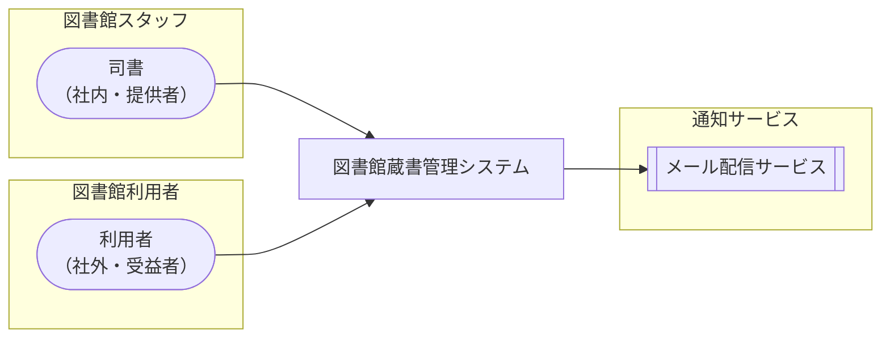

<!-- generateRdraMd.js による自動生成ファイル。手動編集しないこと。元データ: docs/rdra/latest/*.tsv -->

# システムコンテキスト

RDRA システム価値レイヤー。システムに関わるアクターと外部システムの全体像。

> 凡例: `(丸角)` アクター / `[四角]` システム / `[[二重枠]]` 外部システム

## アクター

| アクター群 | アクター | 役割 | 社内外 | 立場 | 主担当業務 |
|---|---|---|---|---|---|
| 図書館スタッフ | 司書 | 蔵書と利用者の情報を登録・編集・削除し、窓口で貸出・返却・予約取消を受け付ける。取置き・リマインド・督促の通知運用と、在庫状況・貸出統計レポートの参照による選書・運用改善を担う | 社内 | 提供者 | 蔵書を管理するフロー、利用者を管理するフロー、延滞を督促するフロー、在庫状況を把握するフロー、貸出統計を把握するフロー |
| 図書館利用者 | 利用者 | 書籍を検索して在庫状況を確認し、貸出中の書籍を予約する。窓口で貸出・返却を受け、自分の利用者情報・貸出内容・返却期限・貸出履歴・予約状況・取置き状況を Web 画面で照会し、取置き通知・リマインド・督促を受け取る | 社外 | 受益者 |  |

## 外部システム

| 外部システム群 | 外部システム | 役割 |
|---|---|---|
| 通知サービス | メール配信サービス | 取置き可能通知・返却期限リマインド・延滞督促のメールを利用者へ送信する外部のメール配信基盤 |
