<!-- generateRdraMd.js による自動生成ファイル。手動編集しないこと。元データ: docs/rdra/latest/*.tsv -->

# UC複合図

RDRA システム境界レイヤー。BUC ごとに、アクティビティ・UC・画面・イベント・
情報・条件・外部システムの関係を表す。

## 蔵書管理業務

### 蔵書を管理するフロー

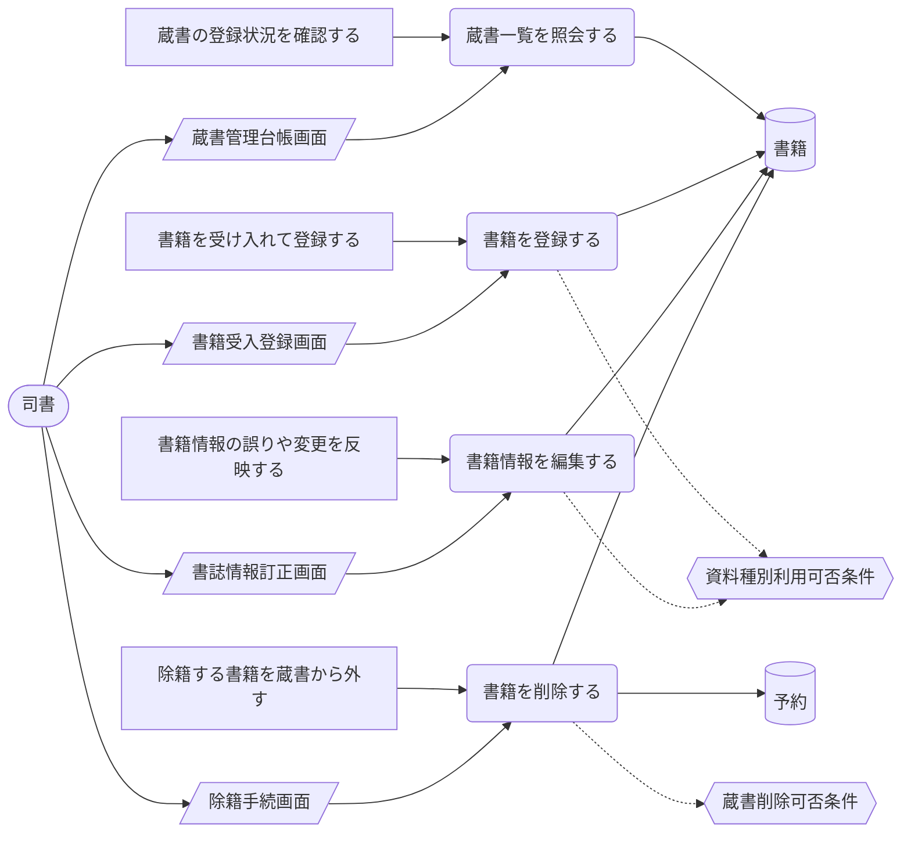

> 凡例: `(丸角)` アクター・UC / `[四角]` アクティビティ / `[/斜め/]` 画面 / `[(円柱)]` 情報 / `{{六角}}` 条件 / `>旗]` イベント / `[[二重枠]]` 外部システム。点線は条件参照。

| UC | アクティビティ | 画面 | 情報 | 条件 | イベント | 説明 |
|---|---|---|---|---|---|---|
| 蔵書一覧を照会する | 蔵書の登録状況を確認する | 蔵書管理台帳画面 | 書籍 |  |  | 登録済みの書籍をタイトル・著者・ISBN・出版社・ジャンル・資料種別とともに一覧表示し、一元管理されている蔵書の最新状態を確認する |
| 書籍を登録する | 書籍を受け入れて登録する | 書籍受入登録画面 | 書籍 | 資料種別利用可否条件 |  | 新規に受け入れた書籍のタイトル・著者・ISBN・出版社・ジャンル・資料種別を登録し、書籍状態を在庫ありとする。資料種別は初期リリースでは紙書籍のみ有効とする |
| 書籍情報を編集する | 書籍情報の誤りや変更を反映する | 書誌情報訂正画面 | 書籍 | 資料種別利用可否条件 |  | 登録済み書籍の書誌情報を修正し、システムが保持するデータを単一の正として維持する |
| 書籍を削除する | 除籍する書籍を蔵書から外す | 除籍手続画面 | 書籍、予約 | 蔵書削除可否条件 |  | 書籍を蔵書から削除する。書籍状態が貸出中・予約待ちの書籍は進行中の取引が追跡できなくなるため削除できない |

## 利用者管理業務

### 利用者を管理するフロー

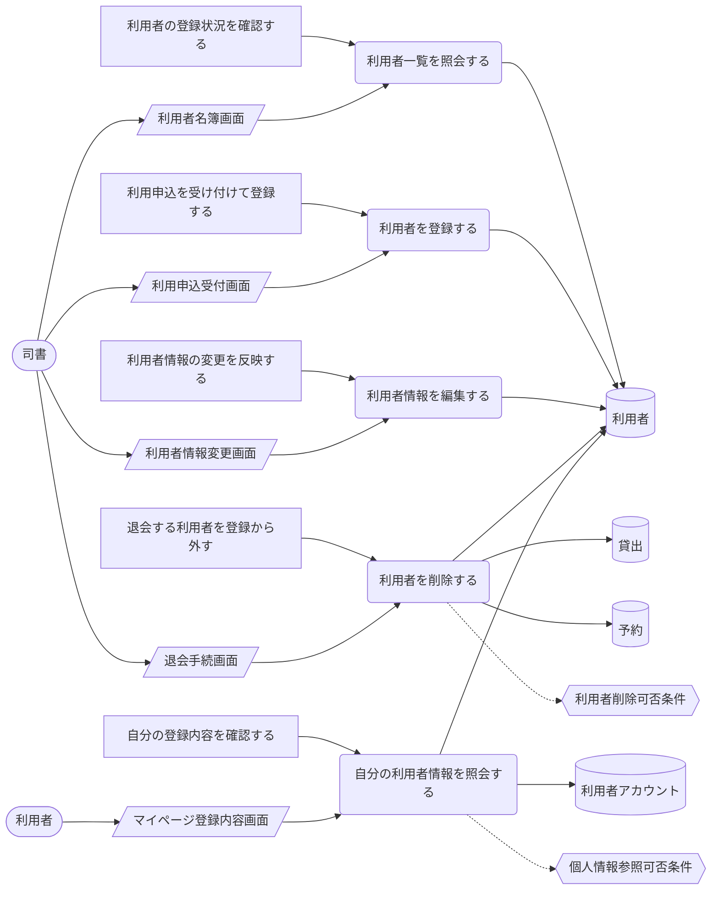

> 凡例: `(丸角)` アクター・UC / `[四角]` アクティビティ / `[/斜め/]` 画面 / `[(円柱)]` 情報 / `{{六角}}` 条件 / `>旗]` イベント / `[[二重枠]]` 外部システム。点線は条件参照。

| UC | アクティビティ | 画面 | 情報 | 条件 | イベント | 説明 |
|---|---|---|---|---|---|---|
| 利用者一覧を照会する | 利用者の登録状況を確認する | 利用者名簿画面 | 利用者 |  |  | 登録済み利用者を氏名・連絡先・利用者番号とともに一覧表示し、貸出責任者を特定できる状態を確認する |
| 利用者を登録する | 利用申込を受け付けて登録する | 利用申込受付画面 | 利用者 |  |  | 氏名・連絡先を登録し、利用者番号を採番して利用者を一意に識別できるようにする |
| 利用者情報を編集する | 利用者情報の変更を反映する | 利用者情報変更画面 | 利用者 |  |  | 氏名・連絡先の変更を反映し、督促・通知が確実に届く状態を維持する |
| 利用者を削除する | 退会する利用者を登録から外す | 退会手続画面 | 利用者、貸出、予約 | 利用者削除可否条件 |  | 利用者を削除する。貸出中の貸出や予約中の予約が残る利用者は削除できない |
| 自分の利用者情報を照会する | 自分の登録内容を確認する | マイページ登録内容画面 | 利用者、利用者アカウント | 個人情報参照可否条件 |  | 利用者が自分の氏名・連絡先・利用者番号を Web 画面で確認する。他の利用者の情報は参照できない |

## 蔵書利用業務

### 書籍を検索するフロー

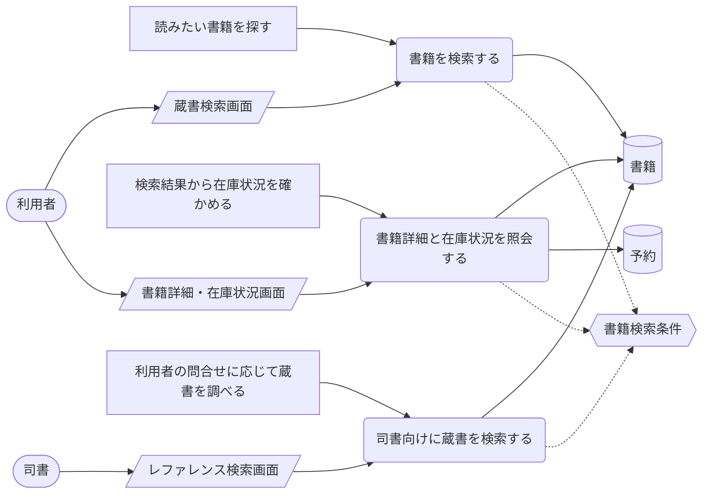

> 凡例: `(丸角)` アクター・UC / `[四角]` アクティビティ / `[/斜め/]` 画面 / `[(円柱)]` 情報 / `{{六角}}` 条件 / `>旗]` イベント / `[[二重枠]]` 外部システム。点線は条件参照。

| UC | アクティビティ | 画面 | 情報 | 条件 | イベント | 説明 |
|---|---|---|---|---|---|---|
| 書籍を検索する | 読みたい書籍を探す | 蔵書検索画面 | 書籍 | 書籍検索条件 |  | キーワード・タイトル・著者・ISBN・ジャンルを条件に蔵書を検索し、該当する書籍の一覧を得る |
| 書籍詳細と在庫状況を照会する | 検索結果から在庫状況を確かめる | 書籍詳細・在庫状況画面 | 書籍、予約 | 書籍検索条件 |  | 検索結果の書籍について書誌情報と書籍状態（在庫あり／貸出中／予約待ち）を表示し、来館前に貸出可否と予約要否を判断できるようにする |
| 司書向けに蔵書を検索する | 利用者の問合せに応じて蔵書を調べる | レファレンス検索画面 | 書籍 | 書籍検索条件 |  | 司書が利用者からの問合せに対し同一の検索条件で蔵書と在庫状況を調べ、案内する |

### 書籍を貸し出すフロー

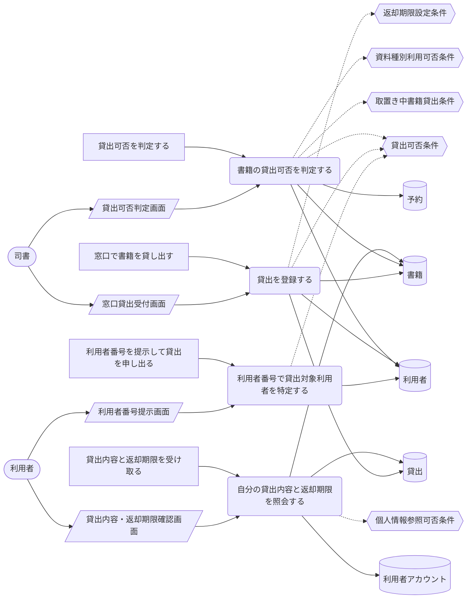

> 凡例: `(丸角)` アクター・UC / `[四角]` アクティビティ / `[/斜め/]` 画面 / `[(円柱)]` 情報 / `{{六角}}` 条件 / `>旗]` イベント / `[[二重枠]]` 外部システム。点線は条件参照。

| UC | アクティビティ | 画面 | 情報 | 条件 | イベント | 説明 |
|---|---|---|---|---|---|---|
| 自分の貸出内容と返却期限を照会する | 貸出内容と返却期限を受け取る | 貸出内容・返却期限確認画面 | 貸出、書籍、利用者アカウント | 個人情報参照可否条件 |  | 利用者が貸し出された書籍と自動設定された返却期限を Web 画面で確認する |
| 書籍の貸出可否を判定する | 貸出可否を判定する | 貸出可否判定画面 | 書籍、利用者、予約 | 貸出可否条件、取置き中書籍貸出条件、資料種別利用可否条件 |  | 書籍状態が在庫ありであることと利用者が登録済みであることを判定する。貸出中の書籍への貸出要求はエラーとして拒否する |
| 貸出を登録する | 窓口で書籍を貸し出す | 窓口貸出受付画面 | 貸出、書籍、利用者 | 貸出可否条件、返却期限設定条件 |  | 貸出記録を作成して貸出状態を貸出中とし、貸出日を起点とした標準貸出期間から返却期限を自動設定して書籍状態を貸出中へ遷移させる |
| 利用者番号で貸出対象利用者を特定する | 利用者番号を提示して貸出を申し出る | 利用者番号提示画面 | 利用者 | 貸出可否条件 |  | 提示された利用者番号から貸出責任者となる利用者を特定し、貸出記録の対象とする |

### 書籍を返却するフロー

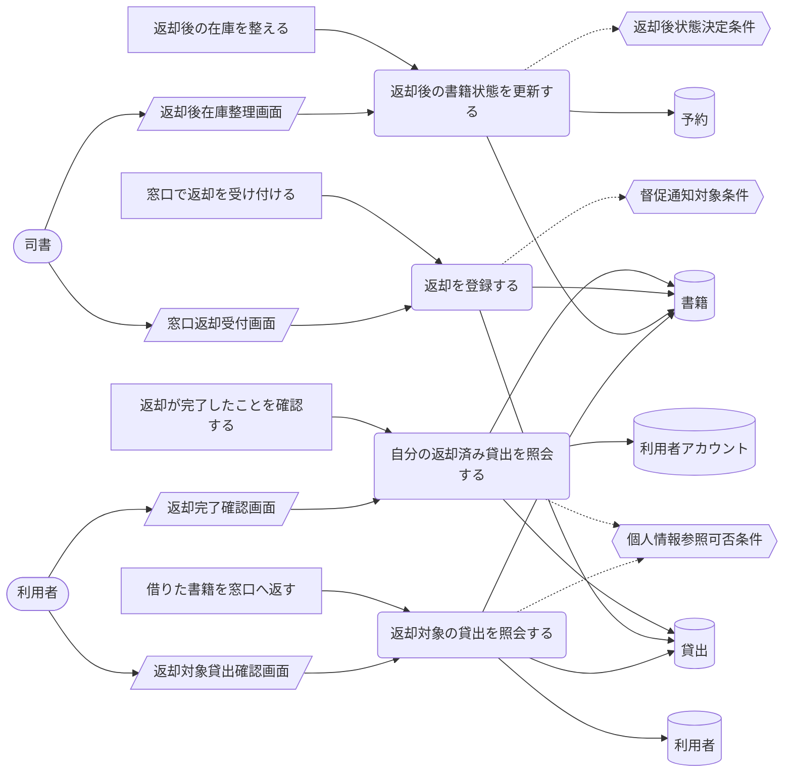

> 凡例: `(丸角)` アクター・UC / `[四角]` アクティビティ / `[/斜め/]` 画面 / `[(円柱)]` 情報 / `{{六角}}` 条件 / `>旗]` イベント / `[[二重枠]]` 外部システム。点線は条件参照。

| UC | アクティビティ | 画面 | 情報 | 条件 | イベント | 説明 |
|---|---|---|---|---|---|---|
| 自分の返却済み貸出を照会する | 返却が完了したことを確認する | 返却完了確認画面 | 貸出、書籍、利用者アカウント | 個人情報参照可否条件 |  | 利用者が返却日と返却済みとなった貸出記録を Web 画面で確認する |
| 返却を登録する | 窓口で返却を受け付ける | 窓口返却受付画面 | 貸出、書籍 | 督促通知対象条件 |  | 貸出記録の貸出状態を返却済みへ遷移させ返却日を記録する。延滞していた貸出は督促を停止する |
| 返却後の書籍状態を更新する | 返却後の在庫を整える | 返却後在庫整理画面 | 書籍、予約 | 返却後状態決定条件 |  | 返却された書籍に予約がなければ書籍状態を在庫ありへ、予約があれば予約待ちへ遷移させ、予約者の取置きを優先する |
| 返却対象の貸出を照会する | 借りた書籍を窓口へ返す | 返却対象貸出確認画面 | 貸出、書籍、利用者 | 個人情報参照可否条件 |  | 返却する書籍に対応する自分の貸出中の貸出記録を特定し、窓口での返却受付の対象とする |

## 予約管理業務

### 書籍を予約するフロー

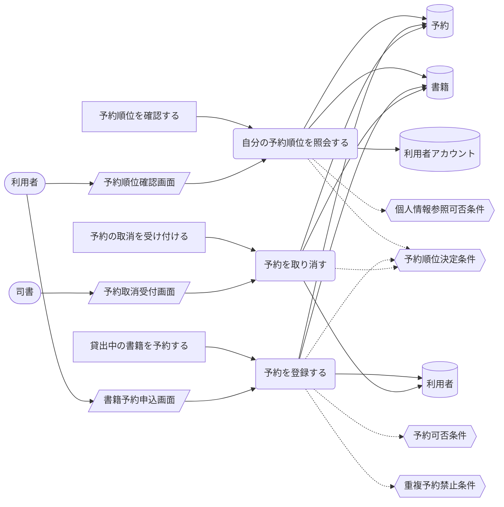

> 凡例: `(丸角)` アクター・UC / `[四角]` アクティビティ / `[/斜め/]` 画面 / `[(円柱)]` 情報 / `{{六角}}` 条件 / `>旗]` イベント / `[[二重枠]]` 外部システム。点線は条件参照。

| UC | アクティビティ | 画面 | 情報 | 条件 | イベント | 説明 |
|---|---|---|---|---|---|---|
| 自分の予約順位を照会する | 予約順位を確認する | 予約順位確認画面 | 予約、書籍、利用者アカウント | 個人情報参照可否条件、予約順位決定条件 |  | 利用者が申込順に付与された予約順位を Web 画面で確認し、貸出可能となる見込みを把握する |
| 予約を登録する | 貸出中の書籍を予約する | 書籍予約申込画面 | 予約、書籍、利用者 | 予約可否条件、重複予約禁止条件、予約順位決定条件 |  | 貸出中の書籍に対し予約を登録して予約状態を予約中とし、申込順に予約順位を付与する。在庫ありの書籍への予約と同一書籍への重複予約は受け付けない |
| 予約を取り消す | 予約の取消を受け付ける | 予約取消受付画面 | 予約、書籍、利用者 | 予約順位決定条件 |  | 利用者からの申し出により予約状態をキャンセルへ遷移させ、後続の予約順位を繰り上げる |

### 予約者へ通知するフロー

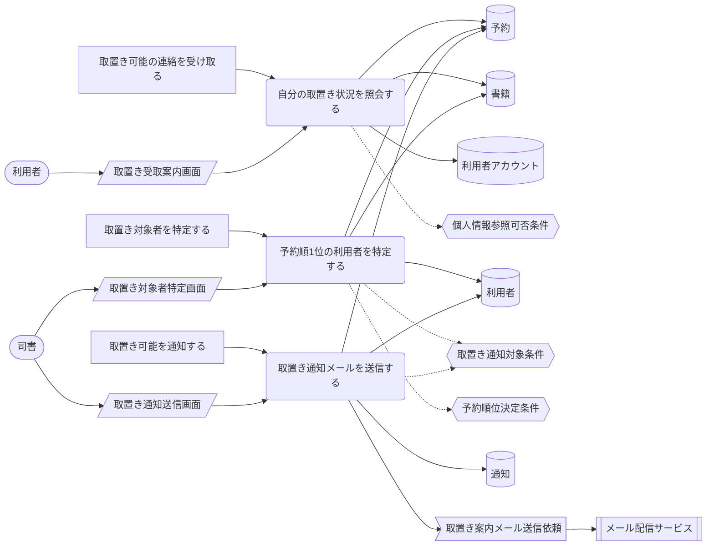

> 凡例: `(丸角)` アクター・UC / `[四角]` アクティビティ / `[/斜め/]` 画面 / `[(円柱)]` 情報 / `{{六角}}` 条件 / `>旗]` イベント / `[[二重枠]]` 外部システム。点線は条件参照。

| UC | アクティビティ | 画面 | 情報 | 条件 | イベント | 説明 |
|---|---|---|---|---|---|---|
| 自分の取置き状況を照会する | 取置き可能の連絡を受け取る | 取置き受取案内画面 | 予約、書籍、利用者アカウント | 個人情報参照可否条件 |  | 利用者が取置き可能となった書籍と取置き中の予約を Web 画面で確認し、来館して貸出を受ける準備をする |
| 予約順1位の利用者を特定する | 取置き対象者を特定する | 取置き対象者特定画面 | 予約、書籍、利用者 | 取置き通知対象条件、予約順位決定条件 |  | 予約のある書籍が返却された際に、予約中の予約のうち予約順1位の利用者を取置き対象として特定する |
| 取置き通知メールを送信する | 取置き可能を通知する | 取置き通知送信画面 | 通知、予約、利用者 | 取置き通知対象条件 | 取置き案内メール送信依頼 | メール配信サービスと連携して取置き可能となった旨を予約順1位の利用者へ自動送信し、予約状態を取置き中へ遷移させる |

## 貸出期限管理業務

### 返却期限をリマインドするフロー

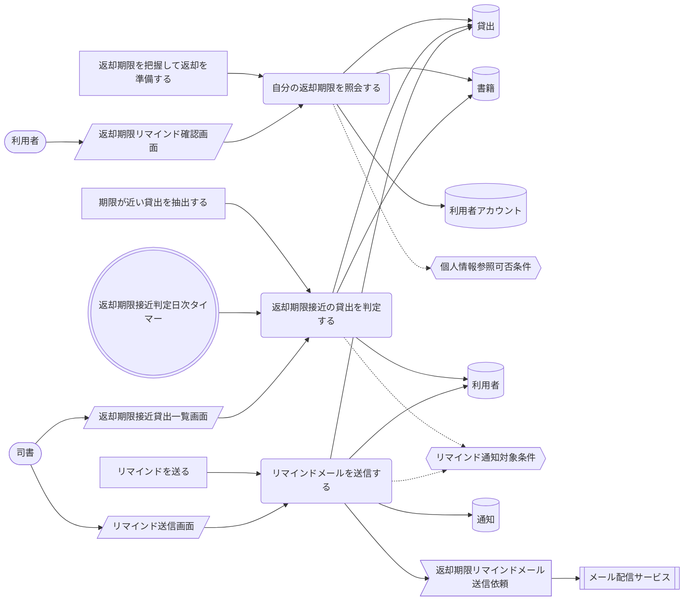

> 凡例: `(丸角)` アクター・UC / `[四角]` アクティビティ / `[/斜め/]` 画面 / `[(円柱)]` 情報 / `{{六角}}` 条件 / `>旗]` イベント / `[[二重枠]]` 外部システム。点線は条件参照。

| UC | アクティビティ | 画面 | 情報 | 条件 | イベント | 説明 |
|---|---|---|---|---|---|---|
| 自分の返却期限を照会する | 返却期限を把握して返却を準備する | 返却期限リマインド確認画面 | 貸出、書籍、利用者アカウント | 個人情報参照可否条件 |  | 利用者がリマインドを受けて返却期限が近づいた貸出を Web 画面で確認し、返却の準備をする |
| 返却期限接近の貸出を判定する | 期限が近い貸出を抽出する | 返却期限接近貸出一覧画面 | 貸出、利用者、書籍 | リマインド通知対象条件 |  | 定期実行のタイマーにより返却期限が近づいた貸出中の貸出を抽出する。返却済みの貸出は対象外とする |
| リマインドメールを送信する | リマインドを送る | リマインド送信画面 | 通知、貸出、利用者 | リマインド通知対象条件 | 返却期限リマインドメール送信依頼 | メール配信サービスと連携して対象利用者へ返却期限のリマインドメールを自動送信する |

### 延滞を督促するフロー

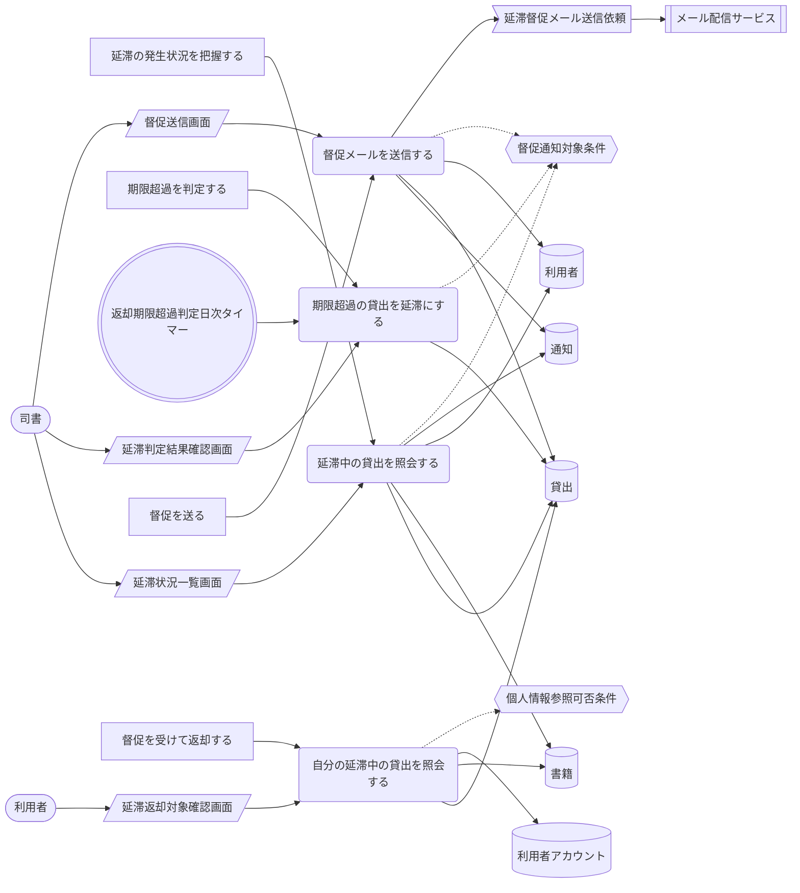

> 凡例: `(丸角)` アクター・UC / `[四角]` アクティビティ / `[/斜め/]` 画面 / `[(円柱)]` 情報 / `{{六角}}` 条件 / `>旗]` イベント / `[[二重枠]]` 外部システム。点線は条件参照。

| UC | アクティビティ | 画面 | 情報 | 条件 | イベント | 説明 |
|---|---|---|---|---|---|---|
| 延滞中の貸出を照会する | 延滞の発生状況を把握する | 延滞状況一覧画面 | 貸出、書籍、利用者、通知 | 督促通知対象条件 |  | 司書が貸出状態が延滞の貸出を一覧で確認し、督促の実施状況と未返却の書籍を把握する |
| 期限超過の貸出を延滞にする | 期限超過を判定する | 延滞判定結果確認画面 | 貸出 | 督促通知対象条件 |  | 定期実行のタイマーにより返却期限を超過した貸出を抽出し、貸出状態を延滞へ遷移させる |
| 督促メールを送信する | 督促を送る | 督促送信画面 | 通知、貸出、利用者 | 督促通知対象条件 | 延滞督促メール送信依頼 | メール配信サービスと連携して延滞の貸出の対象利用者へ督促メールを自動送信する。返却により督促は停止する |
| 自分の延滞中の貸出を照会する | 督促を受けて返却する | 延滞返却対象確認画面 | 貸出、書籍、利用者アカウント | 個人情報参照可否条件 |  | 利用者が督促対象となった自分の延滞中の貸出と超過日数を Web 画面で確認し、返却の対象を特定する |

## 利用照会業務

### 貸出履歴を確認するフロー

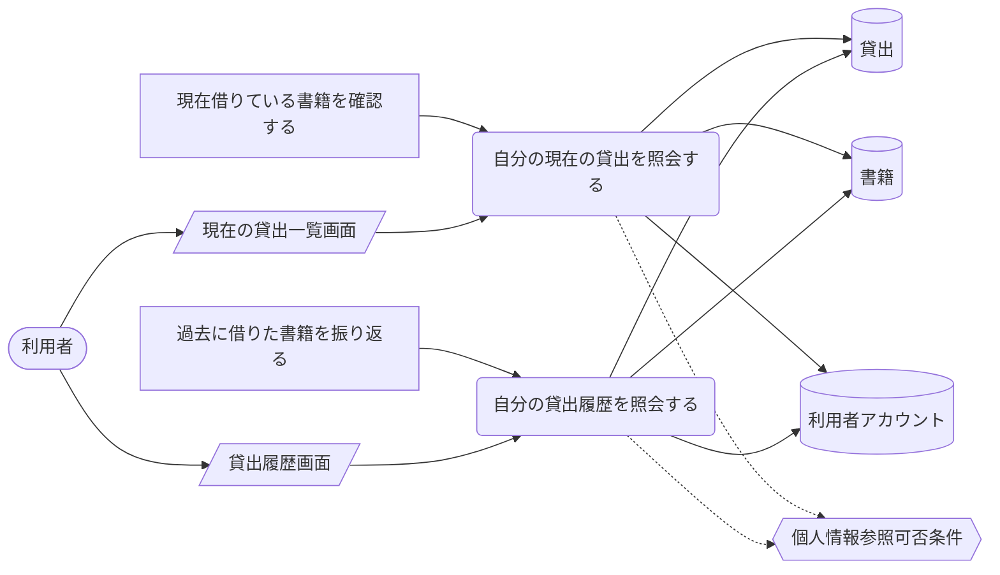

> 凡例: `(丸角)` アクター・UC / `[四角]` アクティビティ / `[/斜め/]` 画面 / `[(円柱)]` 情報 / `{{六角}}` 条件 / `>旗]` イベント / `[[二重枠]]` 外部システム。点線は条件参照。

| UC | アクティビティ | 画面 | 情報 | 条件 | イベント | 説明 |
|---|---|---|---|---|---|---|
| 自分の現在の貸出を照会する | 現在借りている書籍を確認する | 現在の貸出一覧画面 | 貸出、書籍、利用者アカウント | 個人情報参照可否条件 |  | 利用者が貸出中・延滞の貸出と各貸出の返却期限を Web 画面で確認する。他の利用者の貸出は参照できない |
| 自分の貸出履歴を照会する | 過去に借りた書籍を振り返る | 貸出履歴画面 | 貸出、書籍、利用者アカウント | 個人情報参照可否条件 |  | 利用者が返却済みの貸出を貸出日・返却日とともに Web 画面で確認する。参照範囲は自分の貸出に限定される |

### 予約状況を確認するフロー

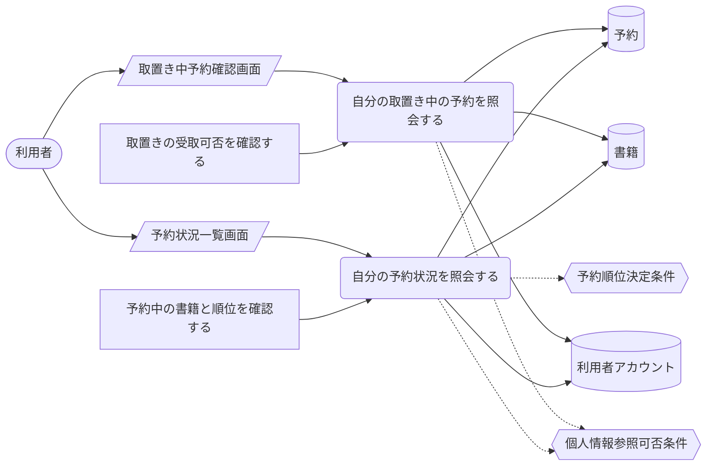

> 凡例: `(丸角)` アクター・UC / `[四角]` アクティビティ / `[/斜め/]` 画面 / `[(円柱)]` 情報 / `{{六角}}` 条件 / `>旗]` イベント / `[[二重枠]]` 外部システム。点線は条件参照。

| UC | アクティビティ | 画面 | 情報 | 条件 | イベント | 説明 |
|---|---|---|---|---|---|---|
| 自分の予約状況を照会する | 予約中の書籍と順位を確認する | 予約状況一覧画面 | 予約、書籍、利用者アカウント | 個人情報参照可否条件、予約順位決定条件 |  | 利用者が予約中の書籍と予約順位を Web 画面で確認する。他の利用者の予約は参照できない |
| 自分の取置き中の予約を照会する | 取置きの受取可否を確認する | 取置き中予約確認画面 | 予約、書籍、利用者アカウント | 個人情報参照可否条件 |  | 利用者が取置き中の予約と受取可能な書籍を Web 画面で確認し、来館の要否を判断する |

## 蔵書分析業務

### 在庫状況を把握するフロー

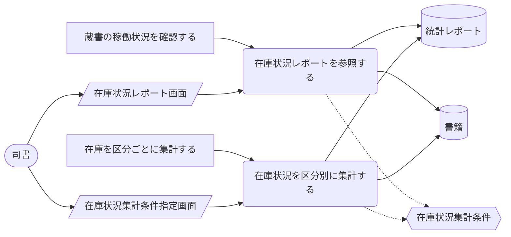

> 凡例: `(丸角)` アクター・UC / `[四角]` アクティビティ / `[/斜め/]` 画面 / `[(円柱)]` 情報 / `{{六角}}` 条件 / `>旗]` イベント / `[[二重枠]]` 外部システム。点線は条件参照。

| UC | アクティビティ | 画面 | 情報 | 条件 | イベント | 説明 |
|---|---|---|---|---|---|---|
| 在庫状況レポートを参照する | 蔵書の稼働状況を確認する | 在庫状況レポート画面 | 統計レポート、書籍 | 在庫状況集計条件 |  | 司書が書籍状態の区分ごとの件数と該当書籍一覧をレポートとして参照し、蔵書の稼働状況を把握する |
| 在庫状況を区分別に集計する | 在庫を区分ごとに集計する | 在庫状況集計条件指定画面 | 統計レポート、書籍 | 在庫状況集計条件 |  | 書籍状態（貸出中・在庫あり・予約待ち）ごとに蔵書を集計し、区分別件数と書籍一覧のレポートを作成する |

### 貸出統計を把握するフロー

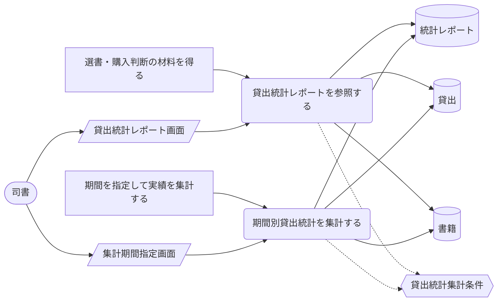

> 凡例: `(丸角)` アクター・UC / `[四角]` アクティビティ / `[/斜め/]` 画面 / `[(円柱)]` 情報 / `{{六角}}` 条件 / `>旗]` イベント / `[[二重枠]]` 外部システム。点線は条件参照。

| UC | アクティビティ | 画面 | 情報 | 条件 | イベント | 説明 |
|---|---|---|---|---|---|---|
| 貸出統計レポートを参照する | 選書・購入判断の材料を得る | 貸出統計レポート画面 | 統計レポート、貸出、書籍 | 貸出統計集計条件 |  | 司書が指定期間の貸出件数と人気書籍ランキングをレポートとして参照し、選書・購入判断や運用改善に活かす |
| 期間別貸出統計を集計する | 期間を指定して実績を集計する | 集計期間指定画面 | 統計レポート、貸出、書籍 | 貸出統計集計条件 |  | 指定された集計期間区分で貸出件数と書籍別貸出回数のランキングを集計する。実績のない期間は実績なしとして案内する |
