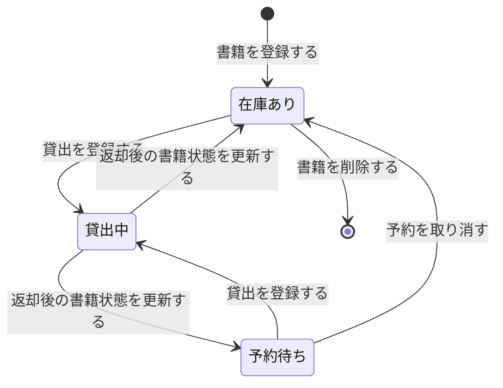
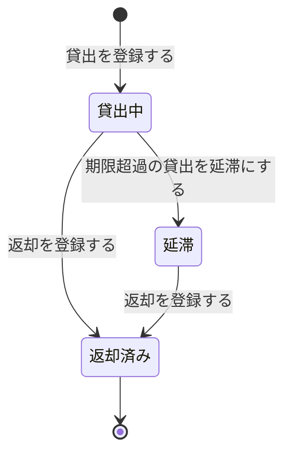
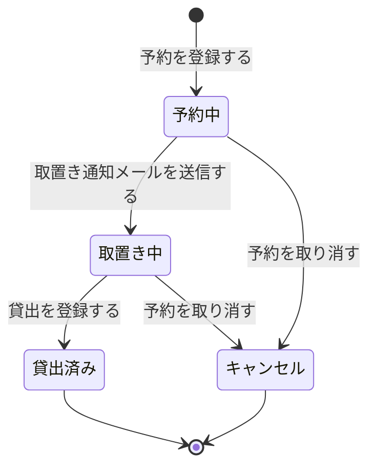
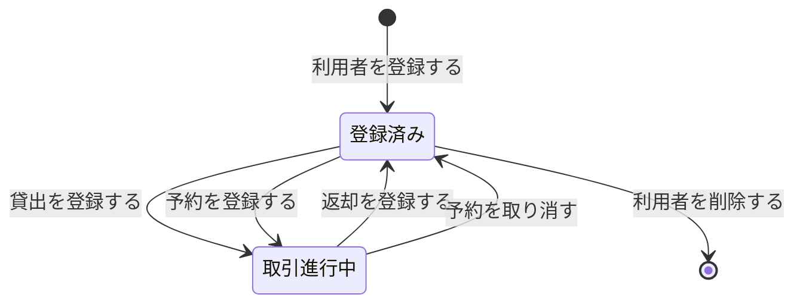
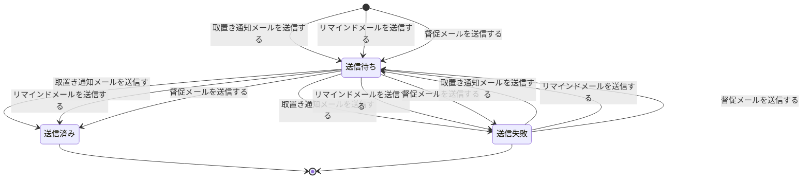
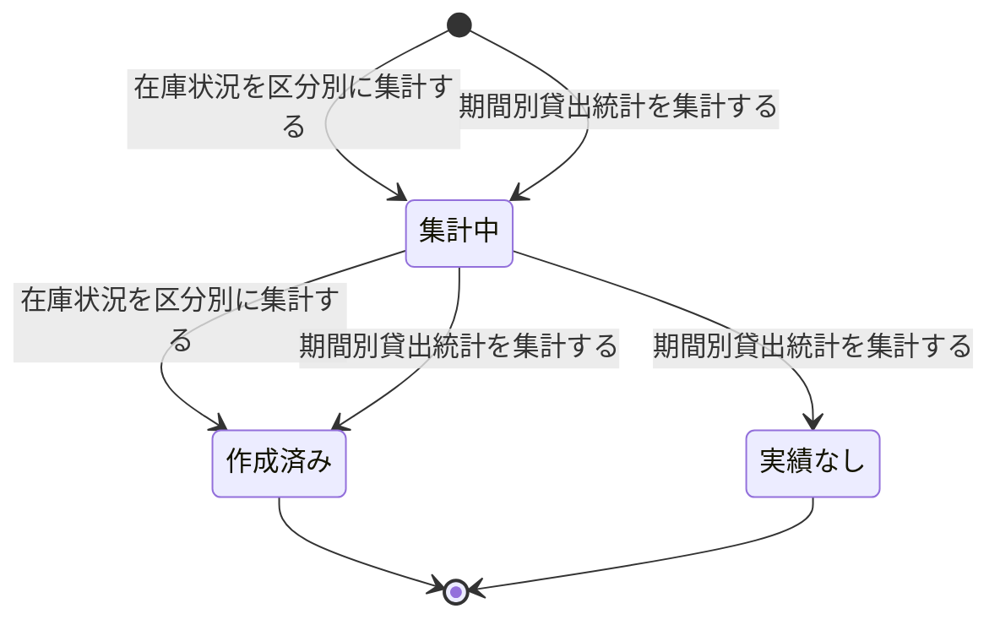

<!-- generateRdraMd.js による自動生成ファイル。手動編集しないこと。元データ: docs/rdra/latest/*.tsv -->

# 状態モデル

RDRA システム内部レイヤー。状態モデルごとの状態遷移。遷移ラベルは UC。

## 書籍状態（蔵書管理）

| 状態 | 遷移UC | 遷移先状態 | 説明 |
|---|---|---|---|
|  | 書籍を登録する | 在庫あり | 蔵書1冊ごとの在庫状況を管理し、貸出可否判定・検索結果の在庫表示・在庫状況レポートの区分集計に使う。司書が書籍を登録すると在庫ありで開始する |
| 在庫あり | 貸出を登録する | 貸出中 | 在庫ありの書籍を利用者へ貸し出すと貸出中へ遷移する。貸出可否判定ポリシーにより在庫ありの書籍のみ貸出できる |
| 貸出中 | 返却後の書籍状態を更新する | 在庫あり | 貸出中の書籍が返却され、予約が存在しない場合は在庫ありへ戻る |
| 貸出中 | 返却後の書籍状態を更新する | 予約待ち | 貸出中の書籍が返却され、予約が存在する場合は返却時取置き優先ポリシーにより予約待ちへ遷移し、予約順1位の利用者のために取り置く |
| 予約待ち | 貸出を登録する | 貸出中 | 取り置かれた書籍を予約順1位の利用者へ貸し出すと貸出中へ遷移する |
| 予約待ち | 予約を取り消す | 在庫あり | 取置き期限切れや予約取消により有効な予約がなくなると在庫ありへ戻り、一般の貸出対象となる |
| 在庫あり | 書籍を削除する |  | 蔵書削除制限ポリシーにより、貸出中・予約待ちでない在庫ありの書籍のみ削除でき、蔵書から除かれる |

## 貸出状態（貸出管理）

| 状態 | 遷移UC | 遷移先状態 | 説明 |
|---|---|---|---|
|  | 貸出を登録する | 貸出中 | 貸出記録1件の進行状況を管理し、返却期限の超過判定・督促の要否・貸出履歴の現在／過去の区別に使う。司書が貸出を受け付けると貸出中で開始し、貸出期間ポリシーにより返却期限が自動設定される |
| 貸出中 | 期限超過の貸出を延滞にする | 延滞 | 返却期限を超過した貸出は延滞督促ポリシーにより延滞へ遷移し、督促メールの送信対象となる |
| 貸出中 | 返却を登録する | 返却済み | 返却期限内に司書が返却を受け付けると返却済みへ遷移し、返却日を記録する |
| 延滞 | 返却を登録する | 返却済み | 延滞中の書籍が返却されると返却済みへ遷移し、督促が停止する |
| 返却済み |  |  | 返却済みの貸出は進行中の取引ではなくなり、過去の貸出履歴と貸出統計の集計対象として保持される |

## 予約状態（予約管理）

| 状態 | 遷移UC | 遷移先状態 | 説明 |
|---|---|---|---|
|  | 予約を登録する | 予約中 | 利用者ごとの予約1件の進行状況を管理し、予約順位の対象判定・取置き通知の送信・予約状況照会の表示に使う。在庫あり書籍予約不可ポリシーと重複予約禁止ポリシーを満たす予約申込で予約中となり、申込順に順位付けされる |
| 予約中 | 取置き通知メールを送信する | 取置き中 | 予約対象の書籍が返却され、予約順位ポリシーにより予約順1位となった利用者へ取置き可能の通知を送ると取置き中へ遷移する |
| 予約中 | 予約を取り消す | キャンセル | 利用者が予約を取り消すとキャンセルへ遷移し、以降の予約順位の対象から外れる |
| 取置き中 | 貸出を登録する | 貸出済み | 取り置かれた書籍を該当利用者へ貸し出すと貸出済みへ遷移し、予約が成立して完了する |
| 取置き中 | 予約を取り消す | キャンセル | 取置き期限を過ぎても来館がない場合や利用者が取り消した場合はキャンセルへ遷移し、次順位者への取置きへ引き継がれる |
| 貸出済み |  |  | 貸出済みの予約は目的を果たして終了し、予約状況照会の対象から外れる |
| キャンセル |  |  | キャンセルされた予約は無効となり終了する |

## 利用者状態（利用者管理）

| 状態 | 遷移UC | 遷移先状態 | 説明 |
|---|---|---|---|
|  | 利用者を登録する | 登録済み | 利用者登録ポリシーにより貸出・予約は登録済み利用者に限定するため、利用者の登録有無と進行中取引の有無を管理する。司書が氏名・連絡先を登録し利用者番号を採番すると登録済みで開始する |
| 登録済み | 貸出を登録する | 取引進行中 | 登録済み利用者に貸出または予約が発生すると取引進行中へ遷移し、蔵書削除制限ポリシーにより削除できなくなる |
| 登録済み | 予約を登録する | 取引進行中 | 登録済み利用者に貸出または予約が発生すると取引進行中へ遷移し、蔵書削除制限ポリシーにより削除できなくなる |
| 取引進行中 | 返却を登録する | 登録済み | 貸出の返却と予約の完了・取消により進行中の取引がなくなると登録済みへ戻る |
| 取引進行中 | 予約を取り消す | 登録済み | 貸出の返却と予約の完了・取消により進行中の取引がなくなると登録済みへ戻る |
| 登録済み | 利用者を削除する |  | 蔵書削除制限ポリシーにより、貸出中・予約中のない登録済み利用者のみ削除でき、利用者情報が除かれる |

## 通知状態（通知管理）

| 状態 | 遷移UC | 遷移先状態 | 説明 |
|---|---|---|---|
|  | 取置き通知メールを送信する | 送信待ち | メール通知ポリシーにより取置き・返却期限リマインド・督促の連絡を自動送信するため、通知1件の送信進行を管理し重複送信防止と送信実績の追跡に使う。通知条件の成立で送信待ちとして作成される |
|  | リマインドメールを送信する | 送信待ち | メール通知ポリシーにより取置き・返却期限リマインド・督促の連絡を自動送信するため、通知1件の送信進行を管理し重複送信防止と送信実績の追跡に使う。通知条件の成立で送信待ちとして作成される |
|  | 督促メールを送信する | 送信待ち | メール通知ポリシーにより取置き・返却期限リマインド・督促の連絡を自動送信するため、通知1件の送信進行を管理し重複送信防止と送信実績の追跡に使う。通知条件の成立で送信待ちとして作成される |
| 送信待ち | 取置き通知メールを送信する | 送信済み | メール配信サービスへの送信が成功すると送信済みへ遷移し、同一対象への重複送信を抑止する |
| 送信待ち | リマインドメールを送信する | 送信済み | メール配信サービスへの送信が成功すると送信済みへ遷移し、同一対象への重複送信を抑止する |
| 送信待ち | 督促メールを送信する | 送信済み | メール配信サービスへの送信が成功すると送信済みへ遷移し、同一対象への重複送信を抑止する |
| 送信待ち | 取置き通知メールを送信する | 送信失敗 | メール配信サービスとの連携に失敗すると送信失敗へ遷移し、未達として司書が追跡できるようにする |
| 送信待ち | リマインドメールを送信する | 送信失敗 | メール配信サービスとの連携に失敗すると送信失敗へ遷移し、未達として司書が追跡できるようにする |
| 送信待ち | 督促メールを送信する | 送信失敗 | メール配信サービスとの連携に失敗すると送信失敗へ遷移し、未達として司書が追跡できるようにする |
| 送信失敗 | 取置き通知メールを送信する | 送信待ち | 失敗した通知を再送対象として送信待ちへ戻し、利用者への連絡到達を確保する |
| 送信失敗 | リマインドメールを送信する | 送信待ち | 失敗した通知を再送対象として送信待ちへ戻し、利用者への連絡到達を確保する |
| 送信失敗 | 督促メールを送信する | 送信待ち | 失敗した通知を再送対象として送信待ちへ戻し、利用者への連絡到達を確保する |
| 送信済み |  |  | 送信済みの通知は送信実績として記録され完了する |
| 送信失敗 |  |  | 再送を打ち切った通知は未達のまま記録して終了する |

## 統計レポート状態（分析管理）

| 状態 | 遷移UC | 遷移先状態 | 説明 |
|---|---|---|---|
|  | 在庫状況を区分別に集計する | 集計中 | 蔵書稼働可視化ポリシーにより在庫状況・人気書籍ランキング・期間別貸出統計を司書向けレポートとして提供するため、レポート1件の作成進行を管理する。司書が集計条件を指定すると集計中で開始する |
|  | 期間別貸出統計を集計する | 集計中 | 蔵書稼働可視化ポリシーにより在庫状況・人気書籍ランキング・期間別貸出統計を司書向けレポートとして提供するため、レポート1件の作成進行を管理する。司書が集計条件を指定すると集計中で開始する |
| 集計中 | 在庫状況を区分別に集計する | 作成済み | 対象期間に実績がある場合は集計が完了し、件数・ランキング・書籍一覧を含む作成済みのレポートとなる |
| 集計中 | 期間別貸出統計を集計する | 作成済み | 対象期間に実績がある場合は集計が完了し、件数・ランキング・書籍一覧を含む作成済みのレポートとなる |
| 集計中 | 期間別貸出統計を集計する | 実績なし | 対象期間に貸出実績がない場合は実績なしとなり、司書へ実績なしとして案内される |
| 作成済み |  |  | 作成済みのレポートは司書の選書・購入判断や運用改善に参照されて完了する |
| 実績なし |  |  | 実績なしのレポートは集計対象がないまま終了する |
