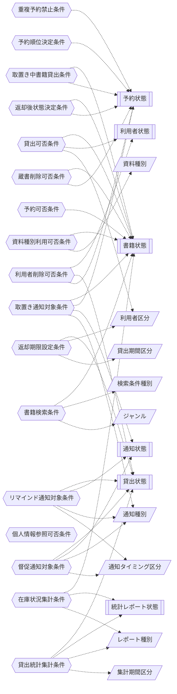

<!-- generateRdraMd.js による自動生成ファイル。手動編集しないこと。元データ: docs/rdra/latest/*.tsv -->

# 条件・バリエーション

RDRA システム内部レイヤー。判断条件（ビジネスルール）と区分・種別の一覧。

## 条件（ビジネスルール）

> 凡例: `{{六角}}` 条件 / `[[二重枠]]` 状態モデル / `[/斜め/]` バリエーション

| コンテキスト | 条件 | 条件の説明 | バリエーション | 状態モデル |
|---|---|---|---|---|
| 貸出管理 | 貸出可否条件 | 書籍状態が「在庫あり」であり、かつ貸出先が登録済みで利用者状態区分が「利用可能」の利用者であるときに限り貸出を許可する。書籍状態が「貸出中」「予約待ち」の場合は貸出を拒否しエラーを表示する | 利用者区分 | 書籍状態、利用者状態 |
| 予約管理 | 取置き中書籍貸出条件 | 予約状態が「取置き中」の書籍は、取置き対象である予約順1位の利用者に対してのみ貸出を許可する。それ以外の利用者への貸出は拒否する |  | 書籍状態、予約状態 |
| 予約管理 | 予約可否条件 | 書籍状態が「貸出中」の書籍に対してのみ予約を受け付ける。書籍状態が「在庫あり」の書籍への予約申込は、予約せずに貸出できる旨を案内して受け付けない |  | 書籍状態 |
| 予約管理 | 重複予約禁止条件 | 同一利用者が同一書籍に対して予約状態が「予約中」または「取置き中」の予約を既に持つ場合、再度の予約申込を受け付けない |  | 予約状態 |
| 予約管理 | 予約順位決定条件 | 同一書籍への予約は申込日時の昇順で順位を付与する。予約状態が「貸出済み」「キャンセル」になった予約は順位の対象から除外し、後続の予約を繰り上げる |  | 予約状態 |
| 蔵書管理 | 返却後状態決定条件 | 返却受付時に対象書籍への有効な予約（予約状態が「予約中」）が存在する場合は書籍状態を「予約待ち」とし、存在しない場合は「在庫あり」とする |  | 書籍状態、予約状態 |
| 通知管理 | 取置き通知対象条件 | 書籍状態が「予約待ち」となった書籍について、予約順1位かつ予約状態が「予約中」の予約1件を取置き通知の対象とする。通知送信後は当該予約の予約状態を「取置き中」に更新する | 通知種別 | 書籍状態、予約状態、通知状態 |
| 貸出管理 | 返却期限設定条件 | 貸出記録の作成時に、貸出日を起点として利用者区分に対応する貸出期間区分の日数を加算した日を返却期限として自動設定する | 利用者区分、貸出期間区分 | 貸出状態 |
| 通知管理 | リマインド通知対象条件 | 貸出状態が「貸出中」であり、かつ返却期限までの残日数が通知タイミング区分で定めたリマインド基準日数以内の貸出を通知対象とする。貸出状態が「返却済み」の貸出は対象外とする | 通知種別、通知タイミング区分 | 貸出状態、通知状態 |
| 通知管理 | 督促通知対象条件 | 貸出状態が「貸出中」または「延滞」であり、かつ返却期限を経過した貸出を督促対象とする。督促時に貸出状態を「延滞」へ遷移させ、貸出状態が「返却済み」になった時点で督促を停止する | 通知種別、通知タイミング区分 | 貸出状態、通知状態 |
| 蔵書管理 | 蔵書削除可否条件 | 対象書籍の書籍状態が「在庫あり」であり、かつ予約状態が「予約中」「取置き中」の予約が存在しない場合に限り削除を許可する |  | 書籍状態、予約状態 |
| 利用者管理 | 利用者削除可否条件 | 対象利用者に貸出状態が「貸出中」「延滞」の貸出、および予約状態が「予約中」「取置き中」の予約が存在しない場合に限り削除を許可する |  | 利用者状態、貸出状態、予約状態 |
| 蔵書管理 | 書籍検索条件 | 検索条件種別（キーワード／タイトル／著者／ISBN／ジャンル）のいずれかで蔵書を検索し、一致した書籍について書籍状態に基づく在庫状況区分（在庫あり／貸出中／予約待ち）を併せて表示する | 検索条件種別、ジャンル | 書籍状態 |
| 利用者管理 | 個人情報参照可否条件 | 貸出履歴・予約状況の照会は、ログイン中の利用者本人に紐づく貸出・予約のみを対象とする。他の利用者の貸出・予約は表示しない |  |  |
| 分析管理 | 在庫状況集計条件 | 蔵書全件を書籍状態（在庫あり／貸出中／予約待ち）で区分し、区分ごとの件数と書籍一覧を集計する | レポート種別 | 書籍状態、統計レポート状態 |
| 分析管理 | 貸出統計集計条件 | 指定された集計期間区分と期間に含まれる貸出記録を対象に貸出件数と書籍別貸出回数を集計する。対象期間に貸出実績が存在しない場合は実績なしとして扱う | レポート種別、集計期間区分 | 貸出状態、統計レポート状態 |
| 蔵書管理 | 資料種別利用可否条件 | 資料種別が「紙書籍」の蔵書のみ初期リリースで登録・貸出の対象とする。資料種別が「電子書籍」を指定した場合は未対応である旨を案内し登録しない | 資料種別 | 書籍状態 |

## バリエーション

| コンテキスト | バリエーション | 値 | 説明 |
|---|---|---|---|
| 蔵書管理 | 資料種別 | 紙書籍、電子書籍 | 蔵書の資料の種類を表す区分。初期リリースでは紙書籍のみを有効とし、電子書籍は未対応として案内する。将来の電子書籍対応時に情報モデルを作り直さないための拡張点として使う |
| 蔵書管理 | ジャンル | 文学、人文、社会科学、自然科学、技術、芸術、児童、その他 | 書籍を内容分野で分類する区分。書籍登録時の必須項目であり、利用者と司書がジャンル指定で蔵書を絞り込むための検索軸として使う |
| 蔵書管理 | 検索条件種別 | キーワード、タイトル、著者、ISBN、ジャンル | 書籍検索の条件の種類を表す区分。利用者と司書が目的に応じた探し方を選択できるようにするために使う |
| 利用者管理 | 利用者区分 | 一般、学生、団体 | 利用者の属性を表す区分。貸出可能冊数や貸出期間などの利用条件を区分ごとに設定するために使う |
| 貸出管理 | 貸出期間区分 | 標準、短期、長期 | 貸出日から返却期限までの日数を決める区分。貸出期間ポリシーに基づき返却期限を自動設定する際の適用単位として使う |
| 通知管理 | 通知種別 | 取置き案内、返却期限リマインド、延滞督促 | 利用者へ送るメールの種類を表す区分。送信の契機（予約書籍の返却時、期限接近時、期限超過時）と文面を業務上使い分けるために使う |
| 通知管理 | 通知タイミング区分 | 期限前リマインド、期限当日、期限超過督促 | 通知を送る時点を表す区分。リマインドを返却期限の何日前に送るか、督促を期限超過後のどの時点で送るかという通知対象条件の判定基準として使う |
| 分析管理 | レポート種別 | 在庫状況、人気書籍ランキング、期間別貸出統計 | 司書が参照するレポートの種類を表す区分。選書・購入判断や運用改善という目的別にレポートを出し分けるために使う |
| 分析管理 | 集計期間区分 | 日次、月次、年次 | 貸出統計を集計する期間の単位を表す区分。期間別の貸出実績と人気書籍ランキングを同一の粒度で比較可能にするために使う |
