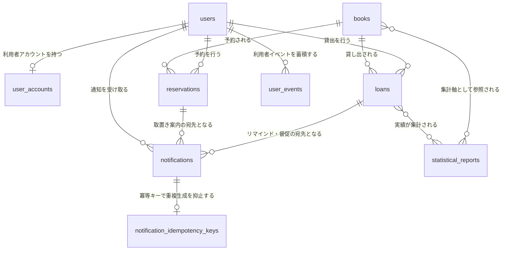
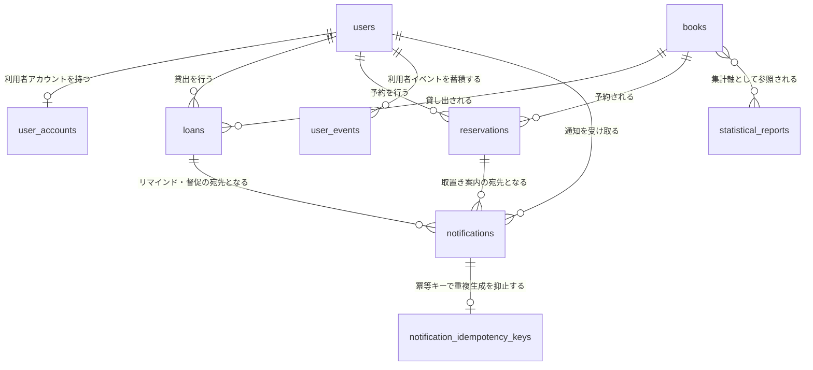
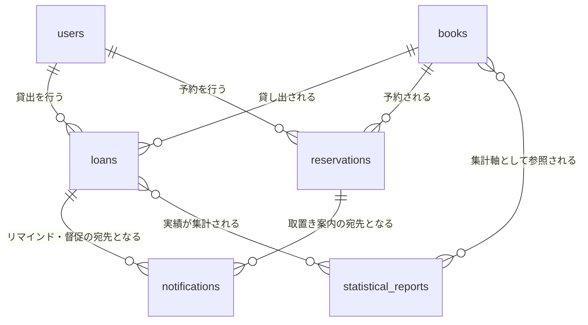
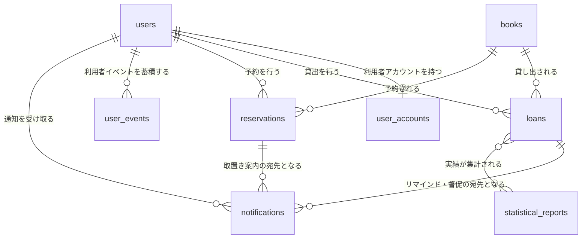
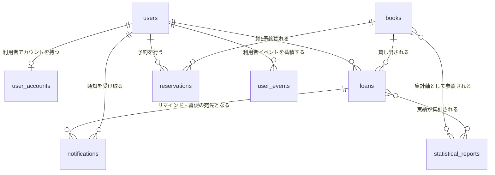
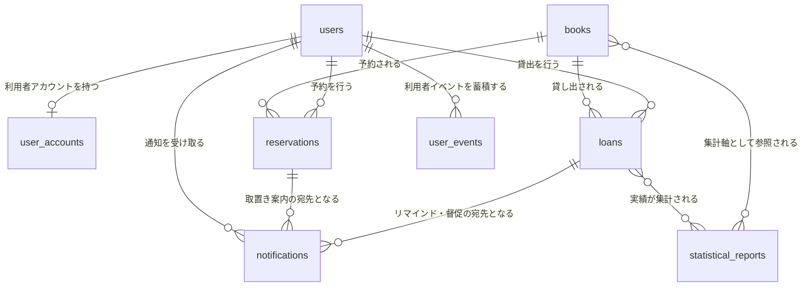
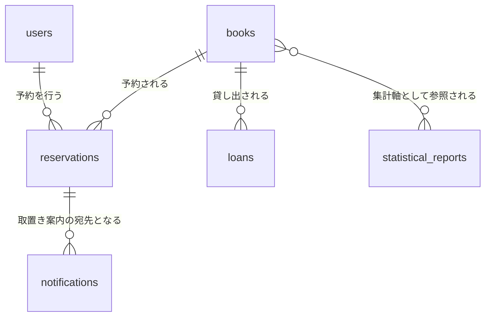

# データストアスキーマ

## サマリー

| データストア | 項目数 |
|------------|:------:|
| RDB テーブル | 9 |
| RDB インデックス | 29 |
| RDB 外部キー | 6 |
| KVS キーパターン | 7 |

## RDB

### ER 図

#### 全体

#### 予約管理業務

#### 利用照会業務

#### 利用者管理業務

#### 蔵書分析業務

#### 蔵書利用業務

#### 蔵書管理業務

#### 貸出期限管理業務

### テーブル一覧

| テーブル名 | RDRA 情報 | 説明 | カラム数 | インデックス数 | 利用 UC 数 |
|-----------|----------|------|:-------:|:----------:|:--------:|
| books | 書籍 | 図書館が所蔵する蔵書の1冊を表すスナップショットテーブル。arch E-001（model_type: event_snapshot）に対応する。書籍ID・書誌情報（タイトル/著者/ISBN/出版社/ジャンル/資料種別）と在庫を表す書籍状態を保持し、蔵書管理・検索・貸出可否判定・在庫状況レポートの集計軸となる | 11 | 6 | 29 |
| users | 利用者 | 図書館の利用者を表すスナップショットテーブル。arch E-002（model_type: event_snapshot）に対応する。利用者番号・氏名・連絡先・利用者区分・利用者状態を保持し、貸出／予約の主体と通知メールの宛先解決に使う。氏名と連絡先は保管時暗号化の対象（NFR E.6.1.1） | 7 | 3 | 18 |
| user_accounts | 利用者アカウント | ログイン済み操作者を識別する利用者アカウント。arch E-003（model_type: resource_mutable）に対応する。認証情報の正データは IdP ティアが保持し、本テーブルは業務側の対応関係（アカウントID ↔ 利用者番号 ↔ 役割）のみを保持する。本人限定参照（個人情報参照可否条件）と RBAC の判定に使う | 5 | 2 | 4 |
| loans | 貸出 | どの利用者にどの書籍をいつ貸し出したかを記録するスナップショットテーブル。arch E-004（model_type: event_snapshot）に対応する。貸出登録で貸出中として作成し、返却登録で返却済み、日次判定で延滞へ遷移する。返却済みの貸出は貸出統計の集計対象として保持する | 12 | 7 | 17 |
| reservations | 予約 | 貸出中の書籍に対する利用者の予約を表すスナップショットテーブル。arch E-005（model_type: event_snapshot）に対応する。申込順の予約順位と取置き状況を管理し、予約登録・取消・取置き遷移・貸出済み遷移の対象となる | 8 | 4 | 16 |
| notifications | 通知 | 予約の取置き案内・返却期限リマインド・延滞督促のメール送信実績を表すスナップショットテーブル。arch E-006（model_type: event_snapshot）に対応する。送信条件が成立すると送信待ちで作成し、メール配信サービスとの連携結果で送信済み／送信失敗を記録する。重複送信の抑止と未達の追跡に使う | 11 | 3 | 4 |
| statistical_reports | 統計レポート | 在庫状況・人気書籍ランキング・期間別貸出統計を表すスナップショットテーブル。arch E-007（model_type: event_snapshot）に対応する。集計開始で集計中として作成し、実績があれば作成済み、実績がなければ実績なしとして司書へ案内する | 8 | 2 | 4 |
| notification_idempotency_keys | 通知 | 通知送信の冪等キーを保持するテーブル。arch E-902「通知送信冪等キー」（派生エンティティ）に対応する。MQ の at-least-once 配信による通知の重複生成を抑止する。KVS 側にも同じ判定キーを持ち、KVS 消失時の最終防御となる | 4 | 1 | 1 |
| user_events | 利用者 | 利用者に関するイミュータブルなイベントストリーム。設置根拠は『UC がスナップショットに残らない事実を必要とするか』であり、利用者は物理削除（匿名化）方式のため、退会後も残さなければならない監査証跡（登録・変更・退会の事実と変更項目）を users スナップショットだけでは保持できないことによる。UC「利用者を登録する／情報を編集する／削除する」が本テーブルへ追記する | 5 | 1 | 3 |

### books

**RDRA 情報**: 書籍
**説明**: 図書館が所蔵する蔵書の1冊を表すスナップショットテーブル。arch E-001（model_type: event_snapshot）に対応する。書籍ID・書誌情報（タイトル/著者/ISBN/出版社/ジャンル/資料種別）と在庫を表す書籍状態を保持し、蔵書管理・検索・貸出可否判定・在庫状況レポートの集計軸となる

#### カラム

| カラム名 | 型 | NULL | 説明 |
|---------|---|:----:|------|
| **book_id** (PK) | string | NO | 書籍ID。蔵書1冊を一意に識別する主キー（RDRA 情報「書籍」の書籍ID） |
| title | string | NO | タイトル。蔵書検索のキーワード対象および蔵書一覧の既定ソート表示項目 |
| author | string | NO | 著者。窓口レファレンスの主要な検索軸 |
| isbn | string | YES | ISBN。完全一致検索と重複確認に使う。データ移行時のクレンジング対象（NFR D.4.1.3）のため NULL を許容する |
| publisher | string | NO | 出版社。キーワード検索の対象項目 |
| genre | string | NO | ジャンル。RDRA バリエーション「ジャンル」。値: 文学, 人文, 社会科学, 自然科学, 技術, 芸術, 児童, その他 |
| material_type | string | NO | 資料種別。RDRA バリエーション「資料種別」。値: 紙書籍, 電子書籍。初期リリースは紙書籍のみ受理し電子書籍は 422 で拒否する（資料種別利用可否条件） |
| book_status | string | NO | 書籍状態。RDRA 状態モデル「書籍状態」。値: 在庫あり, 貸出中, 予約待ち。在庫状況レポートの区分集計軸となる |
| registered_at | datetime | NO | 登録日時。書籍登録イベントの occurred_at をスナップショットへ射影した値 |
| updated_at | datetime | NO | 最終更新日時。最新イベントの occurred_at を射影する。蔵書一覧の既定ソートキー（更新日時の降順） |
| version | integer | NO | 楽観ロックの世代番号。RDRA 由来ではなく arch の並行更新制御に由来する技術カラム。書籍情報の編集で version 一致を条件に UPDATE し、+1 する（同時編集の後勝ち上書きを防ぐ） |

#### インデックス

| 名前 | カラム | UNIQUE | 理由 | 利用 UC |
|------|-------|:------:|------|--------|
| idx_books_title | title | NO | タイトルの部分一致検索と、蔵書検索結果の既定並び順（ORDER BY title）に使う | 書籍を検索する, 司書向けに蔵書を検索する |
| idx_books_author | author | NO | 著者の部分一致検索が窓口レファレンスの主要な問合せ軸であるため | 書籍を検索する, 司書向けに蔵書を検索する |
| idx_books_isbn | isbn | NO | ISBN の完全一致検索と登録時の重複確認に使う。ユニーク制約: 同一 ISBN の複本を許容する運用のため非ユニークとする（_review_notes 参照） | 書籍を検索する, 司書向けに蔵書を検索する, 書籍を登録する |
| idx_books_genre | genre | NO | ジャンルによる検索・絞り込みと、在庫状況レポートのジャンル別件数集計に使う | 書籍を検索する, 司書向けに蔵書を検索する, 蔵書一覧を照会する, 在庫状況を区分別に集計する |
| idx_books_book_status | book_status | NO | 在庫ありのみの絞り込み、蔵書一覧の区分絞り込み、在庫状況レポートの書籍状態別件数集計に使う | 書籍を検索する, 司書向けに蔵書を検索する, 蔵書一覧を照会する, 在庫状況を区分別に集計する, 返却後の書籍状態を更新する |
| idx_books_updated_at | updated_at | NO | 蔵書一覧の既定並び順（ORDER BY updated_at DESC）のページングに使う | 蔵書一覧を照会する |

#### 利用 UC

| UC | 操作 |
|---|------|
| 書籍を登録する | INSERT |
| 書籍情報を編集する | SELECT, UPDATE |
| 書籍を削除する | SELECT, DELETE |
| 蔵書一覧を照会する | SELECT |
| 書籍を検索する | SELECT |
| 司書向けに蔵書を検索する | SELECT |
| 書籍詳細と在庫状況を照会する | SELECT |
| 書籍の貸出可否を判定する | SELECT |
| 貸出を登録する | SELECT, UPDATE |
| 返却後の書籍状態を更新する | SELECT, UPDATE |
| 返却対象の貸出を照会する | SELECT |
| 自分の貸出内容と返却期限を照会する | SELECT |
| 自分の現在の貸出を照会する | SELECT |
| 予約を登録する | SELECT |
| 予約を取り消す | UPDATE |
| 自分の予約順位を照会する | SELECT |
| 自分の予約状況を照会する | SELECT |
| 自分の取置き中の予約を照会する | SELECT |
| 自分の取置き状況を照会する | SELECT |
| 予約順1位の利用者を特定する | SELECT |
| 在庫状況を区分別に集計する | SELECT |
| 期間別貸出統計を集計する | SELECT |
| 延滞中の貸出を照会する | SELECT |
| 期限超過の貸出を延滞にする | SELECT |
| 自分の延滞中の貸出を照会する | SELECT |
| 督促メールを送信する | SELECT |
| リマインドメールを送信する | SELECT |
| 返却期限接近の貸出を判定する | SELECT |
| 自分の返却期限を照会する | SELECT |

### users

**RDRA 情報**: 利用者
**説明**: 図書館の利用者を表すスナップショットテーブル。arch E-002（model_type: event_snapshot）に対応する。利用者番号・氏名・連絡先・利用者区分・利用者状態を保持し、貸出／予約の主体と通知メールの宛先解決に使う。氏名と連絡先は保管時暗号化の対象（NFR E.6.1.1）

#### カラム

| カラム名 | 型 | NULL | 説明 |
|---------|---|:----:|------|
| **user_no** (PK) | string | NO | 利用者番号。利用者を一意に識別する主キー（RDRA 情報「利用者」の利用者番号）。窓口で提示され貸出対象利用者の特定に使う |
| name | string | NO | 氏名。個人情報のため保管時暗号化の対象（NFR E.6.1.1）。利用者名簿のキーワード検索対象 |
| email | string | NO | 連絡先（メールアドレス）。取置き案内・返却期限リマインド・延滞督促メールの宛先。保管時暗号化の対象（NFR E.6.1.1） |
| user_category | string | NO | 利用者区分。RDRA バリエーション「利用者区分」。値: 一般, 学生, 団体。貸出期間の適用単位および貸出統計の内訳軸 |
| user_status | string | NO | 利用者状態。RDRA 状態モデル「利用者状態」。値: 登録済み, 取引進行中。取引進行中の利用者は削除できない（利用者削除可否条件） |
| registered_at | datetime | NO | 登録日時。利用者登録イベントの occurred_at を射影した値 |
| updated_at | datetime | NO | 最終更新日時。最新イベントの occurred_at を射影する。利用者情報の編集では If-Match による楽観ロックの比較対象として使う |

#### インデックス

| 名前 | カラム | UNIQUE | 理由 | 利用 UC |
|------|-------|:------:|------|--------|
| uq_users_email | email | YES | ユニーク制約: 連絡先（メールアドレス）は利用者の自然キーであり、重複登録を一意制約で最終防御する（LP-007 の 4 層防御）。編集時も他利用者との重複を検査する。前提: email は保管時暗号化（NFR E.6.1.1）を決定的暗号化方式（固定 IV／同一平文は同一暗号文）で行い、暗号文のまま一意性が判定できるものとする。notifications.recipient_email も同じ決定的暗号化方式に揃える | 利用者を登録する, 利用者情報を編集する |
| idx_users_user_category | user_category | NO | 利用者名簿画面の利用者区分による一覧絞り込みに使う | 利用者一覧を照会する |
| idx_users_name | name | NO | 利用者名簿画面の氏名キーワード検索に使う | 利用者一覧を照会する |

#### 利用 UC

| UC | 操作 |
|---|------|
| 利用者を登録する | INSERT, SELECT |
| 利用者情報を編集する | SELECT, UPDATE |
| 利用者を削除する | SELECT, DELETE |
| 利用者一覧を照会する | SELECT |
| 自分の利用者情報を照会する | SELECT |
| 利用者番号で貸出対象利用者を特定する | SELECT |
| 書籍の貸出可否を判定する | SELECT |
| 貸出を登録する | SELECT, UPDATE |
| 返却を登録する | UPDATE |
| 予約を登録する | UPDATE |
| 自分の取置き状況を照会する | SELECT |
| 予約順1位の利用者を特定する | SELECT |
| 期間別貸出統計を集計する | SELECT |
| 延滞中の貸出を照会する | SELECT |
| 期限超過の貸出を延滞にする | SELECT |
| 督促メールを送信する | SELECT |
| リマインドメールを送信する | SELECT |
| 返却期限接近の貸出を判定する | SELECT |

### user_accounts

**RDRA 情報**: 利用者アカウント
**説明**: ログイン済み操作者を識別する利用者アカウント。arch E-003（model_type: resource_mutable）に対応する。認証情報の正データは IdP ティアが保持し、本テーブルは業務側の対応関係（アカウントID ↔ 利用者番号 ↔ 役割）のみを保持する。本人限定参照（個人情報参照可否条件）と RBAC の判定に使う

#### カラム

| カラム名 | 型 | NULL | 説明 |
|---------|---|:----:|------|
| **account_id** (PK) | string | NO | アカウントID。アクセストークンの sub に対応する主キー。認証コンテキストから利用者番号・役割を解決する起点 |
| user_no | string | NO | 利用者番号。利用者（users）への参照。本人限定参照の判定主体となる |
| login_id | string | NO | ログインID。IdP の識別子と対応づける業務側のキー |
| role | string | NO | 役割。RDRA アクターに対応する RBAC ロール（NFR E.5.2.1）。値: 司書, 利用者。司書向け照会と利用者向け Web 照会の出し分けに使う |
| is_active | boolean | NO | 有効フラグ。ログイン失敗の連続検知によるアカウントロックで false になる（NFR E.7.2.1）。false のアカウントは認可判定で拒否する |

#### 外部キー

| カラム | 参照先テーブル | 参照先カラム | ON DELETE |
|-------|-------------|------------|----------|
| user_no | users | user_no | CASCADE |

#### インデックス

| 名前 | カラム | UNIQUE | 理由 | 利用 UC |
|------|-------|:------:|------|--------|
| uq_user_accounts_login_id | login_id | YES | ユニーク制約: ログインID は認証の自然キーであり、同一 ID の重複アカウントを禁止する | 自分の利用者情報を照会する, 利用者番号で貸出対象利用者を特定する |
| uq_user_accounts_user_no | user_no | YES | ユニーク制約: 利用者アカウントと利用者は実質 1:1（arch E-003 の関連説明）であり、1 利用者に複数アカウントを作らせない | 自分の利用者情報を照会する, 利用者番号で貸出対象利用者を特定する |

#### 利用 UC

| UC | 操作 |
|---|------|
| 自分の利用者情報を照会する | SELECT |
| 利用者番号で貸出対象利用者を特定する | SELECT |
| 自分の延滞中の貸出を照会する | SELECT |
| 自分の返却期限を照会する | SELECT |

### loans

**RDRA 情報**: 貸出
**説明**: どの利用者にどの書籍をいつ貸し出したかを記録するスナップショットテーブル。arch E-004（model_type: event_snapshot）に対応する。貸出登録で貸出中として作成し、返却登録で返却済み、日次判定で延滞へ遷移する。返却済みの貸出は貸出統計の集計対象として保持する

#### カラム

| カラム名 | 型 | NULL | 説明 |
|---------|---|:----:|------|
| **loan_id** (PK) | string | NO | 貸出ID。貸出1件を一意に識別する主キー（RDRA 情報「貸出」の貸出ID） |
| book_id | string | YES | 貸出対象の書籍ID。books への参照。書籍が物理削除されると SET NULL となり、書誌の表示は非正規化スナップショット列（book_title / book_author / book_isbn / book_genre）で再現する（UC「書籍を削除する」との整合） |
| user_no | string | YES | 貸出先の利用者番号。users への参照。本人限定参照の絞り込み条件となる。利用者が物理削除されると SET NULL となり（匿名化方針）、以降は本人限定参照の対象外となる（UC「利用者を削除する」との整合） |
| loan_date | date | NO | 貸出日。貸出登録イベントの occurred_at を日付へ射影した値。期間別貸出統計の集計期間の判定軸 |
| loan_period_type | string | NO | 貸出期間区分。RDRA バリエーション「貸出期間区分」。値: 標準, 短期, 長期。返却期限の算出単位 |
| due_date | date | NO | 返却期限。貸出日＋貸出期間区分に対応する日数で自動設定する（返却期限設定条件）。リマインド判定・延滞判定・超過日数算出の基準 |
| loan_status | string | NO | 貸出状態。RDRA 状態モデル「貸出状態」。値: 貸出中, 延滞, 返却済み |
| returned_at | date | YES | 返却日。RDRA 情報「貸出」の属性「返却日」に対応する。返却登録時に受付日を設定し、未返却の間は NULL。返却済み貸出一覧および貸出履歴一覧の返却日表示・降順ソートキーの唯一の供給元（イベントからの射影は行わない）。arch E-004 の属性一覧には未記載のため要確認 |
| book_title | string | NO | 貸出時点の書籍タイトルのスナップショット。非正規化カラム。書籍が削除・改題されても貸出履歴と統計の表示を貸出当時の値で再現するために保持する（正規化レベルは要確認） |
| book_author | string | NO | 貸出時点の書籍著者のスナップショット。非正規化カラム。用途は book_title と同じ（正規化レベルは要確認） |
| book_isbn | string | YES | 貸出時点の書籍 ISBN のスナップショット。非正規化カラム。books.isbn が NULL 許容のため NULL を許容する（正規化レベルは要確認） |
| book_genre | string | NO | 貸出時点の書籍ジャンルのスナップショット。非正規化カラム。貸出統計のジャンル別内訳を貸出当時の区分で集計するために保持する（正規化レベルは要確認） |

#### 外部キー

| カラム | 参照先テーブル | 参照先カラム | ON DELETE |
|-------|-------------|------------|----------|
| book_id | books | book_id | SET NULL |
| user_no | users | user_no | SET NULL |

#### インデックス

| 名前 | カラム | UNIQUE | 理由 | 利用 UC |
|------|-------|:------:|------|--------|
| uq_loans_book_id_active | book_id | YES | ユニーク制約: 同一書籍に有効な貸出（貸出中／延滞）は同時に1件までという業務ルール（arch E-004 の関連説明）を部分インデックスで担保する | 貸出を登録する, 返却を登録する |
| idx_loans_user_no_loan_status_due_date | user_no, loan_status, due_date | NO | 本人限定参照の絞り込み（user_no）＋貸出状態フィルタ＋返却期限昇順ソートを 1 本の索引で満たす。現在の貸出・返却対象・延滞中・返却期限接近の各照会で共用する | 自分の現在の貸出を照会する, 返却対象の貸出を照会する, 自分の貸出内容と返却期限を照会する, 自分の延滞中の貸出を照会する, 自分の返却期限を照会する |
| idx_loans_user_no_loan_status_returned_at | user_no, loan_status, returned_at | NO | 本人の返却済み貸出を返却日の降順でページングする。返却済みは年々蓄積されるため索引なしの走査を避ける | 自分の返却済み貸出を照会する, 自分の貸出履歴を照会する |
| idx_loans_book_id_loan_status | book_id, loan_status | NO | 返却された書籍から対象貸出を特定する司書向け検索と、書籍単位の有効貸出の存在確認に使う | 貸出を登録する, 返却を登録する |
| idx_loans_loan_status_due_date | loan_status, due_date | NO | 貸出全件（最大 10 万件）の日次走査（延滞判定・返却期限接近判定）と司書の延滞一覧照会が同一条件で絞り込むため | 期限超過の貸出を延滞にする, 返却期限接近の貸出を判定する, 延滞中の貸出を照会する |
| idx_loans_book_id_loan_date | book_id, loan_date | NO | 期間別貸出統計の書籍別貸出回数ランキング集計（期間内で book_id ごとに GROUP BY）に使う | 期間別貸出統計を集計する |
| idx_loans_loan_date | loan_date | NO | 集計期間での範囲絞り込みを高速化する（NFR B.2.1.3 ターンアラウンド 10 秒以内） | 期間別貸出統計を集計する |

#### 利用 UC

| UC | 操作 |
|---|------|
| 貸出を登録する | INSERT |
| 返却を登録する | SELECT, UPDATE |
| 返却対象の貸出を照会する | SELECT |
| 自分の返却済み貸出を照会する | SELECT |
| 自分の貸出内容と返却期限を照会する | SELECT |
| 自分の現在の貸出を照会する | SELECT |
| 自分の貸出履歴を照会する | SELECT |
| 利用者を削除する | SELECT |
| 利用者一覧を照会する | SELECT |
| 期間別貸出統計を集計する | SELECT |
| 期限超過の貸出を延滞にする | SELECT, UPDATE |
| 延滞中の貸出を照会する | SELECT |
| 自分の延滞中の貸出を照会する | SELECT |
| 督促メールを送信する | SELECT |
| リマインドメールを送信する | SELECT |
| 返却期限接近の貸出を判定する | SELECT |
| 自分の返却期限を照会する | SELECT |

### reservations

**RDRA 情報**: 予約
**説明**: 貸出中の書籍に対する利用者の予約を表すスナップショットテーブル。arch E-005（model_type: event_snapshot）に対応する。申込順の予約順位と取置き状況を管理し、予約登録・取消・取置き遷移・貸出済み遷移の対象となる

#### カラム

| カラム名 | 型 | NULL | 説明 |
|---------|---|:----:|------|
| **reservation_id** (PK) | string | NO | 予約ID。予約1件を一意に識別する主キー（RDRA 情報「予約」の予約ID） |
| book_id | string | YES | 予約対象の書籍ID。books への参照。予約待ち行列の単位となる。書籍が物理削除されると SET NULL となる（削除可否条件により有効予約は残らないため、NULL になるのはキャンセル／貸出済みの履歴行のみ） |
| user_no | string | YES | 予約申込者の利用者番号。users への参照。本人限定参照の絞り込み条件となる。利用者が物理削除されると SET NULL となる（匿名化方針。削除可否条件により有効予約は残らない） |
| applied_at | datetime | NO | 予約申込日時。予約順位決定条件の昇順ソートキーであり、予約状況一覧の降順ソートキーでもある |
| priority | integer | NO | 予約順位。同一書籍の有効予約件数＋1 で採番し、取消時は後続を繰り上げ再計算する |
| reservation_status | string | NO | 予約状態。RDRA 状態モデル「予約状態」。値: 予約中, 取置き中, 貸出済み, キャンセル。有効な予約は 予約中／取置き中 を指す |
| hold_expires_at | datetime | YES | 取置き期限。取置き遷移時に設定し、取置き期限切れの日次判定でインデックス検索するためスナップショットに保持する（arch のイミュータブル原則の明示的例外）。取置き中以外は NULL |
| hold_started_at | datetime | YES | 取置き開始日時。取置き遷移時に設定する。取置き状況照会（取置き開始日時の表示）がこの値を参照する。取置きを経ていない予約は NULL |

#### 外部キー

| カラム | 参照先テーブル | 参照先カラム | ON DELETE |
|-------|-------------|------------|----------|
| book_id | books | book_id | SET NULL |
| user_no | users | user_no | SET NULL |

#### インデックス

| 名前 | カラム | UNIQUE | 理由 | 利用 UC |
|------|-------|:------:|------|--------|
| uq_reservations_book_id_user_no_active | book_id, user_no | YES | ユニーク制約: 重複予約禁止ポリシー（同一利用者が同一書籍に有効な予約を二重に持てない）を部分インデックスで担保する | 予約を登録する |
| idx_reservations_book_id_reservation_status_priority | book_id, reservation_status, priority | NO | 書籍単位の有効予約を予約順位の昇順で走査する。予約順1位の抽出・取置き対象特定・順位繰り上げ・有効予約件数の集計を 1 本の索引で満たす（カーディナリティの高い book_id を先頭に置く） | 予約順1位の利用者を特定する, 予約を取り消す, 予約を登録する, 書籍の貸出可否を判定する, 貸出を登録する, 返却後の書籍状態を更新する, 書籍詳細と在庫状況を照会する, 書籍を削除する, 自分の予約順位を照会する |
| idx_reservations_user_no_reservation_status_applied_at | user_no, reservation_status, applied_at | NO | 本人限定参照の絞り込み＋予約状態フィルタ＋申込日時降順のページングを 1 本の索引で満たす。進行中予約件数の集計（利用者削除可否条件）でも先頭 2 列を利用する | 自分の予約状況を照会する, 利用者を削除する, 利用者一覧を照会する, 返却を登録する |
| idx_reservations_user_no_reservation_status_hold_expires_at | user_no, reservation_status, hold_expires_at | NO | 本人の取置き中予約を取置き期限の昇順で取得する | 自分の取置き中の予約を照会する |

#### 利用 UC

| UC | 操作 |
|---|------|
| 予約を登録する | SELECT, INSERT |
| 予約を取り消す | SELECT, UPDATE |
| 自分の予約順位を照会する | SELECT |
| 自分の予約状況を照会する | SELECT |
| 自分の取置き中の予約を照会する | SELECT |
| 自分の取置き状況を照会する | SELECT |
| 予約順1位の利用者を特定する | SELECT |
| 取置き通知メールを送信する | SELECT, UPDATE |
| 書籍詳細と在庫状況を照会する | SELECT |
| 書籍を削除する | SELECT |
| 書籍の貸出可否を判定する | SELECT |
| 貸出を登録する | SELECT, UPDATE |
| 返却を登録する | SELECT |
| 返却後の書籍状態を更新する | SELECT |
| 利用者を削除する | SELECT |
| 利用者一覧を照会する | SELECT |

### notifications

**RDRA 情報**: 通知
**説明**: 予約の取置き案内・返却期限リマインド・延滞督促のメール送信実績を表すスナップショットテーブル。arch E-006（model_type: event_snapshot）に対応する。送信条件が成立すると送信待ちで作成し、メール配信サービスとの連携結果で送信済み／送信失敗を記録する。重複送信の抑止と未達の追跡に使う

#### カラム

| カラム名 | 型 | NULL | 説明 |
|---------|---|:----:|------|
| **notification_id** (PK) | string | NO | 通知ID。通知1件を一意に識別する主キー（RDRA 情報「通知」の通知ID） |
| notification_type | string | NO | 通知種別。RDRA バリエーション「通知種別」。値: 取置き案内, 返却期限リマインド, 延滞督促 |
| timing_type | string | NO | 通知タイミング区分。RDRA バリエーション「通知タイミング区分」。値: 期限前リマインド, 期限当日, 期限超過督促。取置き案内では即時送信のため値の追加が必要（要確認） |
| recipient_user_no | string | NO | 宛先利用者番号。送信時点の対象利用者を示す。利用者削除後も送信実績を追跡するため外部キー制約は張らない |
| recipient_email | string | NO | 宛先メールアドレス。送信時点の値をコピーして保持し、利用者側の変更に追随させない。保管時暗号化の対象（NFR E.6.1.1） |
| target_loan_id | string | YES | 対象貸出ID。返却期限リマインド・延滞督促のときに設定し、取置き案内では NULL |
| target_reservation_id | string | YES | 対象予約ID。取置き案内のときに設定し、リマインド・督促では NULL |
| requested_at | datetime | NO | 送信要求日時。送信実績一覧の日付絞り込みと直近督促1件の特定に使う。RDRA 情報「通知」の属性「送信日時」に対応する送信側の時刻。値の担保方法: 通知を INSERT する 3 UC（取置き通知メールを送信する／リマインドメールを送信する／督促メールを送信する）はいずれも本列を INSERT 列に挙げないため、DB 側の default CURRENT_TIMESTAMP で NOT NULL を担保する。arch E-006 の属性一覧には未記載のため要確認 |
| send_result | text | YES | 送信結果。メール配信サービスの応答コードとエラー内容を記録し未達追跡に使う。メールアドレスはマスクして格納する。送信前は NULL |
| sent_at | datetime | YES | 送信日時。メール配信サービスの送信成功時に設定し、送信待ち・送信失敗の間は NULL。openapi.yaml NotificationLogItem.sent_at の唯一の供給元 |
| notification_status | string | NO | 通知状態。RDRA 状態モデル「通知状態」。値: 送信待ち, 送信済み, 送信失敗 |

#### インデックス

| 名前 | カラム | UNIQUE | 理由 | 利用 UC |
|------|-------|:------:|------|--------|
| idx_notifications_type_status_requested_at | notification_type, notification_status, requested_at | NO | 司書の送信実績一覧を通知種別・通知状態・送信要求日で絞り込み、未達（送信失敗）件数を集計する | 督促メールを送信する, リマインドメールを送信する, 取置き通知メールを送信する |
| idx_notifications_target_loan_id_type_requested_at | target_loan_id, notification_type, requested_at | NO | 対象貸出ごとの直近1件（target_loan_id IN (...) AND notification_type = '延滞督促' の requested_at 最新）を索引だけで解決する。重複送信抑止（arch SR-018）は timing_type を含む冪等キー（notification_idempotency_keys / KVS idem:notification:*）側で担保するため本索引には含めない | 督促メールを送信する, リマインドメールを送信する, 延滞中の貸出を照会する |
| idx_notifications_target_reservation_id_type | target_reservation_id, notification_type | NO | 同一予約への取置き案内の重複送信抑止（取置き通知対象条件）の存在確認に使う | 取置き通知メールを送信する |

#### 利用 UC

| UC | 操作 |
|---|------|
| 取置き通知メールを送信する | INSERT, SELECT, UPDATE |
| リマインドメールを送信する | INSERT, SELECT, UPDATE |
| 督促メールを送信する | INSERT, SELECT, UPDATE |
| 延滞中の貸出を照会する | SELECT |

### statistical_reports

**RDRA 情報**: 統計レポート
**説明**: 在庫状況・人気書籍ランキング・期間別貸出統計を表すスナップショットテーブル。arch E-007（model_type: event_snapshot）に対応する。集計開始で集計中として作成し、実績があれば作成済み、実績がなければ実績なしとして司書へ案内する

#### カラム

| カラム名 | 型 | NULL | 説明 |
|---------|---|:----:|------|
| **report_id** (PK) | string | NO | レポートID。統計レポート1件を一意に識別する主キー（RDRA 情報「統計レポート」のレポートID） |
| report_type | string | NO | レポート種別。RDRA バリエーション「レポート種別」。値: 在庫状況, 人気書籍ランキング, 期間別貸出統計 |
| period_type | string | NO | 集計期間区分。RDRA バリエーション「集計期間区分」。値: 日次, 月次, 年次 |
| period_start | date | NO | 集計開始日。集計対象期間の下限 |
| period_end | date | NO | 集計終了日。集計対象期間の上限 |
| aggregated_at | datetime | NO | 集計日時。作成時は集計開始時刻、完了時は集計完了時刻で更新する。最新レポートと前回レポートの特定に使うソートキー |
| detail | text | NO | 集計明細。書籍状態別件数・ジャンル別件数・稼働率・書籍別貸出回数・利用者区分別内訳などを構造化テキスト（JSON）で保持する導出データ。作成時は空の JSON オブジェクトで初期化する |
| report_status | string | NO | 統計レポート状態。RDRA 状態モデル「統計レポート状態」。値: 集計中, 作成済み, 実績なし |

#### インデックス

| 名前 | カラム | UNIQUE | 理由 | 利用 UC |
|------|-------|:------:|------|--------|
| idx_statistical_reports_report_type_aggregated_at | report_type, aggregated_at | NO | レポート種別ごとの最新1件の取得と、前回集計1件の取得（前期比の算出）を索引だけで解決する | 在庫状況を区分別に集計する, 在庫状況レポートを参照する, 期間別貸出統計を集計する, 貸出統計レポートを参照する |
| idx_statistical_reports_report_status | report_status | NO | 集計中レポートの滞留監視と重複消費の判定に使う | 在庫状況を区分別に集計する |

#### 利用 UC

| UC | 操作 |
|---|------|
| 在庫状況を区分別に集計する | INSERT, SELECT, UPDATE |
| 在庫状況レポートを参照する | SELECT |
| 期間別貸出統計を集計する | INSERT, SELECT, UPDATE |
| 貸出統計レポートを参照する | SELECT |

### notification_idempotency_keys

**RDRA 情報**: 通知
**説明**: 通知送信の冪等キーを保持するテーブル。arch E-902「通知送信冪等キー」（派生エンティティ）に対応する。MQ の at-least-once 配信による通知の重複生成を抑止する。KVS 側にも同じ判定キーを持ち、KVS 消失時の最終防御となる

#### カラム

| カラム名 | 型 | NULL | 説明 |
|---------|---|:----:|------|
| **idempotency_key** (PK) | string | NO | 冪等キー。通知種別＋対象貸出ID／対象予約ID＋通知タイミング区分から決定的に生成する主キー |
| notification_id | string | NO | 生成済みの通知ID。notifications への参照。重複要求に対して既存の通知IDを返すために保持する |
| requested_at | datetime | NO | 送信要求日時。冪等キーが最初に登録された時刻 |
| expires_at | datetime | NO | キー保持期限。期限切れのキーを定期削除して肥大化を防ぐ |

#### 外部キー

| カラム | 参照先テーブル | 参照先カラム | ON DELETE |
|-------|-------------|------------|----------|
| notification_id | notifications | notification_id | CASCADE |

#### インデックス

| 名前 | カラム | UNIQUE | 理由 | 利用 UC |
|------|-------|:------:|------|--------|
| idx_notification_idempotency_keys_expires_at | expires_at | NO | 保持期限切れの冪等キーを定期削除するバッチの走査に使う | 取置き通知メールを送信する |

#### 利用 UC

| UC | 操作 |
|---|------|
| 取置き通知メールを送信する | INSERT, SELECT |

### user_events

**RDRA 情報**: 利用者
**説明**: 利用者に関するイミュータブルなイベントストリーム。設置根拠は『UC がスナップショットに残らない事実を必要とするか』であり、利用者は物理削除（匿名化）方式のため、退会後も残さなければならない監査証跡（登録・変更・退会の事実と変更項目）を users スナップショットだけでは保持できないことによる。UC「利用者を登録する／情報を編集する／削除する」が本テーブルへ追記する

#### カラム

| カラム名 | 型 | NULL | 説明 |
|---------|---|:----:|------|
| **event_id** (PK) | uuid | NO | イベントID。イベント1件を一意に識別する主キー |
| user_no | string | NO | 対象の利用者番号。イベントストリームの集約キー。退会後も監査追跡のため保持するので外部キー制約は張らない |
| event_type | string | NO | イベント種別。値: USER_REGISTERED（登録）, USER_PROFILE_CHANGED（情報変更）, USER_WITHDRAWN（退会） |
| payload | text | NO | イベント内容。構造化テキスト（JSON）。個人情報（氏名・連絡先）は格納しない。登録・変更・退会のいずれでも、利用者区分・変更項目名・登録日時など識別性の無い項目のみを保持する。利用者は物理削除＋履歴の匿名化方式のため、payload に氏名・メールアドレスを残すと users 行を削除しても匿名化が成立しないことによる。個人情報を含まないため保管時暗号化（NFR E.6.1.1）の対象外とし、users.name / users.email の暗号化方針と保護水準の食い違いを生じさせない |
| occurred_at | datetime | NO | イベント発生時刻。スナップショットの registered_at / updated_at の射影元であり、時系列参照のソートキー |

#### インデックス

| 名前 | カラム | UNIQUE | 理由 | 利用 UC |
|------|-------|:------:|------|--------|
| idx_user_events_user_no_occurred_at | user_no, occurred_at | NO | 利用者ごとのイベント時系列取得（スナップショット再構築・監査追跡）に使う | 利用者を登録する, 利用者情報を編集する, 利用者を削除する |

#### 利用 UC

| UC | 操作 |
|---|------|
| 利用者を登録する | INSERT |
| 利用者情報を編集する | INSERT |
| 利用者を削除する | INSERT |

## KVS

| キーパターン | 用途 | 値の型 | TTL | 利用 UC |
|------------|------|-------|-----|--------|
| `session:account:{session_id}` | session | セッション情報（account_id / user_no / role / access_token / expires_at）。arch E-901「セッション情報」に対応する | IdP のアクセストークン有効期限まで（既定 1h） | 利用者番号で貸出対象利用者を特定する, 自分の延滞中の貸出を照会する, 自分の返却期限を照会する |
| `idem:api:{operation_id}:{idempotency_key}` | idem | 前回処理結果（採番した ID とレスポンス本文またはステータス） | 24h | 書籍を登録する, 書籍情報を編集する, 書籍を削除する, 利用者を登録する, 利用者情報を編集する, 利用者を削除する, 貸出を登録する, 返却を登録する, 返却後の書籍状態を更新する, 予約を登録する, 予約を取り消す, 取置き通知メールを送信する, 督促メールを送信する, リマインドメールを送信する, 在庫状況を区分別に集計する, 期間別貸出統計を集計する |
| `idem:notification:loan:{notification_type}:{target_loan_id}:{timing_type}:{base_date}` | idem | 生成済みの通知ID（送信要求の発行済みマーカー） | 7d | 返却期限接近の貸出を判定する, リマインドメールを送信する, 期限超過の貸出を延滞にする, 督促メールを送信する |
| `idem:notification:reservation:{notification_type}:{target_reservation_id}` | idem | 生成済みの通知ID | 24h | 取置き通知メールを送信する |
| `idem:mq:consumed:{message_id}` | idem | 消費済みマーカー（処理結果コード） | 24h | リマインドメールを送信する, 督促メールを送信する, 在庫状況を区分別に集計する, 期間別貸出統計を集計する |
| `lock:job:{job_name}:{base_date}` | lock | ジョブ実行ID・実行状態（実行中／完了）・遷移件数・遷移対象ID一覧 | 7d | 期限超過の貸出を延滞にする, 返却期限接近の貸出を判定する |
| `cache:reservation:rank:{book_id}` | cache | 同一書籍の有効予約件数（integer） | 60s | 自分の予約順位を照会する, 予約を登録する, 予約を取り消す, 取置き通知メールを送信する |

### `session:account:{session_id}`

- **用途**: session
- **値の型**: セッション情報（account_id / user_no / role / access_token / expires_at）。arch E-901「セッション情報」に対応する
- **TTL**: IdP のアクセストークン有効期限まで（既定 1h）
- **説明**: ログイン済み操作者のセッションを保持する。認証コンテキストから利用者アカウントID・利用者番号・役割を解決し、RBAC の粗粒度判定（NFR E.5.2.1）と本人限定参照（個人情報参照可否条件）の判定に使う。RDB へは永続化せず TTL で自動失効させる。操作: GET / SET / DEL。元表記: session:{session_id}
- **利用 UC**: 利用者番号で貸出対象利用者を特定する, 自分の延滞中の貸出を照会する, 自分の返却期限を照会する

### `idem:api:{operation_id}:{idempotency_key}`

- **用途**: idem
- **値の型**: 前回処理結果（採番した ID とレスポンス本文またはステータス）
- **TTL**: 24h
- **説明**: 更新系 API の二重送信を抑止する冪等キー（arch SR-002）。operation_id は OpenAPI の operationId（createUser / updateUser / deleteUser / createLoan / registerLoanReturn / restockBook / createReservation / cancelReservation / sendHoldNotice / resendNotification / createInventoryReport / createLoanStatsReport / createBook / updateBook / deleteBook 等）を用い、HTTP メソッドとパスを直接キーに埋め込まない。同一キーの再送には前回結果をそのまま返す。操作: GET / SET。元表記: idempotency:POST:/api/v1/users:{key}, idempotency:PUT:/api/v1/users/{user_no}:{key}, idempotency:DELETE:/api/v1/users/{user_no}:{key}, idempotency:loan:{key}, idempotency:return:{key}, idempotency:restock:{key}, idem:reservation:create:{key}, idem:reservation:cancel:{key}, idem:notification:request:{key}, api:idem:{X-Idempotency-Key}
- **利用 UC**: 書籍を登録する, 書籍情報を編集する, 書籍を削除する, 利用者を登録する, 利用者情報を編集する, 利用者を削除する, 貸出を登録する, 返却を登録する, 返却後の書籍状態を更新する, 予約を登録する, 予約を取り消す, 取置き通知メールを送信する, 督促メールを送信する, リマインドメールを送信する, 在庫状況を区分別に集計する, 期間別貸出統計を集計する

### `idem:notification:loan:{notification_type}:{target_loan_id}:{timing_type}:{base_date}`

- **用途**: idem
- **値の型**: 生成済みの通知ID（送信要求の発行済みマーカー）
- **TTL**: 7d
- **説明**: 返却期限リマインドと延滞督促の重複送信を抑止する（arch SR-018）。日次判定ジョブの再実行と MQ の at-least-once 配信の両方で同じキーになるよう、通知種別・対象貸出ID・通知タイミング区分・判定基準日から決定的に生成する。RDB の notification_idempotency_keys と二重に保持し、KVS 消失時は RDB 側が最終防御となる。操作: GET / SET。元表記: notif:idem:{通知種別}:{対象貸出ID}:{通知タイミング区分}:{base_date}
- **利用 UC**: 返却期限接近の貸出を判定する, リマインドメールを送信する, 期限超過の貸出を延滞にする, 督促メールを送信する

### `idem:notification:reservation:{notification_type}:{target_reservation_id}`

- **用途**: idem
- **値の型**: 生成済みの通知ID
- **TTL**: 24h
- **説明**: 取置き案内メールの重複送信を抑止する（取置き通知対象条件）。予約1件につき取置き案内は1回のため判定基準日を含めない。RDB の notification_idempotency_keys（arch E-902）と二重に保持する。操作: GET / SET。元表記: notify:idem:取置き案内:{reservation_id}
- **利用 UC**: 取置き通知メールを送信する

### `idem:mq:consumed:{message_id}`

- **用途**: idem
- **値の型**: 消費済みマーカー（処理結果コード）
- **TTL**: 24h
- **説明**: 非同期ワーカーが MQ の at-least-once 配信による同一メッセージの再処理を検知する。業務単位の冪等キー（idem:notification:*）より手前の粗い防御として働く。操作: GET / SET。元表記: mq:consumed:{message_id}
- **利用 UC**: リマインドメールを送信する, 督促メールを送信する, 在庫状況を区分別に集計する, 期間別貸出統計を集計する

### `lock:job:{job_name}:{base_date}`

- **用途**: lock
- **値の型**: ジョブ実行ID・実行状態（実行中／完了）・遷移件数・遷移対象ID一覧
- **TTL**: 7d
- **説明**: 日次バッチの同一基準日での多重起動を防ぎ、実行結果を保持する。job_name は overdue-judge（期限超過判定）と upcoming-due-judge（返却期限接近判定）。当日の遷移件数・遷移対象貸出ID一覧の正本であり、返却期限からの逆算による再構築を不要にする。操作: GET / SET。元表記: job:exec:overdue-judge:{base_date}, job:exec:upcoming-due-judge:{base_date}
- **利用 UC**: 期限超過の貸出を延滞にする, 返却期限接近の貸出を判定する

### `cache:reservation:rank:{book_id}`

- **用途**: cache
- **値の型**: 同一書籍の有効予約件数（integer）
- **TTL**: 60s
- **説明**: 予約順位表示に使う書籍単位の有効予約件数をキャッシュする。生成・参照は「自分の予約順位を照会する」が行い、破棄（DEL）は予約状態を変える「予約を登録する」「予約を取り消す」「取置き通知メールを送信する」が行う。予約の登録・取消で明示的に破棄（DEL）し、取りこぼしに備えて短い TTL を併用する。操作: GET / SET / DEL
- **利用 UC**: 自分の予約順位を照会する, 予約を登録する, 予約を取り消す, 取置き通知メールを送信する
