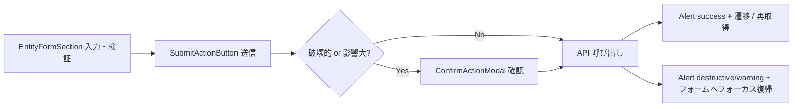

# 共通コンポーネント設計

- system: 図書館蔵書管理システム（ブランド名 `Libra`）
- event_id: `20260902_152849_spec_generation`
- 対象: 全 41 UC の presentation ティア（`tier-frontend-patron.md` 16 件 / `tier-frontend-staff.md` 25 件）
- 正本: デザインシステムは `docs/design/latest/design-event.yaml`、利用ルールは `_cross-cutting/ux-ui/ui-design.md`
- 位置づけ: 本書の共通コンポーネントは **既存 UI / Domain コンポーネントの合成（composition）** である。新しい視覚表現・新しい状態・新しいトークンを一切導入しない

## 設計原則

1. **重複定義しない**: design-event.yaml に存在する UI コンポーネント（13 種）・Domain コンポーネント（18 種）を再実装しない。共通コンポーネントはそれらを組み合わせる薄い層に限る
2. **状態は `stateMaps` が正本**: 状態バッジは `src/components/domain/stateMaps.ts` のマッピングを経由する。共通層で状態を再定義しない
3. **横断関心事だけを共通化**: 3 UC 以上で同じ構造・同じ振る舞いが繰り返されるものだけを共通化する。2 UC のものは「レポート系」のように業務としてのまとまりがある場合に限る
4. **ドメイン語彙を共通層に持ち込まない**: 書籍・貸出・予約・利用者の語彙は Domain コンポーネント側に留める。共通層はジェネリック（`items` / `columns` / `state`）に保つ
5. **インポートパス**: `@/components/common/{Name}`

## 対象 UC 一覧（41 件）

### 利用者ポータル（patron / 16 UC）

書籍を検索する / 書籍詳細と在庫状況を照会する / 予約を登録する / 自分の予約順位を照会する / 自分の予約状況を照会する / 自分の取置き中の予約を照会する / 自分の取置き状況を照会する / 自分の現在の貸出を照会する / 自分の貸出内容と返却期限を照会する / 自分の貸出履歴を照会する / 自分の返却期限を照会する / 自分の延滞中の貸出を照会する / 返却対象の貸出を照会する / 自分の返却済み貸出を照会する / 自分の利用者情報を照会する / 利用者番号で貸出対象利用者を特定する

### 司書ポータル（staff / 25 UC）

蔵書一覧を照会する / 書籍を登録する / 書籍情報を編集する / 書籍を削除する / 司書向けに蔵書を検索する / 書籍の貸出可否を判定する / 貸出を登録する / 返却を登録する / 返却後の書籍状態を更新する / 返却期限接近の貸出を判定する / リマインドメールを送信する / 期限超過の貸出を延滞にする / 延滞中の貸出を照会する / 督促メールを送信する / 予約を取り消す / 予約順1位の利用者を特定する / 取置き通知メールを送信する / 利用者一覧を照会する / 利用者を登録する / 利用者情報を編集する / 利用者を削除する / 在庫状況を区分別に集計する / 在庫状況レポートを参照する / 期間別貸出統計を集計する / 貸出統計レポートを参照する

## 共通コンポーネント一覧（10 件）

| # | 共通コンポーネント | 分類 | 合成元（design-event.yaml） | 利用 UC 数 |
|---|-------------------|------|---------------------------|-----------|
| 1 | `PortalPageLayout` | レイアウトシェル | `PortalShell` / `Icon` | 41 |
| 2 | `AsyncSection` | 状態表示 | `Skeleton` / `EmptyState` / `Alert` | 39 |
| 3 | `DataListSection` | 一覧 | `Table`（または Domain テーブル） / `Pagination` / `AsyncSection` | 15 |
| 4 | `FilterPanel` | 一覧 | `ToggleGroup` / `Input` / `Button` | 11 |
| 5 | `EntityFormSection` | フォーム | `Card` / `Input` / `ToggleGroup` / `Alert` / `Button` | 10 |
| 6 | `ConfirmActionModal` | フォーム | `Modal`（`confirm` / `destructive-confirm`） / `Button` | 5 |
| 7 | `SubmitActionButton` | フォーム | `Button` | 16 |
| 8 | `PiiMaskedText` | 状態表示 | `Button(ghost)` + `pii.*` トークン | 11 |
| 9 | `NotificationLogSection` | 一覧 | `NotificationLogTable` / `NotificationStatusBadge` / `Alert` | 3 |
| 10 | `ReportSummarySection` | 一覧 | `ReportKpiCard` / `LoanTrendChart` / `ReportStatusBadge` | 2 |

共通フックは「共通ロジック（フック）」節に別記する（3 件）。

---

## 1. 共通レイアウトシェル

### PortalPageLayout

```ts
import { PortalPageLayout } from "@/components/common/PortalPageLayout";
```

- **合成元**: `PortalShell`（`patron` / `staff` / `collapsed`）+ `Icon`
- **役割**: 全 41 UC が同一の骨格（ヘッダー固定 + サイドバー 16rem + コンテンツ）を使うための唯一の入口。ポータル差分（アクセント色・ナビ項目・ロゴ種別）を `portal` prop で解決し、**画面側でポータル色やナビ定義を書かせない**
- **ポータル差分**（`ui-design.md` のレイアウトパターンに従う）:

  | portal | アクセント | ロゴ | プライマリナビ（業務単位） | 共通メニュー（2 件・サイドバー下端） |
  |--------|-----------|------|--------------|--------------------|
  | `patron` | `primary_patron` | `logo-full` | 4 項目（蔵書をさがす / 予約 / 貸出 / マイページ） | ログイン利用者メニュー / ヘルプ・問い合わせ |
  | `staff` | `primary_staff` | `logo-icon` | 6 項目（蔵書管理 / 利用者管理 / 貸出・返却 / 期限・督促 / 予約・取置き / レポート） | ログイン利用者メニュー / ヘルプ・問い合わせ |

  design 正本の `PortalShell` は「ナビ = RDRA 業務 7 件 + 共通メニュー 2 件」で定義される。patron 4 項目 + staff 6 項目は同じ業務 7 件（蔵書管理業務 / 利用者管理業務 / 貸出返却業務 / 貸出期限管理業務 / 予約管理業務 / 蔵書分析業務 / 蔵書検索業務）をポータル別に読み替えた表記であり、共通メニュー 2 件は両ポータルで同一とする。

- **Props**:

  | Prop | 型 | 必須 | 説明 |
  |------|---|------|------|
  | portal | `"patron" \| "staff"` | Yes | `PortalShell` の `data-portal` に伝播する |
  | title | `string` | Yes | 現在の業務名。ヘッダーと `<h1>` に使う |
  | breadcrumb | `{ label: string; href?: string }[]` | No | 一覧 → 詳細 → 操作の 3 段構成の現在位置 |
  | actions | `ReactNode` | No | 画面主操作（`Button`）を右上に配置する |
  | width | `"contained" \| "full"` | No | 既定 `contained`（80rem 中央寄せ）。一覧・レポートは `full` |
  | children | `ReactNode` | Yes | コンテンツエリア |

- **レスポンシブ**: `lg` 以上は常設サイドバー、`md` は `collapsed`（4rem）、`sm` 未満はハンバーガー + ドロワー。分岐は本コンポーネントに閉じ込め、画面側にブレイクポイント記述を持たせない
- **フッター**: 両ポータルとも軽量フッター（著作表記・問い合わせ導線）を `PortalShell` の下端に固定配置する。フッター専用コンポーネントは作らない
- **利用 UC**: 全 41 UC（上記「対象 UC 一覧」の全件）
- **例外**: `利用者番号で貸出対象利用者を特定する`（`/mypage/card`）のみ `sm` を主対象とし、`width="contained"` かつサイドバー既定折りたたみで使う

---

## 2. 共通状態表示パターン

### AsyncSection

```ts
import { AsyncSection } from "@/components/common/AsyncSection";
```

- **合成元**: `Skeleton`（`line` / `table`）+ `EmptyState`（`default` / `with-action`）+ `Alert`（`destructive`）
- **役割**: `ui-design.md` の「一覧系は `EmptyState` / `Alert(destructive)` / `Skeleton` の 3 状態を必ず実装する」を型で強制する。取得系の全画面が同じ順序・同じ位置で 3 状態を出す
- **状態遷移**:

  ```mermaid
  graph LR
    Idle[idle] --> Loading[loading: Skeleton]
    Loading --> Ready[ready: children]
    Loading --> Empty[empty: EmptyState]
    Loading --> Error[error: Alert destructive + 再試行]
    Error --> Loading
  ```

- **Props**:

  | Prop | 型 | 必須 | 説明 |
  |------|---|------|------|
  | loading | `boolean` | Yes | true で `Skeleton` を表示する |
  | error | `string \| null` | Yes | 非 null で `Alert(destructive)` + 再試行ボタン |
  | isEmpty | `boolean` | Yes | true で `EmptyState` |
  | skeleton | `"line" \| "table"` | No | 既定 `table`（一覧）。詳細・カードは `line` |
  | emptyMessage | `string` | Yes | 「なぜ 0 件か」を示す文言 |
  | emptyAction | `ReactNode` | No | 次の行動の導線（`with-action`） |
  | onRetry | `() => void` | No | エラー時の再試行。省略時は再試行ボタンを出さない |
  | announce | `boolean` | No | 既定 true。件数・エラーを `aria-live="polite"` / `role="alert"` で通知する |

- **アクセシビリティ**: 取得完了時に件数を `aria-live="polite"`、エラーを `role="alert"` で通知する（28 UC が明記済み）。`prefers-reduced-motion: reduce` では `Skeleton` のシマーを止める
- **利用 UC（39 件）**: `対象 UC 一覧` のうち **`書籍を登録する` / `利用者を登録する` を除く全 UC**。この 2 件は新規入力が起点で取得待ちが無いため 3 状態を持たない（`返却を登録する` は利用者番号入力後に貸出一覧を取得する取得系のため対象に含める）

### PiiMaskedText

```ts
import { PiiMaskedText } from "@/components/common/PiiMaskedText";
```

- **合成元**: `pii.mask_bg` / `pii.mask_color` トークン + `Button(ghost)`
- **役割**: 連絡先など個人情報の既定マスクと明示操作による開示を 1 箇所に集約する（NFR E.1.2.1 / arch SR-006）。`UserProfileCard` / `UserTable` は内部でこれを使い、**両コンポーネントの外**（通知系・窓口系画面）でも同じ表現を保証する
- **Props**: `value`（`string`）/ `kind`（`"email" \| "phone" \| "address"`）/ `revealable`（`boolean`、既定 false）/ `onReveal`（開示の監査ログ通知）
- **振る舞い**: 既定はマスク文字列を表示し、`revealable` かつ明示操作でのみ実値へ切り替える。開示状態は画面遷移で破棄する。マスク済みであることは背景色だけでなく文言（例: 「非表示」）でも示す
- **利用 UC（11 件）**: 自分の利用者情報を照会する / 利用者一覧を照会する / 利用者情報を編集する / 利用者を削除する / 利用者番号で貸出対象利用者を特定する / 書籍の貸出可否を判定する / 貸出を登録する / 予約順1位の利用者を特定する / 取置き通知メールを送信する / リマインドメールを送信する / 督促メールを送信する

---

## 3. 共通一覧パターン

### DataListSection

```ts
import { DataListSection } from "@/components/common/DataListSection";
```

- **合成元**: `Table`（司書一覧）または Domain テーブル（`LoanTable` / `UserTable` / `NotificationLogTable`）+ `Pagination`（`default` / `single-page`）+ `AsyncSection`
- **役割**: 「フィルター → 一覧 → ページ送り」の縦積みレイアウトと 20 件/頁の分割ルールを統一する。テーブル本体は差し替え可能なスロットにし、**Domain テーブルを共通層で置き換えない**
- **構造**:

  ```mermaid
  graph TD
    A[DataListSection] --> B[FilterPanel スロット 任意]
    A --> C[AsyncSection]
    C --> D[table スロット: Table / LoanTable / UserTable / NotificationLogTable]
    A --> E[Pagination 20 件/頁]
  ```

- **Props**:

  | Prop | 型 | 必須 | 説明 |
  |------|---|------|------|
  | filter | `ReactNode` | No | `FilterPanel` を差す |
  | table | `ReactNode` | Yes | 一覧本体（Domain テーブル優先） |
  | page / totalPages / onPageChange | `number` / `number` / `(p:number)=>void` | Yes | `Pagination`。1 頁のみなら `single-page` |
  | total | `number` | Yes | 件数表示（`aria-live="polite"`） |
  | loading / error / isEmpty / emptyMessage | — | Yes | `AsyncSection` へ委譲する |

- **ルール**: 無限スクロールは使わない。`sm` 未満ではテーブル親を `overflow-x` にする（カード切替はしない）
- **利用 UC（15 件）**: 書籍を検索する / 司書向けに蔵書を検索する / 蔵書一覧を照会する / 利用者一覧を照会する / 自分の現在の貸出を照会する / 自分の貸出履歴を照会する / 自分の返却済み貸出を照会する / 返却対象の貸出を照会する / 延滞中の貸出を照会する / 返却期限接近の貸出を判定する / 自分の予約状況を照会する / リマインドメールを送信する / 督促メールを送信する / 在庫状況レポートを参照する / 貸出統計レポートを参照する
- **参考**: ページ送りを伴わない一覧（`自分の延滞中の貸出を照会する` / `自分の取置き中の予約を照会する` / `期限超過の貸出を延滞にする` / `取置き通知メールを送信する` / `返却を登録する`）は `AsyncSection` + Domain テーブルの直接組み合わせでよい

### FilterPanel

```ts
import { FilterPanel } from "@/components/common/FilterPanel";
```

- **合成元**: `ToggleGroup`（`single` / `multi`）+ `Input` + `Button`
- **役割**: 「単一選択トグル + 複数選択トグル + 検索語 + 実行ボタン + 結果件数」の並びと、詳細条件の折りたたみ（段階的開示）を統一する。**ドメイン固有のフィルター（`BookSearchFilter` / `ReportPeriodSelector`）は本コンポーネントを内側で使う**（置き換えない）
- **Props**: `fields`（`{ key, label, kind: "single"|"multi"|"text", options?, value }[]`）/ `onChange` / `onSubmit` / `onReset` / `resultCount` / `collapsedByDefault`（既定 true、既定表示はキーワードのみ）/ `submitting`
- **ルール**: セレクトボックスを使わない（RDRA バリエーションが 3〜8 件のため選択肢を露出する）。条件は `useListQueryState` でクエリパラメータと同期する
- **利用 UC（11 件）**: 書籍を検索する / 司書向けに蔵書を検索する / 蔵書一覧を照会する / 利用者一覧を照会する / 返却期限接近の貸出を判定する / 延滞中の貸出を照会する / 在庫状況を区分別に集計する / 期間別貸出統計を集計する / リマインドメールを送信する / 督促メールを送信する / 取置き通知メールを送信する

### NotificationLogSection

```ts
import { NotificationLogSection } from "@/components/common/NotificationLogSection";
```

- **合成元**: `NotificationLogTable` + `NotificationStatusBadge` + `Alert`（`warning` / `destructive`）+ `SubmitActionButton`
- **役割**: 通知 3 UC が同一構造（送信対象サマリ → 送信実行 → 送信実績一覧 → 失敗行の再送）であるためのテンプレート。未達件数の警告位置と、409（送信失敗以外の再送）の文言を統一する
- **Props**: `notificationType`（`"取置き通知" \| "リマインド" \| "督促"`）/ `counts`（送信対象サマリ。`{ 送信待ち, 送信済み, 送信失敗 }` の件数を `NotificationLogTable` のヘッダーに文言表示する。KPI カードは使わない）/ `logs` / `loading` / `onSend` / `onRetry`（送信失敗行のみ活性）
- **利用 UC（3 件）**: 取置き通知メールを送信する / リマインドメールを送信する / 督促メールを送信する

### ReportSummarySection

```ts
import { ReportSummarySection } from "@/components/common/ReportSummarySection";
```

- **合成元**: `ReportKpiCard`（`default` / `with-delta` / `row`）+ `LoanTrendChart` + `ReportStatusBadge` + `Table` + `EmptyState`
- **役割**: 「KPI 行 → 推移チャート → 明細テーブル」の情報階層（全体サマリー → ドリルダウン）と、レポート状態（集計中 / 作成済み / 実績なし）の表現を 2 レポート画面で揃える
- **Props**: `status`（`"集計中" \| "作成済み" \| "実績なし"`）/ `kpis`（`ReportKpiCard` の props 配列、4 件以内）/ `chart` / `detail` / `emptyMessage`
- **ルール**: KPI は認知負荷を考慮し 1 行 4 件までにする。`集計中` は `ReportStatusBadge(analysis)` + `Skeleton`、`実績なし` は `EmptyState` を出す。外部チャートライブラリを導入しない
- **利用 UC（2 件）**: 在庫状況レポートを参照する / 貸出統計レポートを参照する

---

## 4. 共通フォームパターン

本システムは **入力 → 確認 → 完了の複数ページウィザードを採用しない**。`ui-design.md` の「ステッパーは使わず 1 画面 1 フォームを維持する」に従い、確認はページ遷移ではなく `Modal` で行う。よって共通フォームパターンは「1 画面フォーム + 確認モーダル + 冪等送信」の 3 部品で構成する。



### EntityFormSection

```ts
import { EntityFormSection } from "@/components/common/EntityFormSection";
```

- **合成元**: `Card` + `Input`（`default` / `with-icon` / `error` / `disabled`）+ `ToggleGroup` + `Alert` + `Button`
- **役割**: フォームのレイアウト（`lg` 2 列 / `md` 以下 1 列）、ラベル・必須表記・エラー表示位置、送信中の無効化を統一する。**現在値（current）と入力値（draft）を分けて保持する編集系の型**も本コンポーネントが提供する
- **Props**:

  | Prop | 型 | 必須 | 説明 |
  |------|---|------|------|
  | mode | `"create" \| "edit" \| "action"` | Yes | `edit` では `dirtyFields` の差分サマリを出す |
  | fields | `FormFieldSpec[]` | Yes | `kind: "text" \| "single" \| "multi"`、`required`、`validate` |
  | value / onChange | — | Yes | draft の制御 |
  | current | `Record<string, unknown>` | No | `edit` 時の現行値。差分算出に使う |
  | errors | `Record<string, string>` | Yes | フィールド単位のエラー（`Input(error)`） |
  | formError | `string \| null` | Yes | 業務エラー（`Alert`、`role="alert"`） |
  | footer | `ReactNode` | Yes | `SubmitActionButton` 等 |

- **バリデーション方針**: 形式チェック（必須・文字数・メール書式・ISBN 桁数）のみクライアントで行う。業務判断はバックエンドに委ねる
- **アクセシビリティ**: 送信失敗時は最初のエラーフィールドへフォーカスを戻す（8 UC が明記済み）
- **利用 UC（10 件）**: 書籍を登録する / 書籍情報を編集する / 利用者を登録する / 利用者情報を編集する / 貸出を登録する / 返却を登録する / 書籍の貸出可否を判定する / 在庫状況を区分別に集計する / 期間別貸出統計を集計する / 期限超過の貸出を延滞にする

### ConfirmActionModal

```ts
import { ConfirmActionModal } from "@/components/common/ConfirmActionModal";
```

- **合成元**: `Modal`（`confirm` `sm` 24rem / `destructive-confirm` `md` 32rem）+ `Button`（`default` / `destructive` / `outline`）+ `Alert`
- **役割**: 確認ダイアログの文言構造（対象名の再掲 → 影響の明示 → 取り消し可否）とフォーカス制御を統一する。`window.confirm` と `Alert` による代替を禁止する
- **Props**: `open` / `tone`（`"confirm" \| "destructive"`）/ `title` / `targetLabel`（対象名の再掲）/ `impact`（実行後に起きること）/ `confirmLabel` / `onConfirm` / `onCancel` / `submitting`
- **アクセシビリティ**: フォーカストラップ、Esc クローズ、閉じたら起動元へフォーカス復帰。開閉アニメーションは `duration.slow` 320ms、`prefers-reduced-motion: reduce` で無効化する
- **利用 UC（5 件）**:

  | UC | tone |
  |----|------|
  | 書籍を削除する | `destructive` |
  | 利用者を削除する | `destructive` |
  | 予約を取り消す | `destructive` |
  | 予約を登録する | `confirm` |
  | 利用者情報を編集する | `confirm` |

### SubmitActionButton

```ts
import { SubmitActionButton } from "@/components/common/SubmitActionButton";
```

- **合成元**: `Button`（`default` / `destructive` / `outline`、`lg` 2.75rem）
- **役割**: 更新系 API の二重送信防止を 1 箇所に集約する。押下で `disabled` + `aria-busy="true"` + `loading` にし、画面表示時に発行した冪等キー（UUID）を `X-Idempotency-Key` として送る（arch SR-002 / LR-032）
- **Props**: `idempotencyKey`（`string`、`useIdempotentMutation` から受け取る）/ `variant` / `onSubmit` / `submitting` / `disabled` / `children`
- **ルール**: 破壊的操作は `destructive`、主操作は `default`、副次操作は `outline`、ナビ的操作は `ghost`。館内タブレット運用のためタップ領域は 2.75rem 以上を確保する
- **利用 UC（16 件）**: 書籍を登録する / 書籍情報を編集する / 書籍を削除する / 利用者を登録する / 利用者情報を編集する / 利用者を削除する / 貸出を登録する / 返却を登録する / 返却後の書籍状態を更新する / 予約を登録する / 予約を取り消す / 取置き通知メールを送信する / リマインドメールを送信する / 督促メールを送信する / 在庫状況を区分別に集計する / 期間別貸出統計を集計する

---

## 5. 共通ロジック（フック）

コンポーネントではないが 3 UC 以上で重複するロジックを共通化する。配置は `@/components/common/hooks/`。

| フック | 役割 | 利用 UC 数 | 利用 UC |
|--------|------|-----------|---------|
| `useListQueryState` | 一覧の検索条件・ページをルーティングのクエリパラメータと同期する（画面をまたぐ共有状態を持たない / arch LR-026） | 7 | 書籍を検索する / 司書向けに蔵書を検索する / 蔵書一覧を照会する / 自分の貸出履歴を照会する / 自分の返却済み貸出を照会する / 自分の取置き中の予約を照会する / 返却対象の貸出を照会する |
| `useIdempotentMutation` | 画面表示時に UUID を発行し、送信・再送で同一の `X-Idempotency-Key` を維持する。`SubmitActionButton` へキーと `submitting` を渡す | 16 | `SubmitActionButton` の利用 UC と同一 |
| `useApiErrorPresenter` | API エラーを 4 分類（通信 / 認可 / 業務ルール違反 / 競合）に正規化し、表示先（フィールド / `Alert` / 再ログイン導線）と重篤度を決める（arch LR-031 / CLP-014） | 41 | 全 UC |

### `useApiErrorPresenter` のマッピング（横断規約）

| ステータス | 分類 | 表示 | 追加導線 |
|-----------|------|------|---------|
| 400 / 422 | 入力エラー | `Input(error)` + フィールド直下メッセージ | 最初のエラー欄へフォーカス |
| 401 | 認可 | `Alert(destructive)` | 再ログイン導線 |
| 403 | 認可 | `Alert(destructive)` | 前画面へ戻る導線（他ポータルの画面へリンクしない） |
| 404 | 業務 | `Alert(destructive)` | 一覧へ戻る導線 |
| 409 | 競合 / 業務ルール違反 | `Alert(warning)`（再実行で解消しうる） / `Alert(destructive)`（対象の再特定が必要） | 最新の再取得 or 再読込 |
| 5xx | 通信 | `Alert(destructive)` | 同じ位置に再試行ボタン |

いずれも `role="alert"` で通知し、色だけで重篤度を伝えない。

---

## 既存コンポーネントとの関係（重複防止）

### そのまま使う（共通層でラップしない）

| 区分 | コンポーネント | 理由 |
|------|--------------|------|
| Domain（状態） | `BookStatusBadge` / `LoanStatusBadge` / `ReservationStatusBadge` / `UserStatusBadge` / `NotificationStatusBadge` / `ReportStatusBadge` | `stateMaps` が正本。共通層でのラップは状態定義の二重化を招く |
| Domain（表示） | `BookCard` / `HoldPickupCard` / `UserProfileCard` / `DueDateIndicator` / `ReservationQueueTracker` / `LoanTrendChart` / `ReportKpiCard` | ドメイン語彙を含むため共通層に上げない |
| Domain（一覧） | `LoanTable` / `UserTable` / `NotificationLogTable` | 既に default / loading / empty / error の 4 状態を内包する。`DataListSection` の `table` スロットに差す |
| Domain（フィルター） | `BookSearchFilter` / `ReportPeriodSelector` | RDRA バリエーションに束縛される。内部で `FilterPanel` を使う |
| UI | `Button` / `Badge` / `Card` / `Input` / `ToggleGroup` / `Table` / `Alert` / `EmptyState` / `Skeleton` / `Pagination` / `Modal` / `Icon` / `PortalShell` | design-event.yaml が正本 |

### 共通層に移す（各 UC の tier md にある UC 固有コンポーネントの共通部分）

| UC 固有コンポーネント（例） | 共通化される部分 |
|--------------------------|----------------|
| `BookSearchResultList` / `ReferenceResultTable` / `BookLedgerTable` / `OverdueLoanList` / `MyReservationTable` / `ReturnedLoanList` ほか一覧系 | `DataListSection` + `AsyncSection` |
| `BookSearchPanel` / `BookLedgerFilter` / `ReferenceSearchFilter` / `DueTimingFilter` / `InventoryReportConditionForm` / `LoanStatsPeriodForm` | `FilterPanel` |
| `BookIntakeForm` / `BookEditForm` / `UserRegisterForm` / `UserEditForm` / `LoanRegistrationForm` / `LoanEligibilityForm` | `EntityFormSection` |
| `WithdrawalConfirmModal` / `WithdrawConfirmModal` / `ReservationCancelPanel` の確認部 | `ConfirmActionModal` |
| `DunNotificationLog` / `RemindNotificationLog` / `HoldNoticeLogSection` | `NotificationLogSection` |
| `InventoryKpiRow` / `LoanStatsKpiRow` / `LoanTrendSection` | `ReportSummarySection` |

UC 固有コンポーネントは**廃止せず**、上記の共通コンポーネントを内側で使う薄いアダプタとして残す（UC 単位 Spec の BDD をそのまま満たすため）。

## 新規追加していないことの確認

- 新しい視覚表現（新レイアウト・新チャート種別・新バッジ色）は追加していない
- 新しい状態は追加していない（RDRA 状態モデル 6 種 / `stateMaps` の範囲内）
- 新しいトークンは追加していない（semantic / component 層の既存トークンのみ参照）
- 共通コンポーネント 10 件はすべて既存 UI / Domain コンポーネントの合成である
