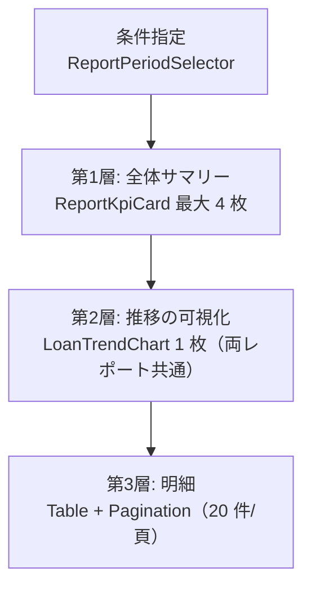

# データ可視化設計仕様

- system: 図書館蔵書管理システム（ブランド名 `Libra`）
- event_id: `20260902_152849_spec_generation`
- 対象範囲: 蔵書分析業務の 2 レポート画面（在庫状況 / 貸出統計）と、貸出期限管理業務・予約管理業務の通知件数サマリ
- 対象ポータル: 司書ポータル（staff）のみ。利用者ポータル（patron）には集計・可視化を置かない（個人情報参照可否条件 / arch SP-004 本人限定参照）
- 使用コンポーネント: `ReportKpiCard` / `LoanTrendChart` / `ReportPeriodSelector` / `ReportStatusBadge` / `Table`（レポート 2 画面の明細用途に限る） / `LoanTable`（貸出の一覧 2 画面: 返却期限接近貸出一覧 / 延滞状況一覧） / `EmptyState` / `NotificationLogTable` / `DueDateIndicator` / `Alert`（design 正本にあるもののみ）
- `ReportKpiCard` は design 正本の screens 定義どおり在庫状況レポート画面・貸出統計レポート画面の 2 画面に限定する。通知・一覧系 5 画面の件数サマリには使わない

## 可視化対象

RDRA の情報「統計レポート」「通知」と、条件「在庫状況集計条件」「貸出統計集計条件」の範囲に限定する。ここに無い指標を新設しない。

| 画面 | 指標/データ | 用途 | チャート種別 |
|------|-----------|------|-----------|
| 在庫状況レポート画面（`/staff/reports/inventory`） | 蔵書総数 | Comparison | `ReportKpiCard`（単一値 + 前回集計比） |
| 在庫状況レポート画面 | 書籍状態別件数（在庫あり / 貸出中 / 予約待ち） | Composition | `Table`（区分別の件数と構成比の明細表 + `BookStatusBadge`） |
| 在庫状況レポート画面 | 集計日別の蔵書総数・貸出中件数の推移 | Trend | `LoanTrendChart`（`daily` / `monthly`。design の `LoanTrendChart.screens` が本画面を含むため、時系列用途として配置する） |
| 在庫状況レポート画面 | 稼働率（貸出中 ÷ 蔵書総数） | Comparison（計算指標） | `ReportKpiCard`（`with-delta`） |
| 在庫状況レポート画面 | ジャンル別蔵書件数（8 区分） | Comparison | `Table`（明細表。8 区分は棒の識別が難しく表で提示する） |
| 在庫状況レポート画面 | 書籍状態別の書籍一覧 | 明細 | `Table` + `BookStatusBadge` + `Pagination` |
| 貸出統計レポート画面（`/staff/reports/loans`） | 期間内貸出件数 | Comparison | `ReportKpiCard`（前期比 delta つき） |
| 貸出統計レポート画面 | 返却済み件数 | Comparison | `ReportKpiCard`（前期比 delta つき） |
| 貸出統計レポート画面 | 利用者数（期間内に貸出のあった利用者の実数） | Comparison | `ReportKpiCard`（前期比 delta つき） |
| 貸出統計レポート画面 | 1 利用者あたり貸出件数（期間内貸出件数 ÷ 利用者数） | Comparison（計算指標） | `ReportKpiCard`（`with-delta`） |
| 貸出統計レポート画面 | 集計期間区分別の貸出件数推移（日次 / 月次 / 年次） | Trend | `LoanTrendChart`（`daily` / `monthly`。`highlightMax` で最大値を強調） |
| 貸出統計レポート画面 | 書籍別貸出回数（人気書籍ランキング） | Comparison | `Table`（上位 20 件。ランキングは順位の読み取りが目的のため表を主とする） |
| 貸出統計レポート画面 | 利用者区分別 / ジャンル別の貸出内訳 | Composition | `Table`（区分別の件数と構成比の明細表。非時系列のため `LoanTrendChart` は使わない） |
| リマインド送信画面（`/staff/duedates/remind`） | 通知状態別件数（送信待ち / 送信済み / 送信失敗） | Comparison | `NotificationLogTable`（ヘッダーに状態別件数を文言表示）+ `NotificationStatusBadge` 列 |
| 督促送信画面（`/staff/overdues/dun`） | 通知状態別件数 + 未達件数 | Comparison | `NotificationLogTable`（ヘッダー件数）+ `Alert(destructive)`（未達 > 0 のとき） |
| 取置き通知送信画面（`/staff/holds/notify`） | 通知状態別件数 | Comparison | `NotificationLogTable`（ヘッダー件数）+ `NotificationStatusBadge` 列 |
| 返却期限接近貸出一覧画面（`/staff/duedates/upcoming`） | 通知タイミング区分別の対象件数（期限前 / 期限当日） | Comparison | `LoanTable`（ヘッダーに区分別件数を文言表示）+ `DueDateIndicator` 列 |
| 延滞状況一覧画面（`/staff/overdues`） | 延滞件数・最長超過日数 | Comparison | `LoanTable`（ヘッダーに区分別件数を文言表示）+ `Alert(warning)`（延滞件数）+ `DueDateIndicator` 列 |

チャートを置かない画面（一覧・詳細・フォーム 34 画面）では、指標の可視化を行わない。件数は表のヘッダーまたは `BookSearchFilter` の `resultCount` で文言として示す。

## チャート選定ガイドライン

`references/specs/data-visualization-rules.md` を適用する。

### 観点別チャート選定

| 観点 | 推奨チャート | 使用場面 |
|------|-----------|---------|
| Comparison（比較） | KPI カード（`ReportKpiCard`、2 レポート画面のみ）、明細表（`Table` / `NotificationLogTable`） | 期間内貸出件数の前期比は `ReportKpiCard`、書籍状態別の在庫件数・通知状態別の送信件数は表とヘッダー件数。単一値には必ず比較対象（前回集計比 / 前期比）を添える |
| Composition（構成比） | 明細表（件数 + 構成比の列） | 書籍状態 3 区分の内訳、利用者区分 3 区分の貸出内訳。design 正本に非時系列の棒バリアントが無いため表で示す。円グラフも使わない（角度比較より長さ比較のほうが正確なため） |
| Relationship（関連性） | 採用しない | 本システムの RDRA モデルに散布図で示すべき 2 変量の指標が無い。将来「ジャンル × 貸出回数」の相関分析が必要になったら design ステージで追加を検討する |
| Distribution（分布） | 採用しない | 延滞日数の分布は延滞件数と最長超過日数の KPI で代替する。ヒストグラム用のコンポーネントを design に持たない |
| Trend（傾向） | 棒グラフ（`LoanTrendChart` の `daily` / `monthly`） | 期間別貸出件数の推移。折れ線は design に該当コンポーネントが無いため使わず、離散的な期間集計として棒で表現する |

### 不適切な使用の禁止事項

- 6 項目以上の円グラフを使わない（ジャンル 8 区分は `Table` で提示する）
- 長期トレンドを比較目的の並び替えで表示しない（時系列は必ず時間順に固定する）
- 3D 効果・影・グラデーション・背景色つきプロットエリアを使わない（Data-Ink Ratio）
- 棒グラフの縦軸を 0 以外から始めない（差の誇張を防ぐ）
- 外部チャートライブラリを導入しない。`LoanTrendChart` の SVG/div 実装を使う（design 正本の定義）

### データ表現フレームワークの適用

| 表現方法 | 適用先 | 具体例 |
|---------|-------|--------|
| % Change（変化率） | 貸出統計レポート画面の期間内貸出件数 | 前期比 `+12%`（`ReportKpiCard` の `delta`。増は `success`、減は `destructive` ではなく `neutral` トーンで示し、減少＝悪と決めつけない） |
| Variance（差異） | 在庫状況レポート画面の書籍状態別件数 | 前回集計との件数差を `±N 件` で併記する |
| Calculated Metric（計算指標） | 在庫状況レポート画面の稼働率、貸出統計レポート画面の 1 利用者あたり貸出件数 | 分母・分子の定義を KPI カードの補足文言に明示する |
| Added Context（追加コンテキスト） | 貸出統計レポート画面の推移 | `highlightMax` で期間内最大値を強調し、比較の基準点を与える |

## ダッシュボード設計原則

### 情報の階層化

両レポート画面は 3 層構造に固定する。

- **全体サマリー**: `ReportKpiCard` を最大 4 枚。ワーキングメモリの限界（4-5 項目）に合わせ、5 枚以上は置かない
  - 在庫状況レポート: 蔵書総数 / 在庫あり件数 / 貸出中件数 / 稼働率
  - 貸出統計レポート: 期間内貸出件数 / 返却済み件数 / 利用者数 / 1 利用者あたり貸出件数
- **ドリルダウン**: チャートの区分をクリックすると、第 3 層の明細表が同じ区分で絞り込まれる。別画面へは遷移しない（画面数を RDRA の 41 件から増やさない）
- **フィルター**: 条件指定は前段の専用画面（`/staff/reports/inventory/new`、`/staff/reports/loans/new`）で行う。レポート画面上には「条件を変更する」導線のみを置き、フィルタ UI を二重に持たない
- **状態表示**: `ReportStatusBadge` を画面上部に常置する。`集計中` は `Skeleton`、`実績なし` は `EmptyState`（「集計期間を変更して再集計する」を `with-action` で提示）に対応させる

### データストーリーテリング

| レポート | ナラティブ | 比較軸 | 見た後のアクション |
|---------|----------|-------|-----------------|
| 在庫状況レポート | 「いま棚に無い本がどれだけあるか」。予約待ちの積み上がりは複本購入の検討材料になる | 前回集計比 / 書籍状態区分間 / ジャンル区分間 | 予約待ちが多いジャンル・書籍の複本購入、除籍候補の抽出 |
| 貸出統計レポート | 「どの期間・どの本が使われているか」。人気書籍ランキングは選書の根拠になる | 前期比 / 集計期間区分内の期間間 / 利用者区分間 | 選書・購入判断、開館時間や配架の運用改善 |
| 通知件数サマリ（リマインド / 督促 / 取置き） | 「通知が届いていない利用者がいるか」。未達は督促の実効性を損なう | 通知状態区分間（送信待ち / 送信済み / 送信失敗） | 送信失敗の再送、連絡先の確認・訂正依頼 |

5W1H は次のように固定する。Who = 司書、When = 集計実行時（日次 / 月次 / 年次）、Where = 司書ポータルのレポート画面（館内ネットワーク限定）、Why = 選書・購入判断と運用改善、What = 在庫状況 / 期間別貸出統計 / 人気書籍ランキング（レポート種別の 3 値）、How = 条件指定 → 集計 → 参照。

## 認知負荷への配慮

- 1 画面あたりの主要指標は 4 枚以内、チャートは 1 枚に制限する。第 2 層のチャートを増やしたい要求は、レポート種別（在庫状況 / 人気書籍ランキング / 期間別貸出統計）の切り替えで吸収する
- Data-Ink Ratio: グリッド線は水平方向のみ（`chart.grid` = `--border`）、枠線・背景色・3D・影は使わない。データラベルは `highlightMax` の最大値と軸の端点のみに付ける
- ゲシュタルトの法則の適用:
  - **近接**: KPI カード 4 枚を `component_gap`（0.75rem）で 1 グループにし、チャートとは `section_gap`（2rem）で離す
  - **類同**: 状態区分の色は `stateMaps` と同一トークンを使う（在庫あり = `success`、貸出中 = `info`、予約待ち = `warning`）。レポート内だけの独自配色を作らない
  - **連続**: 時系列の棒は必ず時間順に並べ、欠損期間も 0 件の枠として表示する
  - **閉合**: 各層を `Card`（`radius.xl` / `shadow.sm`）で囲み、層の境界を明示する
- 色に依存しない: チャートの各系列に区分名のラベルを付け、`LoanTrendChart` の内容を `aria-label` で読み上げ可能にする。同じデータを第 3 層の `Table` でテキストとしても提供する（JIS X 8341-3 AA 目標 / NFR F.3.1.2）
- 数値表記: `ReportKpiCard` の値は等幅（`font_family.mono`）・桁揃え。`toLocaleString('ja-JP')` で 3 桁区切りにする（arch SR-004）
- 応答性: 集計は NFR B.2.1.1（5 秒以内）を超える可能性があるため、`集計中` 状態では `Skeleton` を表示し、完了は `aria-live="polite"` で通知する
- ダークモード: `chart.bar_bg`（`--primary`）・`bar_muted_bg`・`chart_grid`（ダークは `--color-gray-700`）を使い、棒と背景のコントラストを 3:1 以上に保つ
