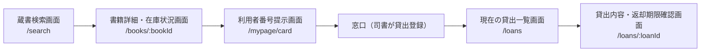
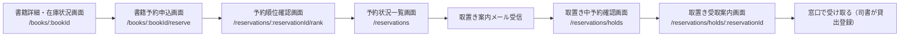
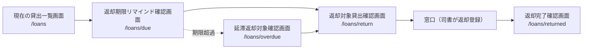
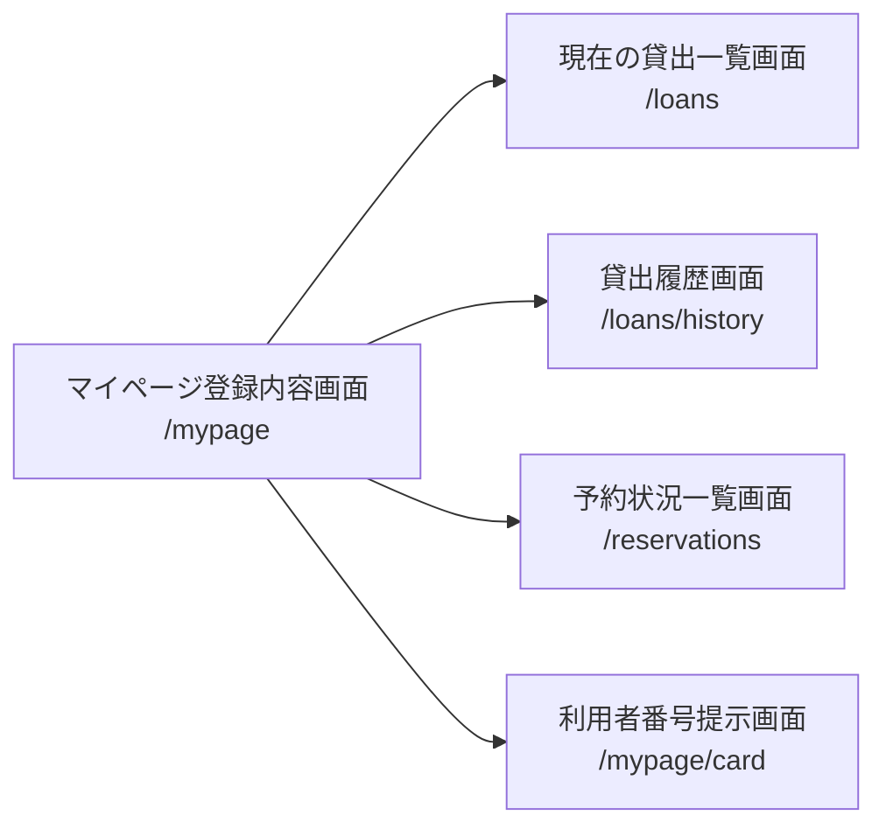
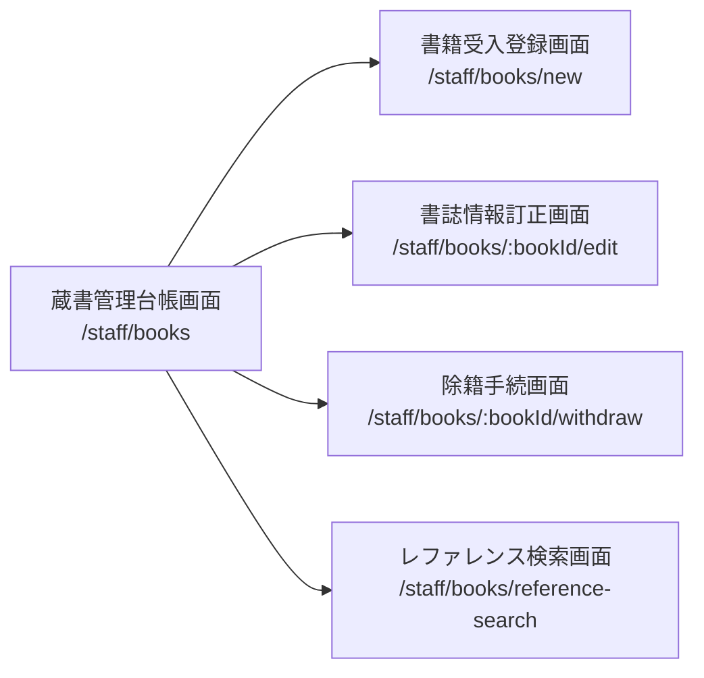
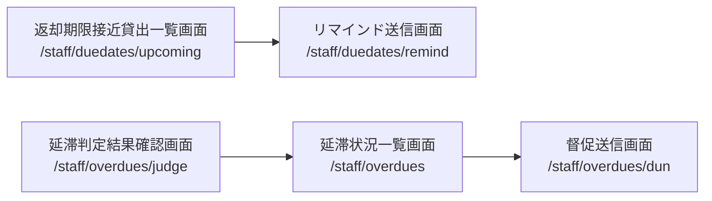
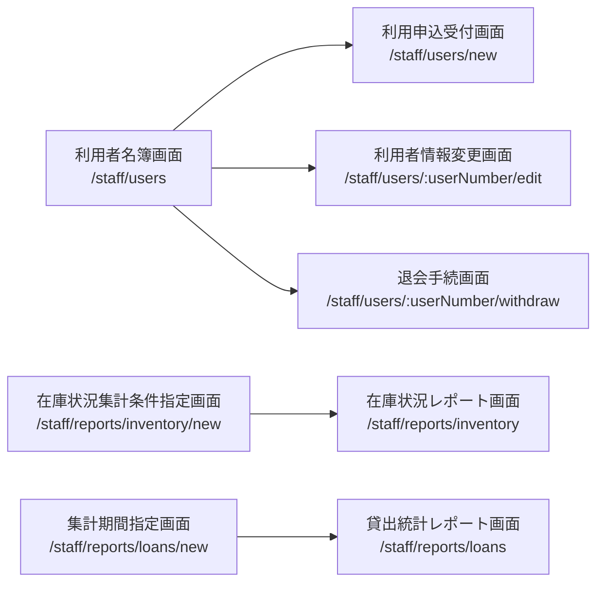
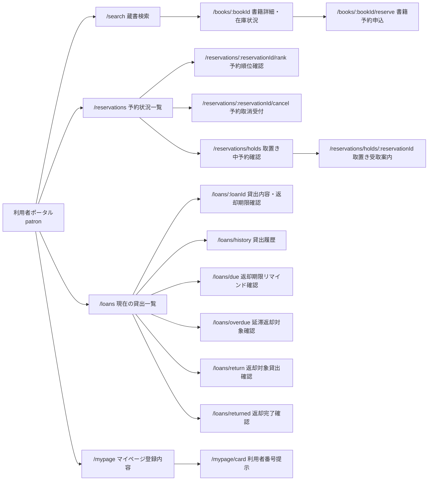
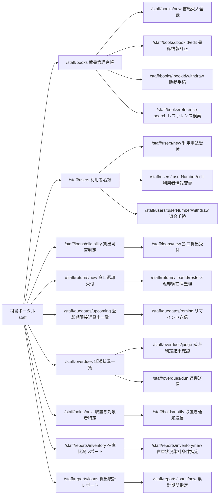

# UX デザイン仕様

- system: 図書館蔵書管理システム（ブランド名 `Libra`）
- event_id: `20260902_152849_spec_generation`
- 対象: 全 7 業務 / 12 BUC / 41 UC、2 ポータル（patron 17 画面 / staff 24 画面）
- 正本: 画面・ルートは `docs/design/latest/_digest/screens.yaml`、アクター・情報・条件・状態は `docs/rdra/latest/*.tsv`

## ユーザーフロー

業務フロー横断で 8 本のフローを定義する。patron 4 本 / staff 4 本。

### 蔵書利用業務: 探して借りる（在庫あり）

**アクター**: 利用者
**ゴール**: 目的の書籍を見つけ、在庫があることを確認して窓口で借りる

**タッチポイント**:

| ステップ | 画面 | UC | 感情 | 改善機会 |
|---------|------|---|------|---------|
| 条件を選んで探す | 蔵書検索画面 | 書籍を検索する | ニュートラル | 検索条件種別 5 種の選択で迷わせない。既定「キーワード」+ 在庫ありのみトグルを前面に置く |
| 在庫を確かめる | 書籍詳細・在庫状況画面 | 書籍詳細と在庫状況を照会する | ポジティブ（在庫あり） / ネガティブ（貸出中） | 「在庫あり」は次アクション（窓口で借りられます）まで書く。貸出中は予約導線へ即接続する |
| 窓口で本人を示す | 利用者番号提示画面 | 利用者番号で貸出対象利用者を特定する | ニュートラル | 利用者番号を大きく表示し、館内で片手操作できるようにする |
| 借りた内容を確認する | 現在の貸出一覧画面 / 貸出内容・返却期限確認画面 | 自分の現在の貸出を照会する / 自分の貸出内容と返却期限を照会する | ポジティブ | 返却期限を残日数で示し（DueDateIndicator）、期限当日までの見通しを与える |

### 予約管理業務: 貸出中の書籍を予約して受け取る

**アクター**: 利用者
**ゴール**: 貸出中の書籍を予約し、取置き通知を受けて窓口で受け取る

**タッチポイント**:

| ステップ | 画面 | UC | 感情 | 改善機会 |
|---------|------|---|------|---------|
| 予約できるか判断する | 書籍詳細・在庫状況画面 | 書籍詳細と在庫状況を照会する | ニュートラル | 在庫あり書籍予約不可ポリシーは「予約せず借りられます」という肯定形で伝える |
| 予約を申し込む | 書籍予約申込画面 | 予約を登録する | ポジティブ | 申込前に見込み順位を提示し、待ち時間の期待値を先に合わせる。重複予約は申込前に検知して案内する |
| 待ち状況を追う | 予約順位確認画面 / 予約状況一覧画面 | 自分の予約順位を照会する / 自分の予約状況を照会する | ニュートラル〜ネガティブ（待ち長） | ReservationQueueTracker で「予約中 → 取置き中 → 貸出済み」の進行を段階表示し、待ちの不透明さを減らす |
| 取置きを受け取る | 取置き中予約確認画面 / 取置き受取案内画面 | 自分の取置き中の予約を照会する / 自分の取置き状況を照会する | ポジティブ | 取置き期限を残日数と日付の両方で示す。期限当日は HoldPickupCard の `deadline-today` を使う |
| 予約をやめる | 予約取消受付画面 | 予約を取り消す | ニュートラル | 取消は Modal（destructive-confirm）で意図的な壁を置き、誤操作を防ぐ |

### 貸出期限管理業務: 期限を守って返す

**アクター**: 利用者
**ゴール**: 返却期限を把握し、延滞前に返却する

**タッチポイント**:

| ステップ | 画面 | UC | 感情 | 改善機会 |
|---------|------|---|------|---------|
| 期限を知る | 返却期限リマインド確認画面 | 自分の返却期限を照会する | ニュートラル | リマインドメールからの着地点にする。通知タイミング区分（期限前 / 当日）で見出しを出し分ける |
| 延滞を知る | 延滞返却対象確認画面 | 自分の延滞中の貸出を照会する | ネガティブ | 責める文言を避け、超過日数と「窓口で返却してください」の 1 アクションだけを示す |
| 返す対象を確認する | 返却対象貸出確認画面 | 返却対象の貸出を照会する | ニュートラル | 持参すべき冊数を件数で明示する |
| 返し終える | 返却完了確認画面 | 自分の返却済み貸出を照会する | ポジティブ | ピーク・エンドの法則に従い、完了時に「返却済み」バッジと次の行動（次を探す）を提示する |

### 利用照会業務: 自分の利用状況を振り返る

**アクター**: 利用者
**ゴール**: 自分の登録内容・貸出履歴・予約状況を確認する

**タッチポイント**:

| ステップ | 画面 | UC | 感情 | 改善機会 |
|---------|------|---|------|---------|
| 登録内容を見る | マイページ登録内容画面 | 自分の利用者情報を照会する | ニュートラル | 連絡先は既定でマスクし、明示操作でだけ開示する（個人情報参照可否条件 / NFR E.1.2.1） |
| 履歴を振り返る | 貸出履歴画面 | 自分の貸出履歴を照会する | ポジティブ | 返却済みのみを扱う旨を空状態のメッセージで明示し、現在の貸出との混同を防ぐ |
| 予約を見る | 予約状況一覧画面 | 自分の予約状況を照会する | ニュートラル | 予約中と取置き中を同一表で状態バッジで区別し、取置きだけ受取導線を出す |

### 蔵書管理業務: 蔵書を受け入れて維持する

**アクター**: 司書
**ゴール**: 書籍を登録・訂正・除籍し、台帳を単一の正データとして保つ

**タッチポイント**:

| ステップ | 画面 | UC | 感情 | 改善機会 |
|---------|------|---|------|---------|
| 台帳を見る | 蔵書管理台帳画面 | 蔵書一覧を照会する | ニュートラル | 書籍状態バッジで在庫・貸出・予約待ちを一覧のまま判別できるようにする |
| 受け入れる | 書籍受入登録画面 | 書籍を登録する | ニュートラル | ジャンル・資料種別は ToggleGroup で選ばせる。電子書籍は選択時に未対応を即時案内する（資料種別利用可否条件） |
| 訂正する | 書誌情報訂正画面 | 書籍情報を編集する | ニュートラル | 変更前後の差分が分かるよう、変更した項目だけを保存前に確認表示する |
| 除籍する | 除籍手続画面 | 書籍を削除する | ネガティブ（不可時） | 削除不可のときは蔵書削除可否条件の未充足理由（貸出中 / 予約あり）を根拠つきで並べる |
| 問い合わせに答える | レファレンス検索画面 | 司書向けに蔵書を検索する | ニュートラル | 窓口対応中の使用を想定し、検索結果を表形式で一度に多く見せる |

### 蔵書利用業務: 窓口で貸して返してもらう

**アクター**: 司書
**ゴール**: 貸出可否を判定して貸し出し、返却を受けて在庫を整える

**タッチポイント**:

| ステップ | 画面 | UC | 感情 | 改善機会 |
|---------|------|---|------|---------|
| 貸せるか判定する | 貸出可否判定画面 | 書籍の貸出可否を判定する | ニュートラル | 判定結果は「可否 + 根拠条件」を並置する（ブランドボイス「判定結果と根拠を並べて示す」） |
| 貸し出す | 窓口貸出受付画面 | 貸出を登録する | ポジティブ | 貸出期間区分から自動設定された返却期限を、登録前に DueDateIndicator で確認させる |
| 返却を受ける | 窓口返却受付画面 | 返却を登録する | ニュートラル | 延滞返却は責めずに事実（超過日数）だけ示す |
| 在庫を整える | 返却後在庫整理画面 | 返却後の書籍状態を更新する | ニュートラル | 返却後状態決定条件により「予約待ち」となる場合は、取置き対象者特定への導線をその場に出す |
| 次順位者へつなぐ | 取置き対象者特定画面 / 取置き通知送信画面 | 予約順1位の利用者を特定する / 取置き通知メールを送信する | ニュートラル | 送信済みは NotificationStatusBadge で示し、重複送信を抑止していることを見せる |

### 貸出期限管理業務: 期限を管理して督促する

**アクター**: 司書
**ゴール**: 期限接近と延滞を把握し、リマインド・督促を漏れなく送る

**タッチポイント**:

| ステップ | 画面 | UC | 感情 | 改善機会 |
|---------|------|---|------|---------|
| 期限接近を確認する | 返却期限接近貸出一覧画面 | 返却期限接近の貸出を判定する | ニュートラル | 日次バッチの判定結果であることと、判定日時を画面上部に明示する |
| リマインドを送る | リマインド送信画面 | リマインドメールを送信する | ニュートラル | 送信待ち / 送信済み / 送信失敗の件数を先頭に置き、失敗行だけ再送操作を出す |
| 延滞を確定する | 延滞判定結果確認画面 | 期限超過の貸出を延滞にする | ニュートラル | 状態遷移（貸出中 → 延滞）の件数を結果サマリで示す |
| 延滞を追う | 延滞状況一覧画面 | 延滞中の貸出を照会する | ネガティブ | 超過日数の降順を既定ソートにし、長期延滞から着手できるようにする |
| 督促を送る | 督促送信画面 | 督促メールを送信する | ニュートラル | 未達（送信失敗）件数を Alert(destructive) で上部に出し、追跡漏れを防ぐ |

### 蔵書分析業務・利用者管理業務: 名簿を保ち、実績で選書する

**アクター**: 司書
**ゴール**: 利用者名簿を維持し、在庫状況と貸出統計から選書・運用改善を判断する

**タッチポイント**:

| ステップ | 画面 | UC | 感情 | 改善機会 |
|---------|------|---|------|---------|
| 名簿を見る | 利用者名簿画面 | 利用者一覧を照会する | ニュートラル | 連絡先は常時マスクする。貸出中・予約中の件数を列に出し、削除可否をその場で読み取れるようにする |
| 受け付ける | 利用申込受付画面 | 利用者を登録する | ニュートラル | 利用者区分（一般 / 学生 / 団体）の既定値を「一般」にして決断疲れを減らす |
| 退会させる | 退会手続画面 | 利用者を削除する | ネガティブ（不可時） | 利用者削除可否条件の未充足理由（進行中の貸出・予約）を件数つきで示す |
| 集計条件を決める | 在庫状況集計条件指定画面 / 集計期間指定画面 | 在庫状況を区分別に集計する / 期間別貸出統計を集計する | ニュートラル | レポート種別・集計期間区分の既定値を置き、そのまま実行できるようにする |
| 判断する | 在庫状況レポート画面 / 貸出統計レポート画面 | 在庫状況レポートを参照する / 貸出統計レポートを参照する | ポジティブ | KPI 4 枚 + チャート 1 枚 + 明細表の 3 層に固定する（`data-visualization.md`） |

## 情報アーキテクチャ（IA）

### サイトマップ

ルートは `screens.yaml` の `route` を正本とする。RDRA に無い画面は追加しない。

### ナビゲーション構造

PortalShell のサイドバーに置くナビは、design 正本の `PortalShell` 定義（RDRA 業務 7 件 + 共通メニュー 2 件）に従い、**業務単位のプライマリナビ + 共通メニュー 2 件**で構成する。

| ポータル | プライマリナビ | セカンダリナビ |
|---------|-------------|-------------|
| 利用者ポータル（patron） | 蔵書をさがす（`/search`） | 書籍詳細 / 予約申込 |
| 利用者ポータル（patron） | 予約（`/reservations`） | 予約順位確認 / 予約取消受付 / 取置き中予約確認 / 取置き受取案内 |
| 利用者ポータル（patron） | 貸出（`/loans`） | 貸出内容・返却期限確認 / 返却期限リマインド確認 / 延滞返却対象確認 / 返却対象貸出確認 / 返却完了確認 / 貸出履歴 |
| 利用者ポータル（patron） | マイページ（`/mypage`） | 利用者番号提示 |
| 司書ポータル（staff） | 蔵書管理（`/staff/books`） | 書籍受入登録 / 書誌情報訂正 / 除籍手続 / レファレンス検索 |
| 司書ポータル（staff） | 利用者管理（`/staff/users`） | 利用申込受付 / 利用者情報変更 / 退会手続 |
| 司書ポータル（staff） | 貸出・返却（`/staff/loans/eligibility`） | 貸出可否判定 / 窓口貸出受付 / 窓口返却受付 / 返却後在庫整理 |
| 司書ポータル（staff） | 期限・督促（`/staff/duedates/upcoming`） | 返却期限接近貸出一覧 / リマインド送信 / 延滞判定結果確認 / 延滞状況一覧 / 督促送信 |
| 司書ポータル（staff） | 予約・取置き（`/staff/holds/next`） | 取置き対象者特定 / 取置き通知送信 |
| 司書ポータル（staff） | レポート（`/staff/reports/inventory`） | 在庫状況集計条件指定 / 在庫状況レポート / 集計期間指定 / 貸出統計レポート |
| 両ポータル共通（共通メニュー 1/2） | ログイン利用者メニュー（サイドバー下端） | ログイン利用者名の表示 / ログアウト |
| 両ポータル共通（共通メニュー 2/2） | ヘルプ・問い合わせ（サイドバー下端） | 利用案内 / 問い合わせ先 |

プライマリナビと RDRA 業務 7 件の対応は次のとおり。staff 6 項目は蔵書管理業務 / 利用者管理業務 / 貸出返却業務 / 貸出期限管理業務 / 予約管理業務 / 蔵書分析業務の 6 業務に 1:1 で対応する。patron 4 項目は蔵書検索業務（蔵書をさがす）/ 予約管理業務（予約）/ 貸出返却業務・貸出期限管理業務（貸出）/ 利用者管理業務（マイページ）に対応し、両ポータル合わせて業務 7 件を過不足なく覆う。共通メニュー 2 件は業務に紐づかない横断導線として、両ポータルで同一の並びにする。

系列位置効果に従い、記憶に残りやすいナビの先頭と末尾に主要導線を置く。patron は先頭「蔵書をさがす」・末尾「マイページ」、staff は先頭「蔵書管理」・末尾「レポート」とし、共通メニュー 2 件はプライマリナビとは区切り線で分離してサイドバー下端に固定する。

### ページ間の遷移ルール

- 2 ポータルは独立したナビゲーション空間とする。patron の画面から staff の画面へ、またはその逆へリンクしない（NFR E.5.3.1: 司書向け機能は館内ネットワーク限定 / arch SP-004: 本人限定参照の UI 制約）。
- patron の一覧・詳細は、ログイン中の利用者本人に紐づくデータのみを対象とする（個人情報参照可否条件）。他利用者のデータへの導線を画面上に置かない。
- 一覧 → 詳細 → 操作の 3 段構成を守る。操作画面（予約申込 / 除籍手続 / 退会手続 / 取消）は必ず対象を特定した詳細の後に置く。
- 破壊的操作（予約取消 / 除籍 / 退会）は Modal(destructive-confirm) を経由し、直接 URL 遷移で完了させない。
- 判定・集計の結果画面（貸出可否判定 / 延滞判定結果確認 / 各レポート）は、条件指定画面から前方遷移する。ブラウザバックで条件指定へ戻れることを保証する。
- 通知メールからの着地点は patron の照会画面に限定する（取置き案内 → `/reservations/holds`、リマインド → `/loans/due`、督促 → `/loans/overdue`）。
- 一覧はすべて Pagination（20 件/頁）で分割し、無限スクロールは使わない（NFR B.1.1.1 に対する design 決定）。

## UX 心理学に基づくインタラクション設計原則

公共サービスの業務系システムであること、staff が反復操作の熟練者・patron が非熟練の一般利用者であることを踏まえ、射幸性のある原則（希少性・変動型報酬・おとり効果）は採用しない。

### 適用する原則

| 原則 | 適用場面 | 具体的な設計 |
|------|---------|-----------|
| 認知負荷 (Cognitive Load) | レポート画面 / 一覧画面全般 | 1 画面の主要指標を 4-5 個に制限する。レポートは KPI 4 枚 + チャート 1 枚 + 明細表の 3 層に固定する |
| 視覚的階層 (Visual Hierarchy) | 全画面 | 見出し（3xl/2xl）> 本文（base）> 補足（sm/xs）の 3 段。主操作は Button `default`、副次は `outline`、破壊的は `destructive` に固定する |
| 段階的開示 (Progressive Disclosure) | マイページ登録内容画面 / 蔵書検索画面 | 連絡先は既定でマスクし明示操作で開示する。検索の詳細条件（ジャンル・資料種別）は折りたたみに置き、既定はキーワードのみ |
| 意図的な壁 (Intentional Friction) | 予約取消受付画面 / 除籍手続画面 / 退会手続画面 | Modal(destructive-confirm) で対象名を再掲したうえで確定させる。確定ボタンは既定でフォーカスしない |
| デフォルト効果 (Default Bias) | 利用申込受付画面 / 各レポート条件指定画面 | 利用者区分は「一般」、集計期間区分は「月次」、検索条件種別は「キーワード」を初期選択にする |
| 決断疲れ (Decision Fatigue) | 書籍受入登録画面 / レポート条件指定画面 | ToggleGroup の選択肢を RDRA バリエーションの値のみに限定し、自由入力の分岐を作らない |
| 目標勾配効果 (Goal Gradient Effect) | 予約順位確認画面 / 取置き受取案内画面 | ReservationQueueTracker で「予約中 → 取置き中 → 貸出済み」の到達段階を示し、順位と残り人数を数値で添える |
| ドハティの閾値 (Doherty Threshold) | 全一覧・詳細画面 | 応答が 0.4 秒を超える可能性がある取得は Skeleton を表示する。5 秒（NFR B.2.1.1）を超える集計は「集計中」状態を明示する |
| ピーク・エンドの法則 (Peak-End Rule) | 返却完了確認画面 / 各送信完了画面 | 完了時に結果サマリ（件数・状態バッジ）と次の行動導線を必ず 1 つ提示する。失敗時は原因と再試行手段を同じ位置に置く |
| フレーミング効果 (Framing) | 書籍詳細・在庫状況画面 / 各種可否判定 | 制約は否定形でなく「できること」を先に書く（在庫あり書籍への予約申込 →「予約せずにそのまま借りられます」） |
| 反応型オンボーディング (Reactive Onboarding) | 司書ポータルの判定・送信画面 | 判定結果が「不可」のとき、根拠となった RDRA 条件名と充足していない項目をその場に展開する |

## アクセシビリティ方針

- **WCAG 準拠レベル**: AA（JIS X 8341-3:2016 AA を目標とする。NFR F.3.1.2 に基づき適合宣言は行わない）
- **キーボード操作**: 全ての操作をキーボードのみで完結できる。フォーカスリング（semantic `ring`）を常時可視にし、`outline: none` の単独指定を禁止する。Modal はフォーカストラップと Esc クローズを備え、閉じたら起動元へフォーカスを戻す。一覧 → 詳細 → 操作のタブ順は視覚順と一致させる。サイドバーの先頭に「本文へスキップ」リンクを置く。
- **スクリーンリーダー**: PortalShell は `header` / `nav` / `main` / `footer` のランドマークで構成する。表は `caption` と `th scope` を付与する。非同期更新（検索結果件数・送信結果・集計完了）は `aria-live="polite"`、エラーは `role="alert"` で通知する。送信中の Button は `disabled` かつ `aria-busy="true"` にする（arch SR-002）。LoanTrendChart は図の内容を `aria-label` とテキスト代替（明細表）の両方で提供する。
- **色覚多様性**: 色だけで意味を伝えない。全ての状態表示（BookStatusBadge / LoanStatusBadge / ReservationStatusBadge / UserStatusBadge / NotificationStatusBadge / ReportStatusBadge）に状態名の文言を必ず含め、`dot` とアイコンを併用する。DueDateIndicator は色に加えて残日数・超過日数を数値と文言で示す。本文コントラストは 4.5:1 以上、非テキスト UI（境界・フォーカスリング・チャートの棒）は 3:1 以上を満たす。ライト・ダーク両テーマで検証する。
- **文字サイズ・拡大**: 200% 拡大時に横スクロールなしで読める。`rem` 基準のトークン（`font_size` / `spacing`）のみを使い、固定 px を使わない。
- **言語**: `lang="ja"` を固定する。日付・数値は `toLocaleDateString('ja-JP')` / `toLocaleString('ja-JP')` で書式化する（arch SR-004）。専門用語は RDRA の業務用語（除籍 / 取置き / 督促）をそのまま使い、初出時に補足説明を添える。
