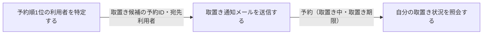
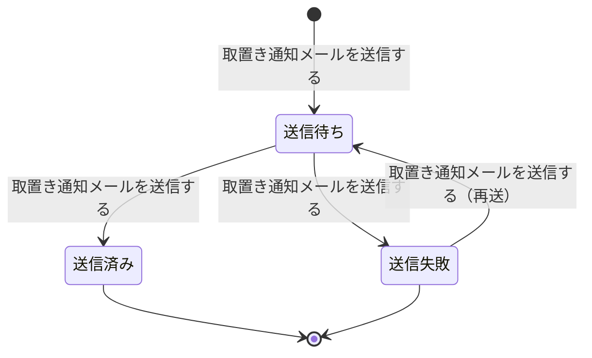
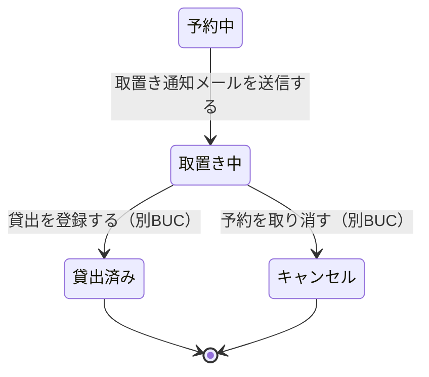

# 予約者へ通知するフロー

## 概要

予約のある書籍が返却されて書籍状態が「予約待ち」となった際に、予約順1位の利用者を取置き対象として特定し、メール配信サービス経由で取置き案内を送信して予約状態を「取置き中」へ遷移させる BUC。案内を受けた利用者は取置き状況を Web 画面で確認して来館の準備をする。

## 所属 UC 一覧

| UC名 | アクター | 主な操作 | 関連情報 |
|------|---------|---------|---------|
| [予約順1位の利用者を特定する](予約順1位の利用者を特定する/spec.md) | 司書（提供者） | 予約待ちの書籍について予約状態が「予約中」かつ予約順1位の予約 1 件と申込者を特定する | 予約、書籍、利用者 |
| [取置き通知メールを送信する](取置き通知メールを送信する/spec.md) | 司書（提供者） | 通知を「送信待ち」で作成し、メール配信サービスへ取置き案内メール送信依頼を発行して予約状態を「取置き中」へ遷移させる | 通知、予約、利用者 |
| [自分の取置き状況を照会する](自分の取置き状況を照会する/spec.md) | 利用者（受益者） | 本人の取置き中の予約と取置き期限を Web 画面で確認する | 予約、書籍、利用者アカウント |

## UC 横断データフロー

「予約順1位の利用者を特定する」が取置き候補の予約を確定し、「取置き通知メールを送信する」がその予約を対象に通知を作成・送信して予約状態を取置き中へ更新する。更新後の予約を「自分の取置き状況を照会する」が参照する。

### データフロー図

### 情報 CRUD マトリクス

| 情報名 | 予約順1位の利用者を特定する | 取置き通知メールを送信する | 自分の取置き状況を照会する |
|--------|:--------------------------:|:-------------------------:|:-------------------------:|
| 予約 | R | U | R |
| 書籍 | R | | R |
| 利用者 | R | R | |
| 利用者アカウント | | | R |
| 通知 | | C / U | |

## 状態遷移全体図

本 BUC は通知状態の送信進行と、それに連動する予約状態（予約中 → 取置き中）を扱う。書籍状態は判定に参照するのみで遷移させない。

### 状態遷移 UC マッピング

| 状態モデル | 遷移元 | 遷移先 | 担当 UC |
|-----------|--------|--------|--------|
| 通知状態 | （未生成） | 送信待ち | [取置き通知メールを送信する](取置き通知メールを送信する/spec.md) |
| 通知状態 | 送信待ち | 送信済み | [取置き通知メールを送信する](取置き通知メールを送信する/spec.md) |
| 通知状態 | 送信待ち | 送信失敗 | [取置き通知メールを送信する](取置き通知メールを送信する/spec.md) |
| 通知状態 | 送信失敗 | 送信待ち | [取置き通知メールを送信する](取置き通知メールを送信する/spec.md) |
| 予約状態 | 予約中 | 取置き中 | [取置き通知メールを送信する](取置き通知メールを送信する/spec.md) |
| 予約状態 | 予約中 | （遷移なし・候補判定に参照） | [予約順1位の利用者を特定する](予約順1位の利用者を特定する/spec.md) |
| 予約状態 | 取置き中 | （遷移なし・参照） | [自分の取置き状況を照会する](自分の取置き状況を照会する/spec.md) |
| 書籍状態 | 予約待ち | （遷移なし・通知可否判定に参照） | [予約順1位の利用者を特定する](予約順1位の利用者を特定する/spec.md) |

## BUC 内共有条件一覧

2 つ以上の UC で適用される条件を示す。

| 条件名 | 条件の説明 | 適用 UC |
|--------|----------|--------|
| 取置き通知対象条件 | 書籍状態が「予約待ち」となった書籍について、予約順1位かつ予約状態が「予約中」の予約 1 件を取置き通知の対象とする。通知送信後は当該予約の予約状態を「取置き中」に更新する | 予約順1位の利用者を特定する, 取置き通知メールを送信する |
| 個人情報参照可否条件 | 個人に紐づく予約・連絡先の参照範囲を限定する。利用者側は本人の予約のみを対象とし、司書側は連絡先を既定でマスクして明示操作で開示する | 予約順1位の利用者を特定する（司書側のマスク要件として UC spec で拡張）, 自分の取置き状況を照会する |

単一 UC のみで適用される条件（詳細は各 UC Spec を参照）。

| 条件名 | 適用 UC |
|--------|--------|
| 予約順位決定条件 | 予約順1位の利用者を特定する |

## BUC 内共有バリエーション一覧

2 つ以上の UC で適用されるバリエーションを示す。

| バリエーション名 | 値 | 適用 UC |
|----------------|---|--------|
| 通知種別 | 取置き案内（本 BUC で使用）／ 返却期限リマインド / 延滞督促 | 予約順1位の利用者を特定する, 取置き通知メールを送信する |
| 利用者区分 | 一般 / 学生 / 団体 | 予約順1位の利用者を特定する, 取置き通知メールを送信する |

単一 UC のみで適用されるバリエーション（詳細は各 UC Spec を参照）。

| バリエーション名 | 適用 UC |
|----------------|--------|
| 通知タイミング区分 | 取置き通知メールを送信する（取置き案内に対応する値が未定義のため設定しない。要確認） |
| 資料種別 | 自分の取置き状況を照会する |
| ジャンル | 自分の取置き状況を照会する |
