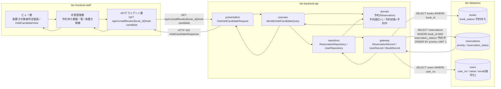
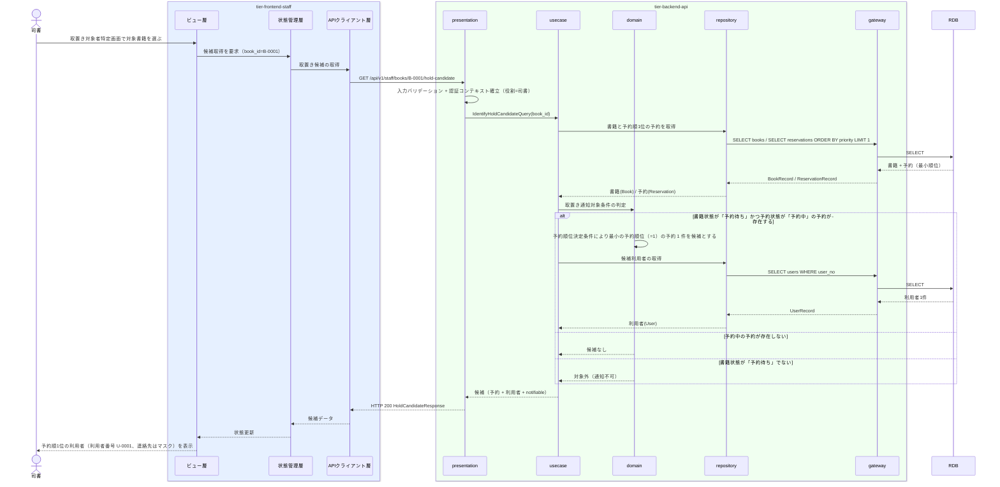

# 予約順1位の利用者を特定する

## 概要

予約のある書籍が返却されて書籍状態が「予約待ち」となった際に、司書がその書籍の取置き通知対象を特定する UC。取置き通知対象条件に従い、予約状態が「予約中」かつ予約順1位の予約 1 件と、その予約申込者を取置き対象として提示する。

## データフロー



| レイヤー | データモデル | 変換内容 |
|---------|------------|---------|
| FE ビュー層 | 取置き対象者特定画面（対象書籍・予約順1位の予約・対象利用者の表示） | 司書の「取置き対象を特定する」操作を候補取得リクエストへ変換 |
| FE 状態管理層 | 予約待ち書籍一覧 / 取置き候補 | 取得した候補をキャッシュし、取置き通知送信画面へ引き渡す |
| FE APIクライアント層 | GetHoldCandidateRequest(book_id) | 認証トークンの添付、trace_id の発行、タイムアウトとリトライ |
| BE presentation | GetHoldCandidateRequest(book_id) | 形式バリデーション、認証コンテキスト（役割=司書）の確立、Query へ変換 |
| BE usecase | IdentifyHoldCandidateQuery(book_id) | 読み取り専用トランザクション、監査ログ出力（個人情報の参照） |
| BE domain | 予約(Reservation)（予約順位・予約状態） | 取置き通知対象条件による候補判定（書籍状態=予約待ち かつ 予約状態=予約中 かつ 予約順1位） |
| BE gateway | ReservationRecord / UserRecord / BookRecord | reservations / users / books の SELECT。email は保管時暗号化から復号する |
| Response | HoldCandidateResponse(reservation_id, priority, user, book, notifiable) | 取置き候補を司書向け表示データへ変換（連絡先は既定マスク） |

## 処理フロー



## バリエーション一覧

| バリエーション名 | 値 | 処理内容 | 適用 tier | 適用箇所 |
|----------------|---|---------|----------|---------|
| 利用者区分 | 一般 / 学生 / 団体 | 取置き対象利用者の区分を UserProfileCard に表示する | tier-frontend-staff | 取置き対象者特定画面 |
| 通知種別 | 取置き案内 / 返却期限リマインド / 延滞督促 | 本 UC の後続で送信する通知種別を「取置き案内」に固定して引き渡す | tier-frontend-staff | 取置き対象者特定画面（取置き通知送信画面への引き渡し） |

## 分岐条件一覧

| 条件名 | 判定ルール | 適用 tier | 適用箇所 | BDD Scenario |
|--------|----------|----------|---------|-------------|
| 取置き通知対象条件 | 書籍状態が「予約待ち」となった書籍について、予約順1位かつ予約状態が「予約中」の予約 1 件を取置き通知の対象とする | tier-backend-api, tier-frontend-staff | GET /api/v1/staff/books/{book_id}/hold-candidate / 取置き対象者特定画面 | 予約待ちの書籍で予約順1位の利用者を特定できる |
| 予約順位決定条件 | 同一書籍への予約は申込日時の昇順で順位を付与する。「貸出済み」「キャンセル」の予約は順位対象から除外する | tier-backend-api | 最小 priority の予約 1 件の抽出 | キャンセル済みの予約は取置き対象にならない |
| 個人情報参照可否条件 | 司書が業務上必要な範囲で利用者情報を参照する。連絡先は既定でマスクし、明示操作で開示する | tier-frontend-staff | 取置き対象者特定画面（UserProfileCard） | 対象利用者の連絡先は既定でマスクされる |

## 計算ルール一覧

| 計算名 | 入力情報 | 計算式/ロジック | 出力情報 | 適用 tier |
|--------|---------|---------------|---------|----------|
| 取置き候補の抽出 | 予約.予約状態、予約.予約順位、予約.書籍ID | 同一 book_id で予約状態が「予約中」の予約のうち予約順位が最小（=1）の 1 件を選ぶ | 取置き候補の予約ID | tier-backend-api |
| 通知可否の判定 | 書籍.書籍状態、予約の有無 | 書籍状態が「予約待ち」かつ候補予約が存在する場合に notifiable=true とする | 取置き通知送信画面への遷移可否 | tier-backend-api |
| 残り予約件数 | 予約.予約状態 | 同一書籍で予約状態が「予約中」の件数から候補 1 件を引いた数 | 後続待ち人数の表示 | tier-backend-api |

## 状態遷移一覧

| 状態モデル | 遷移元 | 遷移先 | トリガー | 事前条件 | 事後処理 | 適用 tier |
|-----------|--------|--------|---------|---------|---------|----------|
| 予約状態 | 予約中 | （遷移なし） | 予約順1位の利用者を特定する | 書籍状態が「予約待ち」 | 参照のみ。取置き中への遷移は UC「取置き通知メールを送信する」で行う | tier-backend-api |
| 書籍状態 | 予約待ち | （遷移なし） | 予約順1位の利用者を特定する | 返却により予約待ちとなっていること | 参照のみ。状態は変化しない | tier-backend-api |

## 関連 RDRA モデル

| モデル種別 | 要素名 | 関連 |
|-----------|--------|------|
| 業務 | 予約管理業務 | このUCが属する業務 |
| BUC | 予約者へ通知するフロー | このUCを含むBUC |
| アクティビティ | 取置き対象者を特定する | このUCが実現するアクティビティ |
| アクター | 司書 | 操作するアクター（立場: 提供者） |
| 画面 | 取置き対象者特定画面 | 操作画面 |
| 情報 | 予約 | 参照する情報 |
| 情報 | 書籍 | 予約待ち判定に参照する情報 |
| 情報 | 利用者 | 取置き対象者として参照する情報 |
| 状態 | 予約状態 | 判定に使う状態 |
| 状態 | 書籍状態 | 判定に使う状態 |
| 条件 | 取置き通知対象条件 | 適用される条件 |
| 条件 | 予約順位決定条件 | 適用される条件 |

## E2E 完了条件（BDD）

### 正常系

```gherkin
Feature: 予約順1位の利用者を特定する

  Scenario: 予約待ちの書籍で予約順1位の利用者を特定できる
    Given 司書「山田司書」がログイン済み
    And 書籍「吾輩は猫である」（書籍ID B-0001）の書籍状態が「予約待ち」
    And 書籍 B-0001 に予約順位 1 の「予約中」予約 R-0007（利用者番号 U-0001）が存在する
    And 書籍 B-0001 に予約順位 2 の「予約中」予約 R-0008 が存在する
    When 司書が取置き対象者特定画面で書籍 B-0001 の取置き対象を特定する
    Then 予約 R-0007 が取置き候補として表示される
    And 利用者番号 U-0001 と利用者区分「一般」が表示される
    And 後続の待ち人数として 1 件が表示される

  Scenario: 取置き通知送信画面へ引き渡せる
    Given 書籍 B-0001 の取置き候補として予約 R-0007 が特定されている
    When 司書が「取置き通知へ進む」を押下する
    Then 取置き通知送信画面 /staff/holds/notify へ遷移する
    And 通知種別「取置き案内」と予約ID R-0007 が引き渡される
```

### 異常系

```gherkin
  Scenario: 予約中の予約が無い書籍では候補が存在しない
    Given 書籍「坊っちゃん」（書籍ID B-0002）の書籍状態が「予約待ち」
    And 書籍 B-0002 の予約はすべて予約状態が「キャンセル」である
    When 司書が書籍 B-0002 の取置き対象を特定する
    Then HTTP 200 で candidate が null として返る
    And 「取置き対象の予約がありません」という EmptyState が表示される

  Scenario: 在庫ありの書籍は取置き対象にならない
    Given 書籍「こころ」（書籍ID B-0003）の書籍状態が「在庫あり」
    When 司書が書籍 B-0003 の取置き対象を特定する
    Then notifiable が false で返る
    And 「この書籍は予約待ちではないため取置き対象になりません」と表示される

  Scenario: 役割が利用者のアカウントでは特定できない
    Given 役割が利用者のアクセストークンを保持している
    When GET /api/v1/staff/books/B-0001/hold-candidate を送信する
    Then HTTP 403 が返り「この操作は司書のみ実行できます」と表示される
    And 利用者情報は返らない
```

## ティア別仕様

- [司書ポータル](tier-frontend-staff.md)
- [バックエンド API](tier-backend-api.md)

### 統合 API Spec

- [OpenAPI Spec](../../../_cross-cutting/api/openapi.yaml)（全 UC 統合、Contract First 開発用）
