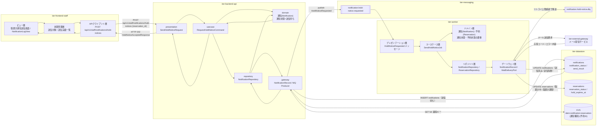
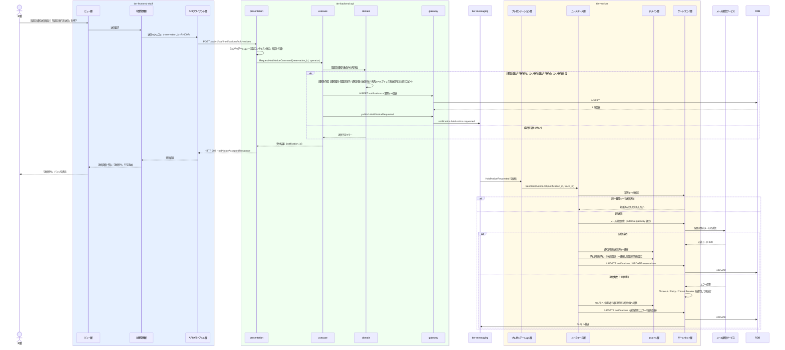

# 取置き通知メールを送信する

## 概要

外部システム「メール配信サービス」と連携して、取置き可能となった旨を予約順1位の利用者へ送信する UC。バックエンド API が通知を「送信待ち」で作成してメッセージングへ送信要求を発行し、ワーカーが実際の送信と結果記録を担う。送信成功時は予約状態を「予約中」から「取置き中」へ遷移させる。

## データフロー



| レイヤー | データモデル | 変換内容 |
|---------|------------|---------|
| FE ビュー層 | 取置き通知送信画面（送信対象・送信実績一覧・未達件数） | 司書の「送信」操作を送信要求へ変換。送信失敗行に再送操作を出す |
| FE 状態管理層 | 送信対象 / 送信実績一覧 | 202 応答後に送信実績一覧をポーリング再取得し、通知状態の遷移を反映する |
| FE APIクライアント層 | SendHoldNoticeRequest(reservation_id) + X-Idempotency-Key | 冪等キーの付与、認証トークンの添付、trace_id の発行 |
| BE presentation | SendHoldNoticeRequest(reservation_id) | 形式バリデーション、認証コンテキスト（役割=司書）の確立、Command へ変換 |
| BE usecase | RequestHoldNoticeCommand(reservation_id, operator) | 取置き通知対象条件の再評価、通知の作成、送信要求の発行をトランザクション境界で制御 |
| BE domain | 通知(Notification)（通知種別=取置き案内・宛先・対象予約ID・通知状態=送信待ち） | 送信時点の宛先メールアドレスをコピーして保持する不変条件の適用 |
| BE gateway | NotificationRecord / MQ Producer | notifications への INSERT、`notification.hold-notice.requested` への publish |
| MQ メッセージ | HoldNoticeRequested(notification_id, reservation_id, recipient_user_no, trace_id) | 非同期の送信要求。at-least-once 配信のため冪等キーを同梱する |
| WK プレゼンテーション層 | HoldNoticeRequested メッセージ | メッセージのデシリアライズ、trace_id の引き継ぎ（arch CLR-005） |
| WK usecase | SendHoldNoticeJob(notification_id) | 冪等判定、外部送信、結果記録、予約状態遷移をチャンク単位のトランザクションで制御 |
| WK domain | 通知(Notification) / 予約(Reservation) | 通知状態の「送信待ち → 送信済み / 送信失敗」遷移、予約状態の「予約中 → 取置き中」遷移 |
| WK gateway | MailDeliveryPort / NotificationRecord | external-gateway ティア経由でメール配信サービスへ送信し、応答を送信結果へ記録する |
| Response | HoldNoticeAcceptedResponse(notification_id, notification_status) | 受付結果を送信実績一覧の初期行へ変換 |

## 処理フロー



## バリエーション一覧

| バリエーション名 | 値 | 処理内容 | 適用 tier | 適用箇所 |
|----------------|---|---------|----------|---------|
| 通知種別 | 取置き案内 / 返却期限リマインド / 延滞督促 | 本 UC では「取置き案内」を固定で設定し、送信実績一覧のフィルターにも使う | tier-backend-api, tier-worker, tier-frontend-staff | 通知の作成 / 取置き通知送信画面 |
| 通知タイミング区分 | 期限前リマインド / 期限当日 / 期限超過督促 | いずれも期限起点の区分であり取置き案内に対応する値が定義されていない。新規値を追加せず、本 UC では設定しない（要確認） | tier-backend-api | 通知の作成 |
| 利用者区分 | 一般 / 学生 / 団体 | 宛先利用者の区分を送信実績の絞り込み条件として表示する | tier-frontend-staff | 取置き通知送信画面 |

## 分岐条件一覧

| 条件名 | 判定ルール | 適用 tier | 適用箇所 | BDD Scenario |
|--------|----------|----------|---------|-------------|
| 取置き通知対象条件 | 書籍状態が「予約待ち」となった書籍について、予約順1位かつ予約状態が「予約中」の予約 1 件を取置き通知の対象とする。通知送信後は当該予約の予約状態を「取置き中」に更新する | tier-backend-api, tier-worker | POST /api/v1/staff/notifications/hold-notices / SendHoldNoticeJob | 取置き案内メールを送信すると予約状態が取置き中になる |
| 重複送信抑止（取置き通知対象条件の一部） | 通知種別と対象予約IDから決定的に生成した冪等キーが既に存在する場合は、新規の通知作成と送信を行わない | tier-backend-api, tier-worker | 冪等キーの登録・確認 | 同一予約への取置き案内は重複送信されない |
| 送信結果による通知状態の分岐 | メール配信サービスへの送信が成功すると「送信済み」、失敗すると「送信失敗」へ遷移する。送信失敗は再送対象として「送信待ち」へ戻せる | tier-worker, tier-frontend-staff | SendHoldNoticeJob / 取置き通知送信画面 | 送信失敗時に未達として記録され再送できる |

## 計算ルール一覧

| 計算名 | 入力情報 | 計算式/ロジック | 出力情報 | 適用 tier |
|--------|---------|---------------|---------|----------|
| 通知送信冪等キーの生成 | 通知.通知種別、通知.対象予約ID | 「取置き案内」+ 対象予約ID を連結して決定的に生成する（E-902 通知送信冪等キー） | 通知送信冪等キー | tier-backend-api |
| 宛先メールアドレスの確定 | 利用者.連絡先（メールアドレス） | 送信時点の値をコピーして通知へ保持し、以後の利用者側の変更に追随させない | 通知.宛先メールアドレス | tier-backend-api |
| 取置き期限の設定 | 送信実行日時 | 送信実行日時を起点に取置き期限を算出してメール本文へ埋め込み、送信成功時に同じ算出値を `hold_expires_at` として確定する。期限日数は RDRA / NFR に定義が無いため運用パラメータとする（要確認） | 予約.取置き期限 | tier-worker |
| 未達件数の集計 | 通知.通知状態 | 通知種別が「取置き案内」かつ通知状態が「送信失敗」の件数を数える | 取置き通知送信画面の未達件数警告 | tier-frontend-staff |

## 状態遷移一覧

| 状態モデル | 遷移元 | 遷移先 | トリガー | 事前条件 | 事後処理 | 適用 tier |
|-----------|--------|--------|---------|---------|---------|----------|
| 通知状態 | （未生成） | 送信待ち | 取置き通知メールを送信する | 取置き通知対象条件を満たす | 送信要求を `notification.hold-notice.requested` へ publish する | tier-backend-api |
| 通知状態 | 送信待ち | 送信済み | 取置き通知メールを送信する | メール配信サービスへの送信が成功 | 予約状態を取置き中へ遷移させ、重複送信を抑止する | tier-worker |
| 通知状態 | 送信待ち | 送信失敗 | 取置き通知メールを送信する | メール配信サービスとの連携に失敗 | 送信結果にエラー内容を記録し、DLQ へ移送して司書が未達を追跡できるようにする | tier-worker |
| 通知状態 | 送信失敗 | 送信待ち | 取置き通知メールを送信する（再送） | 司書が再送を指示 | 再送対象として送信要求を再 publish する | tier-backend-api |
| 予約状態 | 予約中 | 取置き中 | 取置き通知メールを送信する | 通知が送信済みになったこと | 取置き期限を設定する | tier-worker |

## 関連 RDRA モデル

| モデル種別 | 要素名 | 関連 |
|-----------|--------|------|
| 業務 | 予約管理業務 | このUCが属する業務 |
| BUC | 予約者へ通知するフロー | このUCを含むBUC |
| アクティビティ | 取置き可能を通知する | このUCが実現するアクティビティ |
| アクター | 司書 | 操作するアクター（立場: 提供者） |
| 画面 | 取置き通知送信画面 | 操作画面 |
| 情報 | 通知 | 作成・更新する情報 |
| 情報 | 予約 | 取置き中へ更新する情報 |
| 情報 | 利用者 | 宛先として参照する情報 |
| 状態 | 通知状態 | 送信待ち → 送信済み / 送信失敗の状態遷移 |
| 状態 | 予約状態 | 予約中 → 取置き中の状態遷移 |
| 条件 | 取置き通知対象条件 | 適用される条件 |
| イベント | 取置き案内メール送信依頼 | 外部システムへの送信依頼 |
| 外部システム | メール配信サービス | 連携する外部システム |

## E2E 完了条件（BDD）

### 正常系

```gherkin
Feature: 取置き通知メールを送信する

  Scenario: 取置き案内メールを送信すると予約状態が取置き中になる
    Given 司書「山田司書」がログイン済み
    And 書籍「吾輩は猫である」（書籍ID B-0001）の書籍状態が「予約待ち」
    And 予約 R-0007（利用者番号 U-0001、予約順位 1）の予約状態が「予約中」
    When 司書が取置き通知送信画面で予約 R-0007 への取置き案内送信を実行する
    Then 通知種別「取置き案内」の通知が通知状態「送信待ち」で作成される
    And メール配信サービスへの送信が成功すると通知状態が「送信済み」になる
    And 予約 R-0007 の予約状態が「取置き中」になり取置き期限が設定される

  Scenario: 送信実績が送信実績一覧に表示される
    Given 予約 R-0007 への取置き案内が送信済みである
    When 司書が取置き通知送信画面を開く
    Then 送信実績一覧に「送信済み」バッジの行が表示される
    And 宛先利用者番号 U-0001 と送信日時が表示される
```

### 異常系

```gherkin
  Scenario: メール配信サービスとの連携に失敗すると送信失敗として記録される
    Given 予約 R-0007 への取置き案内が通知状態「送信待ち」で作成されている
    And メール配信サービスがエラー応答を返す
    When ワーカーが取置き案内メールの送信を実行する
    Then リトライ上限を超えた時点で通知状態が「送信失敗」になる
    And 送信結果にメール配信サービスの応答コードとエラー内容が記録される
    And 予約 R-0007 の予約状態は「予約中」のまま変わらない

  Scenario: 同一予約への取置き案内は重複送信されない
    Given 予約 R-0007 への取置き案内が通知状態「送信済み」で存在する
    When 司書が予約 R-0007 への取置き案内送信を再度実行する
    Then HTTP 409 が返り「この予約への取置き案内は送信済みです」と表示される
    And 通知は追加作成されない

  Scenario: 予約中でない予約には送信できない
    Given 予約 R-0300 の予約状態が「キャンセル」
    When 司書が予約 R-0300 への取置き案内送信を実行する
    Then HTTP 409 が返り「取置き通知対象条件を満たしません」と表示される
    And 通知は作成されない

  Scenario: 送信失敗した通知を再送できる
    Given 通知 N-0001 の通知状態が「送信失敗」である
    When 司書が送信実績一覧で通知 N-0001 の「再送」を押下する
    Then 通知状態が「送信待ち」へ戻る
    And 送信要求が再度 notification.hold-notice.requested へ発行される
```

## ティア別仕様

- [司書ポータル](tier-frontend-staff.md)
- [バックエンド API](tier-backend-api.md)
- [バックエンドワーカー](tier-worker.md)

### 統合 API Spec

- [OpenAPI Spec](../../../_cross-cutting/api/openapi.yaml)（全 UC 統合、Contract First 開発用）
- [AsyncAPI Spec](../../../_cross-cutting/api/asyncapi.yaml)（全 UC 統合、非同期イベント）
