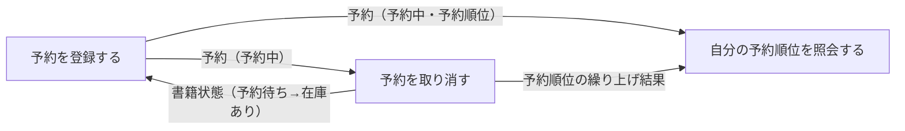
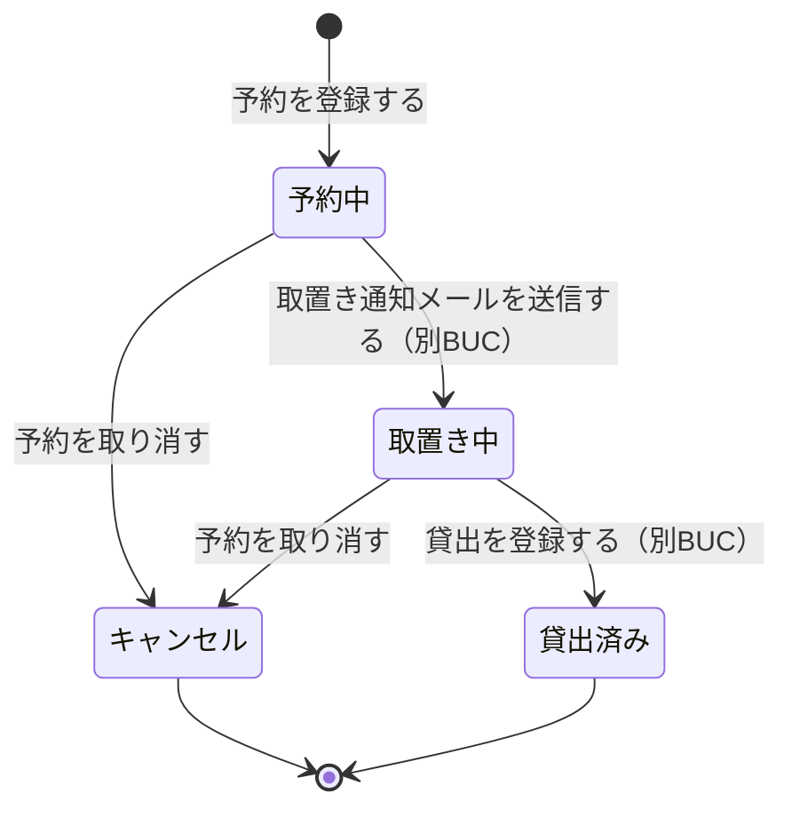
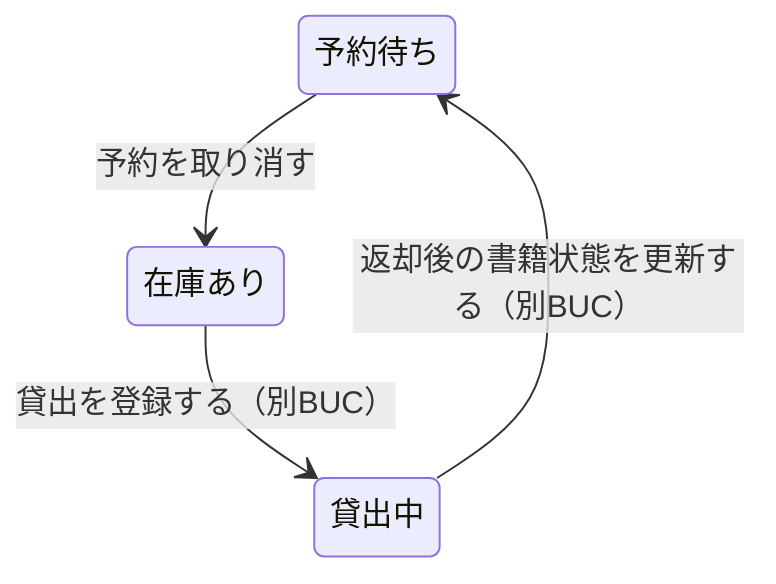
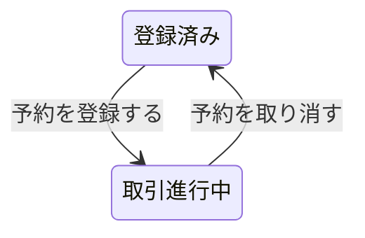

# 書籍を予約するフロー

## 概要

貸出中の書籍に対する利用者の予約申込を受け付け、申込順の予約順位を維持し、取消の申し出に応じて予約を無効化する BUC。予約可否条件・重複予約禁止条件・予約順位決定条件を軸に、予約 1 件のライフサイクルの入口（登録）と出口（取消）、および利用者からの順位確認を扱う。

## 所属 UC 一覧

| UC名 | アクター | 主な操作 | 関連情報 |
|------|---------|---------|---------|
| [予約を登録する](予約を登録する/spec.md) | 利用者（提供者） | 貸出中の書籍に予約を登録し、予約状態を「予約中」として予約順位を採番する | 予約、書籍、利用者 |
| [予約を取り消す](予約を取り消す/spec.md) | 司書（提供者） | 利用者の申し出により予約状態を「キャンセル」へ遷移させ、後続予約の順位を繰り上げる | 予約、書籍、利用者 |
| [自分の予約順位を照会する](自分の予約順位を照会する/spec.md) | 利用者（受益者） | 本人の予約の予約順位と待ち人数を Web 画面で確認する | 予約、書籍、利用者アカウント |

## UC 横断データフロー

「予約を登録する」が予約と予約順位を生成し、「自分の予約順位を照会する」がそれを参照する。「予約を取り消す」は予約状態をキャンセルへ変えたうえで後続予約の予約順位を更新するため、照会結果に反映される。

### データフロー図

### 情報 CRUD マトリクス

| 情報名 | 予約を登録する | 予約を取り消す | 自分の予約順位を照会する |
|--------|:-------------:|:-------------:|:-----------------------:|
| 予約 | C | U | R |
| 書籍 | R | U | R |
| 利用者 | U | U | |
| 利用者アカウント | | | R |

> 「予約を登録する」「予約を取り消す」の利用者 U は、利用者状態遷移に伴う更新を指す。予約登録時は登録済み → 取引進行中、予約取消時は貸出中・延滞の貸出と予約中・取置き中の予約が残らない場合に取引進行中 → 登録済みへ更新する。

## 状態遷移全体図

本 BUC は予約状態を主に扱い、予約取消の副作用として書籍状態（予約待ち → 在庫あり）へ波及する。

### 状態遷移 UC マッピング

| 状態モデル | 遷移元 | 遷移先 | 担当 UC |
|-----------|--------|--------|--------|
| 予約状態 | （未生成） | 予約中 | [予約を登録する](予約を登録する/spec.md) |
| 予約状態 | 予約中 | キャンセル | [予約を取り消す](予約を取り消す/spec.md) |
| 予約状態 | 取置き中 | キャンセル | [予約を取り消す](予約を取り消す/spec.md) |
| 予約状態 | 予約中 | （遷移なし・参照） | [自分の予約順位を照会する](自分の予約順位を照会する/spec.md) |
| 予約状態 | 取置き中 | （遷移なし・参照） | [自分の予約順位を照会する](自分の予約順位を照会する/spec.md) |
| 書籍状態 | 予約待ち | 在庫あり | [予約を取り消す](予約を取り消す/spec.md) |
| 書籍状態 | 貸出中 | （遷移なし・予約可否判定に参照） | [予約を登録する](予約を登録する/spec.md) |
| 利用者状態 | 登録済み | 取引進行中 | [予約を登録する](予約を登録する/spec.md) |
| 利用者状態 | 取引進行中 | 登録済み | [予約を取り消す](予約を取り消す/spec.md) |

## BUC 内共有条件一覧

2 つ以上の UC で適用される条件を示す。

| 条件名 | 条件の説明 | 適用 UC |
|--------|----------|--------|
| 予約順位決定条件 | 同一書籍への予約は申込日時の昇順で順位を付与する。予約状態が「貸出済み」「キャンセル」になった予約は順位の対象から除外し、後続の予約を繰り上げる | 予約を登録する, 予約を取り消す, 自分の予約順位を照会する |

単一 UC のみで適用される条件（詳細は各 UC Spec を参照）。

| 条件名 | 適用 UC |
|--------|--------|
| 予約可否条件 | 予約を登録する |
| 重複予約禁止条件 | 予約を登録する |
| 個人情報参照可否条件 | 自分の予約順位を照会する |

## BUC 内共有バリエーション一覧

2 つ以上の UC で適用されるバリエーションを示す。

| バリエーション名 | 値 | 適用 UC |
|----------------|---|--------|
| 資料種別 | 紙書籍 / 電子書籍 | 予約を登録する, 予約を取り消す, 自分の予約順位を照会する |
| ジャンル | 文学 / 人文 / 社会科学 / 自然科学 / 技術 / 芸術 / 児童 / その他 | 予約を登録する, 自分の予約順位を照会する |
