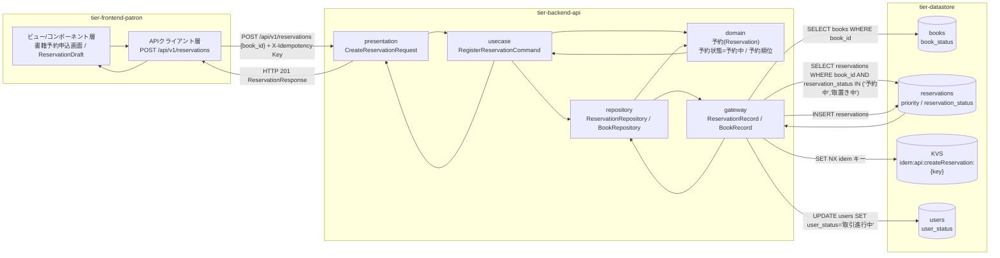
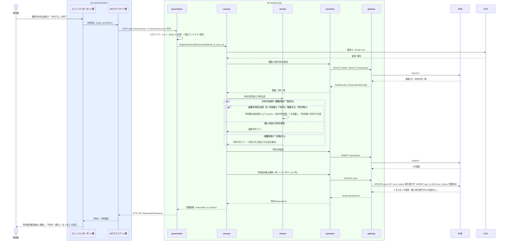

# 予約を登録する

## 概要

利用者が貸出中の書籍に対して予約を登録する UC。予約可否条件（書籍状態が「貸出中」であること）と重複予約禁止条件を満たす場合のみ予約を受け付け、予約状態を「予約中」とし、申込日時の昇順で予約順位を付与する。

## データフロー



| レイヤー | データモデル | 変換内容 |
|---------|------------|---------|
| FE ビュー/コンポーネント層 | 書籍予約申込画面（書籍ID・タイトル・書籍状態・見込み順位の表示、予約するボタン） | 利用者の「予約する」操作を予約申込リクエストへ変換。二重送信防止のため送信中は Button を `aria-busy` かつ disabled にする |
| FE APIクライアント層 | CreateReservationRequest(book_id) + X-Idempotency-Key(UUID) | 冪等キーの付与、認証トークンの添付、trace_id の発行 |
| BE presentation | CreateReservationRequest(book_id) | 形式バリデーション（book_id 必須）、認証コンテキスト（user_no / role）の確立、RegisterReservationCommand へ変換 |
| BE usecase | RegisterReservationCommand(book_id, user_no, idempotency_key) | 冪等キー検証、トランザクション境界の設定、監査ログ出力 |
| BE domain | 予約(Reservation)（予約ID・書籍ID・利用者番号・予約申込日時・予約順位・予約状態） | 予約可否条件・重複予約禁止条件の判定、予約順位決定条件による順位付与、予約状態=予約中の生成 |
| BE gateway | ReservationRecord / BookRecord | reservations への INSERT、books と reservations の SELECT |
| Response | ReservationResponse(reservation_id, book_id, book_title, user_no, applied_at, priority, reservation_status, total_reservations) | 予約順位と予約状態を ReservationQueueTracker の表示データへ変換 |

## 処理フロー



## バリエーション一覧

| バリエーション名 | 値 | 処理内容 | 適用 tier | 適用箇所 |
|----------------|---|---------|----------|---------|
| 資料種別 | 紙書籍 / 電子書籍 | 予約申込画面で対象書籍の資料種別を表示する。初期リリースでは紙書籍のみ有効 | tier-frontend-patron | 書籍予約申込画面（BookCard） |
| ジャンル | 文学 / 人文 / 社会科学 / 自然科学 / 技術 / 芸術 / 児童 / その他 | 予約対象書籍の分類として表示する | tier-frontend-patron | 書籍予約申込画面（BookCard） |

## 分岐条件一覧

| 条件名 | 判定ルール | 適用 tier | 適用箇所 | BDD Scenario |
|--------|----------|----------|---------|-------------|
| 予約可否条件 | 書籍状態が「貸出中」の書籍に対してのみ予約を受け付ける。「在庫あり」の書籍への予約申込は、予約せずに貸出できる旨を案内して受け付けない | tier-backend-api, tier-frontend-patron | POST /api/v1/reservations / 書籍予約申込画面 | 在庫ありの書籍には予約を登録できない |
| 重複予約禁止条件 | 同一利用者が同一書籍に対して予約状態が「予約中」または「取置き中」の予約を既に持つ場合、再度の予約申込を受け付けない | tier-backend-api, tier-frontend-patron | POST /api/v1/reservations / 書籍予約申込画面 | 同一書籍への重複予約は受け付けられない |
| 予約順位決定条件 | 同一書籍への予約は申込日時の昇順で順位を付与する。予約状態が「貸出済み」「キャンセル」になった予約は順位の対象から除外する | tier-backend-api | RegisterReservationCommand（予約順位の採番） | 貸出中の書籍を予約すると予約中で順位が付与される |

## 計算ルール一覧

| 計算名 | 入力情報 | 計算式/ロジック | 出力情報 | 適用 tier |
|--------|---------|---------------|---------|----------|
| 予約順位の採番 | 予約.予約状態、予約.予約申込日時 | 同一 book_id で予約状態が「予約中」「取置き中」の予約件数を数え、+1 を新規予約の予約順位とする（申込日時の昇順と一致する） | 予約.予約順位 | tier-backend-api |
| 見込み待ち人数の提示 | 予約.予約順位 | 予約順位 - 1 を「自分より前に待っている人数」として表示する | 書籍予約申込画面の見込み順位 | tier-frontend-patron |

## 状態遷移一覧

| 状態モデル | 遷移元 | 遷移先 | トリガー | 事前条件 | 事後処理 | 適用 tier |
|-----------|--------|--------|---------|---------|---------|----------|
| 予約状態 | （未生成） | 予約中 | 予約を登録する | 書籍状態が「貸出中」かつ同一利用者の有効な予約が無い | 予約順位を採番して reservations へ登録する | tier-backend-api |
| 利用者状態 | 登録済み | 取引進行中 | 予約を登録する | 予約が登録されたこと | 利用者削除可否条件の判定対象になる | tier-backend-api |

## 関連 RDRA モデル

| モデル種別 | 要素名 | 関連 |
|-----------|--------|------|
| 業務 | 予約管理業務 | このUCが属する業務 |
| BUC | 書籍を予約するフロー | このUCを含むBUC |
| アクティビティ | 貸出中の書籍を予約する | このUCが実現するアクティビティ |
| アクター | 利用者 | 操作するアクター（立場: 提供者） |
| 画面 | 書籍予約申込画面 | 操作画面 |
| 情報 | 予約 | 登録する情報 |
| 情報 | 書籍 | 予約可否判定に参照する情報 |
| 情報 | 利用者 | 予約申込者として参照し、利用者状態を更新する情報 |
| 状態 | 予約状態 | 予約中を生成する状態遷移 |
| 状態 | 利用者状態 | 登録済み → 取引進行中（予約の登録により取引進行中へ遷移する） |
| 条件 | 予約可否条件 | 適用される条件 |
| 条件 | 重複予約禁止条件 | 適用される条件 |
| 条件 | 予約順位決定条件 | 適用される条件 |

## E2E 完了条件（BDD）

### 正常系

```gherkin
Feature: 予約を登録する

  Scenario: 貸出中の書籍を予約すると予約中で順位が付与される
    Given 利用者「田中太郎」（利用者番号 U-0001）がログイン済み
    And 書籍「吾輩は猫である」（書籍ID B-0001）の書籍状態が「貸出中」
    And 書籍 B-0001 には予約状態が「予約中」の予約が 2 件ある
    When 利用者が書籍予約申込画面で「予約する」を押下する
    Then 予約状態が「予約中」の予約が 1 件登録される
    And 予約順位が 3 として付与される
    And 利用者「田中太郎」の利用者状態が「登録済み」から「取引進行中」になる
    And 予約順位確認画面に「予約中（順位 3 / 全 3 件）」が表示される

  Scenario: 予約が 1 件も無い貸出中の書籍を予約すると順位 1 になる
    Given 利用者「佐藤花子」（利用者番号 U-0002）がログイン済み
    And 書籍「坊っちゃん」（書籍ID B-0002）の書籍状態が「貸出中」
    And 書籍 B-0002 には有効な予約が存在しない
    When 利用者が書籍予約申込画面で「予約する」を押下する
    Then 予約順位が 1 の予約が登録される
    And 予約状態が「予約中」になる
```

### 異常系

```gherkin
  Scenario: 在庫ありの書籍には予約を登録できない
    Given 利用者「田中太郎」（利用者番号 U-0001）がログイン済み
    And 書籍「こころ」（書籍ID B-0003）の書籍状態が「在庫あり」
    When 利用者が書籍 B-0003 の予約申込を送信する
    Then HTTP 409 が返り「この本は予約せずにそのまま借りられます」と案内される
    And 予約は登録されない

  Scenario: 予約待ちの書籍には予約を登録できない
    Given 利用者「田中太郎」（利用者番号 U-0001）がログイン済み
    And 書籍「坊っちゃん」（書籍ID B-0004）の書籍状態が「予約待ち」
    When 利用者が書籍 B-0004 の予約申込を送信する
    Then HTTP 409 が返り「この本は取置き中のため予約を受け付けられません」と案内される
    And 予約は登録されない

  Scenario: 同一書籍への重複予約は受け付けられない
    Given 利用者「田中太郎」（利用者番号 U-0001）がログイン済み
    And 利用者 U-0001 は書籍 B-0001 に予約状態が「予約中」の予約を既に持つ
    When 利用者が書籍 B-0001 の予約申込を送信する
    Then HTTP 409 が返り「この本はすでに予約済みです」と表示される
    And 予約は追加されない

  Scenario: 存在しない書籍への予約は受け付けられない
    Given 利用者「田中太郎」（利用者番号 U-0001）がログイン済み
    When 利用者が書籍ID「B-9999」の予約申込を送信する
    Then HTTP 404 が返り「対象の書籍が見つかりません」と表示される
    And 予約は登録されない
```

## ティア別仕様

- [利用者ポータル](tier-frontend-patron.md)
- [バックエンド API](tier-backend-api.md)

### 統合 API Spec

- [OpenAPI Spec](../../../_cross-cutting/api/openapi.yaml)（全 UC 統合、Contract First 開発用）
