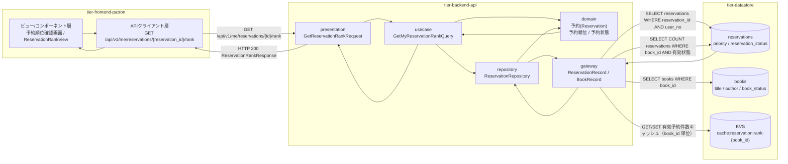
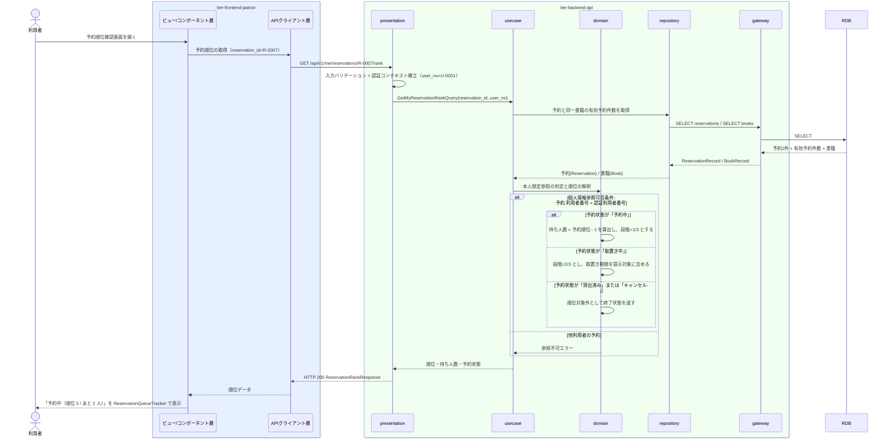

# 自分の予約順位を照会する

## 概要

利用者が自分の予約 1 件について、申込順に付与された予約順位と待ち人数を Web 画面で確認し、貸出可能となる見込みを把握する UC。個人情報参照可否条件により、ログイン中の利用者本人に紐づく予約のみを照会対象とする。

## データフロー



| レイヤー | データモデル | 変換内容 |
|---------|------------|---------|
| FE ビュー/コンポーネント層 | 予約順位確認画面（書籍・予約状態・順位・待ち人数の表示） | 予約順位を ReservationQueueTracker の段階表示（予約中 → 取置き中 → 貸出済み）へ変換 |
| FE APIクライアント層 | GetReservationRankRequest(reservation_id) | 認証トークンの添付、trace_id の発行、タイムアウトとリトライ |
| BE presentation | GetReservationRankRequest(reservation_id) | 形式バリデーション、認証コンテキスト（user_no）の確立、Query へ変換 |
| BE usecase | GetMyReservationRankQuery(reservation_id, user_no) | 本人限定参照の適用、読み取り専用トランザクション |
| BE domain | 予約(Reservation)（予約順位・予約状態・取置き期限） | 所有者ベースの認可判定（予約.利用者番号 = 認証利用者番号）、待ち人数の算出 |
| BE gateway | ReservationRecord / BookRecord | reservations と books の SELECT、参照キャッシュの読み書き |
| Response | ReservationRankResponse(priority, waiting_ahead, total_reservations, reservation_status, book) | 順位・待ち人数を段階表示と数値表示のデータへ変換 |

## 処理フロー



## バリエーション一覧

| バリエーション名 | 値 | 処理内容 | 適用 tier | 適用箇所 |
|----------------|---|---------|----------|---------|
| 資料種別 | 紙書籍 / 電子書籍 | 予約対象書籍の資料種別を BookCard に表示する | tier-frontend-patron | 予約順位確認画面 |
| ジャンル | 文学 / 人文 / 社会科学 / 自然科学 / 技術 / 芸術 / 児童 / その他 | 予約対象書籍の分類として表示する | tier-frontend-patron | 予約順位確認画面 |

## 分岐条件一覧

| 条件名 | 判定ルール | 適用 tier | 適用箇所 | BDD Scenario |
|--------|----------|----------|---------|-------------|
| 個人情報参照可否条件 | 予約状況の照会は、ログイン中の利用者本人に紐づく予約のみを対象とする。他の利用者の予約は表示しない | tier-backend-api, tier-frontend-patron | GET /api/v1/me/reservations/{id}/rank / 予約順位確認画面 | 他利用者の予約順位は照会できない |
| 予約順位決定条件 | 同一書籍への予約は申込日時の昇順で順位を付与する。予約状態が「貸出済み」「キャンセル」の予約は順位対象から除外する | tier-backend-api | 待ち人数と有効予約件数の算出 | 自分の予約順位と待ち人数を確認できる |

## 計算ルール一覧

| 計算名 | 入力情報 | 計算式/ロジック | 出力情報 | 適用 tier |
|--------|---------|---------------|---------|----------|
| 待ち人数の算出 | 予約.予約順位 | 待ち人数 = 予約順位 - 1（自分より前に待っている人数） | 予約順位確認画面の待ち人数 | tier-backend-api |
| 有効予約件数の算出 | 予約.予約状態、予約.書籍ID | 同一 book_id で予約状態が「予約中」「取置き中」の件数を数える | ReservationQueueTracker の totalReservations | tier-backend-api |

## 状態遷移一覧

| 状態モデル | 遷移元 | 遷移先 | トリガー | 事前条件 | 事後処理 | 適用 tier |
|-----------|--------|--------|---------|---------|---------|----------|
| 予約状態 | 予約中 | （遷移なし） | 自分の予約順位を照会する | 本人の予約であること | 参照のみ。状態は変化しない | tier-backend-api |
| 予約状態 | 取置き中 | （遷移なし） | 自分の予約順位を照会する | 本人の予約であること | 参照のみ。取置き期限を併せて表示する | tier-backend-api |

## 関連 RDRA モデル

| モデル種別 | 要素名 | 関連 |
|-----------|--------|------|
| 業務 | 予約管理業務 | このUCが属する業務 |
| BUC | 書籍を予約するフロー | このUCを含むBUC |
| アクティビティ | 予約順位を確認する | このUCが実現するアクティビティ |
| アクター | 利用者 | 操作するアクター（立場: 受益者） |
| 画面 | 予約順位確認画面 | 操作画面 |
| 情報 | 予約 | 参照する情報 |
| 情報 | 書籍 | 予約対象として参照する情報 |
| 情報 | 利用者アカウント | 本人限定参照の判定に使う情報 |
| 状態 | 予約状態 | 表示する状態 |
| 条件 | 個人情報参照可否条件 | 適用される条件 |
| 条件 | 予約順位決定条件 | 適用される条件 |

## E2E 完了条件（BDD）

### 正常系

```gherkin
Feature: 自分の予約順位を照会する

  Scenario: 自分の予約順位と待ち人数を確認できる
    Given 利用者「田中太郎」（利用者番号 U-0001）がログイン済み
    And 利用者 U-0001 は書籍「吾輩は猫である」に予約状態「予約中」・予約順位 3 の予約 R-0007 を持つ
    And 書籍「吾輩は猫である」の有効な予約は 5 件である
    When 利用者が予約順位確認画面 /reservations/R-0007/rank を開く
    Then 「予約中」の状態バッジが表示される
    And 「順位 3 / 全 5 件」と「あと 2 人」が表示される

  Scenario: 取置き中の予約では取置き期限が併せて表示される
    Given 利用者「佐藤花子」（利用者番号 U-0002）がログイン済み
    And 利用者 U-0002 の予約 R-0100 は予約状態が「取置き中」で取置き期限が 2026-09-09 である
    When 利用者が予約順位確認画面 /reservations/R-0100/rank を開く
    Then 「取置き中」の状態バッジが表示される
    And 取置き期限「2026年9月9日」と残日数が表示される
```

### 異常系

```gherkin
  Scenario: 他利用者の予約順位は照会できない
    Given 利用者「田中太郎」（利用者番号 U-0001）がログイン済み
    And 予約 R-0500 は利用者番号 U-0002 の予約である
    When 利用者が予約順位確認画面 /reservations/R-0500/rank を開く
    Then HTTP 404 が返り「対象の予約が見つかりません」と表示される
    And 他利用者の氏名・連絡先は一切表示されない

  Scenario: 未ログインでは照会できない
    Given 利用者がログインしていない
    When 利用者が予約順位確認画面 /reservations/R-0007/rank を開く
    Then HTTP 401 が返りログイン画面へ誘導される
    And 予約情報は表示されない

  Scenario: キャンセル済みの予約は順位対象外として表示される
    Given 利用者「田中太郎」の予約 R-0300 の予約状態が「キャンセル」
    When 利用者が予約順位確認画面 /reservations/R-0300/rank を開く
    Then 「キャンセル」の中立バッジが表示される
    And 予約順位と待ち人数は表示されない
```

## ティア別仕様

- [利用者ポータル](tier-frontend-patron.md)
- [バックエンド API](tier-backend-api.md)

### 統合 API Spec

- [OpenAPI Spec](../../../_cross-cutting/api/openapi.yaml)（全 UC 統合、Contract First 開発用）
