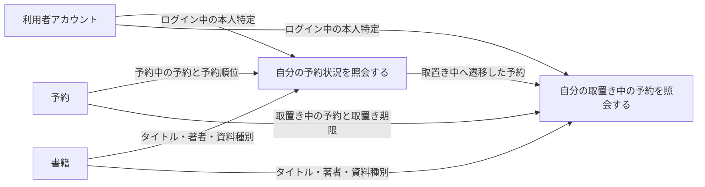
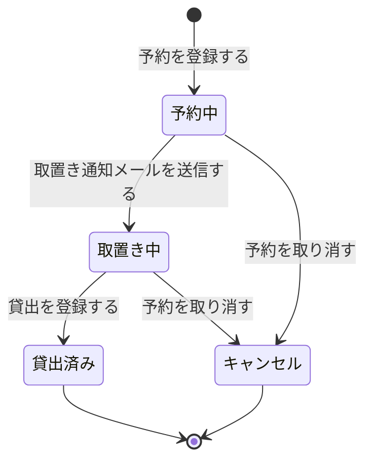

# 予約状況を確認するフロー

## 概要

利用者が Web 画面で自分の予約を確認する業務フローである。予約中の書籍と予約順位を確認する UC と、取置き中の予約から来館の要否を判断する UC で構成し、参照範囲はログイン中の本人の予約に限定する。

## 所属 UC 一覧

| UC名 | アクター | 主な操作 | 関連情報 |
|------|---------|---------|---------|
| [自分の予約状況を照会する](自分の予約状況を照会する/spec.md) | 利用者 | 予約中の書籍と予約順位を確認する | 予約、書籍、利用者アカウント |
| [自分の取置き中の予約を照会する](自分の取置き中の予約を照会する/spec.md) | 利用者 | 取置き中の予約と受取可能な書籍を確認し、来館の要否を判断する | 予約、書籍、利用者アカウント |

## UC 横断データフロー

予約は予約管理業務の UC で作成・更新され、本 BUC の 2 UC はいずれも参照のみを行う。予約状態が「予約中」の予約は予約状況照会、「取置き中」へ遷移した予約は取置き中予約確認の対象となる。

### データフロー図

### 情報 CRUD マトリクス

| 情報名 | 自分の予約状況を照会する | 自分の取置き中の予約を照会する |
|--------|:----------------------:|:----------------------------:|
| 予約 | R | R |
| 書籍 | R | R |
| 利用者アカウント | R | R |

## 状態遷移全体図

予約状態の全遷移パスを示す。本 BUC の 2 UC はいずれも参照系であり、状態を遷移させない。遷移は予約管理業務・通知管理業務・貸出管理業務の UC が担当する。

### 状態遷移 UC マッピング

| 状態モデル | 遷移元 | 遷移先 | 担当 UC |
|-----------|--------|--------|--------|
| 予約状態 | （初期） | 予約中 | 予約を登録する（BUC 外・予約管理） |
| 予約状態 | 予約中 | 取置き中 | 取置き通知メールを送信する（BUC 外・通知管理） |
| 予約状態 | 予約中 | キャンセル | 予約を取り消す（BUC 外・予約管理） |
| 予約状態 | 取置き中 | 貸出済み | 貸出を登録する（BUC 外・貸出管理） |
| 予約状態 | 取置き中 | キャンセル | 予約を取り消す（BUC 外・予約管理） |
| 予約状態 | 予約中 / 取置き中 / 貸出済み / キャンセル | （遷移なし・参照のみ） | [自分の予約状況を照会する](自分の予約状況を照会する/spec.md) |
| 予約状態 | 取置き中 | （遷移なし・参照のみ） | [自分の取置き中の予約を照会する](自分の取置き中の予約を照会する/spec.md) |

## BUC 内共有条件一覧

| 条件名 | 条件の説明 | 適用 UC |
|--------|----------|--------|
| 個人情報参照可否条件 | 予約状況の照会は、ログイン中の利用者本人に紐づく予約のみを対象とする。他の利用者の予約は表示しない | 自分の予約状況を照会する, 自分の取置き中の予約を照会する |

参考: 予約順位決定条件（申込日時の昇順で順位を付与し、貸出済み・キャンセルを順位対象から除外する）は「自分の予約状況を照会する」のみで適用するため、共有条件ではなく当該 UC Spec 側で定義する。

## BUC 内共有バリエーション一覧

| バリエーション名 | 値 | 適用 UC |
|----------------|---|--------|
| ジャンル | 文学、人文、社会科学、自然科学、技術、芸術、児童、その他 | 自分の予約状況を照会する, 自分の取置き中の予約を照会する |
| 資料種別 | 紙書籍、電子書籍 | 自分の予約状況を照会する, 自分の取置き中の予約を照会する |
