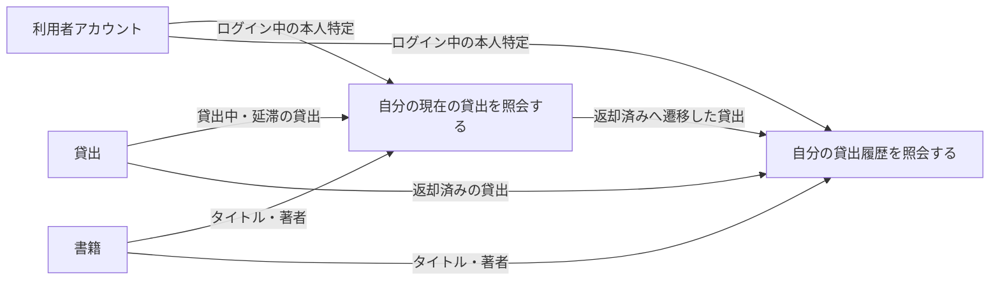
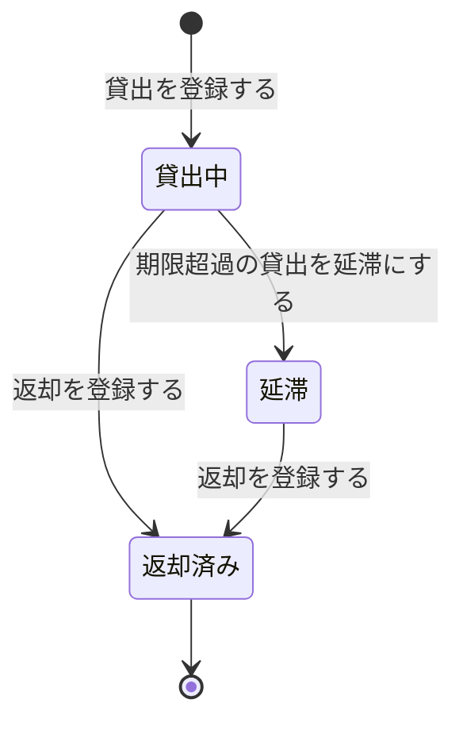

# 貸出履歴を確認するフロー

## 概要

利用者が Web 画面で自分の貸出を確認する業務フローである。現在借りている書籍と返却期限を確認する UC と、過去に借りた書籍を振り返る UC で構成し、参照範囲はいずれもログイン中の本人の貸出に限定する。

## 所属 UC 一覧

| UC名 | アクター | 主な操作 | 関連情報 |
|------|---------|---------|---------|
| [自分の現在の貸出を照会する](自分の現在の貸出を照会する/spec.md) | 利用者 | 貸出中・延滞の貸出と各貸出の返却期限を確認する | 貸出、書籍、利用者アカウント |
| [自分の貸出履歴を照会する](自分の貸出履歴を照会する/spec.md) | 利用者 | 返却済みの貸出を貸出日・返却日とともに確認する | 貸出、書籍、利用者アカウント |

## UC 横断データフロー

貸出は貸出管理業務の UC で作成・更新され、本 BUC の 2 UC はいずれも参照のみを行う。同一の貸出情報を貸出状態で切り分け、貸出中・延滞は「現在の貸出」、返却済みは「貸出履歴」として提示する。

### データフロー図

### 情報 CRUD マトリクス

| 情報名 | 自分の現在の貸出を照会する | 自分の貸出履歴を照会する |
|--------|:------------------------:|:----------------------:|
| 貸出 | R | R |
| 書籍 | R | R |
| 利用者アカウント | R | R |

## 状態遷移全体図

貸出状態の全遷移パスを示す。本 BUC の 2 UC はいずれも参照系であり、状態を遷移させない。遷移は貸出管理業務の UC が担当する。

### 状態遷移 UC マッピング

| 状態モデル | 遷移元 | 遷移先 | 担当 UC |
|-----------|--------|--------|--------|
| 貸出状態 | （初期） | 貸出中 | 貸出を登録する（BUC 外・貸出管理） |
| 貸出状態 | 貸出中 | 延滞 | 期限超過の貸出を延滞にする（BUC 外・貸出管理） |
| 貸出状態 | 貸出中 | 返却済み | 返却を登録する（BUC 外・貸出管理） |
| 貸出状態 | 延滞 | 返却済み | 返却を登録する（BUC 外・貸出管理） |
| 貸出状態 | 貸出中 / 延滞 | （遷移なし・参照のみ） | [自分の現在の貸出を照会する](自分の現在の貸出を照会する/spec.md) |
| 貸出状態 | 返却済み | （遷移なし・参照のみ） | [自分の貸出履歴を照会する](自分の貸出履歴を照会する/spec.md) |

## BUC 内共有条件一覧

| 条件名 | 条件の説明 | 適用 UC |
|--------|----------|--------|
| 個人情報参照可否条件 | 貸出履歴の照会は、ログイン中の利用者本人に紐づく貸出のみを対象とする。他の利用者の貸出は表示しない | 自分の現在の貸出を照会する, 自分の貸出履歴を照会する |
| 本人限定参照の UI 制約（LP-025） | 画面上に他の利用者を指定する導線・入力欄を設けず、本人の貸出のみを表示する | 自分の現在の貸出を照会する, 自分の貸出履歴を照会する |

## BUC 内共有バリエーション一覧

| バリエーション名 | 値 | 適用 UC |
|----------------|---|--------|
| 貸出期間区分 | 標準、短期、長期 | 自分の現在の貸出を照会する, 自分の貸出履歴を照会する |
