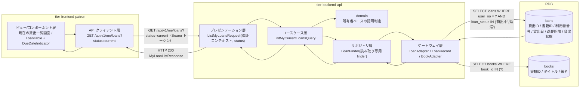
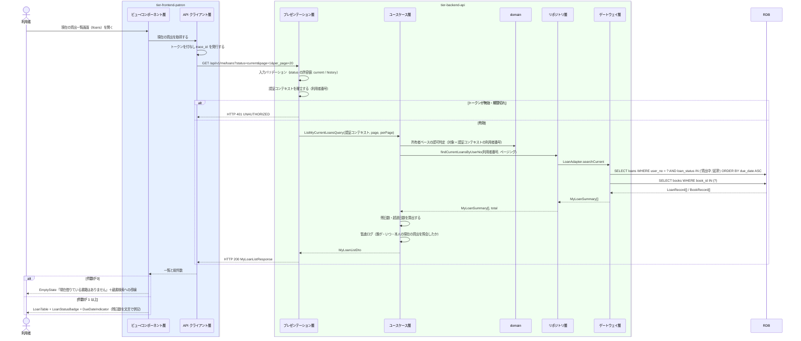

# 自分の現在の貸出を照会する

## 概要

利用者が貸出中・延滞の貸出と各貸出の返却期限を Web 画面（現在の貸出一覧画面）で確認する。個人情報参照可否条件により、参照対象はログイン中の利用者本人に紐づく貸出のみとし、他の利用者の貸出は表示しない。

## データフロー



| レイヤー | データモデル | 変換内容 |
|---------|------------|---------|
| FE ビュー層 | 現在の貸出一覧画面（LoanTable / DueDateIndicator / LoanStatusBadge） | 返却期限を残日数・超過日数の文言と色で提示する。`showUser` は false（本人のみ） |
| FE API クライアント層 | ListMyLoansRequest(status=current) | トークンの付与と trace_id の発行。利用者番号をクライアントから送らない |
| BE presentation | 認証コンテキスト（利用者番号）+ status の許容値チェック | 認証コンテキストを組み立て Query へ変換（LP-003） |
| BE usecase | ListMyCurrentLoansQuery | Query。repository の読み取り専用 finder を使う（LP-008） |
| BE domain | 所有者ベースの認可判定 | 取得対象の利用者番号が認証コンテキストと一致することを強制する（LP-011） |
| BE gateway | SELECT loans + SELECT books（BC-001 の公開インターフェース経由） | LoanRecord と書籍のタイトル・著者を結合し MyLoanSummary へ射影する |
| Response | MyLoanListResponse(items[], total) | 貸出ID・書籍タイトル・貸出日・返却期限・貸出状態・残日数 |

## 処理フロー



## バリエーション一覧

| バリエーション名 | 値 | 処理内容 | 適用 tier | 適用箇所 |
|----------------|---|---------|----------|---------|
| 貸出期間区分 | 標準 / 短期 / 長期 | 返却期限の算出根拠として貸出行に併記する（返却期限そのものは `loans.due_date` を表示する） | tier-frontend-patron | 現在の貸出一覧画面（LoanTable の列） |
| 貸出期間区分 | 標準 / 短期 / 長期 | `loan_period_type` をレスポンスに含める | tier-backend-api | GET /api/v1/me/loans?status=current |

## 分岐条件一覧

| 条件名 | 判定ルール | 適用 tier | 適用箇所 | BDD Scenario |
|--------|----------|----------|---------|-------------|
| 個人情報参照可否条件 | 参照対象はログイン中の利用者本人に紐づく貸出のみ。利用者番号をリクエストで受け取らない | tier-backend-api | domain の所有者ベース認可判定 / GET /api/v1/me/loans | 他人の貸出へ到達できない |
| 本人限定参照の UI 制約（LP-025） | 他利用者の貸出へ到達する導線を画面に持たない。`LoanTable` の `showUser` は false | tier-frontend-patron | 現在の貸出一覧画面 | 利用者列が表示されない |
| 現在の貸出の抽出 | 貸出状態が「貸出中」または「延滞」の貸出のみを対象とする。「返却済み」は対象外（貸出履歴の対象） | tier-backend-api | GET /api/v1/me/loans?status=current | 返却済みの貸出は表示されない |
| 返却期限の表示段階 | 残日数 > 3 は safe、0 < 残日数 ≦ 3 は near、残日数 = 0 は due-today、超過は overdue | tier-frontend-patron | DueDateIndicator | 延滞の貸出に超過日数が表示される |

## 計算ルール一覧

| 計算名 | 入力情報 | 計算式/ロジック | 出力情報 | 適用 tier |
|--------|---------|---------------|---------|----------|
| 残日数 | 貸出（返却期限）、現在日 | days_remaining = 返却期限 - 現在日（日単位。負値は超過日数を表す） | days_remaining | tier-backend-api |
| 超過日数 | days_remaining（API レスポンス） | days_remaining < 0 のとき days_overdue = -days_remaining（例 days_remaining -3 → 3 日超過）。0 以上のときは超過なし | days_overdue（表示用） | tier-frontend-patron |
| 表示段階の決定 | days_remaining | safe（> 3） / near（1〜3） / due-today（0） / overdue（< 0） | DueDateIndicator の variant | tier-frontend-patron |

## 状態遷移一覧

| 状態モデル | 遷移元 | 遷移先 | トリガー | 事前条件 | 事後処理 | 適用 tier |
|-----------|--------|--------|---------|---------|---------|----------|
| 貸出状態 | 貸出中 | 貸出中 | 自分の現在の貸出を照会する（参照のみ） | 利用者としてログイン済み | なし（状態遷移を伴わない照会 UC） | tier-backend-api |
| 貸出状態 | 延滞 | 延滞 | 自分の現在の貸出を照会する（参照のみ） | 利用者としてログイン済み | なし。延滞への遷移は「期限超過の貸出を延滞にする」UC が担う | tier-backend-api |

## 関連 RDRA モデル

| モデル種別 | 要素名 | 関連 |
|-----------|--------|------|
| 業務 | 利用照会業務 | このUCが属する業務 |
| BUC | 貸出履歴を確認するフロー | このUCを含むBUC |
| アクティビティ | 現在借りている書籍を確認する | このUCが実現するアクティビティ |
| アクター | 利用者 | 操作するアクター（立場: 受益者） |
| 情報 | 貸出 | 照会する情報 |
| 情報 | 書籍 | 貸出行に表示する書籍のタイトル・著者 |
| 情報 | 利用者アカウント | 本人限定参照の判定に使う情報 |
| 状態 | 貸出状態 | 表示する状態（貸出中 / 延滞） |
| 条件 | 個人情報参照可否条件 | 本人限定参照の根拠 |
| バリエーション | 貸出期間区分 | 返却期限の算出根拠として表示する区分 |
| 画面 | 現在の貸出一覧画面 | このUCの画面 |

## E2E 完了条件（BDD）

### 正常系

```gherkin
Feature: 自分の現在の貸出を照会する

  Scenario: 貸出中の書籍と返却期限が表示される
    Given 利用者「田中太郎（U-000123）」が利用者ポータルにログイン済みである
    And 利用者「U-000123」に書籍「吾輩は猫である」の貸出状態「貸出中」・返却期限「2026-09-16」の貸出がある
    When 利用者が現在の貸出一覧画面（/loans）を開く
    Then 一覧に「吾輩は猫である」が表示される
    And 返却期限「2026-09-16」が表示される
    And LoanStatusBadge に「貸出中」が表示される

  Scenario: 延滞の貸出に超過日数が表示される
    Given 利用者「田中太郎」に貸出状態「延滞」・返却期限「2026-08-30」の貸出がある
    And 現在日が「2026-09-02」である
    When 利用者が現在の貸出一覧画面を開く
    Then LoanStatusBadge に「延滞」が表示される
    And DueDateIndicator に超過日数「3 日超過」が文言で表示される

  Scenario: 返却期限が近い順に並ぶ
    Given 利用者「田中太郎」に返却期限「2026-09-20」と「2026-09-10」の貸出がある
    When 利用者が現在の貸出一覧画面を開く
    Then 1 行目の返却期限が「2026-09-10」である
    And 2 行目の返却期限が「2026-09-20」である

  Scenario: 返却済みの貸出は表示されない
    Given 利用者「田中太郎」に貸出状態「返却済み」の貸出が 1 件ある
    And 貸出中・延滞の貸出が 0 件である
    When 利用者が現在の貸出一覧画面を開く
    Then EmptyState に「現在借りている書籍はありません」が表示される
```

### 異常系

```gherkin
  Scenario: 未ログインではログイン画面へ誘導される
    Given 利用者がログインしていない
    When 利用者が現在の貸出一覧画面（/loans）を開く
    Then HTTP 401 が返る
    And ログイン画面へ誘導される

  Scenario: 他人の貸出へ到達できない
    Given 利用者「田中太郎（U-000123）」がログイン済みである
    And 利用者「佐藤次郎（U-000200）」に貸出中の貸出がある
    When 利用者が GET /api/v1/me/loans?status=current を実行する
    Then レスポンスに利用者番号「U-000200」の貸出が含まれない
    And 他の利用者番号を指定するパラメータが API に存在しない

  Scenario: 許容外の status を指定すると 400 になる
    Given 利用者「田中太郎」のトークンを保持している
    When GET /api/v1/me/loans?status=all を実行する
    Then HTTP 400 が返る
    And code が「VALIDATION_ERROR」である

  Scenario: 取得に失敗したときエラーを表示する
    Given 利用者「田中太郎」がログイン済みである
    And バックエンド API が HTTP 500 を返す状態である
    When 利用者が現在の貸出一覧画面を開く
    Then Alert(destructive) に「貸出内容を取得できませんでした」と表示される
    And 内部の例外内容やスタックトレースは表示されない
```

## ティア別仕様

- [利用者ポータル](tier-frontend-patron.md)
- [バックエンド API](tier-backend-api.md)

### 統合 API Spec

- [OpenAPI Spec](../../../_cross-cutting/api/openapi.yaml)（全 UC 統合、Contract First 開発用）
