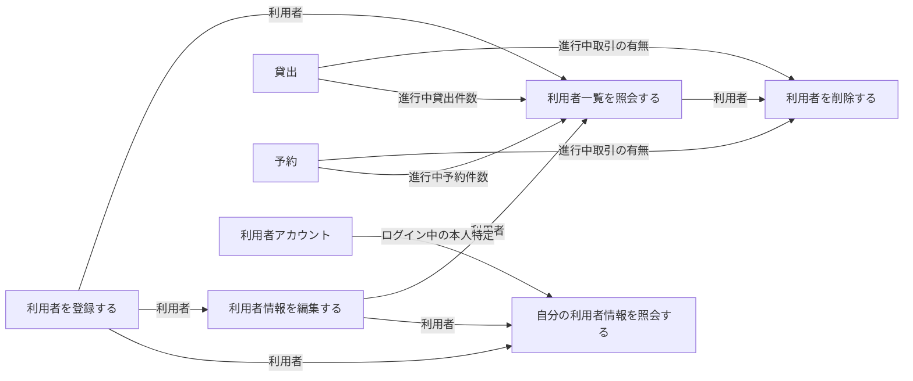
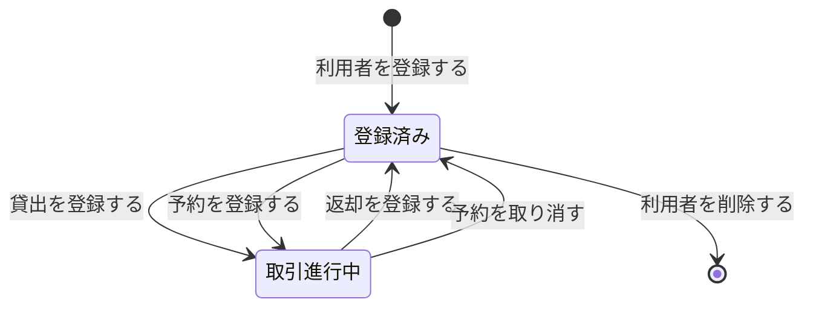

# 利用者を管理するフロー

## 概要

図書館の利用者を登録・照会・変更・削除し、貸出責任者を特定できる状態を維持する業務フローである。司書が利用者名簿を管理し、利用者本人は Web のマイページで自分の登録内容だけを確認する。

## 所属 UC 一覧

| UC名 | アクター | 主な操作 | 関連情報 |
|------|---------|---------|---------|
| [利用者一覧を照会する](利用者一覧を照会する/spec.md) | 司書 | 登録済み利用者を氏名・連絡先・利用者番号とともに一覧表示する | 利用者 |
| [利用者を登録する](利用者を登録する/spec.md) | 司書 | 氏名・連絡先を登録し、利用者番号を採番する | 利用者 |
| [利用者情報を編集する](利用者情報を編集する/spec.md) | 司書 | 氏名・連絡先の変更を反映する | 利用者 |
| [利用者を削除する](利用者を削除する/spec.md) | 司書 | 退会する利用者を登録から外す | 利用者、貸出、予約 |
| [自分の利用者情報を照会する](自分の利用者情報を照会する/spec.md) | 利用者 | 自分の氏名・連絡先・利用者番号を Web 画面で確認する | 利用者、利用者アカウント |

## UC 横断データフロー

「利用者を登録する」で作成された利用者情報が、以降の照会・編集・削除の対象となる。削除判定と一覧の削除可否表示で貸出・予約を参照する。

### データフロー図

### 情報 CRUD マトリクス

| 情報名 | 利用者を登録する | 利用者一覧を照会する | 利用者情報を編集する | 利用者を削除する | 自分の利用者情報を照会する |
|--------|:---------------:|:------------------:|:------------------:|:---------------:|:------------------------:|
| 利用者 | C | R | U | D | R |
| 利用者アカウント | | | | | R |
| 貸出 | | R | | R | |
| 予約 | | R | | R | |

## 状態遷移全体図

利用者状態の全遷移パスを示す。本 BUC が担当するのは「登録」と「削除」の遷移であり、「取引進行中」への出入りは貸出管理・予約管理の UC が担当する。

### 状態遷移 UC マッピング

| 状態モデル | 遷移元 | 遷移先 | 担当 UC |
|-----------|--------|--------|--------|
| 利用者状態 | （初期） | 登録済み | [利用者を登録する](利用者を登録する/spec.md) |
| 利用者状態 | 登録済み | 取引進行中 | 貸出を登録する（BUC 外・貸出管理） |
| 利用者状態 | 登録済み | 取引進行中 | 予約を登録する（BUC 外・予約管理） |
| 利用者状態 | 取引進行中 | 登録済み | 返却を登録する（BUC 外・貸出管理） |
| 利用者状態 | 取引進行中 | 登録済み | 予約を取り消す（BUC 外・予約管理） |
| 利用者状態 | 登録済み | （終了） | [利用者を削除する](利用者を削除する/spec.md) |
| 利用者状態 | 登録済み / 取引進行中 | （遷移なし・参照のみ） | [利用者一覧を照会する](利用者一覧を照会する/spec.md), [利用者情報を編集する](利用者情報を編集する/spec.md), [自分の利用者情報を照会する](自分の利用者情報を照会する/spec.md) |

## BUC 内共有条件一覧

| 条件名 | 条件の説明 | 適用 UC |
|--------|----------|--------|
| 個人情報参照可否条件 | 貸出履歴・予約状況の照会は、ログイン中の利用者本人に紐づく貸出・予約のみを対象とする。 本 BUC での派生ルール: 司書向け UC（利用者一覧を照会する, 利用者を登録する, 利用者情報を編集する, 利用者を削除する）では司書ロールのみ到達可・連絡先マスクとして適用する | 利用者一覧を照会する, 利用者を登録する, 利用者情報を編集する, 利用者を削除する, 自分の利用者情報を照会する |
| 利用者削除可否条件 | 対象利用者に貸出状態が「貸出中」「延滞」の貸出、および予約状態が「予約中」「取置き中」の予約が存在しない場合に限り削除を許可する | 利用者を削除する（判定）, 利用者一覧を照会する（削除可否の表示） |

## BUC 内共有バリエーション一覧

| バリエーション名 | 値 | 適用 UC |
|----------------|---|--------|
| 利用者区分 | 一般、学生、団体 | 利用者一覧を照会する, 利用者を登録する, 利用者情報を編集する, 利用者を削除する, 自分の利用者情報を照会する |
