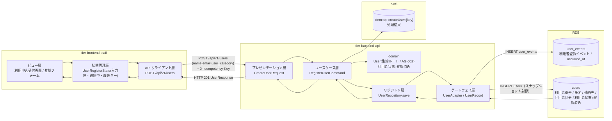
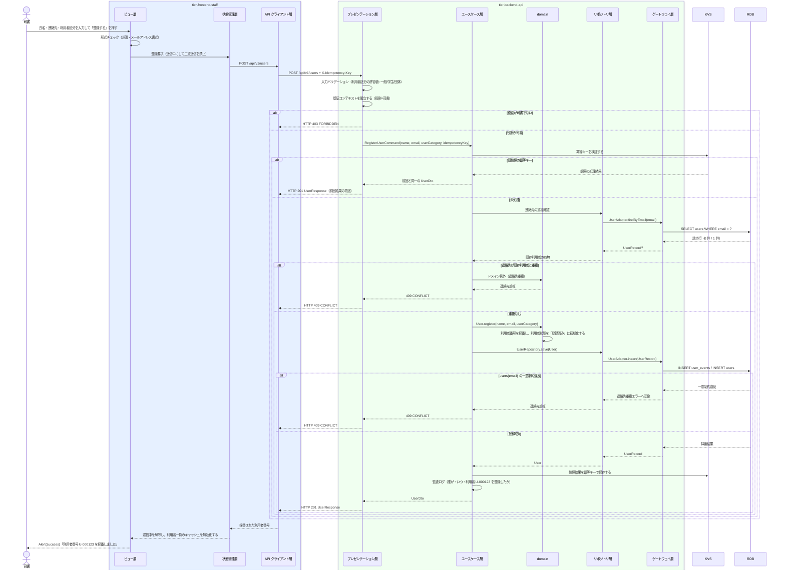

# 利用者を登録する

## 概要

司書が利用申込を受け付け、氏名・連絡先・利用者区分を登録して利用者番号を採番し、利用者を一意に識別できるようにする。登録された利用者は利用者状態「登録済み」で開始し、以降の貸出・予約の対象となる。

## データフロー



| レイヤー | データモデル | 変換内容 |
|---------|------------|---------|
| FE ビュー層 | 利用申込受付画面（氏名・連絡先・利用者区分） | 司書の入力 → フォーム状態。利用者区分の既定値は「一般」 |
| FE 状態管理層 | UserRegisterState(form, submitting, idempotencyKey) | 送信時に冪等キー（UUID）を発行し、再送時も同一キーを使う（LR-032） |
| BE presentation | CreateUserRequest(name, email, user_category) | 必須・桁・メールアドレス書式・利用者区分の許容値を検証し Command へ変換 |
| BE usecase | RegisterUserCommand | 冪等キーを KVS で検証（LP-007）。トランザクション境界を張り、利用者登録イベントとスナップショットを確定する |
| BE domain | User（AG-002 集約ルート） | 利用者番号を採番し、利用者状態を「登録済み」で初期化する |
| BE gateway | INSERT user_events / INSERT users | イベントを追記し、スナップショットへ射影する（registered_at = イベントの occurred_at） |
| Response | UserResponse(user_no, name, email_masked, user_category, user_status, registered_at) | 採番された利用者番号を司書へ提示する |

## 処理フロー



## バリエーション一覧

| バリエーション名 | 値 | 処理内容 | 適用 tier | 適用箇所 |
|----------------|---|---------|----------|---------|
| 利用者区分 | 一般 / 学生 / 団体 | ToggleGroup での単一選択。既定値は「一般」（デフォルト効果） | tier-frontend-staff | 利用申込受付画面の入力フォーム |
| 利用者区分 | 一般 / 学生 / 団体 | 許容値チェックと `users.user_category` への保存。以降の返却期限設定条件の適用単位となる | tier-backend-api | POST /api/v1/users |

## 分岐条件一覧

| 条件名 | 判定ルール | 適用 tier | 適用箇所 | BDD Scenario |
|--------|----------|----------|---------|-------------|
| 個人情報参照可否条件 | 登録 API は司書ロールのみ到達可。レスポンスの連絡先はマスク値を返す | tier-backend-api | POST /api/v1/users | 利用者ロールでは利用者を登録できない |
| 重複登録の抑止（冪等キー検証 / LP-007） | 同一の冪等キーで再送された場合は新規採番せず前回結果を返す | tier-backend-api | POST /api/v1/users | 同一冪等キーの再送で二重登録されない |

## 計算ルール一覧

| 計算名 | 入力情報 | 計算式/ロジック | 出力情報 | 適用 tier |
|--------|---------|---------------|---------|----------|
| 利用者番号の採番 | 利用者（登録要求） | 連番方式で一意な利用者番号を採番する（例 `U-` + 6 桁ゼロ埋め連番） | user_no | tier-backend-api |
| 登録日時の射影 | 利用者登録イベント | registered_at = 利用者登録イベントの occurred_at | users.registered_at | tier-backend-api |

## 状態遷移一覧

| 状態モデル | 遷移元 | 遷移先 | トリガー | 事前条件 | 事後処理 | 適用 tier |
|-----------|--------|--------|---------|---------|---------|----------|
| 利用者状態 | （初期） | 登録済み | 利用者を登録する | 司書としてログイン済みで、氏名・連絡先・利用者区分が入力されている | 利用者番号を採番し、貸出・予約の対象とする | tier-backend-api |

## 関連 RDRA モデル

| モデル種別 | 要素名 | 関連 |
|-----------|--------|------|
| 業務 | 利用者管理業務 | このUCが属する業務 |
| BUC | 利用者を管理するフロー | このUCを含むBUC |
| アクティビティ | 利用申込を受け付けて登録する | このUCが実現するアクティビティ |
| アクター | 司書 | 操作するアクター（立場: 提供者） |
| 情報 | 利用者 | 登録する情報 |
| 状態 | 利用者状態 | 登録済みで開始する |
| 条件 | 個人情報参照可否条件 | 連絡先の取り扱いの根拠 |
| バリエーション | 利用者区分 | 登録時に選択する区分 |
| 画面 | 利用申込受付画面 | このUCの画面 |

## E2E 完了条件（BDD）

### 正常系

```gherkin
Feature: 利用者を登録する

  Scenario: 利用申込を受け付けて利用者番号を採番する
    Given 司書「山田花子」が司書ポータルにログイン済みである
    And 司書が利用申込受付画面（/staff/users/new）を開いている
    When 司書が氏名「田中太郎」・連絡先「tanaka@example.com」・利用者区分「一般」を入力して登録する
    Then 利用者番号「U-000123」が採番される
    And 利用者状態が「登録済み」になる
    And Alert(success) に採番された利用者番号が表示される

  Scenario: 利用者区分の既定値が一般である
    Given 司書「山田花子」が利用申込受付画面を開いている
    When 司書が画面の初期表示を確認する
    Then 利用者区分の ToggleGroup で「一般」が選択されている

  Scenario: 登録した利用者が名簿に現れる
    Given 司書「山田花子」が利用者「田中太郎」を登録済みである
    When 司書が利用者名簿画面（/staff/users）を開く
    Then 一覧に利用者番号「U-000123」と氏名「田中太郎」が表示される
    And 利用者状態バッジに「登録済み」が表示される
```

### 異常系

```gherkin
  Scenario: 必須項目が未入力のとき登録できない
    Given 司書「山田花子」が利用申込受付画面を開いている
    When 司書が氏名を空のまま「登録する」を押す
    Then Input(error) に「氏名を入力してください」と表示される
    And POST /api/v1/users は呼ばれない

  Scenario: 連絡先の書式が不正なとき 400 になる
    Given 司書ロールのトークンを保持している
    When POST /api/v1/users に連絡先「tanaka_at_example」を指定して実行する
    Then HTTP 400 が返る
    And code が「VALIDATION_ERROR」である

  Scenario: 許容外の利用者区分を指定すると 400 になる
    Given 司書ロールのトークンを保持している
    When POST /api/v1/users に利用者区分「法人」を指定して実行する
    Then HTTP 400 が返る
    And code が「VALIDATION_ERROR」である

  Scenario: 同一冪等キーの再送で二重登録されない
    Given 司書「山田花子」が冪等キー「11111111-1111-1111-1111-111111111111」で利用者「田中太郎」を登録済みである
    When 同じ冪等キーで同じ内容の POST /api/v1/users を再送する
    Then 前回と同じ利用者番号「U-000123」が返る
    And users テーブルの登録件数が 1 件のままである

  Scenario: 利用者ロールでは利用者を登録できない
    Given 利用者「田中太郎」のトークンを保持している
    When POST /api/v1/users を実行する
    Then HTTP 403 が返る
    And code が「FORBIDDEN」である
```

## ティア別仕様

- [司書ポータル](tier-frontend-staff.md)
- [バックエンド API](tier-backend-api.md)

### 統合 API Spec

- [OpenAPI Spec](../../../_cross-cutting/api/openapi.yaml)（全 UC 統合、Contract First 開発用）
