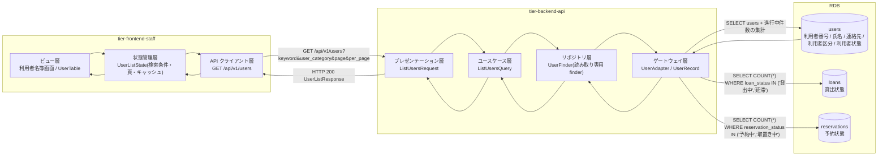
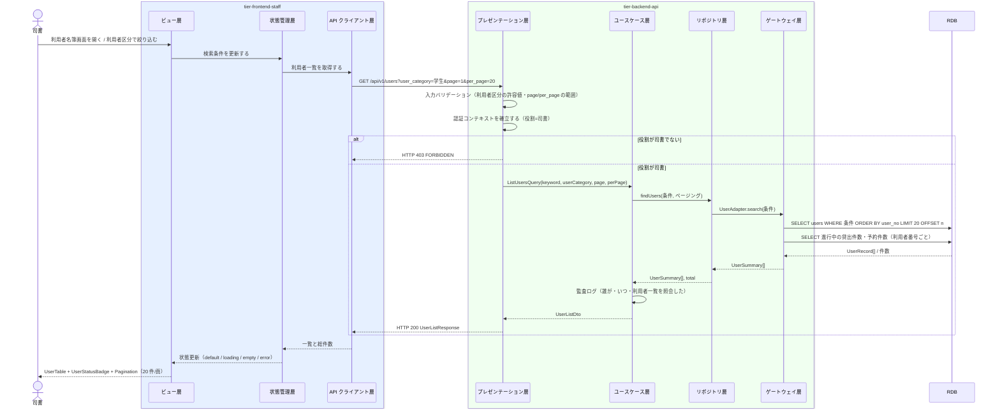

# 利用者一覧を照会する

## 概要

司書が登録済みの利用者を氏名・連絡先・利用者番号とともに一覧表示し、貸出責任者を特定できる状態を確認する。連絡先は個人情報のため一覧では常時マスクし、利用者状態と進行中取引の件数を併記して削除可否を読み取れるようにする。

## データフロー



| レイヤー | データモデル | 変換内容 |
|---------|------------|---------|
| FE ビュー層 | 利用者名簿画面（キーワード・利用者区分・頁） | 司書の絞り込み操作 → 検索条件へ変換。連絡先はマスク済み文字列のみ描画 |
| FE 状態管理層 | UserListState(keyword, userCategory, page, perPage, users, total) | 画面横断で保持する利用者番号を更新系 UC へ引き継ぐ。更新後は一覧キャッシュを無効化 |
| BE presentation | ListUsersRequest(keyword?, user_category?, page, per_page) | 型・桁・利用者区分の許容値（一般/学生/団体）を検証し Query へ変換 |
| BE usecase | ListUsersQuery → UserListDto | Query 側は domain を経由せず repository の読み取り専用 finder を利用（LP-008） |
| BE gateway | SELECT users LEFT JOIN 進行中貸出件数 / 進行中予約件数 | UserRecord → UserSummary へ射影する。連絡先は email_masked（例 t****@example.com）のみを返し、生値はレスポンスに含めない（LR-003） |
| Response | UserListResponse(items[], total, page, per_page) | UserTable の行データとして表示。連絡先は既定マスク |

## 処理フロー



## バリエーション一覧

| バリエーション名 | 値 | 処理内容 | 適用 tier | 適用箇所 |
|----------------|---|---------|----------|---------|
| 利用者区分 | 一般 / 学生 / 団体 | 一覧の絞り込みフィルターと列表示 | tier-frontend-staff | 利用者名簿画面（ToggleGroup） |
| 利用者区分 | 一般 / 学生 / 団体 | `user_category` クエリパラメータの許容値チェックと WHERE 条件 | tier-backend-api | GET /api/v1/users |

## 分岐条件一覧

| 条件名 | 判定ルール | 適用 tier | 適用箇所 | BDD Scenario |
|--------|----------|----------|---------|-------------|
| 個人情報参照可否条件 | RDRA 定義: 貸出履歴・予約状況の照会は、ログイン中の本人に紐づく貸出・予約のみを対象とする。本 UC での派生ルール: 司書ロールのみがこの API に到達でき（利用者ロールは 403）、一覧の連絡先は既定でマスクする | tier-backend-api | GET /api/v1/users（LR-003 レスポンスの PII 最小化） | 利用者ロールでは利用者一覧を照会できない |
| 利用者削除可否条件 | 貸出状態が「貸出中」「延滞」の貸出、予約状態が「予約中」「取置き中」の予約が 0 件のときだけ削除操作を提示する | tier-frontend-staff | 利用者名簿画面の行アクション | 進行中取引がある利用者は削除操作が出ない |

## 計算ルール一覧

| 計算名 | 入力情報 | 計算式/ロジック | 出力情報 | 適用 tier |
|--------|---------|---------------|---------|----------|
| 進行中貸出件数 | 貸出（貸出状態） | COUNT(loans WHERE user_no = ? AND loan_status IN ('貸出中','延滞')) | active_loan_count | tier-backend-api |
| 進行中予約件数 | 予約（予約状態） | COUNT(reservations WHERE user_no = ? AND reservation_status IN ('予約中','取置き中')) | active_reservation_count | tier-backend-api |
| 総頁数 | 総件数 | ceil(total / per_page)、per_page = 20 固定 | Pagination の頁数 | tier-frontend-staff |

## 状態遷移一覧

| 状態モデル | 遷移元 | 遷移先 | トリガー | 事前条件 | 事後処理 | 適用 tier |
|-----------|--------|--------|---------|---------|---------|----------|
| 利用者状態 | 登録済み | 登録済み | 利用者一覧を照会する（参照のみ） | 司書としてログイン済み | なし（状態遷移を伴わない照会 UC） | tier-backend-api |
| 利用者状態 | 取引進行中 | 取引進行中 | 利用者一覧を照会する（参照のみ） | 司書としてログイン済み | なし | tier-backend-api |

## 関連 RDRA モデル

| モデル種別 | 要素名 | 関連 |
|-----------|--------|------|
| 業務 | 利用者管理業務 | このUCが属する業務 |
| BUC | 利用者を管理するフロー | このUCを含むBUC |
| アクティビティ | 利用者の登録状況を確認する | このUCが実現するアクティビティ |
| アクター | 司書 | 操作するアクター（立場: 受益者） |
| 情報 | 利用者 | 一覧表示する情報 |
| 情報 | 貸出 | 進行中件数の集計に参照する情報 |
| 情報 | 予約 | 進行中件数の集計に参照する情報 |
| 状態 | 利用者状態 | 一覧に表示する状態（登録済み / 取引進行中） |
| 条件 | 個人情報参照可否条件 | 連絡先マスクの根拠 |
| 条件 | 利用者削除可否条件 | 削除操作の提示可否の根拠 |
| バリエーション | 利用者区分 | 絞り込み・表示に使う区分 |
| 画面 | 利用者名簿画面 | このUCの画面 |

## E2E 完了条件（BDD）

### 正常系

```gherkin
Feature: 利用者一覧を照会する

  Scenario: 登録済み利用者が一覧で確認できる
    Given 司書「山田花子」が司書ポータルにログイン済みである
    And 利用者「田中太郎（利用者番号 U-000123 / 一般 / 登録済み）」が登録されている
    When 司書が利用者名簿画面（/staff/users）を開く
    Then 一覧に利用者番号「U-000123」と氏名「田中太郎」が表示される
    And 連絡先はマスク表示（例「t****@example.com」）である
    And 利用者状態バッジに「登録済み」が表示される

  Scenario: 利用者区分で絞り込める
    Given 司書「山田花子」が利用者名簿画面を開いている
    And 利用者区分が「学生」の利用者が 3 件、「一般」の利用者が 5 件登録されている
    When 司書が利用者区分「学生」を選択する
    Then 一覧の表示件数が 3 件になる
    And 表示された全行の利用者区分が「学生」である

  Scenario: 21 件目以降を次頁で確認できる
    Given 司書「山田花子」が利用者名簿画面を開いている
    And 利用者が 25 件登録されている
    When 司書が Pagination の 2 頁目を選択する
    Then 5 件が表示される
    And Pagination に「2 / 2」が表示される

  Scenario: 進行中取引のある利用者は削除操作が出ない
    Given 司書「山田花子」が利用者名簿画面を開いている
    And 利用者「佐藤次郎（U-000200）」に貸出状態「貸出中」の貸出が 1 件ある
    When 司書が一覧の「佐藤次郎」の行を確認する
    Then 利用者状態バッジに「取引進行中」が表示される
    And 進行中貸出件数「1」が表示される
    And 退会手続への操作ボタンが表示されない
```

### 異常系

```gherkin
  Scenario: 該当する利用者が 0 件のとき空状態を案内する
    Given 司書「山田花子」が利用者名簿画面を開いている
    And 利用者区分「団体」の利用者が 0 件である
    When 司書が利用者区分「団体」を選択する
    Then EmptyState に「該当する利用者はいません」と表示される
    And 絞り込み条件を解除する導線が表示される

  Scenario: 利用者ロールでは利用者一覧を照会できない
    Given 利用者「田中太郎」のトークンで GET /api/v1/users を呼び出す準備ができている
    When 利用者ロールのトークンで GET /api/v1/users を実行する
    Then HTTP 403 が返る
    And レスポンスの code が「FORBIDDEN」である

  Scenario: 許容外の利用者区分を指定するとエラーになる
    Given 司書「山田花子」が司書ポータルにログイン済みである
    When GET /api/v1/users?user_category=法人 を実行する
    Then HTTP 400 が返る
    And レスポンスの code が「VALIDATION_ERROR」である

  Scenario: 一覧取得に失敗したときエラーを表示する
    Given 司書「山田花子」が利用者名簿画面を開いている
    And バックエンド API が HTTP 500 を返す状態である
    When 司書が一覧を再読み込みする
    Then Alert(destructive) に「利用者一覧を取得できませんでした」と表示される
    And 再試行ボタンが表示される
```

## ティア別仕様

- [司書ポータル](tier-frontend-staff.md)
- [バックエンド API](tier-backend-api.md)

### 統合 API Spec

- [OpenAPI Spec](../../../_cross-cutting/api/openapi.yaml)（全 UC 統合、Contract First 開発用）
