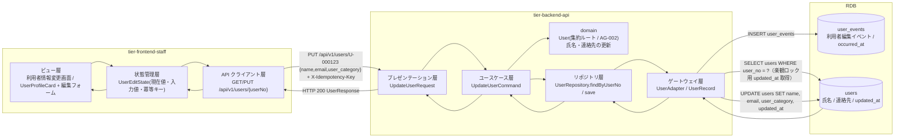
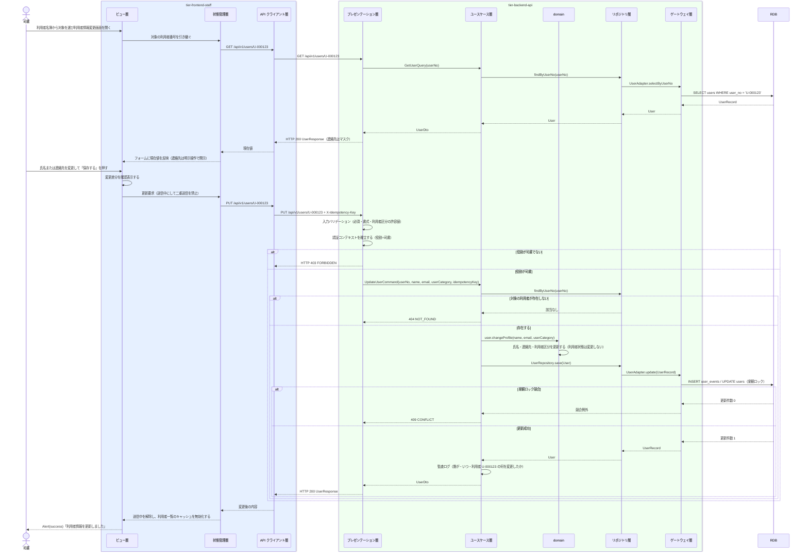

# 利用者情報を編集する

## 概要

司書が利用者の氏名・連絡先の変更を反映し、督促・通知が確実に届く状態を維持する。連絡先は取置き案内・返却期限リマインド・延滞督促メールの宛先となるため、変更内容は編集イベントとして追記し、スナップショットへ射影する。

## データフロー



| レイヤー | データモデル | 変換内容 |
|---------|------------|---------|
| FE ビュー層 | 利用者情報変更画面（現在値の提示 + 変更入力） | 変更した項目だけを保存前に確認表示する |
| FE 状態管理層 | UserEditState(userNo, current, form, submitting, idempotencyKey) | 利用者名簿から引き継いだ利用者番号を保持し、更新後は一覧キャッシュを無効化する |
| BE presentation | UpdateUserRequest(name, email, user_category) | 必須・桁・メールアドレス書式・利用者区分の許容値を検証し Command へ変換 |
| BE usecase | UpdateUserCommand | 冪等キー検証（LP-007）、トランザクション境界の設定、監査ログの出力 |
| BE domain | User（AG-002 集約ルート） | 氏名・連絡先・利用者区分を更新する。利用者状態は変更しない |
| BE gateway | INSERT user_events / UPDATE users | 編集イベントを追記し、スナップショットを更新する。楽観ロックで競合を検知する（LR-009 相当） |
| Response | UserResponse(user_no, name, email_masked, user_category, user_status, updated_at) | 変更後の内容を司書へ提示する |

## 処理フロー



## バリエーション一覧

| バリエーション名 | 値 | 処理内容 | 適用 tier | 適用箇所 |
|----------------|---|---------|----------|---------|
| 利用者区分 | 一般 / 学生 / 団体 | ToggleGroup での単一選択。現在値を初期選択にする | tier-frontend-staff | 利用者情報変更画面 |
| 利用者区分 | 一般 / 学生 / 団体 | 許容値チェックと `users.user_category` の更新。以降の貸出で返却期限設定条件の適用単位が変わる | tier-backend-api | PUT /api/v1/users/{userNo} |

## 分岐条件一覧

| 条件名 | 判定ルール | 適用 tier | 適用箇所 | BDD Scenario |
|--------|----------|----------|---------|-------------|
| 個人情報参照可否条件 | 編集 API は司書ロールのみ到達可。現在値の連絡先は既定でマスクし、明示操作で開示する | tier-frontend-staff / tier-backend-api | 利用者情報変更画面 / PUT /api/v1/users/{userNo} | 連絡先は既定でマスクされる |
| 対象利用者の存在 | 指定した利用者番号のレコードが存在しない場合は 404 を返す | tier-backend-api | PUT /api/v1/users/{userNo} | 存在しない利用者番号では 404 になる |
| 楽観ロック競合（LR-009 楽観ロックによる競合制御） | 取得時の updated_at と更新時の updated_at が一致しない場合は 409 を返す | tier-backend-api | PUT /api/v1/users/{userNo} | 同時編集で後勝ちを防ぐ |

## 計算ルール一覧

| 計算名 | 入力情報 | 計算式/ロジック | 出力情報 | 適用 tier |
|--------|---------|---------------|---------|----------|
| 更新日時の射影 | 利用者編集イベント | updated_at = 利用者編集イベントの occurred_at | users.updated_at | tier-backend-api |
| 変更差分の抽出 | 現在値と入力値 | 項目ごとに現在値 ≠ 入力値の項目のみを差分として列挙する | 保存前確認の表示内容 | tier-frontend-staff |

## 状態遷移一覧

| 状態モデル | 遷移元 | 遷移先 | トリガー | 事前条件 | 事後処理 | 適用 tier |
|-----------|--------|--------|---------|---------|---------|----------|
| 利用者状態 | 登録済み | 登録済み | 利用者情報を編集する（属性変更のみ） | 対象の利用者が存在する | 利用者状態は変更しない。連絡先変更は以降の通知の宛先に反映される | tier-backend-api |
| 利用者状態 | 取引進行中 | 取引進行中 | 利用者情報を編集する（属性変更のみ） | 対象の利用者が存在する | 進行中取引があっても編集は許可する（削除のみ制限される） | tier-backend-api |

## 関連 RDRA モデル

| モデル種別 | 要素名 | 関連 |
|-----------|--------|------|
| 業務 | 利用者管理業務 | このUCが属する業務 |
| BUC | 利用者を管理するフロー | このUCを含むBUC |
| アクティビティ | 利用者情報の変更を反映する | このUCが実現するアクティビティ |
| アクター | 司書 | 操作するアクター（立場: 提供者） |
| 情報 | 利用者 | 編集する情報 |
| 状態 | 利用者状態 | 表示する状態（変更しない） |
| 条件 | 個人情報参照可否条件 | 連絡先マスクの根拠 |
| バリエーション | 利用者区分 | 編集対象の区分 |
| 画面 | 利用者情報変更画面 | このUCの画面 |

## E2E 完了条件（BDD）

### 正常系

```gherkin
Feature: 利用者情報を編集する

  Scenario: 連絡先の変更が反映される
    Given 司書「山田花子」が司書ポータルにログイン済みである
    And 利用者「田中太郎（U-000123）」の連絡先が「tanaka@example.com」である
    When 司書が利用者情報変更画面（/staff/users/U-000123/edit）で連絡先を「taro.tanaka@example.com」に変更して保存する
    Then HTTP 200 が返る
    And 利用者「U-000123」の連絡先が「taro.tanaka@example.com」になる
    And Alert(success) に「利用者情報を更新しました」が表示される

  Scenario: 氏名の変更が名簿に反映される
    Given 利用者「田中太郎（U-000123）」が登録されている
    When 司書が氏名を「田中太朗」に変更して保存する
    Then 利用者名簿画面（/staff/users）の該当行の氏名が「田中太朗」になる

  Scenario: 変更した項目だけが保存前に確認表示される
    Given 司書が利用者情報変更画面（/staff/users/U-000123/edit）を開いている
    When 司書が連絡先だけを「taro.tanaka@example.com」に変更して「保存する」を押す
    Then 確認表示に連絡先の変更前後が表示される
    And 氏名は変更項目として表示されない

  Scenario: 取引進行中の利用者も編集できる
    Given 利用者「佐藤次郎（U-000200）」の利用者状態が「取引進行中」である
    When 司書が連絡先を「jiro.sato@example.com」に変更して保存する
    Then HTTP 200 が返る
    And 利用者状態は「取引進行中」のままである
```

### 異常系

```gherkin
  Scenario: 存在しない利用者番号では 404 になる
    Given 司書ロールのトークンを保持している
    When PUT /api/v1/users/U-999999 を実行する
    Then HTTP 404 が返る
    And code が「NOT_FOUND」である

  Scenario: 連絡先の書式が不正なとき保存できない
    Given 司書が利用者情報変更画面（/staff/users/U-000123/edit）を開いている
    When 司書が連絡先を「taro_at_example」に変更して「保存する」を押す
    Then Input(error) に書式エラーが表示される
    And PUT /api/v1/users/U-000123 は呼ばれない

  Scenario: 同時編集で競合すると 409 になる
    Given 司書 A と司書 B が利用者「U-000123」の同じ版を取得している
    And 司書 A の変更が既に確定している
    When 司書 B が同じ版を前提に PUT /api/v1/users/U-000123 を実行する
    Then HTTP 409 が返る
    And code が「CONFLICT」である

  Scenario: 利用者ロールでは他人の利用者情報を編集できない
    Given 利用者「田中太郎」のトークンを保持している
    When PUT /api/v1/users/U-000200 を実行する
    Then HTTP 403 が返る
    And code が「FORBIDDEN」である
```

## ティア別仕様

- [司書ポータル](tier-frontend-staff.md)
- [バックエンド API](tier-backend-api.md)

### 統合 API Spec

- [OpenAPI Spec](../../../_cross-cutting/api/openapi.yaml)（全 UC 統合、Contract First 開発用）
