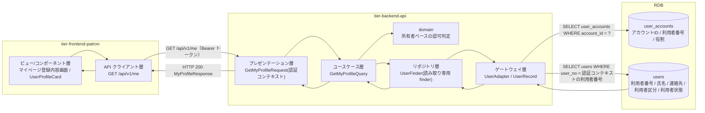
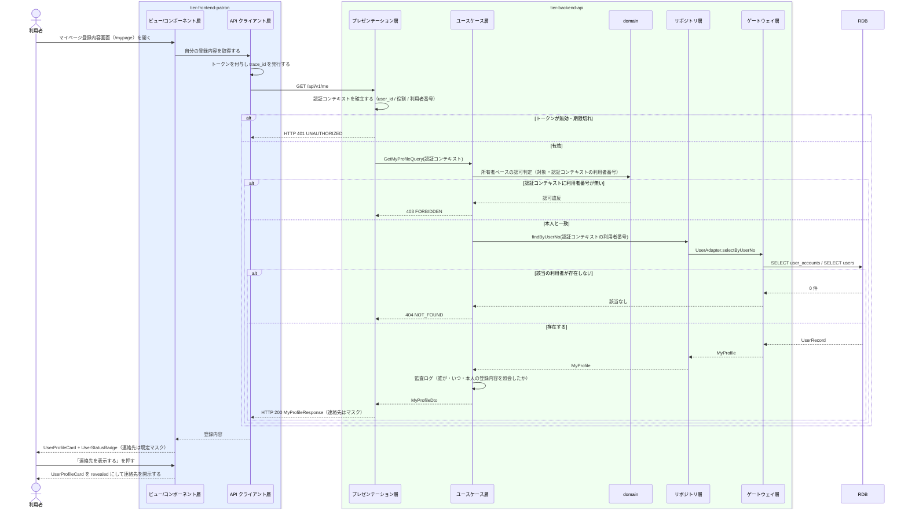

# 自分の利用者情報を照会する

## 概要

利用者が自分の氏名・連絡先・利用者番号を Web 画面（マイページ登録内容画面）で確認する。個人情報参照可否条件により、参照対象はログイン中の利用者本人に紐づく利用者情報に限定し、他の利用者の情報は参照できない。

## データフロー



| レイヤー | データモデル | 変換内容 |
|---------|------------|---------|
| FE ビュー層 | マイページ登録内容画面（UserProfileCard） | 連絡先は既定でマスクし、明示操作で開示する。画面ローカルに状態を保持する（LR-026） |
| FE API クライアント層 | GetMyProfileRequest | トークンの付与と trace_id の発行。利用者番号をクライアントから送らない |
| BE presentation | 認証コンテキスト（user_id, 役割, 利用者番号） | トークンから認証コンテキストを組み立てる。本人限定参照の判定は行わない（LP-003） |
| BE usecase | GetMyProfileQuery(認証コンテキスト) | Query。repository の読み取り専用 finder を使う（LP-008） |
| BE domain | 所有者ベースの認可判定 | 取得対象の利用者番号が認証コンテキストの利用者番号と一致することを強制する（LP-011） |
| BE gateway | SELECT user_accounts / SELECT users | UserRecord → MyProfile へ射影する |
| Response | MyProfileResponse(user_no, name, email_masked, user_category, user_status, registered_at) | 本人の登録内容として表示する |

## 処理フロー



## バリエーション一覧

| バリエーション名 | 値 | 処理内容 | 適用 tier | 適用箇所 |
|----------------|---|---------|----------|---------|
| 利用者区分 | 一般 / 学生 / 団体 | 登録内容カードに区分を表示する | tier-frontend-patron | マイページ登録内容画面（UserProfileCard） |
| 利用者区分 | 一般 / 学生 / 団体 | `user_category` をレスポンスに含める | tier-backend-api | GET /api/v1/me |

## 分岐条件一覧

| 条件名 | 判定ルール | 適用 tier | 適用箇所 | BDD Scenario |
|--------|----------|----------|---------|-------------|
| 個人情報参照可否条件 | 参照対象はログイン中の利用者本人に紐づく利用者情報のみ。利用者番号をリクエストで受け取らず、認証コンテキストの利用者番号だけを使う | tier-backend-api | domain の所有者ベース認可判定 / GET /api/v1/me | 他人の利用者情報へ到達できない |
| 本人限定参照の UI 制約（LP-025） | 他利用者の情報へ到達する導線（利用者番号の直接指定等）を画面に持たない | tier-frontend-patron | マイページ登録内容画面 | 他人の情報への導線が無い |
| 段階的開示 | 連絡先は既定でマスクし、利用者の明示操作でのみ開示する | tier-frontend-patron | UserProfileCard（`default` / `revealed`） | 連絡先が既定でマスクされる |

## 計算ルール一覧

| 計算名 | 入力情報 | 計算式/ロジック | 出力情報 | 適用 tier |
|--------|---------|---------------|---------|----------|
| 連絡先のマスク | 利用者（連絡先） | ローカル部の先頭 1 文字を残して以降を `*` に置換し、ドメイン部はそのまま連結する | email_masked | tier-backend-api |

## 状態遷移一覧

| 状態モデル | 遷移元 | 遷移先 | トリガー | 事前条件 | 事後処理 | 適用 tier |
|-----------|--------|--------|---------|---------|---------|----------|
| 利用者状態 | 登録済み | 登録済み | 自分の利用者情報を照会する（参照のみ） | 利用者としてログイン済み | なし（状態遷移を伴わない照会 UC） | tier-backend-api |
| 利用者状態 | 取引進行中 | 取引進行中 | 自分の利用者情報を照会する（参照のみ） | 利用者としてログイン済み | なし | tier-backend-api |

## 関連 RDRA モデル

| モデル種別 | 要素名 | 関連 |
|-----------|--------|------|
| 業務 | 利用者管理業務 | このUCが属する業務 |
| BUC | 利用者を管理するフロー | このUCを含むBUC |
| アクティビティ | 自分の登録内容を確認する | このUCが実現するアクティビティ |
| アクター | 利用者 | 操作するアクター（立場: 提供者） |
| 情報 | 利用者 | 照会する情報 |
| 情報 | 利用者アカウント | 本人限定参照の判定に使う情報（アカウントID・ログインID・利用者番号・役割・有効フラグ） |
| 状態 | 利用者状態 | 表示する状態（登録済み / 取引進行中） |
| 条件 | 個人情報参照可否条件 | 本人限定参照の根拠 |
| バリエーション | 利用者区分 | 表示する区分 |
| 画面 | マイページ登録内容画面 | このUCの画面 |

## E2E 完了条件（BDD）

### 正常系

```gherkin
Feature: 自分の利用者情報を照会する

  Scenario: 本人の登録内容が表示される
    Given 利用者「田中太郎（U-000123 / 一般 / 登録済み）」が利用者ポータルにログイン済みである
    When 利用者がマイページ登録内容画面（/mypage）を開く
    Then 氏名「田中太郎」と利用者番号「U-000123」が表示される
    And 利用者区分「一般」が表示される
    And UserStatusBadge に「登録済み」が表示される

  Scenario: 連絡先は既定でマスクされる
    Given 利用者「田中太郎」の連絡先が「tanaka@example.com」である
    When 利用者がマイページ登録内容画面を開く
    Then 連絡先がマスク表示（例「t****@example.com」）である
    And 「連絡先を表示する」操作が提供される

  Scenario: 取引進行中の状態が表示される
    Given 利用者「佐藤次郎（U-000200）」の利用者状態が「取引進行中」である
    When 利用者がマイページ登録内容画面を開く
    Then UserStatusBadge に「取引進行中」が表示される

  Scenario: ログイン中のアカウントのログインIDが表示される
    Given 利用者「田中太郎」の利用者アカウント（アカウントID "A-000123"、ログインID "tanaka.taro"、役割「利用者」、有効フラグ true）が存在する
    When 利用者がマイページ登録内容画面を開く
    Then ログイン情報として ログインID「tanaka.taro」が表示される
    And 認証コンテキストのアカウントID から解決した利用者番号「U-000123」の登録内容のみが表示される
```

### 異常系

```gherkin
  Scenario: 未ログインではログイン画面へ誘導される
    Given 利用者がログインしていない
    When 利用者がマイページ登録内容画面（/mypage）を開く
    Then HTTP 401 が返る
    And ログイン画面へ誘導される

  Scenario: 他人の利用者情報へ到達できない
    Given 利用者「田中太郎（U-000123）」がログイン済みである
    When 利用者が GET /api/v1/me を実行する
    Then レスポンスの user_no が「U-000123」である
    And 他の利用者番号を指定するパラメータが API に存在しない

  Scenario: 取得に失敗したときエラーを表示する
    Given 利用者「田中太郎」がログイン済みである
    And バックエンド API が HTTP 500 を返す状態である
    When 利用者がマイページ登録内容画面を開く
    Then Alert(destructive) に「登録内容を取得できませんでした」と表示される
    And 内部の例外内容やスタックトレースは表示されない
```

## ティア別仕様

- [利用者ポータル](tier-frontend-patron.md)
- [バックエンド API](tier-backend-api.md)

### 統合 API Spec

- [OpenAPI Spec](../../../_cross-cutting/api/openapi.yaml)（全 UC 統合、Contract First 開発用）
