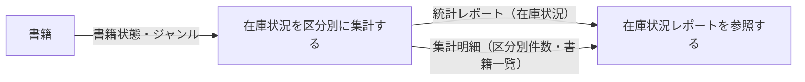
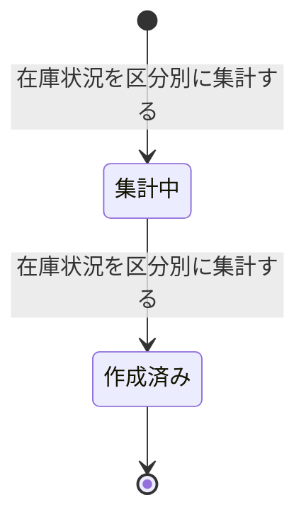

# 在庫状況を把握するフロー

## 概要

蔵書を書籍状態の区分ごとに集計し、司書が蔵書の稼働状況を把握する業務フローである。集計条件を指定してレポートを作成する UC と、作成済みレポートを参照する UC で構成する。

## 所属 UC 一覧

| UC名 | アクター | 主な操作 | 関連情報 |
|------|---------|---------|---------|
| [在庫状況を区分別に集計する](在庫状況を区分別に集計する/spec.md) | 司書（提供者） | 書籍状態（貸出中・在庫あり・予約待ち）ごとに蔵書を集計し、区分別件数と書籍一覧のレポートを作成する | 統計レポート、書籍 |
| [在庫状況レポートを参照する](在庫状況レポートを参照する/spec.md) | 司書（受益者） | 区分ごとの件数と該当書籍一覧をレポートとして参照する | 統計レポート、書籍 |

## UC 横断データフロー

「在庫状況を区分別に集計する」が書籍を集計して統計レポートを作成し、「在庫状況レポートを参照する」がその作成済みレポートを参照する。参照系 UC は書籍を直接集計せず、集計明細を経由して書籍一覧を表示する。

### データフロー図

### 情報 CRUD マトリクス

| 情報名 | 在庫状況を区分別に集計する | 在庫状況レポートを参照する |
|--------|:------------------------:|:------------------------:|
| 統計レポート | C / U | R |
| 書籍 | R | R |

## 状態遷移全体図

統計レポート状態のうち、在庫状況レポートに関わる遷移パスを示す。集計 UC が状態を遷移させ、参照 UC は「作成済み」のレポートを参照する。

### 状態遷移 UC マッピング

| 状態モデル | 遷移元 | 遷移先 | 担当 UC |
|-----------|--------|--------|--------|
| 統計レポート状態 | （初期） | 集計中 | [在庫状況を区分別に集計する](在庫状況を区分別に集計する/spec.md) |
| 統計レポート状態 | 集計中 | 作成済み | [在庫状況を区分別に集計する](在庫状況を区分別に集計する/spec.md) |
| 統計レポート状態 | 作成済み | （終了・参照のみ） | [在庫状況レポートを参照する](在庫状況レポートを参照する/spec.md) |
| 統計レポート状態 | 集計中 | （遷移なし・参照のみ） | [在庫状況レポートを参照する](在庫状況レポートを参照する/spec.md) |
| 書籍状態 | 在庫あり / 貸出中 / 予約待ち | （遷移なし・参照のみ） | [在庫状況を区分別に集計する](在庫状況を区分別に集計する/spec.md), [在庫状況レポートを参照する](在庫状況レポートを参照する/spec.md) |

注記: UC Spec「在庫状況を区分別に集計する」は蔵書 0 件時の「集計中 → 実績なし」遷移を持つが、RDRA 状態モデル（状態.tsv）では当該遷移は「期間別貸出統計を集計する」のみに定義されている。本図は RDRA モデル準拠の遷移のみを描画している（要確認 1 件）。

## BUC 内共有条件一覧

| 条件名 | 条件の説明 | 適用 UC |
|--------|----------|--------|
| 在庫状況集計条件 | 蔵書全件を書籍状態（在庫あり／貸出中／予約待ち）で区分し、区分ごとの件数と書籍一覧を集計する | 在庫状況を区分別に集計する（集計）, 在庫状況レポートを参照する（表示対象の決定） |

## BUC 内共有バリエーション一覧

| バリエーション名 | 値 | 適用 UC |
|----------------|---|--------|
| レポート種別 | 在庫状況、人気書籍ランキング、期間別貸出統計 | 在庫状況を区分別に集計する, 在庫状況レポートを参照する（いずれも「在庫状況」を対象とする） |
| ジャンル | 文学、人文、社会科学、自然科学、技術、芸術、児童、その他 | 在庫状況を区分別に集計する, 在庫状況レポートを参照する |
