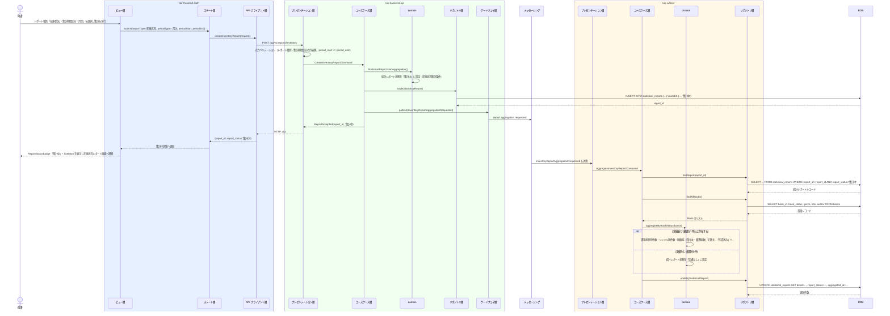

# 在庫状況を区分別に集計する

## 概要

司書が在庫状況集計条件指定画面でレポート種別と集計期間区分を指定し、蔵書全件を書籍状態（在庫あり／貸出中／予約待ち）で区分した件数と書籍一覧を集計する。集計要求は統計レポートを「集計中」で作成したうえで Worker ティアへ非同期に委譲し（arch SP-018）、集計完了後に「作成済み」へ遷移させる。

## データフロー

```mermaid
graph LR
  subgraph FE["tier-frontend-staff"]
    FE_View["ビュー層\n在庫状況集計条件指定画面(ReportPeriodSelector)"]
    FE_State["ステート層\nInventoryReportRequestState(reportType/periodType/periodStart/periodEnd/submitting)"]
    FE_API["API クライアント層\nPOST /api/v1/reports/inventory"]
    FE_View --> FE_State --> FE_API
  end
  subgraph BE["tier-backend-api"]
    BE_Pres["プレゼンテーション層\nCreateInventoryReportRequest"]
    BE_UC["ユースケース層\nCreateInventoryReportCommand"]
    BE_Domain["domain\nStatisticalReport(統計レポート状態=集計中)"]
    BE_Repo["リポジトリ層\nStatisticalReportRecord"]
    BE_GW["ゲートウェイ層\nInventoryReportAggregationRequested"]
    BE_Pres --> BE_UC --> BE_Domain
    BE_UC --> BE_Repo
    BE_UC --> BE_GW
  end
  subgraph WK["tier-worker"]
    WK_Pres["プレゼンテーション層\nInventoryReportAggregationRequested(MQ メッセージ)"]
    WK_UC["ユースケース層\nAggregateInventoryReportCommand"]
    WK_Domain["domain\nInventoryAggregation(書籍状態別件数/ジャンル別件数/稼働率)"]
    WK_Repo["リポジトリ層\nBookRecord / StatisticalReportRecord"]
    WK_Pres --> WK_UC --> WK_Domain
    WK_UC --> WK_Repo
  end
  subgraph DB["RDB"]
    DB_Report[("statistical_reports\nreport_id/report_type/report_status/detail")]
    DB_Book[("books\nbook_id/book_status/genre")]
  end
  subgraph MQ["メッセージング"]
    MQ_CH(["report.aggregation.requested"])
  end
  FE_API -->|"POST /api/v1/reports/inventory {report_type, period_type, period_start, period_end}"| BE_Pres
  BE_Repo -->|"INSERT statistical_reports (report_status='集計中')"| DB_Report
  BE_GW --> MQ_CH --> WK_Pres
  WK_Repo -->|"SELECT statistical_reports (report_id, report_status='集計中')"| DB_Report
  WK_Repo -->|"SELECT book_status, genre FROM books"| DB_Book
  WK_Repo -->|"UPDATE statistical_reports SET detail, report_status='作成済み'"| DB_Report
  BE_Pres -->|"HTTP 202 {report_id, report_status:'集計中'}"| FE_API --> FE_State --> FE_View
```



| レイヤー | データモデル | 変換内容 |
|---------|------------|---------|
| FE ビュー層 | レポート種別（在庫状況）・集計期間区分（日次／月次／年次）・集計期間の選択 | ToggleGroup の選択を `InventoryReportRequestState` へ反映する |
| FE ステート層 | InventoryReportRequestState | 既定値（集計期間区分=月次）を保持し、送信中は `submitting=true` にして二重送信を防ぐ |
| BE プレゼンテーション層 | CreateInventoryReportRequest(report_type, period_type, period_start, period_end) | バリエーション値の許容チェック + CreateInventoryReportCommand へ変換 |
| BE ユースケース層 | CreateInventoryReportCommand | StatisticalReport を「集計中」で生成し、集計要求イベントを発行 |
| BE リポジトリ層 | INSERT statistical_reports | report_status='集計中'、aggregated_at=集計開始日時 |
| Worker ユースケース層 | AggregateInventoryReportCommand | books 全件を書籍状態で区分し件数・書籍一覧・ジャンル別件数を算出 |
| Worker リポジトリ層 | UPDATE statistical_reports | detail(JSON) と report_status='作成済み' を書き込む |
| Response | {report_id, report_status:'集計中'} | 在庫状況レポート画面への遷移と集計中表示に使う |

## 処理フロー



## バリエーション一覧

| バリエーション名 | 値 | 処理内容 | 適用 tier | 適用箇所 |
|----------------|---|---------|----------|---------|
| レポート種別 | 在庫状況 / 人気書籍ランキング / 期間別貸出統計 | 本 UC では「在庫状況」のみを受け付け、それ以外は 400 を返す | tier-frontend-staff, tier-backend-api | 在庫状況集計条件指定画面 / POST /api/v1/reports/inventory |
| 集計期間区分 | 日次 / 月次 / 年次 | 集計対象期間の粒度を決める。既定値は「月次」 | tier-frontend-staff, tier-backend-api | ReportPeriodSelector / CreateInventoryReportRequest |
| ジャンル | 文学 / 人文 / 社会科学 / 自然科学 / 技術 / 芸術 / 児童 / その他 | ジャンル別蔵書件数の集計軸として使う | tier-worker | AggregateInventoryReportCommand |

## 分岐条件一覧

| 条件名 | 判定ルール | 適用 tier | 適用箇所 | BDD Scenario |
|--------|----------|----------|---------|-------------|
| 在庫状況集計条件 | 蔵書全件を書籍状態（在庫あり／貸出中／予約待ち）で区分し、区分ごとの件数と書籍一覧を集計する | tier-worker | AggregateInventoryReportCommand | 蔵書全件を書籍状態で区分集計する |
| 在庫状況集計条件（実績なし判定） | 集計対象の蔵書が 0 件の場合は統計レポート状態を「実績なし」とする | tier-worker | InventoryAggregation | 蔵書が0件のとき実績なしとして記録する |
| レポート種別の許容値 | report_type が「在庫状況」以外の場合は集計要求を受け付けない | tier-backend-api | プレゼンテーション層 入力バリデーション | 対象外のレポート種別を指定すると400を返す |

## 計算ルール一覧

| 計算名 | 入力情報 | 計算式/ロジック | 出力情報 | 適用 tier |
|--------|---------|---------------|---------|----------|
| 書籍状態別件数 | 書籍（書籍状態） | 書籍状態ごとに COUNT(book_id) | 統計レポート（集計明細.status_counts） | tier-worker |
| 蔵書総数 | 書籍（書籍ID） | COUNT(book_id) | 統計レポート（集計明細.total_books） | tier-worker |
| 稼働率 | 書籍（書籍状態） | 貸出中件数 ÷ 蔵書総数（蔵書総数が0のとき算出しない） | 統計レポート（集計明細.utilization_rate） | tier-worker |
| ジャンル別蔵書件数 | 書籍（ジャンル） | ジャンルごとに COUNT(book_id) | 統計レポート（集計明細.genre_counts） | tier-worker |

## 状態遷移一覧

| 状態モデル | 遷移元 | 遷移先 | トリガー | 事前条件 | 事後処理 | 適用 tier |
|-----------|--------|--------|---------|---------|---------|----------|
| 統計レポート状態 | （なし） | 集計中 | 司書が集計条件を指定して集計を実行する | レポート種別・集計期間区分が許容値である | 集計要求イベントを report.aggregation.requested へ発行する | tier-backend-api |
| 統計レポート状態 | 集計中 | 作成済み | 在庫状況の集計が完了する | 蔵書が1件以上存在する | 集計明細（区分別件数・書籍一覧）を保存する | tier-worker |
| 統計レポート状態 | 集計中 | 実績なし | 集計対象の蔵書が存在しない | 蔵書が0件 | 司書へ実績なしとして案内する（※ 状態.tsv には在庫状況の「実績なし」遷移が未定義。蔵書 0 件時の扱いとして本仕様で追加した RDRA 未定義の派生であり、RDRA へのフィードバック対象） | tier-worker |

## 関連 RDRA モデル

| モデル種別 | 要素名 | 関連 |
|-----------|--------|------|
| 業務 | 蔵書分析業務 | このUCが属する業務 |
| BUC | 在庫状況を把握するフロー | このUCを含むBUC |
| アクター | 司書 | 集計を実行するアクター（提供者） |
| 情報 | 統計レポート | 作成・更新する情報 |
| 情報 | 書籍 | 集計対象として参照する情報 |
| 状態 | 統計レポート状態 | 集計中 → 作成済み／実績なし |
| 状態 | 書籍状態 | 集計の区分軸（在庫あり／貸出中／予約待ち） |
| 条件 | 在庫状況集計条件 | 適用される条件 |
| バリエーション | レポート種別 | 在庫状況を指定する |
| バリエーション | 集計期間区分 | 日次／月次／年次 |
| バリエーション | ジャンル | ジャンル別件数の集計軸 |
| 画面 | 在庫状況集計条件指定画面 | 集計条件を指定する画面 |

## E2E 完了条件（BDD）

### 正常系

```gherkin
Feature: 在庫状況を区分別に集計する

  Scenario: 蔵書全件を書籍状態で区分集計する
    Given 司書「山田花子」が司書ポータルにログインしている
    And 蔵書が 120 件登録されており、書籍状態は 在庫あり 80 件・貸出中 30 件・予約待ち 10 件である
    When 司書が在庫状況集計条件指定画面でレポート種別「在庫状況」・集計期間区分「月次」・集計期間「2026-08-01〜2026-08-31」を指定して集計を実行する
    Then HTTP 202 で report_id が返り、統計レポート状態が「集計中」になる
    And 集計完了後に統計レポート状態が「作成済み」になり、集計明細に 蔵書総数 120・在庫あり 80・貸出中 30・予約待ち 10・稼働率 25.0% が記録される

  Scenario: 集計期間区分の既定値でそのまま集計を実行する
    Given 司書「山田花子」が在庫状況集計条件指定画面を開いている
    And 集計期間区分の初期選択が「月次」である
    When 司書が集計期間区分を変更せず集計を実行する
    Then 集計期間区分「月次」で統計レポートが「集計中」として作成される

  Scenario: ジャンル別蔵書件数を集計明細に含める
    Given 蔵書 120 件のうちジャンル「文学」が 45 件・「技術」が 30 件登録されている
    When 司書が在庫状況の集計を実行する
    Then 集計明細の genre_counts に 文学 45・技術 30 が含まれる
```

### 異常系

```gherkin
  Scenario: 蔵書が0件のとき実績なしとして記録する
    Given 蔵書が 0 件である
    When 司書がレポート種別「在庫状況」で集計を実行する
    Then 統計レポート状態が「実績なし」になり、在庫状況レポート画面に EmptyState で「集計対象の蔵書がありません」が表示される

  Scenario: 対象外のレポート種別を指定すると400を返す
    Given 司書「山田花子」が司書ポータルにログインしている
    When 司書が report_type「期間別貸出統計」で POST /api/v1/reports/inventory を実行する
    Then HTTP 400 が返り、「レポート種別は 在庫状況 を指定してください」が表示される

  Scenario: 利用者ロールでは集計を実行できない
    Given 利用者「田中太郎」が利用者ロールのトークンを持っている
    When 利用者が POST /api/v1/reports/inventory を実行する
    Then HTTP 403 が返り、統計レポートは作成されない
```

## ティア別仕様

- [司書ポータル](tier-frontend-staff.md)
- [バックエンド API](tier-backend-api.md)
- [バックエンドワーカー](tier-worker.md)

### 統合 API Spec

- [OpenAPI Spec](../../../_cross-cutting/api/openapi.yaml)（全 UC 統合、Contract First 開発用）
- [AsyncAPI Spec](../../../_cross-cutting/api/asyncapi.yaml)（全 UC 統合、非同期イベントがある場合のみ）
