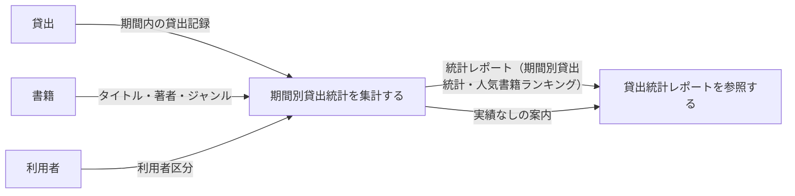
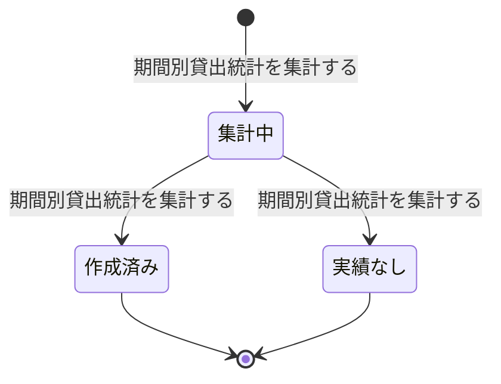

# 貸出統計を把握するフロー

## 概要

指定期間の貸出実績を集計し、司書が選書・購入判断や運用改善に活かす業務フローである。集計期間を指定して統計を作成する UC と、作成済みレポート（貸出件数・人気書籍ランキング）を参照する UC で構成する。

## 所属 UC 一覧

| UC名 | アクター | 主な操作 | 関連情報 |
|------|---------|---------|---------|
| [期間別貸出統計を集計する](期間別貸出統計を集計する/spec.md) | 司書（提供者） | 指定された集計期間区分で貸出件数と書籍別貸出回数のランキングを集計する | 統計レポート、貸出、書籍 |
| [貸出統計レポートを参照する](貸出統計レポートを参照する/spec.md) | 司書（受益者） | 指定期間の貸出件数と人気書籍ランキングをレポートとして参照する | 統計レポート、貸出、書籍 |

## UC 横断データフロー

「期間別貸出統計を集計する」が返却済みを含む貸出記録と書籍から統計レポートを作成し、「貸出統計レポートを参照する」がその作成済みレポートを参照する。対象期間に実績がない場合は「実績なし」のレポートとして参照側へ案内する。

### データフロー図

### 情報 CRUD マトリクス

| 情報名 | 期間別貸出統計を集計する | 貸出統計レポートを参照する |
|--------|:----------------------:|:------------------------:|
| 統計レポート | C / U | R |
| 貸出 | R | R |
| 書籍 | R | R |
| 利用者 | R | |

## 状態遷移全体図

統計レポート状態のうち、貸出統計レポートに関わる遷移パスを示す。集計 UC が状態を遷移させ、参照 UC は「作成済み」「実績なし」のレポートを参照する。

### 状態遷移 UC マッピング

| 状態モデル | 遷移元 | 遷移先 | 担当 UC |
|-----------|--------|--------|--------|
| 統計レポート状態 | （初期） | 集計中 | [期間別貸出統計を集計する](期間別貸出統計を集計する/spec.md) |
| 統計レポート状態 | 集計中 | 作成済み | [期間別貸出統計を集計する](期間別貸出統計を集計する/spec.md) |
| 統計レポート状態 | 集計中 | 実績なし | [期間別貸出統計を集計する](期間別貸出統計を集計する/spec.md) |
| 統計レポート状態 | 作成済み | （終了・参照のみ） | [貸出統計レポートを参照する](貸出統計レポートを参照する/spec.md) |
| 統計レポート状態 | 実績なし | （終了・参照のみ） | [貸出統計レポートを参照する](貸出統計レポートを参照する/spec.md) |
| 貸出状態 | 返却済み | （遷移なし・参照のみ） | [期間別貸出統計を集計する](期間別貸出統計を集計する/spec.md), [貸出統計レポートを参照する](貸出統計レポートを参照する/spec.md) |

## BUC 内共有条件一覧

| 条件名 | 条件の説明 | 適用 UC |
|--------|----------|--------|
| 貸出統計集計条件 | 指定された集計期間区分と期間に含まれる貸出記録を対象に貸出件数と書籍別貸出回数を集計する。対象期間に貸出実績が存在しない場合は実績なしとして扱う | 期間別貸出統計を集計する（集計）, 貸出統計レポートを参照する（表示対象の決定） |

## BUC 内共有バリエーション一覧

| バリエーション名 | 値 | 適用 UC |
|----------------|---|--------|
| レポート種別 | 在庫状況、人気書籍ランキング、期間別貸出統計 | 期間別貸出統計を集計する, 貸出統計レポートを参照する |
| 集計期間区分 | 日次、月次、年次 | 期間別貸出統計を集計する, 貸出統計レポートを参照する |
| 利用者区分 | 一般、学生、団体 | 期間別貸出統計を集計する, 貸出統計レポートを参照する |
| ジャンル | 文学、人文、社会科学、自然科学、技術、芸術、児童、その他 | 期間別貸出統計を集計する, 貸出統計レポートを参照する |
