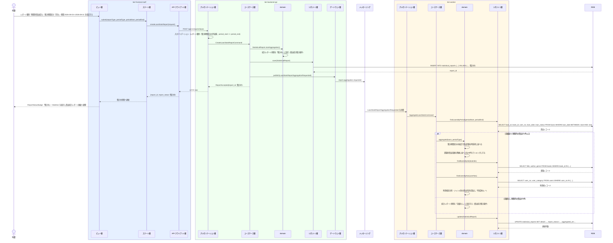

# 期間別貸出統計を集計する

## 概要

司書が集計期間指定画面でレポート種別と集計期間区分（日次／月次／年次）・集計期間を指定し、期間内の貸出記録から貸出件数と書籍別貸出回数のランキングを集計する。集計要求は統計レポートを「集計中」で作成して Worker ティアへ非同期に委譲し（arch SP-018）、実績があれば「作成済み」、実績が無ければ「実績なし」へ遷移させる。

## データフロー

```mermaid
graph LR
  subgraph FE["tier-frontend-staff"]
    FE_View["ビュー層\n集計期間指定画面(ReportPeriodSelector)"]
    FE_State["ステート層\nLoanStatsRequestState(reportType/periodType/periodStart/periodEnd/submitting)"]
    FE_API["API クライアント層\nPOST /api/v1/reports/loans"]
    FE_View --> FE_State --> FE_API
  end
  subgraph BE["tier-backend-api"]
    BE_Pres["プレゼンテーション層\nCreateLoanStatsReportRequest"]
    BE_UC["ユースケース層\nCreateLoanStatsReportCommand"]
    BE_Domain["domain\nStatisticalReport(統計レポート状態=集計中)"]
    BE_Repo["リポジトリ層\nStatisticalReportRecord"]
    BE_GW["ゲートウェイ層\nLoanStatsReportAggregationRequested"]
    BE_Pres --> BE_UC --> BE_Domain
    BE_UC --> BE_Repo
    BE_UC --> BE_GW
  end
  subgraph WK["tier-worker"]
    WK_Pres["プレゼンテーション層\nLoanStatsReportAggregationRequested(MQ メッセージ)"]
    WK_UC["ユースケース層\nAggregateLoanStatsCommand"]
    WK_Domain["domain\nLoanStatsAggregation(期間別貸出件数/書籍別貸出回数)"]
    WK_Repo["リポジトリ層\nLoanRecord / BookRecord / UserRecord / StatisticalReportRecord"]
    WK_Pres --> WK_UC --> WK_Domain
    WK_UC --> WK_Repo
  end
  subgraph DB["RDB"]
    DB_Report[("statistical_reports\nreport_id/report_type/report_status/detail")]
    DB_Loan[("loans\nloan_id/book_id/user_no/loan_date/loan_status")]
    DB_Book[("books\nbook_id/title/author/genre")]
    DB_User[("users\nuser_no/user_category")]
  end
  subgraph MQ["メッセージング"]
    MQ_CH(["report.aggregation.requested"])
  end
  FE_API -->|"POST /api/v1/reports/loans {report_type, period_type, period_start, period_end}"| BE_Pres
  BE_Repo -->|"INSERT statistical_reports (report_status='集計中')"| DB_Report
  BE_GW --> MQ_CH --> WK_Pres
  WK_Repo -->|"SELECT ... FROM loans WHERE loan_date BETWEEN :start AND :end"| DB_Loan
  WK_Repo -->|"SELECT title, author, genre FROM books WHERE book_id IN (...)"| DB_Book
  WK_Repo -->|"SELECT user_no, user_category FROM users WHERE user_no IN (...)"| DB_User
  WK_Repo -->|"UPDATE statistical_reports SET detail, report_status"| DB_Report
  BE_Pres -->|"HTTP 202 {report_id, report_status:'集計中'}"| FE_API --> FE_State --> FE_View
```



| レイヤー | データモデル | 変換内容 |
|---------|------------|---------|
| FE ビュー層 | レポート種別・集計期間区分・集計期間の選択 | ToggleGroup と日付入力を `LoanStatsRequestState` へ反映する |
| FE ステート層 | LoanStatsRequestState | 既定値（集計期間区分=月次）を保持し、送信中は二重送信を防ぐ |
| BE プレゼンテーション層 | CreateLoanStatsReportRequest(report_type, period_type, period_start, period_end) | バリエーション値の許容チェック + Command 変換 |
| BE ユースケース層 | CreateLoanStatsReportCommand | StatisticalReport を「集計中」で生成し、集計要求イベントを発行 |
| BE リポジトリ層 | INSERT statistical_reports | report_status='集計中'、aggregated_at=集計開始日時 |
| Worker ユースケース層 | AggregateLoanStatsCommand | 期間内の貸出を集計期間区分の粒度で件数化し、書籍別貸出回数を降順に並べる |
| Worker リポジトリ層 | UPDATE statistical_reports | detail(JSON) と report_status（作成済み／実績なし）を書き込む |
| Response | {report_id, report_status:'集計中'} | 貸出統計レポート画面への遷移と集計中表示に使う |

## 処理フロー



## バリエーション一覧

| バリエーション名 | 値 | 処理内容 | 適用 tier | 適用箇所 |
|----------------|---|---------|----------|---------|
| レポート種別 | 在庫状況 / 人気書籍ランキング / 期間別貸出統計 | 本 UC では「期間別貸出統計」「人気書籍ランキング」を受け付け、「在庫状況」は 400 を返す | tier-frontend-staff, tier-backend-api | 集計期間指定画面 / POST /api/v1/reports/loans |
| 集計期間区分 | 日次 / 月次 / 年次 | 貸出件数の時系列粒度を決める。既定値は「月次」 | tier-frontend-staff, tier-backend-api, tier-worker | ReportPeriodSelector / AggregateLoanStatsCommand |
| 利用者区分 | 一般 / 学生 / 団体 | 利用者区分別の貸出内訳を算出する集計軸として使う | tier-worker | LoanStatsAggregation |
| ジャンル | 文学 / 人文 / 社会科学 / 自然科学 / 技術 / 芸術 / 児童 / その他 | ジャンル別の貸出内訳を算出する集計軸として使う | tier-worker | LoanStatsAggregation |

## 分岐条件一覧

| 条件名 | 判定ルール | 適用 tier | 適用箇所 | BDD Scenario |
|--------|----------|----------|---------|-------------|
| 貸出統計集計条件 | 指定された集計期間区分と期間に含まれる貸出記録を対象に貸出件数と書籍別貸出回数を集計する | tier-worker | AggregateLoanStatsCommand | 期間内の貸出件数と書籍別貸出回数を集計する |
| 貸出統計集計条件（実績なし判定） | 対象期間に貸出実績が存在しない場合は統計レポート状態を「実績なし」とする | tier-worker | LoanStatsAggregation | 期間内に貸出実績がないとき実績なしとして記録する |
| レポート種別の許容値 | report_type が 期間別貸出統計・人気書籍ランキング 以外なら受け付けない | tier-backend-api | プレゼンテーション層 入力バリデーション | 対象外のレポート種別を指定すると400を返す |
| 集計期間区分の許容値 | period_type が 日次／月次／年次 のいずれでもない場合は集計要求を受け付けない | tier-backend-api | プレゼンテーション層 入力バリデーション | 集計期間区分が不正なとき400を返す |
| 集計期間の前後関係 | period_start が period_end より後の場合は集計要求を受け付けない | tier-frontend-staff, tier-backend-api | 集計期間指定画面 / CreateLoanStatsReportRequest | 集計期間の前後が逆のとき400を返す |

## 計算ルール一覧

| 計算名 | 入力情報 | 計算式/ロジック | 出力情報 | 適用 tier |
|--------|---------|---------------|---------|----------|
| 期間内貸出件数 | 貸出（貸出日） | 期間内の貸出レコードを COUNT(loan_id) | 統計レポート（集計明細.total_loans） | tier-worker |
| 期間別貸出件数の推移 | 貸出（貸出日）、集計期間区分 | 集計期間区分の粒度（日／月／年）で貸出日を丸めて COUNT(loan_id)。貸出が 0 件の期間も 0 として枠を出す | 統計レポート（集計明細.trend[]） | tier-worker |
| 書籍別貸出回数（人気書籍ランキング） | 貸出（書籍ID）、書籍（タイトル・著者） | 書籍IDごとに COUNT(loan_id) を降順に並べ上位 20 件を採用。同数は書籍IDの昇順で安定化する | 統計レポート（集計明細.ranking[]） | tier-worker |
| 返却済み件数 | 貸出（貸出状態） | 期間内の貸出のうち貸出状態が「返却済み」の COUNT(loan_id) | 統計レポート（集計明細.returned_count） | tier-worker |
| 利用者数 | 貸出（利用者番号） | 期間内の貸出の COUNT(DISTINCT user_no) | 統計レポート（集計明細.distinct_users） | tier-worker |
| 1 利用者あたり貸出件数 | 貸出（貸出ID・利用者番号） | 期間内貸出件数 ÷ 利用者数（利用者数が 0 のときは算出しない） | 統計レポート（集計明細.loans_per_user） | tier-worker |

## 状態遷移一覧

| 状態モデル | 遷移元 | 遷移先 | トリガー | 事前条件 | 事後処理 | 適用 tier |
|-----------|--------|--------|---------|---------|---------|----------|
| 統計レポート状態 | （なし） | 集計中 | 司書が集計期間を指定して集計を実行する | レポート種別・集計期間区分が許容値である | 集計要求イベントを report.aggregation.requested へ発行する | tier-backend-api |
| 統計レポート状態 | 集計中 | 作成済み | 期間別貸出統計の集計が完了する | 対象期間に貸出実績が 1 件以上ある | 集計明細（推移・ランキング・内訳）を保存する | tier-worker |
| 統計レポート状態 | 集計中 | 実績なし | 対象期間に貸出実績が存在しない | 期間内の貸出が 0 件 | 司書へ実績なしとして案内する | tier-worker |

## 関連 RDRA モデル

| モデル種別 | 要素名 | 関連 |
|-----------|--------|------|
| 業務 | 蔵書分析業務 | このUCが属する業務 |
| BUC | 貸出統計を把握するフロー | このUCを含むBUC |
| アクター | 司書 | 集計を実行するアクター（提供者） |
| 情報 | 統計レポート | 作成・更新する情報 |
| 情報 | 貸出 | 集計対象として参照する情報 |
| 情報 | 書籍 | ランキングの書誌情報として参照する情報 |
| 情報 | 利用者 | 利用者区分別内訳のため利用者区分の取得元として参照する情報 |
| 状態 | 統計レポート状態 | 集計中 → 作成済み／実績なし |
| 状態 | 貸出状態 | 返却済み件数の判定に使う |
| 条件 | 貸出統計集計条件 | 適用される条件 |
| バリエーション | レポート種別 | 期間別貸出統計／人気書籍ランキング |
| バリエーション | 集計期間区分 | 日次／月次／年次 |
| バリエーション | 利用者区分 | 利用者区分別の貸出内訳の集計軸 |
| バリエーション | ジャンル | ジャンル別の貸出内訳の集計軸 |
| 画面 | 集計期間指定画面 | 集計条件を指定する画面 |

## E2E 完了条件（BDD）

### 正常系

```gherkin
Feature: 期間別貸出統計を集計する

  Scenario: 期間内の貸出件数と書籍別貸出回数を集計する
    Given 司書「山田花子」が司書ポータルにログインしている
    And 2026-08-01 から 2026-08-31 の期間に貸出が 240 件記録されている
    When 司書が集計期間指定画面でレポート種別「期間別貸出統計」・集計期間区分「月次」・期間「2026-08-01〜2026-08-31」を指定して集計を実行する
    Then HTTP 202 で report_id が返り、統計レポート状態が「集計中」になる
    And 集計完了後に統計レポート状態が「作成済み」になり、集計明細の total_loans が 240 になる
    And ranking に書籍別貸出回数の上位 20 件が降順で記録される

  Scenario: 集計期間区分に応じた粒度で推移を集計する
    Given 2026-08-01 から 2026-08-07 の期間に日ごとの貸出が記録されている
    When 司書が集計期間区分「日次」で集計を実行する
    Then 集計明細の trend に 7 日分の枠が時間順で並び、貸出が 0 件の日も 0 として含まれる

  Scenario: 利用者区分別の貸出内訳を集計する
    Given 期間内の貸出 240 件が 一般 150 件・学生 70 件・団体 20 件である
    When 司書が期間別貸出統計の集計を実行する
    Then 集計明細の user_category_counts に 一般 150・学生 70・団体 20 が記録される
```

### 異常系

```gherkin
  Scenario: 期間内に貸出実績がないとき実績なしとして記録する
    Given 2026-09-01 から 2026-09-30 の期間に貸出が 0 件である
    When 司書がその期間で期間別貸出統計の集計を実行する
    Then 統計レポート状態が「実績なし」になり、貸出統計レポート画面に EmptyState で「対象期間に貸出実績がありません」が表示される

  Scenario: 対象外のレポート種別を指定すると400を返す
    Given 司書「山田花子」が司書ポータルにログインしている
    When 司書が report_type「在庫状況」で POST /api/v1/reports/loans を実行する
    Then HTTP 400 が返り、「レポート種別は 期間別貸出統計 または 人気書籍ランキング を指定してください」が表示される

  Scenario: 集計期間区分が不正なとき400を返す
    Given 司書「山田花子」が司書ポータルにログインしている
    When 司書が period_type「週次」で POST /api/v1/reports/loans を実行する
    Then HTTP 400 が返り、「集計期間区分は 日次 / 月次 / 年次 のいずれかを指定してください」が表示される

  Scenario: 集計期間の前後が逆のとき400を返す
    Given 司書「山田花子」が司書ポータルにログインしている
    When 司書が period_start「2026-08-31」・period_end「2026-08-01」で集計を実行する
    Then HTTP 400 が返り、統計レポートは作成されない

  Scenario: 利用者ロールでは集計を実行できない
    Given 利用者「田中太郎」が利用者ロールのトークンを持っている
    When 利用者が POST /api/v1/reports/loans を実行する
    Then HTTP 403 が返り、統計レポートは作成されない
```

## ティア別仕様

- [司書ポータル](tier-frontend-staff.md)
- [バックエンド API](tier-backend-api.md)
- [バックエンドワーカー](tier-worker.md)

### 統合 API Spec

- [OpenAPI Spec](../../../_cross-cutting/api/openapi.yaml)（全 UC 統合、Contract First 開発用）
- [AsyncAPI Spec](../../../_cross-cutting/api/asyncapi.yaml)（全 UC 統合、非同期イベントがある場合のみ）
