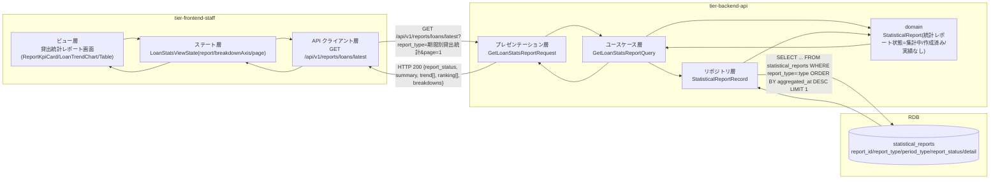
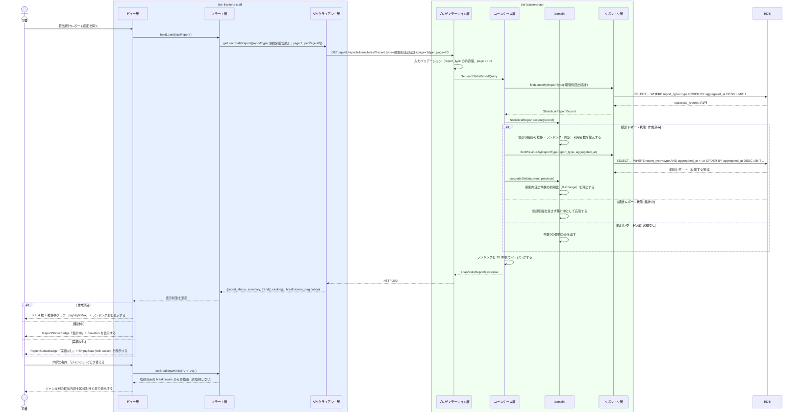

# 貸出統計レポートを参照する

## 概要

司書が貸出統計レポート画面で、指定期間の貸出件数と人気書籍ランキングを参照し、選書・購入判断や運用改善に活かす。集計済みの統計レポートを読み取り専用で表示し、KPI カード 4 枚 + 貸出件数推移チャート 1 枚 + ランキング明細表の 3 層で提示する（`_cross-cutting/ux-ui/data-visualization.md`）。

## データフロー



| レイヤー | データモデル | 変換内容 |
|---------|------------|---------|
| BE プレゼンテーション層 | GetLoanStatsReportRequest(report_id?, report_type?, page, per_page) | クエリパラメータ検証（レポート種別の許容値、ページ番号）と Query 変換 |
| BE ユースケース層 | GetLoanStatsReportQuery | 対象レポートの特定（report_id 指定 or 最新）とランキング明細のページング |
| BE リポジトリ層 | SELECT statistical_reports | report_type='期間別貸出統計'（または人気書籍ランキング）の最新 1 件 |
| BE domain | StatisticalReport | 集計明細(JSON) を推移・ランキング・内訳へ復元し、前期比を算出する |
| Response | LoanStatsReportResponse(report_status, summary, trend[], ranking[], breakdowns, pagination) | KPI カード・推移チャート・ランキング表の表示元 |
| FE ステート層 | LoanStatsViewState | breakdownAxis（利用者区分／ジャンル）とページ番号を保持 |
| FE ビュー層 | KPI 4 枚 / 推移棒グラフ / ランキング表 | 統計レポート状態に応じて Skeleton / EmptyState / 通常表示を切り替える |

## 処理フロー



## バリエーション一覧

| バリエーション名 | 値 | 処理内容 | 適用 tier | 適用箇所 |
|----------------|---|---------|----------|---------|
| レポート種別 | 在庫状況 / 人気書籍ランキング / 期間別貸出統計 | 本画面は「期間別貸出統計」「人気書籍ランキング」を表示対象とし、「在庫状況」は 400 を返す | tier-frontend-staff, tier-backend-api | 貸出統計レポート画面 / GET /api/v1/reports/loans/latest |
| 集計期間区分 | 日次 / 月次 / 年次 | 推移チャートの粒度表示（`daily` / `monthly` バリアント）を切り替える | tier-frontend-staff | LoanTrendChart |
| 利用者区分 | 一般 / 学生 / 団体 | 利用者区分別の貸出内訳を区分別棒と表で提示する | tier-frontend-staff | 貸出統計レポート画面の内訳 |
| ジャンル | 文学 / 人文 / 社会科学 / 自然科学 / 技術 / 芸術 / 児童 / その他 | ジャンル別の貸出内訳を表で提示する（8 区分のため棒にしない） | tier-frontend-staff | 貸出統計レポート画面の内訳 |

## 分岐条件一覧

| 条件名 | 判定ルール | 適用 tier | 適用箇所 | BDD Scenario |
|--------|----------|----------|---------|-------------|
| 貸出統計集計条件 | 集計期間区分と期間に対応する貸出件数と書籍別貸出回数を表示対象とする | tier-backend-api, tier-frontend-staff | GetLoanStatsReportQuery / 貸出統計レポート画面 | 期間内貸出件数とランキングを表示する |
| 統計レポート状態による表示切替 | 集計中は Skeleton、作成済みは KPI・チャート・ランキング、実績なしは EmptyState を表示する | tier-frontend-staff | 貸出統計レポート画面 | 集計中はスケルトンを表示する / 実績なしは空状態を表示する |
| 前期比の算出可否 | 同一レポート種別の前回レポートが存在する場合のみ前期比を返す | tier-backend-api | GetLoanStatsReportQuery | 前回レポートがない場合は前期比を表示しない |
| レポート未存在 | 対象レポート種別の統計レポートが 1 件も無い場合は 404 を返す | tier-backend-api | GET /api/v1/reports/loans/latest | レポートが未作成のとき404を返す |

## 計算ルール一覧

| 計算名 | 入力情報 | 計算式/ロジック | 出力情報 | 適用 tier |
|--------|---------|---------------|---------|----------|
| 前期比（% Change） | 統計レポート（集計明細.total_loans、前回レポートの total_loans） | (今回 − 前回) ÷ 前回 × 100。前回が 0 または未存在なら算出しない | 表示用 delta（％） | tier-backend-api |
| 1 利用者あたり貸出件数の表示 | 統計レポート（集計明細.loans_per_user） | 集計済みの値を小数第1位まで表示し、分母（利用者数）・分子（期間内貸出件数）を補足文言に明示する | 表示値 | tier-frontend-staff |
| ランキング順位 | 統計レポート（集計明細.ranking[]） | 貸出回数の降順に 1 起点の順位を付与する。同数は同順位とし次順位を飛ばす | ランキング表の順位列 | tier-backend-api |
| 推移の最大値強調 | 統計レポート（集計明細.trend[]） | trend の最大値の期間にデータラベルを付与する（`highlightMax`） | チャート表示 | tier-frontend-staff |
| ランキングページ数 | 統計レポート（集計明細.ranking[] の件数） | ceil(ランキング件数 ÷ 20) | ページネーション総ページ数 | tier-backend-api |

## 状態遷移一覧

| 状態モデル | 遷移元 | 遷移先 | トリガー | 事前条件 | 事後処理 | 適用 tier |
|-----------|--------|--------|---------|---------|---------|----------|
| 統計レポート状態 | 作成済み | （終了） | 司書が貸出統計レポート画面で参照する | 統計レポート状態が「作成済み」である | 選書・購入判断や開館時間・配架の運用改善に活用される | tier-frontend-staff |
| 統計レポート状態 | 実績なし | （終了） | 司書が貸出統計レポート画面で参照する | 統計レポート状態が「実績なし」である | 集計期間を変更して再集計する導線を提示する | tier-frontend-staff |

本 UC は参照系であり、統計レポート状態を遷移させない。

## 関連 RDRA モデル

| モデル種別 | 要素名 | 関連 |
|-----------|--------|------|
| 業務 | 蔵書分析業務 | このUCが属する業務 |
| BUC | 貸出統計を把握するフロー | このUCを含むBUC |
| アクター | 司書 | レポートを参照するアクター（受益者） |
| 情報 | 統計レポート | 参照する情報 |
| 情報 | 貸出 | 集計明細の元となる情報 |
| 情報 | 書籍 | ランキングの書誌情報の元となる情報 |
| 状態 | 統計レポート状態 | 集計中／作成済み／実績なしで表示を切り替える |
| 状態 | 貸出状態 | 返却済み件数の内訳表示に使う |
| 条件 | 貸出統計集計条件 | 適用される条件 |
| バリエーション | レポート種別 | 期間別貸出統計／人気書籍ランキング |
| バリエーション | 集計期間区分 | 推移チャートの粒度表示 |
| バリエーション | 利用者区分 | 利用者区分別内訳の表示軸 |
| バリエーション | ジャンル | ジャンル別内訳の表示軸 |
| 画面 | 貸出統計レポート画面 | 参照する画面 |

## E2E 完了条件（BDD）

### 正常系

```gherkin
Feature: 貸出統計レポートを参照する

  Scenario: 期間内貸出件数とランキングを表示する
    Given 統計レポート「RPT-1001」がレポート種別「期間別貸出統計」・統計レポート状態「作成済み」で存在する
    And 集計明細に 期間内貸出件数 240・返却済み件数 200・利用者数 96・1利用者あたり 2.5 件が記録されている
    When 司書「山田花子」が貸出統計レポート画面 /staff/reports/loans を開く
    Then KPI カードに 240 件・200 件・96 人・2.5 件 が 3 桁区切りの等幅で表示される
    And ランキング表に書籍別貸出回数の上位 20 件が順位つきで表示される

  Scenario: 集計期間区分に応じた推移を時間順で表示する
    Given 統計レポート「RPT-1003」の集計期間区分が「日次」で trend に 7 日分が記録されている
    When 司書が貸出統計レポート画面を開く
    Then LoanTrendChart が daily バリアントで 7 本の棒を時間順に表示し、最大値に highlightMax のラベルが付く

  Scenario: 前期比を中立トーンで表示する
    Given 今回の期間内貸出件数が 240 件、前回集計が 214 件である
    And 前期比は (240 - 214) ÷ 214 × 100 = 12.1 として算出される
    When 司書が貸出統計レポート画面を開く
    Then 期間内貸出件数の KPI カードに前期比 +12.1% が表示される

  Scenario: 内訳の軸を切り替える
    Given 司書が貸出統計レポート画面を表示している
    When 司書が内訳の軸を「利用者区分」から「ジャンル」に切り替える
    Then ジャンル 8 区分の貸出内訳が表で表示され、API の再取得は発生しない
```

### 異常系

```gherkin
  Scenario: 集計中はスケルトンを表示する
    Given 最新の貸出統計レポートの統計レポート状態が「集計中」である
    When 司書が貸出統計レポート画面を開く
    Then ReportStatusBadge に「集計中」が表示され、KPI とチャートの領域が Skeleton になる

  Scenario: 実績なしは空状態を表示する
    Given 最新の貸出統計レポートの統計レポート状態が「実績なし」である
    When 司書が貸出統計レポート画面を開く
    Then EmptyState に「対象期間に貸出実績がありません」と「集計期間を変更して再集計する」が表示される

  Scenario: 前回レポートがない場合は前期比を表示しない
    Given レポート種別「期間別貸出統計」の統計レポートが 1 件のみ存在する
    When 司書が貸出統計レポート画面を開く
    Then 期間内貸出件数の KPI カードに前期比が表示されない

  Scenario: レポートが未作成のとき404を返す
    Given レポート種別「期間別貸出統計」の統計レポートが 1 件も存在しない
    When 司書が GET /api/v1/reports/loans/latest を実行する
    Then HTTP 404 が返り、画面に「まだ集計されていません。集計を実行してください」が表示される

  Scenario: 利用者ロールではレポートを参照できない
    Given 利用者「田中太郎」が利用者ロールのトークンを持っている
    When 利用者が GET /api/v1/reports/loans/latest を実行する
    Then HTTP 403 が返り、集計明細は返らない
```

## ティア別仕様

- [司書ポータル](tier-frontend-staff.md)
- [バックエンド API](tier-backend-api.md)

### 統合 API Spec

- [OpenAPI Spec](../../../_cross-cutting/api/openapi.yaml)（全 UC 統合、Contract First 開発用）
- [AsyncAPI Spec](../../../_cross-cutting/api/asyncapi.yaml)（全 UC 統合、非同期イベントがある場合のみ）
