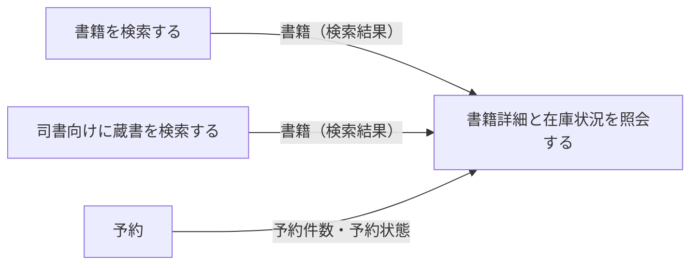
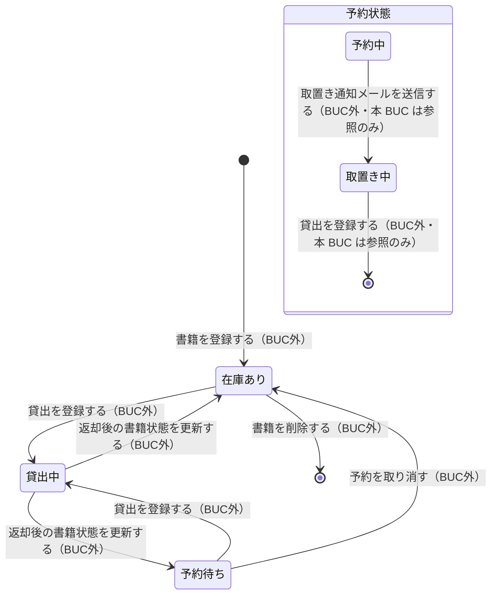

# 書籍を検索するフロー

## 概要

利用者が読みたい書籍を探し、在庫状況を確かめるまでの業務フロー。司書はレファレンス対応として同じ蔵書を検索する。全 UC が書籍を参照のみで扱い、書籍状態から導出した在庫状況区分（在庫あり／貸出中／予約待ち）を表示する。

## 所属 UC 一覧

| UC名 | アクター | 主な操作 | 関連情報 |
|------|---------|---------|---------|
| [書籍を検索する](書籍を検索する/spec.md) | 利用者（受益者） | 蔵書検索画面で検索条件種別を選び読みたい書籍を探す | 書籍 |
| [書籍詳細と在庫状況を照会する](書籍詳細と在庫状況を照会する/spec.md) | 利用者（提供者） | 書籍詳細・在庫状況画面で書誌情報と在庫状況・予約状況を確かめる | 書籍、予約 |
| [司書向けに蔵書を検索する](司書向けに蔵書を検索する/spec.md) | 司書（提供者） | レファレンス検索画面で利用者の問合せに応じて蔵書を調べる | 書籍 |

## UC 横断データフロー

検索結果の書籍が詳細照会へ引き渡される。司書向け検索は同じ蔵書データを別ポータル（司書向け）から参照する。

### データフロー図

### 情報 CRUD マトリクス

| 情報名 | 書籍を検索する | 書籍詳細と在庫状況を照会する | 司書向けに蔵書を検索する |
|--------|:-------------:|:---------------------------:|:-----------------------:|
| 書籍 | R | R | R |
| 予約 | | R | |

## 状態遷移全体図

本 BUC の UC はいずれも状態を遷移させない（参照専用）。書籍状態を在庫状況区分として表示するために参照する。

### 状態遷移 UC マッピング

| 状態モデル | 遷移元 | 遷移先 | 担当 UC |
|-----------|--------|--------|--------|
| 書籍状態 | - | - | 本 BUC に遷移担当 UC はない（3 UC とも参照のみ） |
| 書籍状態（参照） | 在庫あり / 貸出中 / 予約待ち | （遷移なし） | [書籍を検索する](書籍を検索する/spec.md), [書籍詳細と在庫状況を照会する](書籍詳細と在庫状況を照会する/spec.md), [司書向けに蔵書を検索する](司書向けに蔵書を検索する/spec.md) |
| 予約状態（参照） | 予約中 / 取置き中 | （遷移なし） | [書籍詳細と在庫状況を照会する](書籍詳細と在庫状況を照会する/spec.md) |

## BUC 内共有条件一覧

| 条件名 | 条件の説明 | 適用 UC |
|--------|----------|--------|
| 書籍検索条件 | 検索条件種別（キーワード／タイトル／著者／ISBN／ジャンル）のいずれかで蔵書を検索し、一致した書籍について書籍状態に基づく在庫状況区分（在庫あり／貸出中／予約待ち）を併せて表示する | 書籍を検索する, 書籍詳細と在庫状況を照会する, 司書向けに蔵書を検索する |

本 BUC の 3 UC は同一の書籍検索条件を共有する。在庫状況区分の導出ロジックを 3 UC で一致させることが実装上の要点になる。

## BUC 内共有バリエーション一覧

| バリエーション名 | 値 | 適用 UC |
|----------------|---|--------|
| 検索条件種別 | キーワード、タイトル、著者、ISBN、ジャンル | 書籍を検索する, 書籍詳細と在庫状況を照会する, 司書向けに蔵書を検索する |
| ジャンル | 文学、人文、社会科学、自然科学、技術、芸術、児童、その他 | 書籍を検索する, 書籍詳細と在庫状況を照会する, 司書向けに蔵書を検索する |
| 資料種別 | 紙書籍、電子書籍 | 書籍を検索する, 書籍詳細と在庫状況を照会する, 司書向けに蔵書を検索する |
