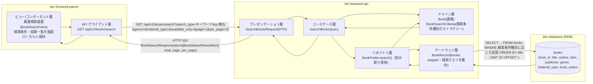
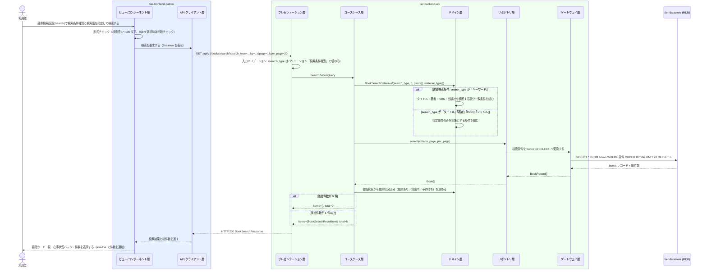

# 書籍を検索する

## 概要

利用者が蔵書検索画面で、キーワード・タイトル・著者・ISBN・ジャンルのいずれかの検索条件種別で蔵書を検索し、該当する書籍の一覧を得る。書籍検索条件により、一致した書籍には書籍状態に基づく在庫状況区分（在庫あり／貸出中／予約待ち）を併せて表示する。

## データフロー



| レイヤー | データモデル | 変換内容 |
|---------|------------|---------|
| FE ビュー/コンポーネント層 | 検索条件種別（単一選択）・検索語・ジャンル・資料種別・在庫ありのみ、結果一覧 | `BookSearchFilter` の選択値を検索クエリへ変換し、`BookCard` の一覧へ描画する |
| FE API クライアント層 | GET /api/v1/books/search のクエリパラメータ | 認証トークン付与・trace_id 発行・タイムアウト/リトライ |
| BE プレゼンテーション層 | SearchBooksRequest(search_type, q, genre[], material_type[], available_only, page, per_page) | 形式・列挙値バリデーション + SearchBooksQuery 変換 |
| BE ユースケース層 | SearchBooksQuery | 読み取り専用（Query 側）。書き込みトランザクションを開かない |
| BE ドメイン層 | BookSearchCriteria（検索条件種別のストラテジー） | 検索条件種別ごとの検索対象属性を決める |
| BE ゲートウェイ層 | BookRecord ⇔ books テーブル | 検索クエリを adapter に集約し、結果を Book へ復元する |
| Response | BookSearchResponse(items[BookSearchResultItem(book, availability)], total, page, per_page) | `BookCard` と `BookStatusBadge` の表示に使う |

## 処理フロー



## バリエーション一覧

| バリエーション名 | 値 | 処理内容 | 適用 tier | 適用箇所 |
|----------------|---|---------|----------|---------|
| 検索条件種別 | キーワード、タイトル、著者、ISBN、ジャンル | 検索対象属性のルート分岐。既定は「キーワード」（デフォルト効果） | tier-frontend-patron / tier-backend-api | 蔵書検索画面の BookSearchFilter / BookSearchCriteria のストラテジー |
| ジャンル | 文学、人文、社会科学、自然科学、技術、芸術、児童、その他 | 絞り込み条件（複数選択）。検索条件種別「ジャンル」では主条件になる | tier-frontend-patron / tier-backend-api | 蔵書検索画面 / GET /api/v1/books/search の genre |
| 資料種別 | 紙書籍、電子書籍 | 絞り込み条件（複数選択）と結果カードの表示項目 | tier-frontend-patron / tier-backend-api | 蔵書検索画面 / GET /api/v1/books/search の material_type |

## 分岐条件一覧

| 条件名 | 判定ルール | 適用 tier | 適用箇所 | BDD Scenario |
|--------|----------|----------|---------|-------------|
| 書籍検索条件 | 検索条件種別（キーワード／タイトル／著者／ISBN／ジャンル）のいずれかで蔵書を検索し、一致した書籍に書籍状態に基づく在庫状況区分を併せて表示する | tier-frontend-patron / tier-backend-api | 蔵書検索画面 / BookSearchCriteria | 著者で蔵書を検索する / ISBNで蔵書を検索する |
| 該当 0 件の分岐 | total が 0 のとき `EmptyState` に「条件に一致する書籍がありません」と条件変更の導線を出す | tier-frontend-patron | 蔵書検索画面 | 該当0件のとき次の行動を案内する |
| 在庫ありのみ絞り込み | `available_only=true` のとき book_status が「在庫あり」の書籍だけを返す | tier-frontend-patron / tier-backend-api | 蔵書検索画面 / GET /api/v1/books/search | 在庫ありのみに絞り込む |
| ページ分割 | total が per_page(20) を超えるとき `Pagination` を表示する（無限スクロールは使わない） | tier-frontend-patron / tier-backend-api | 蔵書検索画面 | 21件以上の検索結果をページ送りする |

## 計算ルール一覧

| 計算名 | 入力情報 | 計算式/ロジック | 出力情報 | 適用 tier |
|--------|---------|---------------|---------|----------|
| 在庫状況区分の決定 | 書籍.書籍状態 | 在庫あり → 在庫あり、貸出中 → 貸出中、予約待ち → 予約待ち（書籍状態をそのまま在庫状況区分として表示する） | 検索結果の在庫状況区分 | tier-backend-api |
| ページオフセット算出 | page, per_page | offset = (page - 1) × per_page | SELECT の OFFSET 値 | tier-backend-api |

## 状態遷移一覧

| 状態モデル | 遷移元 | 遷移先 | トリガー | 事前条件 | 事後処理 | 適用 tier |
|-----------|--------|--------|---------|---------|---------|----------|
| 書籍状態 | （遷移なし） | （遷移なし） | 書籍を検索する（参照のみ） | なし | なし（在庫状況区分として表示するだけ） | tier-backend-api |

## 関連 RDRA モデル

| モデル種別 | 要素名 | 関連 |
|-----------|--------|------|
| 業務 | 蔵書利用業務 | このUCが属する業務 |
| BUC | 書籍を検索するフロー | このUCを含むBUC |
| アクター | 利用者 | 操作するアクター（受益者） |
| 情報 | 書籍 | 参照する情報 |
| 状態 | 書籍状態 | 在庫状況区分として表示する |
| 条件 | 書籍検索条件 | 適用される条件 |
| バリエーション | 検索条件種別、ジャンル、資料種別 | 検索・絞り込み条件 |
| 画面 | 蔵書検索画面 | 操作する画面 |

## E2E 完了条件（BDD）

### 正常系

```gherkin
Feature: 書籍を検索する

  Scenario: キーワードで蔵書を検索する
    Given 利用者「田中太郎」が利用者ポータルにログイン済み
    And 蔵書に「吾輩は猫である」（著者「夏目漱石」、書籍状態「在庫あり」）が登録されている
    When 利用者が蔵書検索画面で検索条件種別「キーワード」に「漱石」を入力して検索する
    Then 「吾輩は猫である」が検索結果に表示され、在庫状況バッジが「在庫あり」になる

  Scenario: 著者で蔵書を検索する
    Given 利用者「田中太郎」が蔵書検索画面を開いている
    And 蔵書に著者「夏目漱石」の書籍が2件、著者「森鷗外」の書籍が1件登録されている
    When 利用者が検索条件種別「著者」に「夏目漱石」を入力して検索する
    Then 検索結果が2件になり、いずれも著者が「夏目漱石」になる

  Scenario: ISBNで蔵書を検索する
    Given 利用者「田中太郎」が蔵書検索画面を開いている
    And 蔵書に ISBN「9784101010014」の「吾輩は猫である」が登録されている
    When 利用者が検索条件種別「ISBN」に「9784101010014」を入力して検索する
    Then 検索結果が1件になり「吾輩は猫である」が表示される

  Scenario: 在庫ありのみに絞り込む
    Given 蔵書に「吾輩は猫である」（在庫あり）と「坊っちゃん」（貸出中）が登録されている
    When 利用者が検索条件種別「キーワード」に「夏目漱石」を入力し「在庫ありのみ」を選んで検索する
    Then 「吾輩は猫である」だけが表示され、「坊っちゃん」は表示されない

  Scenario: 21件以上の検索結果をページ送りする
    Given 検索条件「文学」に一致する書籍が25件ある
    When 利用者が検索してページャの「2」を押す
    Then 21件目から25件目の書籍カードが表示される
```

### 異常系

```gherkin
  Scenario: 該当0件のとき次の行動を案内する
    Given 利用者「田中太郎」が蔵書検索画面を開いている
    And 「存在しない書名」に一致する書籍が蔵書にない
    When 利用者が検索条件種別「タイトル」に「存在しない書名」を入力して検索する
    Then 「条件に一致する書籍がありません」と検索条件の変更を促す案内が表示される

  Scenario: 検索語が未入力のとき検索できない
    Given 利用者「田中太郎」が蔵書検索画面を開いている
    When 利用者が検索語を空欄のまま検索ボタンを押そうとする
    Then 検索ボタンが無効のままで、「検索語を入力してください」と表示される

  Scenario: 検索に失敗したとき再試行できる
    Given バックエンド API が 500 を返す状態である
    When 利用者が検索条件種別「キーワード」に「漱石」を入力して検索する
    Then 「検索できませんでした」というエラー表示と再試行ボタンが表示される
```

## ティア別仕様

- [利用者ポータル](tier-frontend-patron.md)
- [バックエンド API](tier-backend-api.md)

### 統合 API Spec

- [OpenAPI Spec](../../../_cross-cutting/api/openapi.yaml)（全 UC 統合、Contract First 開発用）
