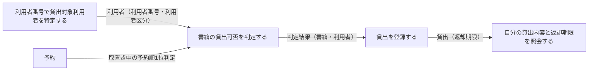
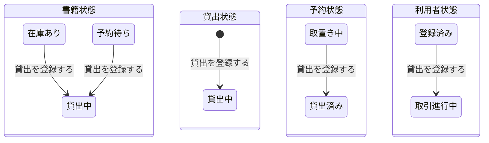

# 書籍を貸し出すフロー

## 概要

利用者が利用者番号を提示し、司書が貸出可否を判定して窓口で書籍を貸し出すまでの業務フロー。貸出登録により書籍状態・貸出状態・利用者状態（取置き中書籍の場合は予約状態も）が同時に遷移する、本システムの中核トランザクションを担う。

## 所属 UC 一覧

| UC名 | アクター | 主な操作 | 関連情報 |
|------|---------|---------|---------|
| [利用者番号で貸出対象利用者を特定する](利用者番号で貸出対象利用者を特定する/spec.md) | 利用者（提供者） | 利用者番号提示画面で利用者番号を提示し、貸出対象利用者を特定する | 利用者 |
| [書籍の貸出可否を判定する](書籍の貸出可否を判定する/spec.md) | 司書（提供者） | 貸出可否判定画面で書籍状態・利用者状態・予約状態から貸出可否を判定する | 書籍、利用者、予約 |
| [貸出を登録する](貸出を登録する/spec.md) | 司書（提供者） | 窓口貸出受付画面で貸出を登録し、返却期限を自動設定する | 書籍、利用者、貸出、予約 |
| [自分の貸出内容と返却期限を照会する](自分の貸出内容と返却期限を照会する/spec.md) | 利用者（受益者） | 貸出内容・返却期限確認画面で自分の貸出内容と返却期限を確認する | 書籍、貸出、利用者アカウント |

## UC 横断データフロー

利用者の特定 → 貸出可否の判定 → 貸出の登録 → 利用者への提示、という一方向のデータフローになる。

### データフロー図

### 情報 CRUD マトリクス

| 情報名 | 利用者番号で貸出対象利用者を特定する | 書籍の貸出可否を判定する | 貸出を登録する | 自分の貸出内容と返却期限を照会する |
|--------|:---------------------------------:|:----------------------:|:-------------:|:--------------------------------:|
| 利用者 | R | R | U | |
| 書籍 | | R | U | R |
| 予約 | | R | U | |
| 貸出 | | | C | R |
| 利用者アカウント | | | | R |

> 「貸出を登録する」の U は状態遷移に伴う更新を指す。書籍は在庫あり／予約待ち → 貸出中、利用者は登録済み → 取引進行中、予約（取置き中の場合）は取置き中 → 貸出済みへ更新する。

## 状態遷移全体図

本 BUC は「貸出を登録する」で 4 つの状態モデルを同時に遷移させる。

### 状態遷移 UC マッピング

| 状態モデル | 遷移元 | 遷移先 | 担当 UC |
|-----------|--------|--------|--------|
| 書籍状態 | 在庫あり | 貸出中 | [貸出を登録する](貸出を登録する/spec.md) |
| 書籍状態 | 予約待ち | 貸出中 | [貸出を登録する](貸出を登録する/spec.md) |
| 貸出状態 | （初期） | 貸出中 | [貸出を登録する](貸出を登録する/spec.md) |
| 予約状態 | 取置き中 | 貸出済み | [貸出を登録する](貸出を登録する/spec.md) |
| 利用者状態 | 登録済み | 取引進行中 | [貸出を登録する](貸出を登録する/spec.md) |
| 書籍状態・利用者状態・予約状態（参照） | - | （遷移なし） | [利用者番号で貸出対象利用者を特定する](利用者番号で貸出対象利用者を特定する/spec.md), [書籍の貸出可否を判定する](書籍の貸出可否を判定する/spec.md), [自分の貸出内容と返却期限を照会する](自分の貸出内容と返却期限を照会する/spec.md) |

## BUC 内共有条件一覧

| 条件名 | 条件の説明 | 適用 UC |
|--------|----------|--------|
| 貸出可否条件 | 書籍状態が「在庫あり」であり、かつ貸出先が登録済みで利用者状態区分が「利用可能」の利用者であるときに限り貸出を許可する。書籍状態が「貸出中」「予約待ち」の場合は貸出を拒否しエラーを表示する | 利用者番号で貸出対象利用者を特定する, 書籍の貸出可否を判定する, 貸出を登録する |

> 貸出可否条件の「利用者状態区分が『利用可能』」は、利用者状態が「登録済み」または「取引進行中」であることを指す（「貸出を登録する」spec.md の記述と対応する）。

単独適用の条件（詳細は各 UC Spec を参照）:

| 条件名 | 条件の説明 | 適用 UC |
|--------|----------|--------|
| 資料種別利用可否条件 | 資料種別が「紙書籍」の蔵書のみ登録・貸出の対象とする。「電子書籍」は未対応として案内する | 書籍の貸出可否を判定する |
| 取置き中書籍貸出条件 | 予約状態が「取置き中」の書籍は、取置き対象である予約順1位の利用者に対してのみ貸出を許可する | 書籍の貸出可否を判定する |
| 返却期限設定条件 | 貸出記録の作成時に、貸出日を起点として利用者区分に対応する貸出期間区分の日数を加算した日を返却期限として自動設定する | 貸出を登録する |
| 個人情報参照可否条件 | 照会はログイン中の利用者本人に紐づく貸出のみを対象とし、他の利用者の貸出は表示しない | 自分の貸出内容と返却期限を照会する |

## BUC 内共有バリエーション一覧

| バリエーション名 | 値 | 適用 UC |
|----------------|---|--------|
| 利用者区分 | 一般、学生、団体 | 利用者番号で貸出対象利用者を特定する, 書籍の貸出可否を判定する, 貸出を登録する |
| 貸出期間区分 | 標準、短期、長期 | 貸出を登録する, 自分の貸出内容と返却期限を照会する |
| 資料種別 | 紙書籍、電子書籍 | 書籍の貸出可否を判定する, 貸出を登録する |

> 利用者区分は「利用者番号で貸出対象利用者を特定する」で確定し、「貸出を登録する」で返却期限設定条件の貸出期間区分の既定選択に引き継がれる。
