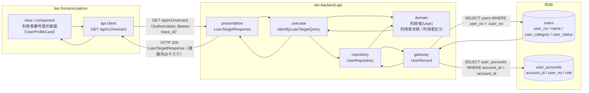
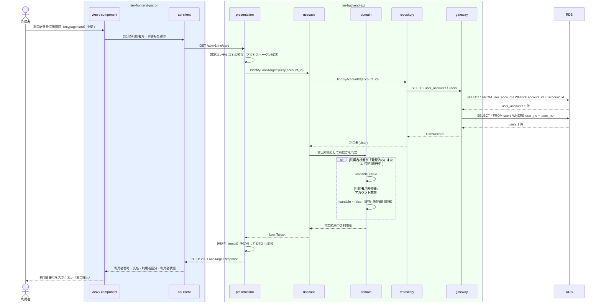

# 利用者番号で貸出対象利用者を特定する

## 概要

利用者が窓口で利用者番号を提示し、司書がその利用者番号から貸出責任者となる利用者を特定する。特定した利用者は後続の「書籍の貸出可否を判定する」「貸出を登録する」で貸出記録の対象となる。本 UC は利用者ポータルでの利用者番号提示と、提示された利用者番号による利用者特定の照会までを範囲とし、貸出可否の判定と貸出記録の作成は含まない。

## データフロー



| レイヤー | データモデル | 変換内容 |
|---------|------------|---------|
| FE view | 利用者番号・氏名・利用者区分・利用者状態の提示 | 認証済みセッションから自分の利用者番号を取得し、窓口提示用に大きく表示する |
| FE api client | GET `/api/v1/me/card` | アクセストークン付与、trace_id 発行、タイムアウト・参照系リトライ（最大 2 回） |
| BE presentation | LoanTargetResponse(user_no, name, user_category, user_status, loanable) | 認証コンテキストの確立、PII 最小化（email を返さない） |
| BE usecase | IdentifyLoanTargetQuery(account_id \| user_no) | 参照系 Query。トランザクションは読み取り専用 |
| BE domain | 利用者(User) | 利用者状態が「登録済み」「取引進行中」であり有効であることを判定（貸出可否条件の利用者側前提） |
| BE gateway | UserRecord / UserAccountRecord | `users` / `user_accounts` の SELECT |
| Response | { user_no, name, user_category, user_status, loanable, reason } | 窓口提示・司書の利用者特定に使う |

## 処理フロー



司書が提示された利用者番号から貸出対象利用者を特定する場合は、`GET /api/v1/loan-targets/{userNo}` を同じ usecase（`IdentifyLoanTargetQuery(user_no)`）で処理する。司書ロールのトークンが必要で、本人限定参照の制約は適用しない。

## バリエーション一覧

| バリエーション名 | 値 | 処理内容 | 適用 tier | 適用箇所 |
|----------------|---|---------|----------|---------|
| 利用者区分 | 一般 / 学生 / 団体 | 特定した利用者の区分を表示・返却する。後続の返却期限設定条件で貸出期間区分の決定に使う | tier-backend-api, tier-frontend-patron | LoanTargetResponse.user_category / 利用者番号提示画面 |

## 分岐条件一覧

| 条件名 | 判定ルール | 適用 tier | 適用箇所 | BDD Scenario |
|--------|----------|----------|---------|-------------|
| 貸出可否条件（利用者側の前提） | 貸出先が登録済みで利用者状態が「登録済み」または「取引進行中」の利用者であること。未登録の利用者番号は貸出対象として特定しない | tier-backend-api | IdentifyLoanTargetQuery / domain の貸出対象判定 | 登録済み利用者の利用者番号で貸出対象を特定できる / 未登録の利用者番号では貸出対象を特定できない |

## 計算ルール一覧

| 計算名 | 入力情報 | 計算式/ロジック | 出力情報 | 適用 tier |
|--------|---------|---------------|---------|----------|
| （なし） | - | 本 UC に計算ルールはない（利用者の特定のみ） | - | - |

## 状態遷移一覧

| 状態モデル | 遷移元 | 遷移先 | トリガー | 事前条件 | 事後処理 | 適用 tier |
|-----------|--------|--------|---------|---------|---------|----------|
| 利用者状態 | 登録済み | 登録済み（遷移なし） | 利用者番号の提示・特定 | 利用者が登録済み | なし（本 UC は参照のみ。遷移は「貸出を登録する」で発生する） | tier-backend-api |

## 関連 RDRA モデル

| モデル種別 | 要素名 | 関連 |
|-----------|--------|------|
| 業務 | 蔵書利用業務 | このUCが属する業務 |
| BUC | 書籍を貸し出すフロー | このUCを含むBUC |
| アクター | 利用者 | 利用者番号を提示するアクター（提供者） |
| アクター | 司書 | 提示された利用者番号から貸出対象を特定するアクター |
| 情報 | 利用者 | 参照する情報（利用者番号・氏名・利用者区分・利用者状態） |
| 情報 | 利用者アカウント | ログイン中の操作者の識別に使う |
| 状態 | 利用者状態 | 貸出対象としての有効性判定に使う |
| 条件 | 貸出可否条件 | 適用される条件（利用者側の前提） |
| バリエーション | 利用者区分 | 一般 / 学生 / 団体。特定結果に含めて後続の返却期限設定に使う |
| 画面 | 利用者番号提示画面 | 利用者ポータルの対象画面 |

## E2E 完了条件（BDD）

### 正常系

```gherkin
Feature: 利用者番号で貸出対象利用者を特定する

  Scenario: 登録済み利用者が自分の利用者番号を窓口提示できる
    Given 利用者「田中太郎」（利用者番号 "U-000123"、利用者区分 "一般"、利用者状態 "登録済み"）が利用者ポータルにログイン済み
    When 利用者が利用者番号提示画面（/mypage/card）を開く
    Then 利用者番号 "U-000123" と氏名「田中太郎」と利用者区分「一般」が表示される
    And 連絡先メールアドレスはマスク表示される

  Scenario: 司書が提示された利用者番号で貸出対象利用者を特定できる
    Given 利用者番号 "U-000123" の利用者「田中太郎」が利用者状態 "登録済み" で存在する
    And 司書「山田花子」が司書ポータルにログイン済み
    When 司書が利用者番号 "U-000123" で貸出対象利用者を特定する
    Then 利用者「田中太郎」が貸出対象として特定され、利用者区分「一般」が返る
    And 貸出対象として有効（loanable = true）と判定される

  Scenario: 取引進行中の利用者も貸出対象として特定できる
    Given 利用者番号 "U-000123" の利用者「田中太郎」が利用者状態 "取引進行中" で存在する
    When 司書が利用者番号 "U-000123" で貸出対象利用者を特定する
    Then 利用者「田中太郎」が貸出対象として特定される
    And 貸出対象として有効（loanable = true）と判定される
```

### 異常系

```gherkin
  Scenario: 未登録の利用者番号では貸出対象を特定できない
    Given 利用者番号 "U-999999" の利用者が登録されていない
    When 司書が利用者番号 "U-999999" で貸出対象利用者を特定する
    Then HTTP 404 が返り「該当する利用者が見つかりません」と表示される
    And 貸出登録へ進む導線は表示されない

  Scenario: 他の利用者の利用者カードは参照できない
    Given 利用者「田中太郎」（利用者番号 "U-000123"）が利用者ポータルにログイン済み
    When 利用者ロールのトークンで `GET /api/v1/loan-targets/U-000456` を呼ぶ
    Then HTTP 403（FORBIDDEN）が返り「他の利用者の情報は参照できません」と表示される

  Scenario: 未ログインで利用者番号提示画面を開くとログインへ誘導される
    Given 利用者がログインしていない
    When 利用者が利用者番号提示画面（/mypage/card）を開く
    Then ログイン画面へリダイレクトされる
```

## ティア別仕様

- [利用者ポータル](tier-frontend-patron.md)
- [バックエンド API](tier-backend-api.md)

### 統合 API Spec

- [OpenAPI Spec](../../_cross-cutting/api/openapi.yaml)（全 UC 統合、Contract First 開発用）
