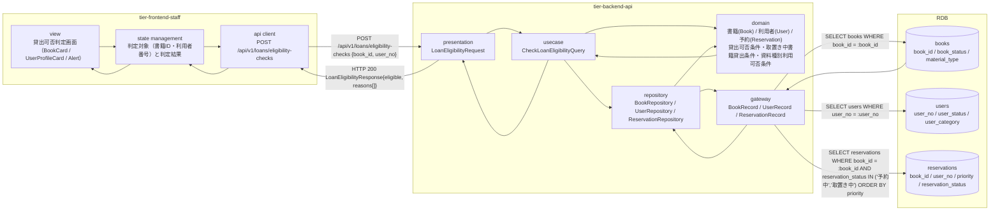
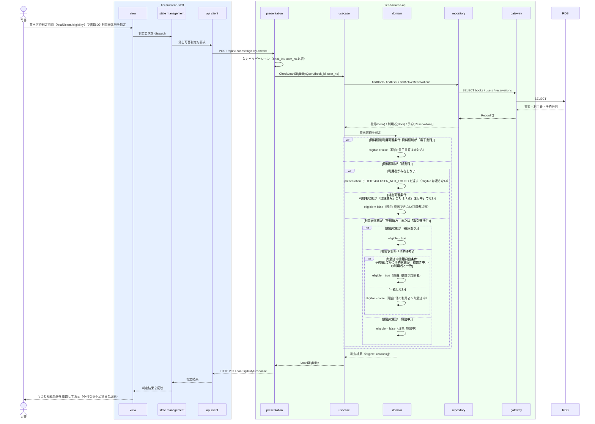

# 書籍の貸出可否を判定する

## 概要

司書が窓口で、対象書籍と貸出対象利用者の組み合わせについて貸出可否を判定する。書籍状態が「在庫あり」であること、利用者が登録済みで利用可能であること、資料種別が「紙書籍」であること、書籍状態が「予約待ち」の場合は取置き対象である予約順1位の利用者であることを判定し、可否と根拠条件を返す。判定のみで貸出記録は作成しない。

## データフロー



| レイヤー | データモデル | 変換内容 |
|---------|------------|---------|
| FE view | 書籍ID / 利用者番号の入力、判定結果と根拠条件の並置表示 | 司書の入力を状態管理層へ渡し、判定結果を可否 + 根拠条件で表示する |
| FE state | { bookId, userNo, eligibilityResult } | 窓口フロー（利用者特定 → 貸出可否判定 → 貸出登録）で画面をまたいで引き継ぐ（LP-030） |
| FE api client | POST `/api/v1/loans/eligibility-checks` | 司書トークン付与、trace_id 発行。参照系相当だが判定要求のため冪等キーは不要 |
| BE presentation | LoanEligibilityRequest(book_id, user_no) | 必須チェック・形式チェック、認証コンテキストの確立 |
| BE usecase | CheckLoanEligibilityQuery | 読み取り専用トランザクション。書籍・利用者・予約を取得してドメインへ渡す |
| BE domain | 書籍(Book) / 利用者(User) / 予約(Reservation) | 貸出可否条件・取置き中書籍貸出条件・資料種別利用可否条件を適用し、eligible と reasons を導出する |
| BE gateway | BookRecord / UserRecord / ReservationRecord | `books` / `users` / `reservations` の SELECT |
| Response | { eligible, reasons[], book{...}, user{...}, hold{...} } | 判定結果と根拠条件を画面に並置する |

## 処理フロー



## バリエーション一覧

| バリエーション名 | 値 | 処理内容 | 適用 tier | 適用箇所 |
|----------------|---|---------|----------|---------|
| 資料種別 | 紙書籍 / 電子書籍 | 「紙書籍」のみ貸出対象とし、「電子書籍」は未対応として不可判定にする（資料種別利用可否条件） | tier-backend-api, tier-frontend-staff | domain の貸出可否判定 / 貸出可否判定画面の根拠表示 |
| 利用者区分 | 一般 / 学生 / 団体 | 判定結果に利用者区分を含めて返し、後続の貸出登録での貸出期間区分の既定選択に使う | tier-backend-api | LoanEligibilityResponse.user.user_category |

## 分岐条件一覧

| 条件名 | 判定ルール | 適用 tier | 適用箇所 | BDD Scenario |
|--------|----------|----------|---------|-------------|
| 貸出可否条件 | 書籍状態が「在庫あり」であり、かつ貸出先が登録済みで利用者状態が「登録済み」または「取引進行中」の利用者であるときに限り貸出可とする。書籍状態が「貸出中」「予約待ち」の場合は原則不可とする | tier-backend-api | domain の貸出可否判定 | 在庫ありの書籍と登録済み利用者の組み合わせは貸出可と判定される / 貸出中の書籍は貸出不可と判定される |
| 取置き中書籍貸出条件 | 予約状態が「取置き中」の書籍は、取置き対象である予約順1位の利用者に対してのみ貸出可とする。それ以外の利用者は不可とする | tier-backend-api | domain の予約整合判定 | 取置き中の書籍は予約順1位の利用者にのみ貸出可と判定される / 取置き中の書籍は他の利用者へは貸出不可と判定される |
| 資料種別利用可否条件 | 資料種別が「紙書籍」の蔵書のみ貸出対象とする。「電子書籍」は未対応として不可とする | tier-backend-api | domain の資料種別判定 | 電子書籍は未対応として貸出不可と判定される |

## 計算ルール一覧

| 計算名 | 入力情報 | 計算式/ロジック | 出力情報 | 適用 tier |
|--------|---------|---------------|---------|----------|
| 予約順位の確定 | 予約.予約申込日時（applied_at）、予約.予約状態 | 予約状態が「予約中」「取置き中」の予約を applied_at 昇順に並べ、1 始まりの順位を割り当てる（予約順位決定条件の参照利用） | 予約.予約順位（priority） | tier-backend-api |

## 状態遷移一覧

| 状態モデル | 遷移元 | 遷移先 | トリガー | 事前条件 | 事後処理 | 適用 tier |
|-----------|--------|--------|---------|---------|---------|----------|
| 書籍状態 | 在庫あり | 在庫あり（遷移なし） | 貸出可否の判定 | 判定要求 | なし（遷移は「貸出を登録する」で発生する） | tier-backend-api |
| 予約状態 | 取置き中 | 取置き中（遷移なし） | 取置き対象者の照合 | 対象書籍に取置き中の予約が存在 | なし（「貸出済み」への遷移は「貸出を登録する」で発生する） | tier-backend-api |

## 関連 RDRA モデル

| モデル種別 | 要素名 | 関連 |
|-----------|--------|------|
| 業務 | 蔵書利用業務 | このUCが属する業務 |
| BUC | 書籍を貸し出すフロー | このUCを含むBUC |
| アクター | 司書 | 貸出可否を判定するアクター（提供者） |
| 情報 | 書籍 | 判定対象の書籍（書籍状態・資料種別） |
| 情報 | 利用者 | 貸出先の利用者（利用者状態・利用者区分） |
| 情報 | 予約 | 取置き対象者の照合に使う予約（予約順位・予約状態） |
| 状態 | 書籍状態 | 在庫あり / 貸出中 / 予約待ちの判定に使う |
| 状態 | 利用者状態 | 登録済み / 取引進行中の判定に使う |
| 状態 | 予約状態 | 予約中 / 取置き中の判定に使う |
| 条件 | 貸出可否条件 | 適用される条件 |
| 条件 | 取置き中書籍貸出条件 | 適用される条件 |
| 条件 | 資料種別利用可否条件 | 適用される条件 |
| バリエーション | 資料種別 | 紙書籍のみ貸出対象とする判定に使う |
| バリエーション | 利用者区分 | 一般 / 学生 / 団体。判定結果に含めて後続の貸出期間区分の既定選択に使う |
| 画面 | 貸出可否判定画面 | 司書ポータルの対象画面 |

## E2E 完了条件（BDD）

### 正常系

```gherkin
Feature: 書籍の貸出可否を判定する

  Scenario: 在庫ありの書籍と登録済み利用者の組み合わせは貸出可と判定される
    Given 書籍「吾輩は猫である」（書籍ID "B-000001"、書籍状態 "在庫あり"、資料種別 "紙書籍"）が存在する
    And 利用者「田中太郎」（利用者番号 "U-000123"、利用者状態 "登録済み"、利用者区分 "一般"）が存在する
    And 司書「山田花子」が司書ポータルにログイン済み
    When 司書が貸出可否判定画面で書籍ID "B-000001" と利用者番号 "U-000123" を指定して判定する
    Then 判定結果に「貸出可」と表示される
    And 根拠として条件「貸出可否条件」を満たす旨が併記される

  Scenario: 取置き中の書籍は予約順1位の利用者にのみ貸出可と判定される
    Given 書籍「坊っちゃん」（書籍ID "B-000002"、書籍状態 "予約待ち"、資料種別 "紙書籍"）が存在する
    And 利用者「田中太郎」（利用者番号 "U-000123"）の予約が予約順位 1、予約状態 "取置き中" で存在する
    When 司書が書籍ID "B-000002" と利用者番号 "U-000123" を指定して判定する
    Then 判定結果に「貸出可」と表示される
    And 根拠として条件「取置き中書籍貸出条件」を満たす旨（予約順1位の取置き対象者）が併記される
```

### 異常系

```gherkin
  Scenario: 貸出中の書籍は貸出不可と判定される
    Given 書籍「こころ」（書籍ID "B-000003"、書籍状態 "貸出中"、資料種別 "紙書籍"）が存在する
    And 利用者「田中太郎」（利用者番号 "U-000123"、利用者状態 "登録済み"）が存在する
    When 司書が書籍ID "B-000003" と利用者番号 "U-000123" を指定して判定する
    Then 判定結果に「貸出不可」と表示される
    And 根拠として条件「貸出可否条件」の不足項目（書籍状態が "貸出中"）が展開表示される

  Scenario: 取置き中の書籍は他の利用者へは貸出不可と判定される
    Given 書籍「坊っちゃん」（書籍ID "B-000002"、書籍状態 "予約待ち"）に利用者番号 "U-000123" の取置き中の予約が存在する
    And 利用者「佐藤次郎」（利用者番号 "U-000456"、利用者状態 "登録済み"）が存在する
    When 司書が書籍ID "B-000002" と利用者番号 "U-000456" を指定して判定する
    Then 判定結果に「貸出不可」と表示される
    And 根拠として条件「取置き中書籍貸出条件」の不足項目（他の利用者へ取置き中）が展開表示される

  Scenario: 未登録の利用者番号では貸出不可と判定される
    Given 書籍「吾輩は猫である」（書籍ID "B-000001"、書籍状態 "在庫あり"）が存在する
    And 利用者番号 "U-999999" の利用者が登録されていない
    When 司書が書籍ID "B-000001" と利用者番号 "U-999999" を指定して判定する
    Then HTTP 404 が返り「該当する利用者が見つかりません」と表示される

  Scenario: 電子書籍は未対応として貸出不可と判定される
    Given 書籍「電子版 吾輩は猫である」（書籍ID "B-000004"、資料種別 "電子書籍"）が存在する
    And 利用者「田中太郎」（利用者番号 "U-000123"、利用者状態 "登録済み"）が存在する
    When 司書が書籍ID "B-000004" と利用者番号 "U-000123" を指定して判定する
    Then 判定結果に「貸出不可」と表示される
    And 根拠として条件「資料種別利用可否条件」（電子書籍は未対応）が展開表示される
```

## ティア別仕様

- [司書ポータル](tier-frontend-staff.md)
- [バックエンド API](tier-backend-api.md)

### 統合 API Spec

- [OpenAPI Spec](../../_cross-cutting/api/openapi.yaml)（全 UC 統合、Contract First 開発用）
